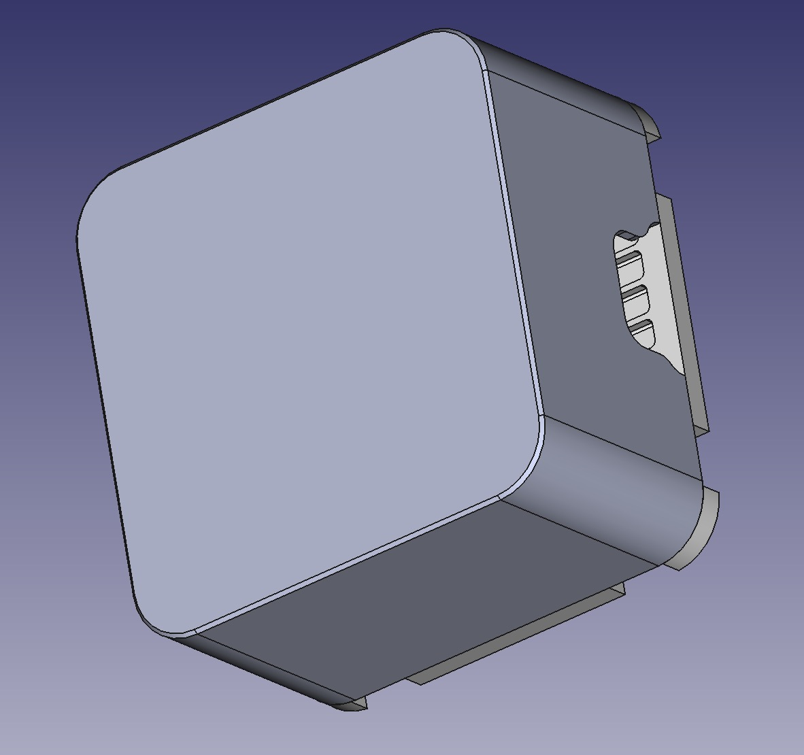
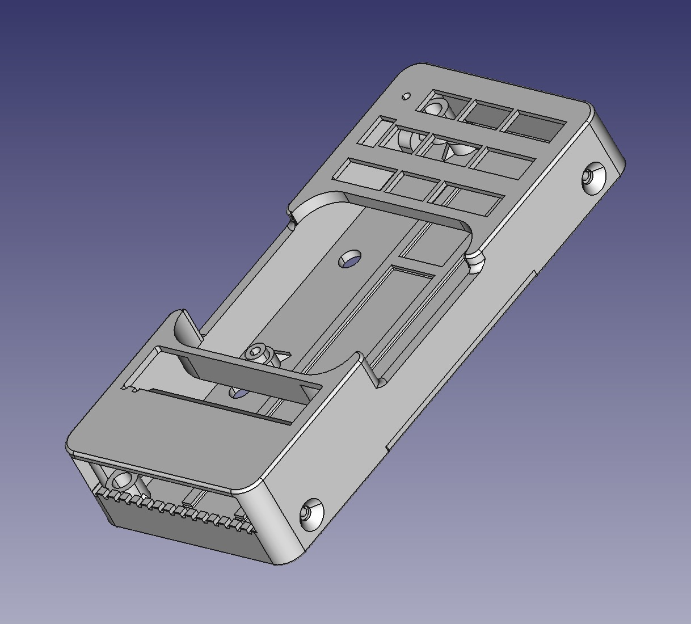
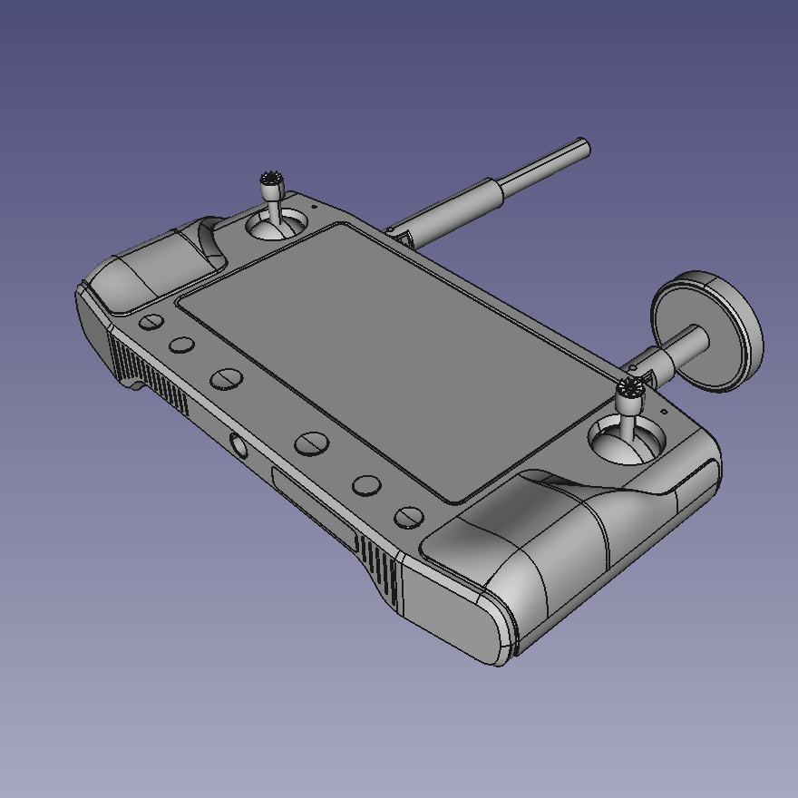
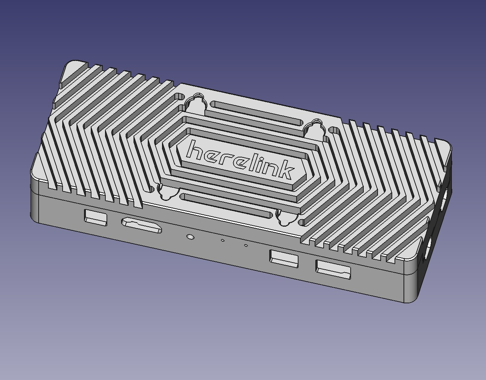
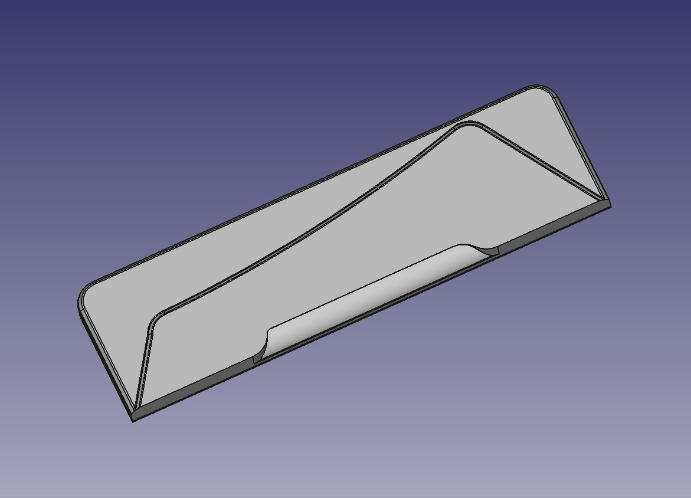
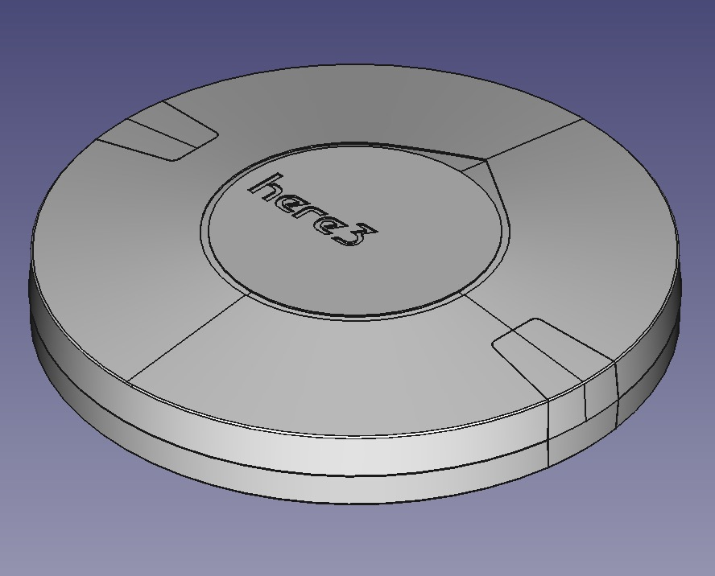
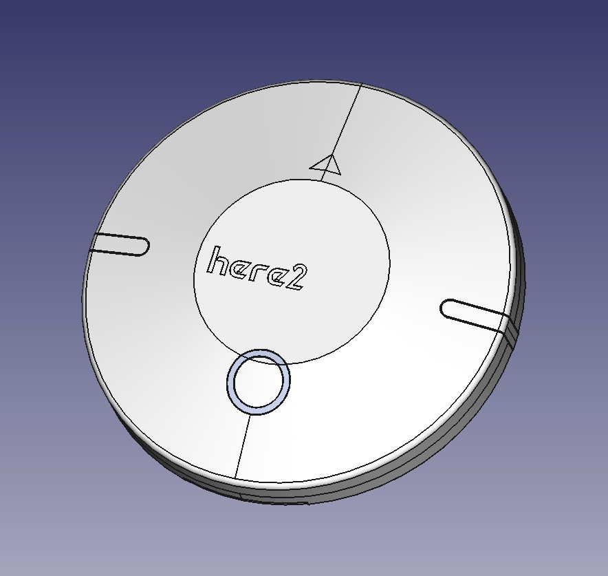
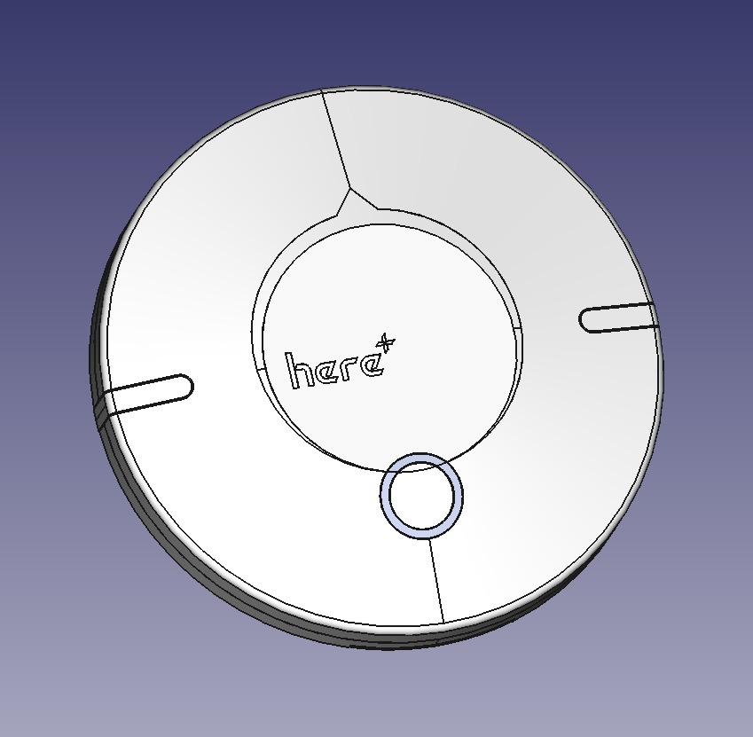
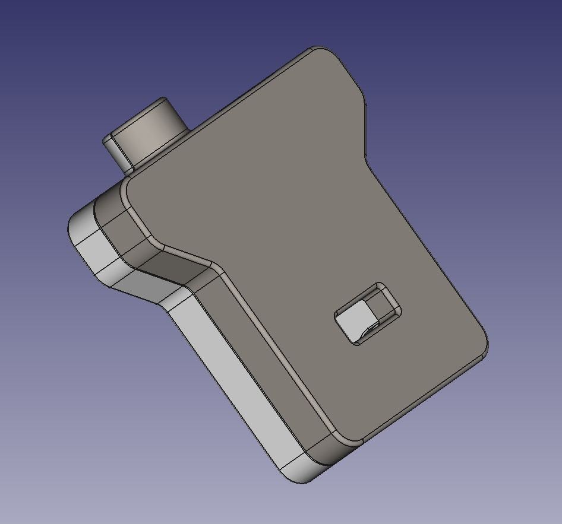
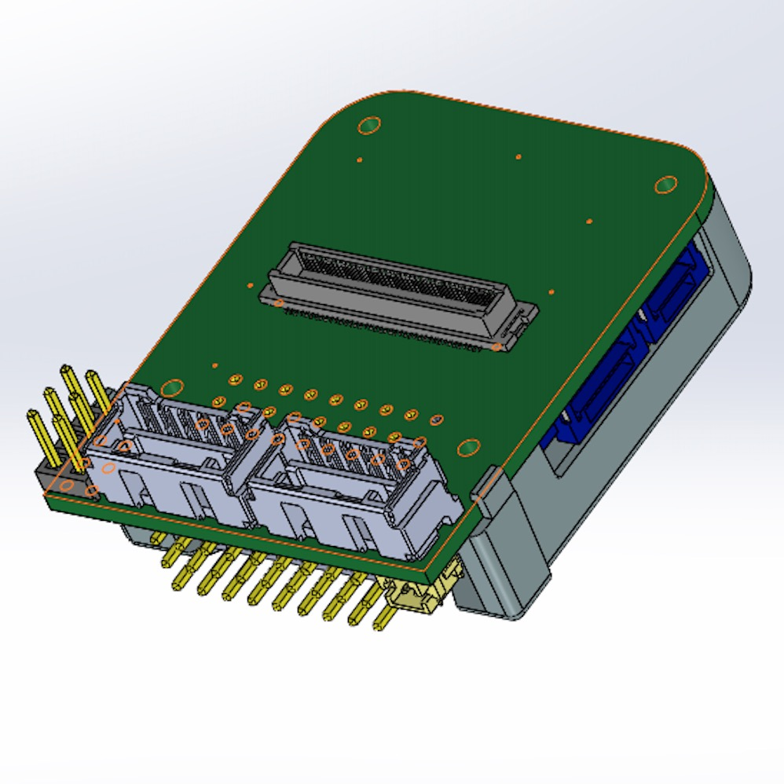

# CubePilot product 3D model

## Cube


Cube.STEP (ZIP)


## Standard Carrier Board


Standard Carrier Board.STEP (ZIP)


## HereLink Controller


HereLink Controller.stp (ZIP)


## HereLink Air Unit


HereLink Air Unit.STEP (ZIP)


## HereLink Air Unit Antenna


HereLink Air Unit Antenna.STEP (ZIP)


## Here3


Here3.STEP (ZIP)


## Here2


Here2.STEP (ZIP)


## Here+ V2 Rover


Here+ V2 Rover.STEP (ZIP)


## Here+ RTK Base


Here+ RTK Base.STEP (ZIP)


## Mini Carrier Board



## Power Brick Mini


