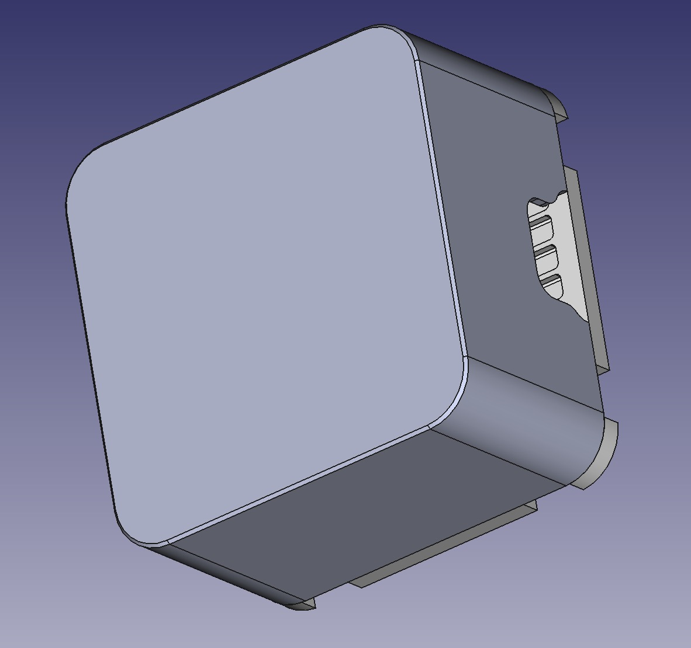
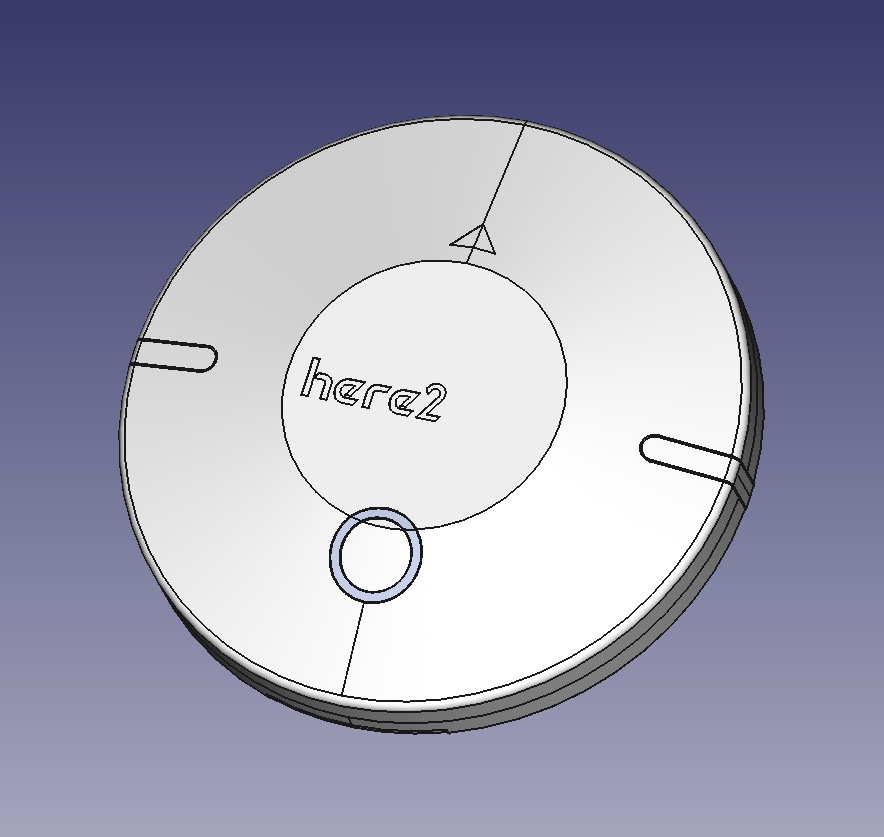
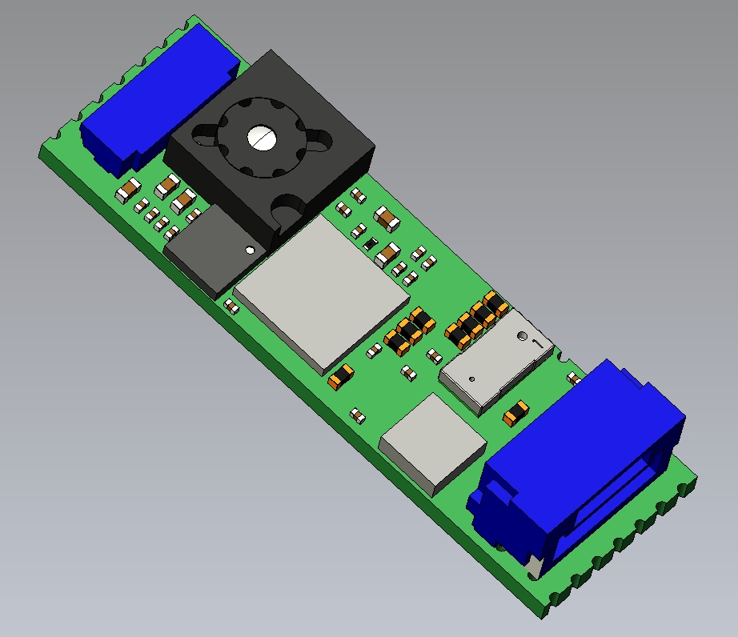
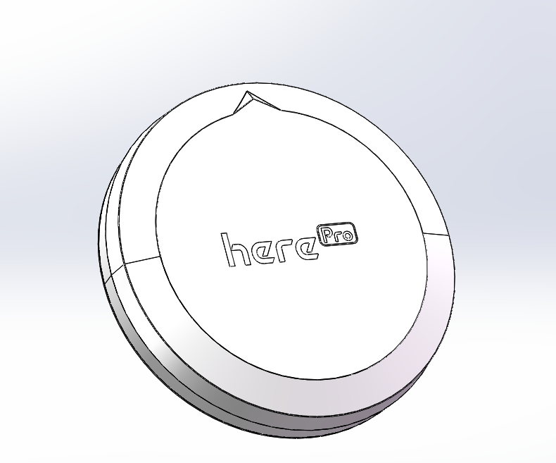
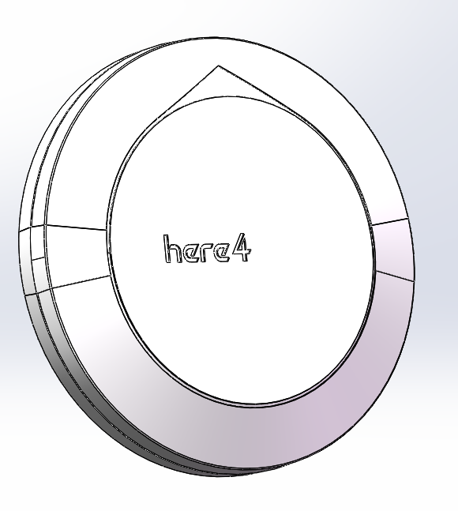

# CubePilot product 3D model

## Cube


Cube.STEP (ZIP)


## Standard Carrier Board


Standard Carrier Board.STEP (ZIP)


## HereLink Controller


HereLink Controller.stp (ZIP)


## HereLink AirUnit


HereLink Air Unit.STEP (ZIP)


## HereLink Air Unit Antenna


HereLink Air Unit Antenna.STEP (ZIP)


## Here3


Here3.STEP (ZIP)


## Here2


Here2.STEP (ZIP)


## Here+ V2 Rover


Here+ V2 Rover.STEP (ZIP)


## Here+ RTK Base


Here+ RTK Base.STEP (ZIP)


## Mini Carrier Board



## Power Brick Mini



## Herelink AirUnit 1.1 case



## Herelink Airunit 1.1 PCBA



## Hereflow



## HerePro

<figure><figcaption></figcaption></figure>



## Here3＋

<figure><figcaption></figcaption></figure>



## Here4

<figure><figcaption></figcaption></figure>


