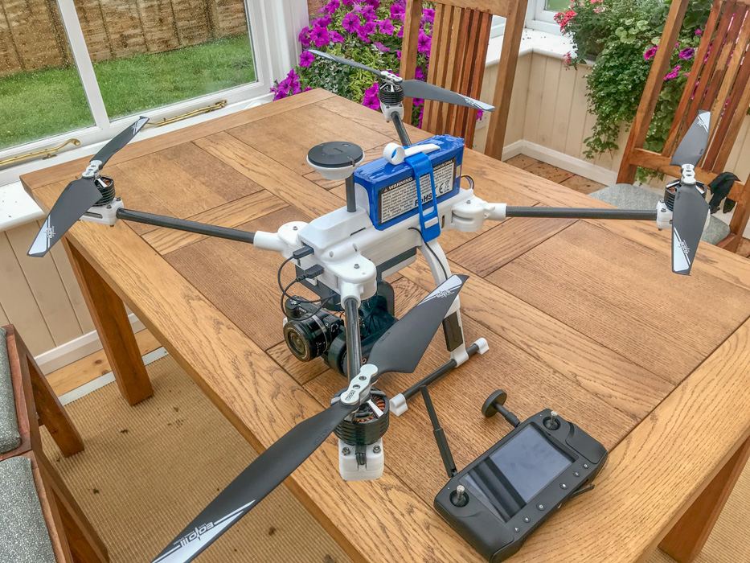
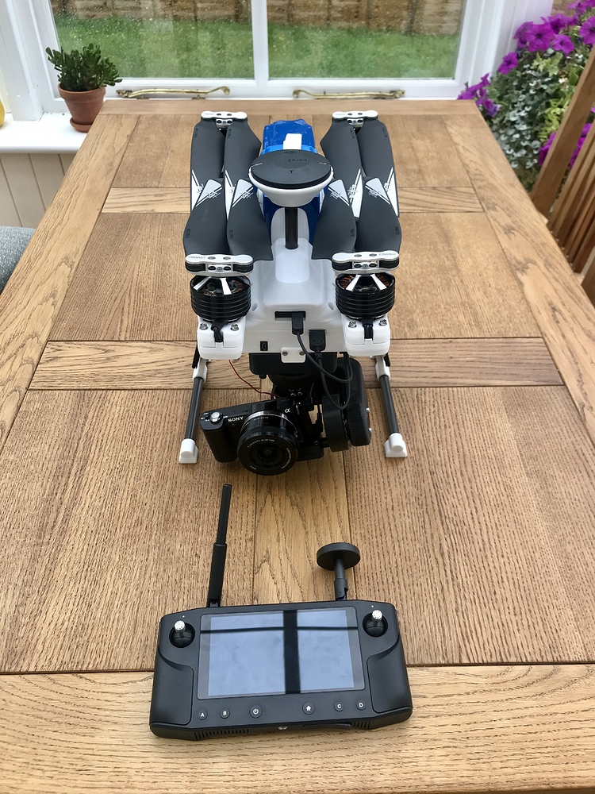

# Printable Camera Quad \(Foldable\)

Printable medium size camera drone. Tested with 1KG payload, dependent on components. To be used with my gimbal, already uploaded. \(Soon to be updated\). Compartments specifically sized for The Cube \(formerly known as Pixhawk\) and Herelink. Holes for 4in1 ESC. FCU vibration straps should be printed in TPU or something soft. HIGHLY RECOMMEND printing in polycarbonate or something else with good layer adhesion. Swing arm hinges could split with poor layer adhesion. Carbon tow wrap recommended for this part. Many other components included in this upload and many of them not in the final assembly. May get rebuild errors in SW if I missed some parts. Getting 26 minutes on 6s 12Ah. Room for a 16Ah at least.  
  
**Assets**  
CubePilot URL:  
[Printable Camera Quad ](https://discuss.cubepilot.org/t/printable-camera-quad/3508)  
  
3D Printing File URL:  
[Q7 Drone](https://grabcad.com/library/q7-camera-drone-sony-axxxx-series-1)  
  
Youtube URL:  
[Drone Gimbal Vibration Testing](https://www.youtube.com/watch?v=E0OPrHs6smE)  

  
  

  

