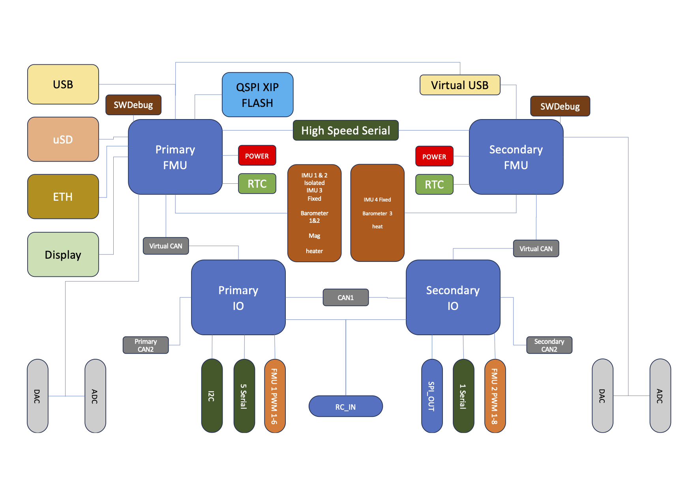

# Cube Red

<figure><figcaption></figcaption></figure>

## Overview

The Cube Red is a professional dual FMU flight control system that ensures operational reliability through its two dual-core, double-precision FPU processors. The newly added Ethernet interface and DSI out provide an unprecedented flight experience. An Isolated Static Air port minimizes disruptions from external airflow, ensuring stable static pressure. Also with Ardupilot firmware, you can utilize this unit with any type of UXV.

## Feature

1. Powerful processing performance is provided by two STM32H7 dual-core processors, each equipped with double-precision FPU (Floating Point Unit) operations.
2. Cube Red is equipped with 4 sets of IMUs and 3 barometers for redundancy, ensuring continuous safe operation during flight.
3. Replaceable fully closed uppercase and isolated static air ducts provide stable pressure to barometers for accurate altitude measurement.
4. Provides foams with different hardness options, catering to various flight purposes.
5. The CAN FD port offers real-time high transmission rates.
6. The Type-C Debugging interface has been updated to the future-proof USB Type-C standard.

## Operating Conditions and Performance

| **About**                                    | **Description**                                                           |
| -------------------------------------------- | ------------------------------------------------------------------------- |
| POWER input voltage / rated input current    | 4.1 - 5.7 V / 2.5 A; 0 - 20 V is safe for the system but it will not work |
| POWER rated output / input power             | 14 W                                                                      |
| USB port input voltage / rated input current | 4 - 5.7 V / 250 mA                                                        |
| Servo rail input voltage                     | 4 - 10.5 V                                                                |
| Waterproof performance                       | Not waterproof. External waterproof protection is needed                  |
| Operation Temperature                        | -10° / 55°                                                                |

## Ports Standard and Definition

### **Standard Carrier Board Ports Standard**

| Connector | Connector Type              |
| --------- | --------------------------- |
| `GPS1`    | JST-GH 1.25 mm (8-pin)      |
| `GPS2`    | JST-GH 1.25 mm (6-pin)      |
| `TELEM1`  | JST-GH 1.25 mm (6-pin)      |
| `TELEM2`  | JST-GH 1.25 mm (6-pin)      |
| `I2C2`    | JST-GH 1.25 mm (4-pin)      |
| `USB`     | JST-GH 1.25 mm (6-pin)      |
| `CAN1`    | JST-GH 1.25 mm (4-pin)      |
| `CAN2`    | JST-GH 1.25 mm (4-pin)      |
| `CAN3`    | JST-GH 1.25 mm (4-pin)      |
| `POWER1`  | Molex CLIK-Mate 2mm (6-pin) |
| `POWER2`  | Molex CLIK-Mate 2mm (6-pin) |
| `ADC`     | JST-GH 1.25 mm (3-pin)      |
| `DSI`     | JST-GH 1.25 mm (15-pin)     |
| `ETH`     | TE Multi-purp pluh(8P)      |

### Cube Red 80-Pin DF17 Connector

<figure><figcaption></figcaption></figure>

### **Connector 1 Assignments**

| **Pin#** | **Name**                      | **I/O** | **Description**                                                         |
| -------- | ----------------------------- | ------- | ----------------------------------------------------------------------- |
| 1        | FMU\_SWDIO                    | I/O     | FMU serial wire debug I/O                                               |
| 2        | FMU\_LED\_AMBER               | O       | Boot error LED (drive only, controlled by FET)                          |
| 3        | FMU\_SWCLK                    | O       | FMU serial wire debug clock                                             |
| 4        | I2C\_2\_SDA                   | I/O     | I2C Serial Data Tx/Rx                                                   |
| 5        | EXTERN\_CS                    | O       | Chip select for external SPI (NC, just for debugging)                   |
| 6        | I2C\_2\_SCL                   | O       | I2C Serial Clock Signal                                                 |
| 7        | FMU\_!RESET                   | I       | Reset pin for the FMU                                                   |
| 8        | CAN\_L\_3                     | I/O     | CAN bus Low Signal Driver                                               |
| 9        | VDD\_SERVO\_IN                | I       | Power for last resort I/O failsafe                                      |
| 10       | CAN\_H\_3                     | I/O     | CAN bus High Signal Driver                                              |
| 11       | EXTERN\_DRDY                  | I       | Interrupt pin for external SPI (NC, just for debugging)                 |
| 12       | SERIAL\_5\_RX                 | I       | UART 5 RX (Receive Data)                                                |
| 13       | GND                           |         | System GND                                                              |
| 14       | SERIAL\_5\_TX                 | O       | UART 5 TX (Transmit Data)                                               |
| 15       | GND                           |         | System GND                                                              |
| 16       | SERIAL\_4\_RX                 | I       | UART 4 RX (Receive Data)                                                |
| 17       | SAFETY                        |         | Safety button input                                                     |
| 18       | SERIAL\_4\_TX                 | O       | UART 4 TX (Transmit Data)                                               |
| 19       | VDD\_3V3\_SPEKTRUM\_EN        | O       | Enable for the Spektrum voltage regulator                               |
| 20       | SERIAL\_3\_RX                 | I       | UART 3 RX (Receive Data)                                                |
| 21       | PRESSURE\_SENS\_IN            | AI      | Analogue Signal port, for pressure sensor, Laser range finder, or Sonar |
| 22       | SERIAL\_3\_TX                 | O       | UART 3 TX (Transmit Data)                                               |
| 23       | AUX\_BATT\_VOLTAGE\_SENS      | AI      | Voltage sense for Aux battery input                                     |
| 24       | ALARM                         | O       | Buzzer PWM Signal                                                       |
| 25       | AUX\_BATT\_CURRENT\_SENS      | AI      | Current sense for Aux battery input                                     |
| 26       | IO\_VDD\_3V3                  | I       | IO chip power, pinned through for debug                                 |
| 27       | VDD\_5V\_PERIPH\_EN           | O       | Enable voltage supply for Peripherals                                   |
| 28       | IO\_LED\_SAFET\_PROT          | O       | IO-LED\_SAFETY (safety LED) pinned out for IRIS                         |
| 29       | VBUS                          | I       | USB VBus (VDD)                                                          |
| 30       | SERIAL\_2\_RTS                |         | UART 2 RTS (Request To Send)                                            |
| 31       | OTG\_DP1                      | I/O     | USB Data+ (D)                                                           |
| 32       | SERIAL\_2\_CTS                |         | UART 2 CTS (Clear To Send)                                              |
| 33       | OTG\_DM1                      | I/O     | USB Data- (M)                                                           |
| 34       | SERIAL\_2\_RX                 | I       | UART 2 RX (Receive Data)                                                |
| 35       | I2C\_1\_SDA                   | I/O     | I2C Serial Data Tx/Rx                                                   |
| 36       | SERIAL\_2\_TX                 | O       | UART 2 TX (Transmit Data)                                               |
| 37       | I2C\_1\_SCL                   | O       | I2C Serial Clock Signal                                                 |
| 38       | SERIAL\_1\_RX                 | I       | UART 1 RX (Receive Data)                                                |
| 39       | CAN\_L\_2                     | I/O     | FMU CAN bus Low Signal Driver                                           |
| 40       | SERIAL\_1\_TX                 | O       | UART 1 TX (Transmit Data)                                               |
| 41       | CAN\_H\_2                     | I/O     | FMU CAN bus High Signal Driver                                          |
| 42       | SERIAL\_1\_RTS                |         | UART 1 RTS (Request To Send)                                            |
| 43       | VDD\_5V\_PERIPH\_OC           | I       | Error state message from Peripheral power supply                        |
| 44       | SERIAL\_1\_CTS                |         | UART 1 CTS (Clear To Send)                                              |
| 45       | VDD\_5V\_HIPOWER\_OC          | I       | Error state message from High power Peripheral power supply             |
| 46       | IO\_USART\_1\_TX              | O       | I/O USART 1 TX                                                          |
| 47       | BATT\_VOLTAGE\_SENS\_PROT     | AI      | Voltage sense from main battery                                         |
| 48       | IO\_USART1\_RX\_SPECTRUM\_DSM | O       | Signal from Spectrum receiver                                           |
| 49       | BATT\_CURRENT\_SENS\_PROT     | AI      | Current sense from main battery                                         |
| 50       | FMU\_CH1\_PROT                | O       | FMU PWM output channel 1                                                |
| 51       | SPI\_EXT\_MOSI                | O       | External SPI, for debug only                                            |
| 52       | FMU\_CH2\_PROT                | O       | FMU PWM output channel 2                                                |
| 53       | VDD\_SERVO                    | I       | VDD\_Servo, for monitoring servo bus                                    |
| 54       | FMU\_CH3\_PROT                | O       | FMU PWM Output Channel 3                                                |
| 55       | VDD\_BRICK\_VALID             | I       | Main Power valid signal                                                 |
| 56       | FMU\_CH4\_PROT                | O       | FMU PWM Output Channel 4                                                |
| 57       | VDD\_BACKUP\_VALID            | I       | Backup Power valid Signal                                               |
| 58       | FMU\_CH5\_PROT                | O       | FMU PWM Output Channel 5                                                |
| 59       | VBUS\_VALID                   | I       | USB bus valid signal                                                    |
| 60       | FMU\_CH6\_PROT                | O       | FMU PWM Output Channel 6                                                |
| 61       | VDD\_5V\_IN\_PROT             | I       | Main power (5V) into FMU from power selection                           |
| 62       | PPM\_SBUS\_PROT               | I       | PPM / S.Bus Signal Input                                                |
| 63       | VDD\_5V\_IN\_PROT             | I       | Main power (5V) into FMU from power selection                           |
| 64       | S.BUS\_OUT                    | O       | S.Bus Signal Output                                                     |
| 65       | IO\_VDD\_5V5                  | O       | IO VDD 5.5 V                                                            |
| 66       | IO\_CH8\_PROT                 | O       | I/O PWM Output Channel 8                                                |
| 67       | SPI\_EXT\_MISO                | I       | External SPI, for Debug only                                            |
| 68       | IO\_CH7\_PROT                 | O       | I/O PWM Channel 7                                                       |
| 69       | IO\_SWDIO                     | I/O     | I/O serial wire debug                                                   |
| 70       | IO\_CH6\_PROT                 | O       | I/O PWM Output Channel 6                                                |
| 71       | IO\_SWCLK                     | O       | I/O Serial Wire Debug Clock                                             |
| 72       | IO\_CH5\_PROT                 | O       | I/O PWM Output Channel 5                                                |
| 73       | SPI\_EXT\_SCK                 | O       | External SPI, for Debug only                                            |
| 74       | IO\_CH4\_PROT                 | O       | I/O PWM Output Channel 4                                                |
| 75       | IO\_!RESET                    | I       | I/O Reset Pin                                                           |
| 76       | IO\_CH3\_PROT                 | O       | I/O PWM Output Channel 3                                                |
| 77       | CAN\_L\_1                     | I/O     | FMU CAN bus Low Signal Driver                                           |
| 78       | IO\_CH2\_PROT                 | O       | I/O PWM Output Channel 2                                                |
| 79       | CAN\_H\_1                     | I/O     | FMU CAN bus High Signal Driver                                          |
| 80       | IO\_CH1\_PROT                 | O       | I/O PWM Output Channel 1                                                |

### **Connector 2 Assignments**

| **Pin#** | **Name**            | **I/O** | **Description**                               |
| -------- | ------------------- | ------- | --------------------------------------------- |
| 1        | GND                 |         | System GND                                    |
| 2        | FMU\_BOOT           | I       | FMU Boot                                      |
| 3        | FC\_NET\_TX+        | I/O     | Ethernet TX+,Auto-MDIX support                |
| 4        | NC                  |         | Use for future                                |
| 5        | GND                 |         |                                               |
| 6        | IO\_BOOT            |         | IO MCU BOOT                                   |
| 7        | FC\_NET\_TX-        | I/O     | Ethernet TX-,Auto-MDIX support                |
| 8        | NC                  |         | Use for future                                |
| 9        | GND                 |         | System GND                                    |
| 10       | NC                  |         | Use for future                                |
| 11       | FC\_NET\_RX+        | I/O     | Ethernet RX+,Auto-MDIX support                |
| 12       | NC                  |         | Use for future                                |
| 13       | GND                 |         | System GND                                    |
| 14       | NC                  |         | Use for future                                |
| 15       | FC\_NET\_RX-        | I/O     | Ethernet RX-,Auto-MDIX support                |
| 16       | NC                  |         | Use for future                                |
| 17       | GND                 |         | System GND                                    |
| 18       | NC                  |         | Use for future                                |
| 19       | FC\_NET\_LEDY       | O       | Link Speed LED Indication                     |
| 20       | NC                  |         | Use for future                                |
| 21       | FC\_NET\_LEDG       | O       | Ethernet Link activity LED Indication         |
| 22       | NC                  |         | Use for future                                |
| 23       | FC\_NET\_VCC        | I       | Ethernet 3.3V Power in                        |
| 24       | NC                  |         | Use for future                                |
| 25       | Timestamp rtc       | I       | Timestamp RTC                                 |
| 26       | NC                  |         | Use for future                                |
| 27       | GND                 |         | System GND                                    |
| 28       | NC                  |         | Use for future                                |
| 29       | CAN\_L\_1           | I/O     | CAN bus Low Signal Driver                     |
| 30       | NC                  |         | Use for future                                |
| 31       | CAN\_H\_1           | I/O     | CAN bus High Signal Driver                    |
| 32       | NC                  |         | Use for future                                |
| 33       | CAN\_L\_2           | I/O     | CAN bus Low Signal Driver                     |
| 34       | NC                  |         | Use for future                                |
| 35       | CAN\_H\_2           | I/O     | CAN bus High Signal Driver                    |
| 36       | NC                  |         | Use for future                                |
| 37       | CAN\_L\_3           | I/O     | CAN bus Low Signal Driver                     |
| 38       | NC                  |         | Use for future                                |
| 39       | CAN\_H\_3           | I/O     | CAN bus High Signal Driver                    |
| 40       | NC                  |         | Use for future                                |
| 41       | GND                 |         | System GND                                    |
| 42       | NC                  |         | Use for future                                |
| 43       | UART8\_RX           | I       | IO UART 8 RX (Receive Data)                   |
| 44       | NC                  |         | Use for future                                |
| 45       | UART8\_TX           | O       | IO UART 8 TX (Transmit Data)                  |
| 46       | NC                  |         | Use for future                                |
| 47       | GND                 |         | System GND                                    |
| 48       | NC                  |         | Use for future                                |
| 49       | DSI\_CKP            | O       | MIPI DSI Host Clock Postive                   |
| 50       | NC                  |         | Use for future                                |
| 51       | DSI\_CKN            | O       | MIPI DSI Host Clock Negative                  |
| 52       | NC                  |         | Use for future                                |
| 53       | GND                 |         | System GND                                    |
| 54       | NC                  |         | Use for future                                |
| 55       | DSI\_D0P            | O       | MIPI DSI Host DATA0 Postive                   |
| 56       | NC                  |         | Use for future                                |
| 57       | DSI\_D0N            | O       | MIPI DSI Host DATA0 Negative                  |
| 58       | NC                  |         | Use for future                                |
| 59       | GND                 |         | System GND                                    |
| 60       | NC                  |         | Use for future                                |
| 61       | DSI\_D1P            | O       | MIPI DSI Host DATA1 Postive                   |
| 62       | NC                  |         | Use for future                                |
| 63       | DSI\_D1N            | O       | MIPI DSI Host DATA1 Negative                  |
| 64       | NC                  |         | Use for future                                |
| 65       | GND                 |         | System GND                                    |
| 66       | NC                  |         | Use for future                                |
| 67       | FMU\_DAC            | O       | FMU Analogue output                           |
| 68       | NC                  |         | Use for future                                |
| 69       | IO\_DAC             | O       | IO Analogue output                            |
| 70       | NC                  |         | Use for future                                |
| 71       | GND                 |         | System GND                                    |
| 72       | NC                  |         | Use for future                                |
| 73       | VDD\_5V\_IN\_backup | I       | Main power (5V) into FMU from power selection |
| 74       | NC                  |         | Use for future                                |
| 75       | VDD\_5V\_IN\_backup | I       | Main power (5V) into FMU from power selection |
| 76       | NC                  |         | Use for future                                |
| 77       | VDD\_5V\_IN\_backup | I       | Main power (5V) into FMU from power selection |
| 78       | NC                  |         | Use for future                                |
| 79       | VDD\_5V\_IN\_backup | I       | Main power (5V) into FMU from power selection |
| 80       | NC                  |         | Use for future                                |

#### System architecture

The Cube continues with the FMU + IO architecture from the previous generation, incorporating the two functional blocks in a single physical module.

<figure><figcaption></figcaption></figure>

**PWM Outputs**

The Cube has eight PWM outputs that are connected to the Secondary FMU \
Multiple update rates can be supported on these outputs in three groups; one group of four and two groups of two. PWM signal rates up to 400Hz can be supported. These 8 PWM's are  capable of driving up to 50mA each, but only a total of 100mA for the 8.

Six PWM outputs are connected to Primary FMU and feature reduced update latency. Multiple update rates can be supported on these outputs in two groups; one group of four and one group of two.

PWM signal rates up to 400Hz can be supported.

All PWM outputs are EDS-protected, and they are designed to survive accidental miss-connection of servos without being damaged. The servo drivers are specified to drive a 50pF servo input load over 2m of 26AWG servo cable.

the I/O PWM outputs can also be configured as individual GPIOs. Note that these are not high-power outputs – the PWM drivers are designed for driving servos and similar logic inputs only, not relays or LEDs.

**Peripheral Ports**

All peripherals are connected through two 80 pin connectors, and the peripherals are connected via a baseboard that can be customized for each application

**FMU and IO Power Supplies**

Both Primary FMU and Secondary FMU operate at 3.3V, and each has its own private dual-channel regulator. As in The old Cube, each regulator features a power-on reset output tied to the regulator’s internal power-up and drop-out sequencing.

**Power Sources**

Power may be supplied to The Cube via USB, via the power brick port, or the second brick port. Each power source is protected against reverse-polarity connections and back-powering from other sources.

**Power Brick Port**

The brick port is the preferred power source for Cube, and brick power will always be selected if it is available.

**Servo Power**

The Cube supports both standard (5V) and high-voltage (up to 10V) servo power with some restrictions.

Secondary FMU will accept power from the servo connector up to 10V. This allows IO to failover to servo power in all cases if the main power supply is lost or interrupted.

_**FMU and peripherals will NOT accept power from the servo connector.**_

**Aux Power**

The Cube introduces a backup power port; this is set up the same as the primary power input.

At input voltages over 5.7V power is locked out.

The Cube and peripherals combined may draw up to 2.75A total when operating on Aux power, provided that the Brick or other power source can supply the required current.

Power is never supplied by The Cube to servos.

**Servo rail**

The I/O chip takes power up to 10.5v from the servo rail; this is used to revert to manual mode in the unfortunate event that the other two main sources of power fail. This is only useful for plane, and only useful if the I/O chip has been mapped correctly.

**USB-Type C Power**

Power from USB-Type C is supported for software update, testing and development purposes. USB-Type C power is supplied to the peripheral ports for testing purposes, however total current consumption must typically be limited to **3A**, including peripherals, to avoid overloading the host USB port.

**Multiple Power Sources**

When more than one power source is connected, power will be drawn from the highest-priority source with a valid input voltage.

In most cases, FMU should be powered via the power brick or a compatible off board regulator via the brick port or auxiliary power rail.

In desktop testing scenarios, taking power from USB avoids the need for a BEC or similar servo power source (though servos themselves will still need external power).

**Capacitor Backup**

**Both** the FMU and IO microcontrollers feature Capacitor-backed real-time clocks and SRAM. The on-board backup Capacitor has capacity sufficient for the intended use of the clock and SRAM, which is to provide storage to permit orderly recovery from unintended power loss or other causes of in-air restarts. The capacitors are recharged from the FMU 3.3V rail. this will only function in the event of software existing to support this feature.

**EMI Filtering and Transient Protection**

* **(on the normal Base Board, must be specified for externally supplied base boards.）**

EMI filtering is provided at key points in the system using high-insertion-loss pass- through filters. These filters are paired with TVS diodes at the peripheral connectors to suppress power transients.

Reverse polarity protection is provided at each of the power inputs. USB signals are filtered and terminated with a combined termination/TVS array.

Most digital peripheral signals (all PWM outputs, serial ports, I2C port) are driven using ESD-enhanced buffers and feature series blocking resistors to reduce the risk of damage due to transients or accidental misconnections.

#### List of features The Cube

* Four set IMU's
* One onboard compass
* Three Barometers

### Carrier board information



### **Please feel free to edit this Doc if you find any issues**

[https://github.com/CubePilot/cubepilot-docs/blob/master/autopilot/cube-red.md](cube-red.md)\

2024-02-08\

\
