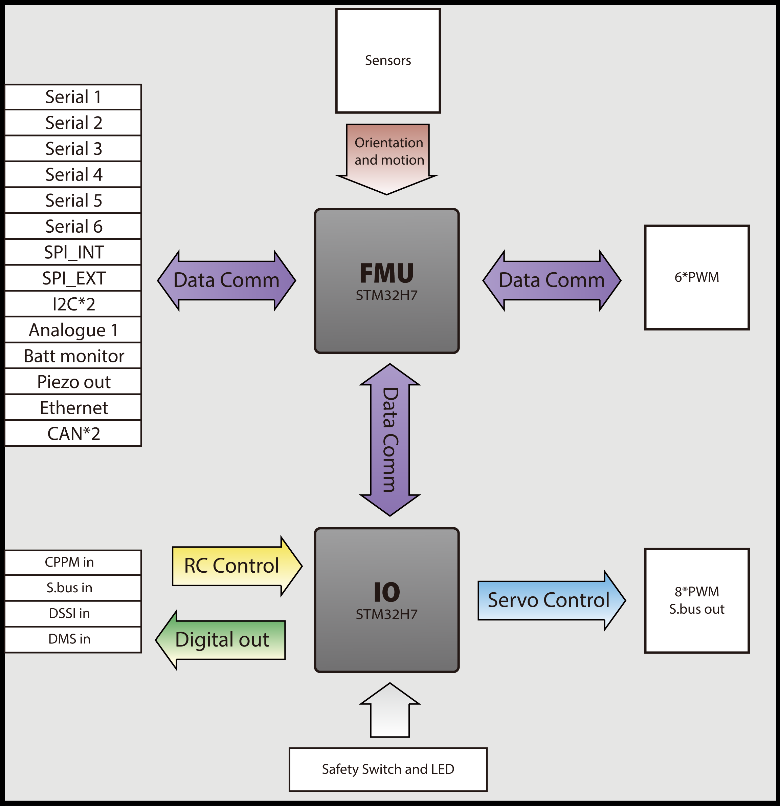

# Cube Red

<figure><figcaption></figcaption></figure>

## Overview

The Cube Red is a professional dual FMU flight control system that ensures operational reliability through its two dual-core, double-precision FPU processors. The newly added Ethernet interface and DSI out provide an unprecedented flight experience. An Isolated Static Air port minimizes disruptions from external airflow, ensuring stable static pressure. Also with Ardupilot firmware, you can utilize this unit with any type of UXV.

## Feature

1. Powerful processing performance is provided by two STM32H7 dual-core processors, each equipped with double-precision FPU (Floating Point Unit) operations.
2. Cube Red is equipped with 4 sets of IMUs and 3 barometers for redundancy, ensuring continuous safe operation during flight.
3. Replaceable fully closed uppercase and isolated static air ducts provide stable pressure to barometers for accurate altitude measurement.
4. Provides foams with different hardness options, catering to various flight purposes.
5. The CAN FD port offers real-time high transmission rates.
6. The Type-C Debugging interface has been updated to the future-proof USB Type-C standard.

## Operating Conditions and Performance

| **About**                                    | **Description**                                                           |
| -------------------------------------------- | ------------------------------------------------------------------------- |
| POWER input voltage / rated input current    | 4.1 - 5.7 V / 2.5 A; 0 - 20 V is safe for the system but it will not work |
| POWER rated output / input power             | 14 W                                                                      |
| USB port input voltage / rated input current | 4 - 5.7 V / 250 mA                                                        |
| Servo rail input voltage                     | 4 - 10.5 V                                                                |
| Waterproof performance                       | Not waterproof. External waterproof protection is needed                  |
| Operation Temperature                        | -10° / 55°                                                                |

## Ports Standard and Definition

### **Standard Carrier Board Ports Standard**

| Connector | Connector Type              |
| --------- | --------------------------- |
| `GPS1`    | JST-GH 1.25 mm (8-pin)      |
| `GPS2`    | JST-GH 1.25 mm (6-pin)      |
| `TELEM1`  | JST-GH 1.25 mm (6-pin)      |
| `TELEM2`  | JST-GH 1.25 mm (6-pin)      |
| `I2C2`    | JST-GH 1.25 mm (4-pin)      |
| `USB`     | JST-GH 1.25 mm (6-pin)      |
| `CAN1`    | JST-GH 1.25 mm (4-pin)      |
| `CAN2`    | JST-GH 1.25 mm (4-pin)      |
| `CAN3`    | JST-GH 1.25 mm (4-pin)      |
| `POWER1`  | Molex CLIK-Mate 2mm (6-pin) |
| `POWER2`  | Molex CLIK-Mate 2mm (6-pin) |
| `ADC`     | JST-GH 1.25 mm (3-pin)      |
| `DSI`     | JST-GH 1.25 mm (15-pin)     |
| `ETH`     | TE Multi-purp pluh(8P)      |

### Cube Red 80-Pin DF17 Connector

<figure><figcaption></figcaption></figure>

### **Connector 1 Assignments**

| **Pin#** | **Name**                      | **I/O** | **Description**                                                         |
| -------- | ----------------------------- | ------- | ----------------------------------------------------------------------- |
| 1        | FMU\_SWDIO                    | I/O     | FMU serial wire debug I/O                                               |
| 2        | FMU\_LED\_AMBER               | O       | Boot error LED (drive only, controlled by FET)                          |
| 3        | FMU\_SWCLK                    | O       | FMU serial wire debug clock                                             |
| 4        | I2C\_2\_SDA                   | I/O     | I2C Serial Data Tx/Rx                                                   |
| 5        | EXTERN\_CS                    | O       | Chip select for external SPI (NC, just for debugging)                   |
| 6        | I2C\_2\_SCL                   | O       | I2C Serial Clock Signal                                                 |
| 7        | FMU\_!RESET                   | I       | Reset pin for the FMU                                                   |
| 8        | CAN\_L\_3                     | I/O     | CAN bus Low Signal Driver                                               |
| 9        | VDD\_SERVO\_IN                | I       | Power for last resort I/O failsafe                                      |
| 10       | CAN\_H\_3                     | I/O     | CAN bus High Signal Driver                                              |
| 11       | EXTERN\_DRDY                  | I       | Interrupt pin for external SPI (NC, just for debugging)                 |
| 12       | SERIAL\_5\_RX                 | I       | UART 5 RX (Receive Data)                                                |
| 13       | GND                           |         | System GND                                                              |
| 14       | SERIAL\_5\_TX                 | O       | UART 5 TX (Transmit Data)                                               |
| 15       | GND                           |         | System GND                                                              |
| 16       | SERIAL\_4\_RX                 | I       | UART 4 RX (Receive Data)                                                |
| 17       | SAFETY                        |         | Safety button input                                                     |
| 18       | SERIAL\_4\_TX                 | O       | UART 4 TX (Transmit Data)                                               |
| 19       | VDD\_3V3\_SPEKTRUM\_EN        | O       | Enable for the Spektrum voltage regulator                               |
| 20       | SERIAL\_3\_RX                 | I       | UART 3 RX (Receive Data)                                                |
| 21       | PRESSURE\_SENS\_IN            | AI      | Analogue Signal port, for pressure sensor, Laser range finder, or Sonar |
| 22       | SERIAL\_3\_TX                 | O       | UART 3 TX (Transmit Data)                                               |
| 23       | AUX\_BATT\_VOLTAGE\_SENS      | AI      | Voltage sense for Aux battery input                                     |
| 24       | ALARM                         | O       | Buzzer PWM Signal                                                       |
| 25       | AUX\_BATT\_CURRENT\_SENS      | AI      | Current sense for Aux battery input                                     |
| 26       | IO\_VDD\_3V3                  | I       | IO chip power, pinned through for debug                                 |
| 27       | VDD\_5V\_PERIPH\_EN           | O       | Enable voltage supply for Peripherals                                   |
| 28       | IO\_LED\_SAFET\_PROT          | O       | IO-LED\_SAFETY (safety LED) pinned out for IRIS                         |
| 29       | VBUS                          | I       | USB VBus (VDD)                                                          |
| 30       | SERIAL\_2\_RTS                |         | UART 2 RTS (Request To Send)                                            |
| 31       | OTG\_DP1                      | I/O     | USB Data+ (D)                                                           |
| 32       | SERIAL\_2\_CTS                |         | UART 2 CTS (Clear To Send)                                              |
| 33       | OTG\_DM1                      | I/O     | USB Data- (M)                                                           |
| 34       | SERIAL\_2\_RX                 | I       | UART 2 RX (Receive Data)                                                |
| 35       | I2C\_1\_SDA                   | I/O     | I2C Serial Data Tx/Rx                                                   |
| 36       | SERIAL\_2\_TX                 | O       | UART 2 TX (Transmit Data)                                               |
| 37       | I2C\_1\_SCL                   | O       | I2C Serial Clock Signal                                                 |
| 38       | SERIAL\_1\_RX                 | I       | UART 1 RX (Receive Data)                                                |
| 39       | CAN\_L\_2                     | I/O     | FMU CAN bus Low Signal Driver                                           |
| 40       | SERIAL\_1\_TX                 | O       | UART 1 TX (Transmit Data)                                               |
| 41       | CAN\_H\_2                     | I/O     | FMU CAN bus High Signal Driver                                          |
| 42       | SERIAL\_1\_RTS                |         | UART 1 RTS (Request To Send)                                            |
| 43       | VDD\_5V\_PERIPH\_OC           | I       | Error state message from Peripheral power supply                        |
| 44       | SERIAL\_1\_CTS                |         | UART 1 CTS (Clear To Send)                                              |
| 45       | VDD\_5V\_HIPOWER\_OC          | I       | Error state message from High power Peripheral power supply             |
| 46       | IO\_USART\_1\_TX              | O       | I/O USART 1 TX                                                          |
| 47       | BATT\_VOLTAGE\_SENS\_PROT     | AI      | Voltage sense from main battery                                         |
| 48       | IO\_USART1\_RX\_SPECTRUM\_DSM | O       | Signal from Spectrum receiver                                           |
| 49       | BATT\_CURRENT\_SENS\_PROT     | AI      | Current sense from main battery                                         |
| 50       | FMU\_CH1\_PROT                | O       | FMU PWM output channel 1                                                |
| 51       | SPI\_EXT\_MOSI                | O       | External SPI, for debug only                                            |
| 52       | FMU\_CH2\_PROT                | O       | FMU PWM output channel 2                                                |
| 53       | VDD\_SERVO                    | I       | VDD\_Servo, for monitoring servo bus                                    |
| 54       | FMU\_CH3\_PROT                | O       | FMU PWM Output Channel 3                                                |
| 55       | VDD\_BRICK\_VALID             | I       | Main Power valid signal                                                 |
| 56       | FMU\_CH4\_PROT                | O       | FMU PWM Output Channel 4                                                |
| 57       | VDD\_BACKUP\_VALID            | I       | Backup Power valid Signal                                               |
| 58       | FMU\_CH5\_PROT                | O       | FMU PWM Output Channel 5                                                |
| 59       | VBUS\_VALID                   | I       | USB bus valid signal                                                    |
| 60       | FMU\_CH6\_PROT                | O       | FMU PWM Output Channel 6                                                |
| 61       | VDD\_5V\_IN\_PROT             | I       | Main power (5V) into FMU from power selection                           |
| 62       | PPM\_SBUS\_PROT               | I       | PPM / S.Bus Signal Input                                                |
| 63       | VDD\_5V\_IN\_PROT             | I       | Main power (5V) into FMU from power selection                           |
| 64       | S.BUS\_OUT                    | O       | S.Bus Signal Output                                                     |
| 65       | IO\_VDD\_5V5                  | O       | IO VDD 5.5 V                                                            |
| 66       | IO\_CH8\_PROT                 | O       | I/O PWM Output Channel 8                                                |
| 67       | SPI\_EXT\_MISO                | I       | External SPI, for Debug only                                            |
| 68       | IO\_CH7\_PROT                 | O       | I/O PWM Channel 7                                                       |
| 69       | IO\_SWDIO                     | I/O     | I/O serial wire debug                                                   |
| 70       | IO\_CH6\_PROT                 | O       | I/O PWM Output Channel 6                                                |
| 71       | IO\_SWCLK                     | O       | I/O Serial Wire Debug Clock                                             |
| 72       | IO\_CH5\_PROT                 | O       | I/O PWM Output Channel 5                                                |
| 73       | SPI\_EXT\_SCK                 | O       | External SPI, for Debug only                                            |
| 74       | IO\_CH4\_PROT                 | O       | I/O PWM Output Channel 4                                                |
| 75       | IO\_!RESET                    | I       | I/O Reset Pin                                                           |
| 76       | IO\_CH3\_PROT                 | O       | I/O PWM Output Channel 3                                                |
| 77       | CAN\_L\_1                     | I/O     | FMU CAN bus Low Signal Driver                                           |
| 78       | IO\_CH2\_PROT                 | O       | I/O PWM Output Channel 2                                                |
| 79       | CAN\_H\_1                     | I/O     | FMU CAN bus High Signal Driver                                          |
| 80       | IO\_CH1\_PROT                 | O       | I/O PWM Output Channel 1                                                |

### **Connector 2 Assignments**

| **Pin#** | **Name**            | **I/O** | **Description**                               |
| -------- | ------------------- | ------- | --------------------------------------------- |
| 1        | GND                 |         | System GND                                    |
| 2        | FMU\_BOOT           | I       | FMU Boot                                      |
| 3        | FC\_NET\_TX+        | I/O     | Ethernet TX+,Auto-MDIX support                |
| 4        | NC                  |         | Use for future                                |
| 5        | GND                 |         |                                               |
| 6        | IO\_BOOT            |         | IO MCU BOOT                                   |
| 7        | FC\_NET\_TX-        | I/O     | Ethernet TX-,Auto-MDIX support                |
| 8        | NC                  |         | Use for future                                |
| 9        | GND                 |         | System GND                                    |
| 10       | NC                  |         | Use for future                                |
| 11       | FC\_NET\_RX+        | I/O     | Ethernet RX+,Auto-MDIX support                |
| 12       | NC                  |         | Use for future                                |
| 13       | GND                 |         | System GND                                    |
| 14       | NC                  |         | Use for future                                |
| 15       | FC\_NET\_RX-        | I/O     | Ethernet RX-,Auto-MDIX support                |
| 16       | NC                  |         | Use for future                                |
| 17       | GND                 |         | System GND                                    |
| 18       | NC                  |         | Use for future                                |
| 19       | FC\_NET\_LEDY       | O       | Link Speed LED Indication                     |
| 20       | NC                  |         | Use for future                                |
| 21       | FC\_NET\_LEDG       | O       | Ethernet Link activity LED Indication         |
| 22       | NC                  |         | Use for future                                |
| 23       | FC\_NET\_VCC        | I       | Ethernet 3.3V Power in                        |
| 24       | NC                  |         | Use for future                                |
| 25       | Timestamp rtc       | I       | Timestamp RTC                                 |
| 26       | NC                  |         | Use for future                                |
| 27       | GND                 |         | System GND                                    |
| 28       | NC                  |         | Use for future                                |
| 29       | CAN\_L\_1           | I/O     | CAN bus Low Signal Driver                     |
| 30       | NC                  |         | Use for future                                |
| 31       | CAN\_H\_1           | I/O     | CAN bus High Signal Driver                    |
| 32       | NC                  |         | Use for future                                |
| 33       | CAN\_L\_2           | I/O     | CAN bus Low Signal Driver                     |
| 34       | NC                  |         | Use for future                                |
| 35       | CAN\_H\_2           | I/O     | CAN bus High Signal Driver                    |
| 36       | NC                  |         | Use for future                                |
| 37       | CAN\_L\_3           | I/O     | CAN bus Low Signal Driver                     |
| 38       | NC                  |         | Use for future                                |
| 39       | CAN\_H\_3           | I/O     | CAN bus High Signal Driver                    |
| 40       | NC                  |         | Use for future                                |
| 41       | GND                 |         | System GND                                    |
| 42       | NC                  |         | Use for future                                |
| 43       | UART8\_RX           | I       | IO UART 8 RX (Receive Data)                   |
| 44       | NC                  |         | Use for future                                |
| 45       | UART8\_TX           | O       | IO UART 8 TX (Transmit Data)                  |
| 46       | NC                  |         | Use for future                                |
| 47       | GND                 |         | System GND                                    |
| 48       | NC                  |         | Use for future                                |
| 49       | DSI\_CKP            | O       | MIPI DSI Host Clock Postive                   |
| 50       | NC                  |         | Use for future                                |
| 51       | DSI\_CKN            | O       | MIPI DSI Host Clock Negative                  |
| 52       | NC                  |         | Use for future                                |
| 53       | GND                 |         | System GND                                    |
| 54       | NC                  |         | Use for future                                |
| 55       | DSI\_D0P            | O       | MIPI DSI Host DATA0 Postive                   |
| 56       | NC                  |         | Use for future                                |
| 57       | DSI\_D0N            | O       | MIPI DSI Host DATA0 Negative                  |
| 58       | NC                  |         | Use for future                                |
| 59       | GND                 |         | System GND                                    |
| 60       | NC                  |         | Use for future                                |
| 61       | DSI\_D1P            | O       | MIPI DSI Host DATA1 Postive                   |
| 62       | NC                  |         | Use for future                                |
| 63       | DSI\_D1N            | O       | MIPI DSI Host DATA1 Negative                  |
| 64       | NC                  |         | Use for future                                |
| 65       | GND                 |         | System GND                                    |
| 66       | NC                  |         | Use for future                                |
| 67       | FMU\_DAC            | O       | FMU Analogue output                           |
| 68       | NC                  |         | Use for future                                |
| 69       | IO\_DAC             | O       | IO Analogue output                            |
| 70       | NC                  |         | Use for future                                |
| 71       | GND                 |         | System GND                                    |
| 72       | NC                  |         | Use for future                                |
| 73       | VDD\_5V\_IN\_backup | I       | Main power (5V) into FMU from power selection |
| 74       | NC                  |         | Use for future                                |
| 75       | VDD\_5V\_IN\_backup | I       | Main power (5V) into FMU from power selection |
| 76       | NC                  |         | Use for future                                |
| 77       | VDD\_5V\_IN\_backup | I       | Main power (5V) into FMU from power selection |
| 78       | NC                  |         | Use for future                                |
| 79       | VDD\_5V\_IN\_backup | I       | Main power (5V) into FMU from power selection |
| 80       | NC                  |         | Use for future                                |

### Ports and Protocols

| **Name**                          | **Function**                                                                                           | **Marking**              |
| --------------------------------- | ------------------------------------------------------------------------------------------------------ | ------------------------ |
| SERIAL 1 / UART 1                 | UART 1 with hardware flow control. 3.3V-5V CMOS TTL level, with ESD protection                         | `TELEM1`                 |
| SERIAL 2 / UART 2                 | UART 2 with hardware flow control. 3.3V-5V CMOS TTL level, with ESD protection                         | `TELEM2`                 |
| SERIAL 3 / UART 3 / I2C 1         | 3.3V-5V CMOS TTL level, with ESD protection                                                            | `GPS1`                   |
| SERIAL 4 / UART 4 / I2C 2         | UART 4 / I2C 2, 3.3V-5V CMOS TTL level, with ESD protection                                            | `GPS2`                   |
| SERIAL 5 / UART 5 (Debug Console) | UART 5，Debug Console                                                                                   | `CONS`                   |
| I2C 2                             | Independent I2C 2 port. Drivers are on-board on FMU. UN-buffered, and pulled up to 3.3V COMS TTL level | `I2C2`                   |
| CAN Bus                           | Standard CAN Bus. Drivers are on-board on FMU.                                                         | `CAN1` `CAN2` `CAN3`     |
| R/C IN                            | Support CPPM / Futaba S.Bus signal input                                                               | `RCIN`                   |
| DSM / USART                       | Support Spektrum DSM® Technology, Spektrum DSM2™ / DSMX™ compatible input; I/O USART 1 RX              | `SKPT`                   |
| S.Bus OUT / RSSI IN               | S.Bus Servo I/O. PPM Output. Can be used as RSSI input                                                 | `SBUSo`                  |
| POWER                             | Main Power source and Backup Power source Input                                                        | `POWER1` `POWER2`        |
| MAIN OUT                          | Standard PWM Servo Signal I/O Port x 8                                                                 | `MAIN OUT`               |
| AUX OUT                           | Programmable FMU GPIO x 6. Support PWM Signal Output                                                   | `AUX OUT`                |
| USB                               | Human Machine Interface (HMI): LED, Speaker and USB extension                                          | `USB`                    |
| ADC                               | 3.3 V ADC Input                                                                                        | `ADC`                    |
| SPI                               | Built-in SPI port, with NO buffer, can only use short cable for connection. Not recommended.           | `Built-in contact point` |
| Debug                             | I/O and FMU Testing Port                                                                               | `Built-in port`          |
| ETH                               | Ethernet Port                                                                                          |                          |
| DSI                               | MIPI DSI output and Timestamp,FMU/IO BOOT                                                              |                          |

## **The Cube Series Interface Specification**

### **Scope of this Document**

This document covers the complete interface standard and core mechanical, electrical and external connection options of The Cube module series. Sections marked as LT (long term) are intended to be kept stable to isolate vehicle from autopilot revisions.

### **Interface Standard**

_Connector Series_

Low density: 0.1” over mould Futaba keyed servo connectors (Mfg. to be identified)

\-Cabling: AWG24, ribbon or round, iconic colour scheme

Stack: [Hirose DF17, 80pos](http://www.hirose.co.jp/cataloge\_hp/en\_DF17\_20130411.pdf) , 4 mm stacking height, 0.5 mm pitch, drop-proof

High density: [JST-GH](http://www.jst-mfg.com/product/detail\_e.php?series=105%5C) 1.25 mm

\-Cabling: AWG28, ribbon, iconic colour scheme

Power Module: [Molex Clik-Mate](https://www.molex.com/molex/products/family/clikmate\_wiretoboard\_connectors) 2 mm for both main and backup power

### **The Cube**

Mechanical: 30x30 mm M3 mounting hole pattern, 35x35 mm footprint

80 position DF17 connector. Carries _all_ autopilot interface connections.

Minimal (read: really minimal) electrical protection

_No power management_（intergrade in Carrier board）

3.8 to 5.7V operation (absolute maximum ratings)

4.0 to 5.5V operation (compliant rating)

### **The Cube IO**

Total connectivity:

* I2C \* 2
* CAN \* 3
* Serial \* 5 : TELEM1, TELEM2, GPS (I2C 1 embedded), SERIAL4(I2C 2 embedded),

**Serial 5 is used for the on-board ADSB-IN receiver that is featured on newer carrier boards**

* HMI \* 1

### **Carrier Board Port Interface and Pin Label**

<figure><figcaption></figcaption></figure>

#### **SERIAL 1 / UART 1 | Port: `TELEM1`**

| **Pin #** | **Name**            | **I/O** | **Voltage**       | **Wire Colour** | **Definition**               |
| --------- | ------------------- | ------- | ----------------- | --------------- | ---------------------------- |
| 1         | VCC\_5V             | OUT     | 5 V               | RED/GRAY        | VCC                          |
| 2         | SERIAL\_1\_TX       | OUT     | 3.3 V - 5.0 V TTL | Orange+/BLACK   | UART 1 TX (Transmit Data)    |
| 3         | SERIAL\_1\_RX       | IN      | 3.3 V - 5.0 V TTL | GREEN/BLACK     | UART 1 RX (Receive Data)     |
| 4         | SERIAL\_1\_CTS (TX) | OUT     | 3.3 V - 5.0 V TTL | GRAY/BLACK      | UART 1 CTS (Clear To Send)   |
| 5         | SERIAL\_1\_RTS (RX) | IN      | 3.3 V - 5.0 V TTL | GRAY/BLACK      | UART 1 RTS (Request To Send) |
| 6         | GND                 |         | GND               | BLACK           | GND                          |

#### **SERIAL 3 / UART 3 (GPS) / I2C 1 | Port: `GPS1`**

| **Pin #** | **Name**             | **I/O** | **Voltage**       | **Cable Colour** | **Definition**                  |
| --------- | -------------------- | ------- | ----------------- | ---------------- | ------------------------------- |
| 1         | VCC\_5V              | IN      | 5 V               | RED              | VCC Power Supply To GPS From AP |
| 3         | SERIAL\_3\_TX        | OUT     | 3.3 V - 5.0 V TTL | BLACK            | UART 3 TX (Transmit Data)       |
| 2         | SERIAL\_3\_RX        | IN      | 3.3 V - 5.0 V TTL | BLACK            | UART 3 RX (Receive Data)        |
| 4         | I2C\_1\_SCL          | IN      | 3.3 V             | BLACK            | I2C 1 Clock Signal              |
| 5         | I2C\_1\_SDA          | IN/OUT  | 3.3 V             | BLACK            | I2C 1 Serial Data               |
| 6         | BUTTON               |         | GND               | BLACK            | Signal shorted to GND on press  |
| 7         | IO\_LED\_SAFET\_PROT |         | GND               | BLACK            | LED Driver For Safety Button    |
| 8         | GND                  |         | GND               | BLACK            | GND                             |

#### **HMI (Buzzer / USB / LED) | Port: `USB`**

| **Pin #** | **Name**        | **I/O** | **Voltage**     | **Cable Colour** | **Definition**                |
| --------- | --------------- | ------- | --------------- | ---------------- | ----------------------------- |
| 1         | V BUS           | OUT     | 5 V             | RED/GRAY         | USB V BUS                     |
| 2         | OTG\_DP1        | IN/OUT  | 3.3 V           | GREEN/BLACK      | USB Data Positive (D+)        |
| 3         | OTG\_DM1        | IN/OUT  | 3.3 V           | RED/BLACK        | USB Data Minus (D-)           |
| 4         | GND             |         | GND             | BLACK            | GND                           |
| 5         | BUZZER\_OUT     | OUT     | Battery Voltage | GRAY/BLACK       | VBAT (8.4 - 42 V)             |
| 6         | FMU\_LED\_AMBER | OUT     |                 | BLACK            | Boot / Error LED (FW updates) |

#### **I2C 2 | Port: `I2C 2`**

| Pin # | Name        | I/O    | Voltage         | Cable Colour | Definition                        |
| ----- | ----------- | ------ | --------------- | ------------ | --------------------------------- |
| 1     | VCC\_5V     | OUT    | 5 V             | RED/GRAY     | VCC Power Supply                  |
| 2     | I2C\_2\_SCL | IN/OUT | 3.3 V (PULLUPS) | BLUE/BLACK   | I2C 2 Clock Signal, Pull-up on AP |
| 3     | I2C\_2\_SDA | IN/OUT | 3.3 V (PULLUPS) | GREEN/BLACK  | I2C 2 Serial Data, Pull-up on AP  |
| 4     | GND         |        | GND             | BLACK        | GND                               |

#### **CAN 1 | Port: `CAN1`**

| Pin # | Name      | I/O    | Voltage | Cable Colour  | Definition       |
| ----- | --------- | ------ | ------- | ------------- | ---------------- |
| 1     | VCC\_5V   | OUT    | 5 V     | RED/GRAY      | VCC Power Supply |
| 2     | CAN\_H\_1 | IN/OUT | 12 V    | Orange+/BLACK | CAN High         |
| 3     | CAN\_L\_1 | IN/OUT | 12 V    | GREEN/BLACK   | CAN Low          |
| 4     | GND       |        | GND     | BLACK         | GND              |

**CAN 2 | Port: `CAN2`**

| Pin # | Name      | I/O    | Voltage | Cable Colour  | Definition       |
| ----- | --------- | ------ | ------- | ------------- | ---------------- |
| 1     | VCC\_5V   | OUT    | 5 V     | RED/GRAY      | VCC Power Supply |
| 2     | CAN\_H\_2 | IN/OUT | 12 V    | Orange+/BLACK | CAN High         |
| 3     | CAN\_L\_2 | IN/OUT | 12 V    | GREEN/BLACK   | CAN Low          |
| 4     | GND       |        | GND     | BLACK         | GND              |

**ADC | Port: `ADC`**

| **Pin #** | **Name**           | **I/O** | **Voltage** | **Cable Colour** | **Definition** |
| --------- | ------------------ | ------- | ----------- | ---------------- | -------------- |
| 1         | VDD\_5V\_PRES      | OUT     | 5 V         | RED              | Power Supply   |
| 2         | PRESSURE\_SENS\_IN | IN      |             | BLACK            |                |
| 3         | GND                |         | GND         | BLACK            | GND            |

**IO USART 1 / DSM | Port: `SPKT`**

| **Pin #** | **Name**                      | **I/O** | **Voltage** | **Cable Colour** | **Definition**           |
| --------- | ----------------------------- | ------- | ----------- | ---------------- | ------------------------ |
| 1         | IO\_USART1\_RX\_SPECTRUM\_DSM | IN      |             |                  | IO USART 1 RX, DSM INPUT |
| 2         | GND                           |         | GND         |                  | GND                      |
| 3         | VDD\_3V3\_Spektrum            | OUT     | 3.3 V       |                  | Independent Power Supply |

<figure><figcaption></figcaption></figure>

**SERIAL 5 / UART 5 (Debug Console) / S.Bus OUT | Port: `CONS`** **`SBUSo`**

| **Pin #** | **Name**      | **I/O** | **Voltage**       | **Cable Colour** | **Definition**            |
| --------- | ------------- | ------- | ----------------- | ---------------- | ------------------------- |
| 1 `SBUSo` | S.Bus\_Out    | OUT     |                   |                  | S.Bus Signal Output       |
| 2 `CONS`  | SERIAL\_5\_TX | OUT     | 3.3 V - 5.0 V TTL |                  | UART 5 TX (Transmit Data) |
| 3 `SBUSo` | VDD\_SERVO    | OUT     | Servo Voltage     |                  |                           |
| 4 `CONS`  | SERIAL\_5\_RX | IN      | 3.3 V - 5.0 V TTL |                  | UART 5 RX (Receive Data)  |
| 5 `SBUSo` | GND           |         | GND               |                  | GND                       |
| 6 `CONS`  | GND           |         | GND               |                  | GND                       |

**Main Power POWER 1 | Port: `POWER1`**

| **Pin #** | **Name**                     | **I/O** | **Voltage** | **Cable Colour** | **Definition**                |
| --------- | ---------------------------- | ------- | ----------- | ---------------- | ----------------------------- |
| 1         | VDD\_5V\_BRICK               | IN      | 5 V         | RED/GRAY         | Supply To AP from Power Brick |
| 2         | VDD\_5V\_BRICK               | IN      | 5 V         | RED/GRAY         | Supply To AP from Power Brick |
| 3         | BATT\_CURRENT\_SENS\_PROT    |         | 3.3 V       | BLACK            | Battery Current Connecter     |
| 4         | BATT\_CURRENT\_VOLTAGE\_PROT | IN      | 3.3 V       | BLACK            | Battery Voltage Connecter     |
| 5         | GND                          |         | GND         | BLACK            | GND                           |
| 6         | GND                          |         | GND         | BLACK            | GND                           |

**Backup Power POWER 2 | Port: `POWER2`**

| **Pin #** | **Name**                 | **I/O** | **Voltage** | **Cable Colour** | **Definition**                |
| --------- | ------------------------ | ------- | ----------- | ---------------- | ----------------------------- |
| 1         | VDD\_5V\_BRICK           | IN      | 5 V         | RED/GRAY         | Supply To AP from Power Brick |
| 2         | VDD\_5V\_BRICK           | IN      | 5 V         | RED/GRAY         | Supply To AP from Power Brick |
| 3         | AUX\_BATT\_CURRENT\_SENS |         | 3.3 V       | BLACK            | Aux Battery Current Connecter |
| 4         | AUX\_BATT\_VOLTAGE\_SENS | IN      | 3.3 V       | BLACK            | Aux Battery Voltage Connecter |
| 5         | GND                      |         | GND         | BLACK            | GND Connection                |
| 6         | GND                      |         | GND         | BLACK            | GND                           |

**CPPM / S.BUS / SERVO SYSTEM | Port: `RCIN`** **`MAIN OUT`** **`AUX OUT`**

| **Pin #** | **Name**        | **I/O** | **Voltage**                          | **Definition**     |
| --------- | --------------- | ------- | ------------------------------------ | ------------------ |
| S - 1     | FMU\_CH1\_PROT  | OUT     | 3.3 V Servo Signal, Servo Rail Power | PWM Signal         |
| S - 2     | FMU\_CH2\_PROT  | OUT     | 3.3 V Servo Signal, Servo Rail Power | PWM Signal         |
| S - 3     | FMU\_CH3\_PROT  | OUT     | 3.3 V Servo Signal, Servo Rail Power | PWM Signal         |
| S - 4     | FMU\_CH4\_PROT  | OUT     | 3.3 V Servo Signal, Servo Rail Power | PWM Signal         |
| S - 5     | FMU\_CH5\_PROT  | OUT     | 3.3 V Servo Signal, Servo Rail Power | PWM Signal         |
| S - 6     | FMU\_CH6\_PROT  | OUT     | 3.3 V Servo Signal, Servo Rail Power | PWM Signal         |
| S - 7     | IO\_CH1\_PROT   | OUT     | 3.3 V Servo Signal, Servo Rail Power | PWM Signal         |
| S - 8     | IO\_CH2\_PROT   | OUT     | 3.3 V Servo Signal, Servo Rail Power | PWM Signal         |
| S - 9     | IO\_CH3\_PROT   | OUT     | 3.3 V Servo Signal, Servo Rail Power | PWM Signal         |
| S - 10    | IO\_CH4\_PROT   | OUT     | 3.3 V Servo Signal, Servo Rail Power | PWM Signal         |
| S - 11    | IO\_CH5\_PROT   | OUT     | 3.3 V Servo Signal, Servo Rail Power | PWM Signal         |
| S - 12    | IO\_CH6\_PROT   | OUT     | 3.3 V Servo Signal, Servo Rail Power | PWM Signal         |
| S - 13    | IO\_CH7\_PROT   | OUT     | 3.3 V Servo Signal, Servo Rail Power | PWM Signal         |
| S - 14    | IO\_CH8\_PROT   | OUT     | 3.3 V Servo Signal, Servo Rail Power | PWM Signal         |
| S - 15    | PPM\_SBUS\_PROT | IN/OUT  | 3.3 V / 4.5 V Powered                | PPM / S.Bus Signal |

<figure><figcaption></figcaption></figure>

**SERIAL 2 / UART 2 | Port: `TELEM2`**

| **Pin #** | **Name**            | **I/O** | **Voltage**       | **Cable Colour** | **Definition**               |
| --------- | ------------------- | ------- | ----------------- | ---------------- | ---------------------------- |
| 1         | VCC\_5V             | OUT     | 5 V               | RED/GRAY         | VCC                          |
| 2         | SERIAL\_2\_TX       | OUT     | 3.3 V - 5.0 V TTL | Orange+/BLACK    | UART 2 TX (Transmit Data)    |
| 3         | SERIAL\_2\_RX       | IN      | 3.3 V - 5.0 V TTL | GREEN/BLACK      | UART 2 RX (Receive Data)     |
| 4         | SERIAL\_2\_CTS (TX) | OUT     | 3.3 V - 5.0 V TTL | GRAY/BLACK       | UART 2 CTS (Clear To Send)   |
| 5         | SERIAL\_2\_RTS (RX) | IN      | 3.3 V - 5.0 V TTL | GRAY/BLACK       | UART 2 RTS (Request To Send) |
| 6         | GND                 |         | GND               | BLACK            | GND                          |

**SERIAL 4 / UART 4 / I2C 2 | Port: `GPS2`**

| Pin # | Name          | I/O | Voltage           | Cable Colour  | **Definition**                  |
| ----- | ------------- | --- | ----------------- | ------------- | ------------------------------- |
| 1     | VCC\_5V       | OUT | 5 V               | RED/GRAY      | VCC Power Supply To GPS From AP |
| 2     | SERIAL\_4\_TX | OUT | 3.3 V - 5.0 V TTL | Orange+/BLACK | UART 4 TX (Transmit Data)       |
| 3     | SERIAL\_4\_RX | IN  | 3.3 V - 5.0 V TTL | GREEN/BLACK   | UART 4 RX (Receive Data)        |
| 4     | I2C\_2\_SCL   | OUT | 3.3 V - 5.0 V     | GRAY/BLACK    | I2C 2 Clock Signal              |
| 5     | I2C\_2\_SDA   | IN  | 3.3 V - 5.0 V     | GRAY/BLACK    | I2C 2 Serial Data               |
| 6     | GND           |     | GND               | BLACK         | GND                             |

**CAN 3 | Port: `CAN3`**

| **Pin #** | **Name**  | **I/O** | **Voltage** | **Cable Colour** | **Definition**   |
| --------- | --------- | ------- | ----------- | ---------------- | ---------------- |
| 1         | VCC\_5V   | OUT     | 5 V         | RED/GRAY         | VCC Power Supply |
| 2         | CAN\_H\_2 | IN/OUT  | 12 V        | Orange+/BLACK    | CAN High         |
| 3         | CAN\_L\_2 | IN/OUT  | 12 V        | GREEN/BLACK      | CAN Low          |
| 4         | GND       |         | GND         | BLACK            | GND              |

<figure><figcaption></figcaption></figure>

**Ethernet: `ETH1`**

| **Pin #** | **Name** | **I/O** | **Description**                    |
| --------- | -------- | ------- | ---------------------------------- |
| 1         | TXP/RXP  | IN/OUT  | Ethernet TXP/RXP Auto-MDIX support |
| 2         | TXN/RXN  | IN/OUT  | Ethernet TXN/RXN Auto-MDIX support |
| 3         | RXP/TXP  | IN/OUT  | Ethernet RXP/TXP Auto-MDIX support |
| 4         | NC       |         | No connect                         |
| 5         | NC       |         | No connect                         |
| 6         | RXN/TXN  | IN/OUT  | Ethernet RXN/TXN Auto-MDIX support |
| 7         | NC       |         | No connect                         |
| 8         | NC       |         | No connect                         |

<figure><figcaption></figcaption></figure>

**DSI / Timestamp / Boot| Port: `DSI`**

| **Pin #** | **Name**       | **I/O** | **Definition**                |
| --------- | -------------- | ------- | ----------------------------- |
| 1         | IO\_BOOT\_0    | OUT     | IO BOOT                       |
| 2         | FMU\_BOOT\_0   | OUT     | FMU BOOT                      |
| 3         | TIMESTAMP\_RTC | OUT     | TIMESTAMP                     |
| 4         | GND            |         | GND                           |
| 5         | DSI\_CKP       | OUT     | MIPI DSI Host Clock Postive   |
| 6         | DSI\_CKN       | OUT     | MIPI DSI Host Clock Negative  |
| 7         | GND            |         | GND                           |
| 8         | DSI\_D0P       | OUT     | MIPI DSI Host DATA 0 Postive  |
| 9         | DSI\_D0N       | OUT     | MIPI DSI Host DATA 0 Negative |
| 10        | GND            |         | GND                           |
| 11        | DSI\_D1P       | OUT     | MIPI DSI Host DATA 1 Postive  |
| 12        | DSI\_D1N       | OUT     | MIPI DSI Host DATA 1 Negative |
| 13        | GND            |         | GND                           |
| 14        | IO\_DAC        | OUT     | IO Analog output              |
| 15        | FMU\_DAC       | OUT     | FMU Analog output             |

#### System architecture

The Cube continues with the FMU + IO architecture from the previous generation, incorporating the two functional blocks in a single physical module.

<figure><figcaption></figcaption></figure>

**PWM Outputs**

The Cube has eight PWM outputs that are connected to IO and can be controlled by IO directly via R/C input and on-board mixing even if FMU is not active (failsafe / manual mode). Multiple update rates can be supported on these outputs in three groups; one group of four and two groups of two. PWM signal rates up to 400Hz can be supported. These 8 PWM's are output ONLY and are capable of driving up to 50mA each, but only a total of 100mA for the 8.

Six PWM outputs are connected to FMU and feature reduced update latency. These outputs cannot be controlled by IO in failsafe conditions. Multiple update rates can be supported on these outputs in two groups; one group of four and one group of two.

PWM signal rates up to 400Hz can be supported.

All PWM outputs are EDS-protected, and they are designed to survive accidental miss-connection of servos without being damaged. The servo drivers are specified to drive a 50pF servo input load over 2m of 26AWG servo cable.

the I/O PWM outputs can also be configured as individual GPIOs. Note that these are not high-power outputs – the PWM drivers are designed for driving servos and similar logic inputs only, not relays or LEDs.

**Peripheral Ports**

All peripherals are connected through two 80 pin connectors, and the peripherals are connected via a baseboard that can be customized for each application

**Base Board**

The initial base board features separate connectors for each of the peripheral ports (with a few exceptions.

Five serial ports are provided. Serial 1 and 2 feature full flow control. Serial 3 is recommended as the GPS port and has the safety button and (possibly the safety led) as well as I2C for the compass and RGB LED. Serial 4 also has I2C, but on the second bus, thus allowing two compass modules to be connected at the same time. Serial 5 is available as a header underneath the board. Serial ports are 3.3V CMOS logic level, 5V tolerant, buffered and ESD-protected.

The SPI port is not buffered; it should only be used with short cable runs. Signals are 3.3V CMOS logic level, but 5V tolerant. SPI is only available to test points on the first base board, along with a CS and INT pin.

Analogue 1-3 are protected against inputs up to 12V, but scaled for 0-3.3V inputs. The RSSI input supports either PWM or analogue RSSI. This input shares a pin with S.Bus output - only one may be connected at a time.

CPPM, S.Bus and DSM/Spektrum input are unchanged from previous versions.

The CAN ports are standard CAN-Bus; termination for one end of the bus is fixed on- board. Drivers are on-board the FMU

The piezo port will drive most piezo elements in the 5 - 300nF range at up to 35V. it is intended to be _extremely loud_, with the achievable sound pressure level limited by the sensitivity of the piezo element being driven.

I2C is direct driven, un-buffered, and pulled up to \***3.3v on-board\*** the FMU

Serial 5 is used for the on-board ADSB-IN receiver that is featured on newer carrier boards

#### Power Architecture

<figure><figcaption></figcaption></figure>

**Power management module (separate from the FMU)**

Key features of The Cube power architecture:

* Single, independent 5V supply for the flight controller and peripherals.
* Integration with \***2 power bricks\*** or compatible alternative, including current and voltage sensing.
* Low power consumption and heat dissipation.
* Power distribution and monitoring for peripheral devices.
* Protection against common wiring faults; under/over-voltage protection, overcurrent protection, thermal protection.
* Brown-out resilience and detection.

**FMU and IO Power Supplies**

Both FMU and IO operate at 3.3V, and each has its own private dual-channel regulator. As in The Cube , each regulator features a power-on reset output tied to the regulator’s internal power-up and drop-out sequencing.

**Power Sources**

Power may be supplied to The Cube via USB, via the power brick port, or the second brick port. Each power source is protected against reverse-polarity connections and back-powering from other sources.

**Power Brick Port**

The brick port is the preferred power source for Cube, and brick power will always be selected if it is available.

**Servo Power**

The Cube supports both standard (5V) and high-voltage (up to 10V) servo power with some restrictions.

IO will accept power from the servo connector up to 10V. This allows IO to failover to servo power in all cases if the main power supply is lost or interrupted.

_**FMU and peripherals will NOT accept power from the servo connector.**_

**Aux Power**

The Cube introduces a backup power port; this is set up the same as the primary power input.

At input voltages over 5.7V power is locked out.

The Cube and peripherals combined may draw up to 2.75A total when operating on Aux power, provided that the Brick or other power source can supply the required current.

Power is never supplied by The Cube to servos.

**Servo rail**

The I/O chip takes power up to 10.5v from the servo rail; this is used to revert to manual mode in the unfortunate event that the other two main sources of power fail. This is only useful for plane, and only useful if the I/O chip has been mapped correctly.

**USB-Type C Power**

Power from USB-Type C is supported for software update, testing and development purposes. USB-Type C power is supplied to the peripheral ports for testing purposes, however total current consumption must typically be limited to **3A**, including peripherals, to avoid overloading the host USB port.

**Multiple Power Sources**

When more than one power source is connected, power will be drawn from the highest-priority source with a valid input voltage.

In most cases, FMU should be powered via the power brick or a compatible off board regulator via the brick port or auxiliary power rail.

In desktop testing scenarios, taking power from USB avoids the need for a BEC or similar servo power source (though servos themselves will still need external power).

**Summary**

For each of the components listed, the input voltage ranges over which the device can be powered from each input is shown.

| 
 
     | **Brick port** | **Aux port**    | **USB port**    | **Servo rail** |
| --------------- | -------------- | --------------- | --------------- | -------------- |
| **FMU**         | 4—5.7V         | 4—5.7V          | 4—5.7V          | NIL            |
| **IO**          | 4—5.7V         | 4—5.7V          | 4—5.7V          | 4 - 10.5V      |
| **Peripherals** | 4—5.7V         | 4—5.7V 2.5A max | 4—5.7V 2.5A max | NIL            |

The Cube provides power routing, over/under voltage detection and protection, filtering, switching, current-limiting and transient suppression for peripherals. Power outputs to peripherals feature ESD and EMI filtering, and the power supply protection scheme ensures that no more than 5.5V is presented to peripheral devices.

Power is disconnected from the peripherals when the available supply voltage falls below 3.8V, or rises above approximately 5.7V.

Peripheral power is split into **two groups**:

**Serial 1** (`TELEM 1`) has a private 1.5A current limit, intended for powering a low power. This output is separately EMI filtered and draws directly from the USB / Brick inputs. Peak power draw on this port should not exceed 1.5A, never power your telemetry from this port under any circumstance.

**All other peripherals** share a 1A current limit and a single power switch. Peak power draw on this port should not exceed 1.5A. Each group is individually switched under software control.

The **Spektrum / DSM R/C interface** draws power from its own regulator, rather than from either of the groups above. This port is switched under software control so that Spektrum / DSM binding can be implemented. Spektrum receivers generally draw \~25mA.

S.Bus and CPPM receivers are powered by a dedicated power supply. Please do not connect any servos to this power, only an RX by itself.

**Capacitor Backup**

**Both** the FMU and IO microcontrollers feature Capacitor-backed real-time clocks and SRAM. The on-board backup Capacitor has capacity sufficient for the intended use of the clock and SRAM, which is to provide storage to permit orderly recovery from unintended power loss or other causes of in-air restarts. The capacitors are recharged from the FMU 3.3V rail. this will only function in the event of software existing to support this feature.

**Voltage, Current and Fault Sensing**

The battery voltage and current reported **by both bricks** can be measured by the FMU. In addition, the 5V unregulated supply rail can be measured (to detect brown- out conditions). IO can measure the servo power rail voltage.

Over-current conditions on the peripheral power ports can be detected by the FMU. Hardware lock-out prevents damage due to persistent short-circuits on these ports. The lock- out can be reset by FMU software. The under/over voltage supervisor for FMU provides an output that is used to hold FMU in reset during brown-out events.

**EMI Filtering and Transient Protection**

* **(on the normal Base Board, must be specified for externally supplied base boards.）**

EMI filtering is provided at key points in the system using high-insertion-loss pass- through filters. These filters are paired with TVS diodes at the peripheral connectors to suppress power transients.

Reverse polarity protection is provided at each of the power inputs. USB signals are filtered and terminated with a combined termination/TVS array.

Most digital peripheral signals (all PWM outputs, serial ports, I2C port) are driven using ESD-enhanced buffers and feature series blocking resistors to reduce the risk of damage due to transients or accidental misconnections.

#### List of features The Cube

* Four set IMU's
* One onboard compass
* Three Barometers
* Dual Power input
  * This removes the option of redundancy from the Servo rail and replaces it with a dedicated second power plug
  * A dedicated power protection Zener diode and Fet have been added to protect from voltages over 5.6v being applied to Aux input 2
  * This is only on the "PRO" carrier board mini carrier board still draws the backup from the servo rail.
* Dual external I2C
  * This allows for connection of items to either I2C port, potentially allowing two GPS / Mag units to be plugged in without the Mags conflicting.
* Power monitoring pins are now routed to the I/O chip, these will allow for the logging of power events during an inflight reboot.

2024-02-08\

\
