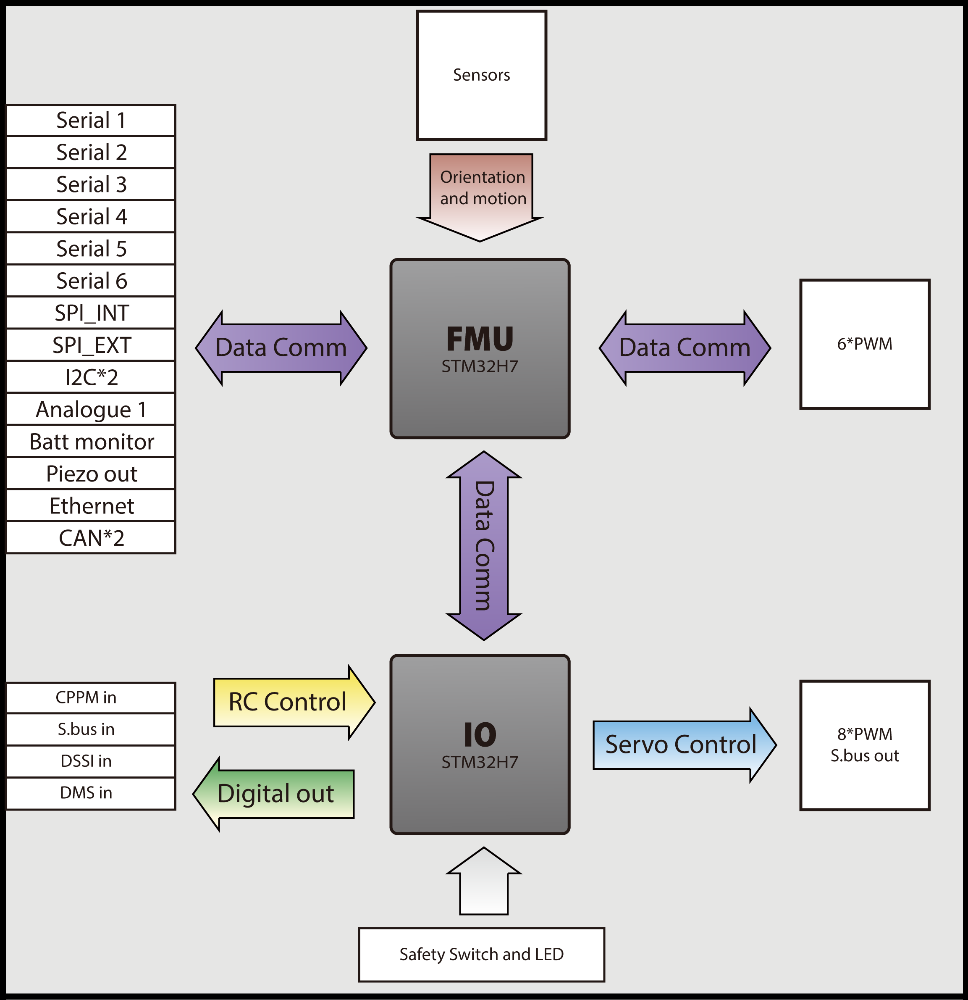

# System Architecture

The <mark style="color:red;">Cube Red</mark> continues with the flight management unit (FMU) + I/O architecture, where the two functional blocks are incorporated in a single physical module.

<figure><figcaption></figcaption></figure>

**PWM Outputs**

The <mark style="color:red;">Cube Red</mark> has eight pulse width modulation (PWM) outputs that are connected to the secondary FMU. Multiple update rates can be supported on these outputs in three groups: one group of four and two groups of two. PWM signal rates reaching up to 400 Hz can be supported. These eight PWMs can drive up to 50 mA each, but with a total of 100 mA for the eight outputs combined.

Six PWM outputs are connected to the primary FMU and feature reduced update latency. Multiple update rates can be supported on these outputs in two groups: one group of four and one group of two. PWM signal rates up to 400 Hz can be supported.

All PWM outputs are electro-static discharge (EDS) protected and designed to survive accidental miss-connection of servos without being damaged. The servo drivers are specified to drive a 50 pF servo input load over 2 m of 26 AWG servo cable.

The I/O PWM outputs can also be configured as individual general-purpose input/output (GPIO).&#x20;


The GPIOs are not high-power outputs. The PWM drivers are only designed for driving servos and similar logic inputs, not relays or LEDs.


**Peripheral Ports**

All peripherals are connected through two 80-pin connectors, and the peripherals are connected via a baseboard that can be customized for each application.

**FMU and I/O Power Supplies**

The primary FMU and secondary FMU both operate at 3.3V, each with a private dual-channel regulator. Each regulator features a power-on reset output tied to the regulator’s internal power-up and drop-out sequencing.

**Power Sources**

Power may be supplied to the <mark style="color:red;">Cube Red</mark> via USB, the power brick port, or the second brick port. Each power source is protected against reverse-polarity connections and back-powering from other sources.

**Power Brick Port**

The brick port is the preferred power source for the <mark style="color:red;">Cube Red</mark>. Brick power will always be selected when available.

**Servo Power**

The <mark style="color:red;">Cube Red</mark> supports both standard (5 V) and high-voltage (up to 10V) servo power, with some restrictions.

The secondary FMU can accept power from the servo connector up to 10V. This allows the I/O to failover to servo power if the main power supply is lost or interrupted.


The FMU and peripherals will NOT accept power from the servo connector.


**Aux Power**

The <mark style="color:red;">Cube Red</mark> includes a backup power port, which is set up like the primary power input. Input voltages above 5.7V power are blocked.

The <mark style="color:red;">Cube Red</mark> and its peripherals may draw up to a total of 2.75A when operating on Aux power, provided that the power brick or another power source can supply the required current. Servos are never powered directly by the <mark style="color:red;">Cube Red</mark>.

**Servo Rail**

The I/O chip draws power up to 10.5V from the servo rail. This allows reverting to manual mode in case the 5V main input or 5V backup input from the power selection module (PSM) located on the carrier board fails. It is specifically applicable to planes and requires correct mapping of the I/O chip.

**USB-Type C Power**

Power from USB-Type C is supported for software updates, testing, and development purposes. USB-Type C power is supplied to the peripheral ports for testing; however, total current consumption must typically be **limited to 3A**, including the peripherals, to avoid overloading the host USB port.

**Multiple Power Sources**

When more than one power source is connected, power will be drawn from the highest-priority source with a valid input voltage.

In most cases, the FMU should be powered via the power brick or a compatible off-board regulator through the brick port or auxiliary power rail.

In desktop testing scenarios, drawing power from the USB avoids the need for a battery eliminator circuit (BEC) or similar servo power source (though the servos will still need an external power source).

**Capacitor Backup**

Both the FMU and I/O microcontrollers feature capacitor-backed real-time clocks and SRAM. The on-board backup capacitor has sufficient capacity for the intended use of the clock and SRAM, which is to provide storage to allow orderly recovery from unintended power loss or other causes of in-air restarts. The capacitors are recharged from the FMU 3.3V rail. This feature will only be available if software is present to support it.

**EMI Filtering and Transient Protection**

A filter and a Transient Voltage Suppressor (TVS) have been added to the carrier board for EMI filtering and transient protection. When designing your own carrier board, you must also include these features.

EMI filtering is provided at key points in the system using high-insertion-loss pass-through filters. These filters are paired with TVS diodes at the peripheral connectors to suppress power transients.

Reverse polarity protection is provided at each of the power inputs. USB signals are filtered and terminated with a combined termination/TVS array.

Most digital peripheral signals (including all PWM outputs, serial ports, or I2C ports) are driven using ESD-enhanced buffers and feature series blocking resistors to reduce the risk of damage due to transients or accidental misconnections.

### <mark style="color:red;">Cube Red</mark> Connectors

<figure><figcaption></figcaption></figure>
