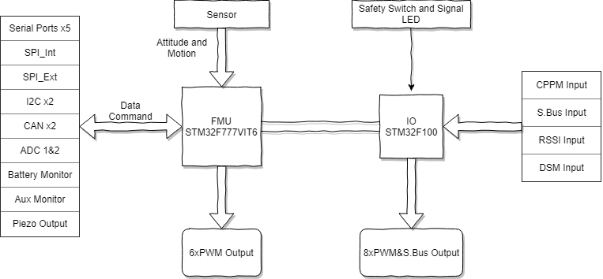

# Cube Yellow

Cube Yellow target to education, drones lovers and professional cost-effective flight control hardware providers.

Thanks to the speed improvement on the next generation high performance F7 processor, the safety of applications can be enhanced. Cube Yellow is equipped with triple redundant sensors, which are temperature controlled and vibration damped IMUs.

Cube Yellow can pilot any kind of Plane, Copter and Rover with ground station application, proving that it is a professional Unmanned Aerial Vehicle \(UAV\) platform.

## About Cube Yellow 

### Goals 

* An integrated and single board/box all-in-one flight controller
* Provide sufficient interfaces for most applications without expansion
* Improve ease-of-use and processing speed
* Improve sensor performance and efficiency
* Improve microcontroller resources
* Better reliability and reduce integration complexity

### Characteristics 

* All-in-one design with integrated Flight Management Unit \(FMU\), I/O module and sufficient data ports
* Improved manufacturability. Designed for simpler assembling
* Separate power supplies for FMU and I/O \(see power architecture section\)
* On-board backup battery for FMU and I/O SRAM / RTC
* Integrable with the standard power brick

## Features 

### Processor 

* 32bit ARM® STM32F777VIT6 Cortex®-M7 Core \(with DPFPU\)
* 216 MHz / 462 DMIPS/2.14 DMIPS/MHz \(Dhrystone 2.1\)
* 512 Kbytes \(including 128 Kbytes of data TCM RAM for critical real-time data\) + 16 Kbytes of instruction TCM RAM \(for critical real-time routines\) + 4 Kbytes of backup SRAM
* 2 MB Flash
* 32 bit STM32F103 failsafe co-processor

### Interfaces 

* 5 UART \(serial ports\): 1 with high-power capability; 2 with hardware flow control
* 2 CAN bus \(1 with internal 3.3 V transceiver; 1 on expansion connector\)
* Compatible with Spektrum DSM® signal input
* Compatible with Futaba S.Bus® signal input and output
* Compatible with PPM signal input
* 2 I2C buses
* Dual mode Quad-SPI
* 3.3 V ADC input
* Internal micro USB port and external micro USB port extension

### Power System 

* Ideal diode controller with automatic failover
* High-power \(max. 10 V\) and high-current \(10 A+\) capability on servo rail
* Overcurrent protection on all peripheral outputs
* ESD protection on all inputs
* Triple power supply redundancy by power module, servo rail, and USB port

## Detail Specification 

### Processors 

| Processor | Model |
| :--- | :--- |
| Main Processor | STM32F777VIT6 \(32 Bit ARM® Cortex®-M7, 216 MHz, 2 MB flash, 512 KB SRAM\) |
| Coprocessor | STM32F100 \(32 Bit ARM® Cortex®-M3, 24 MHz, 8 KB SRAM\) |

### Sensors 

| Type of Sensors | Model |
| :--- | :--- |
| Accelerometer | ICM20948 / ICM20649 / ICM20602 |
| Gyroscope | ICM20948 / ICM20649 / ICM20602 |
| Compass | ICM20948 |
| Barometric Pressure Sensor | MS5611×2 |

### Ports and Protocols 

| Name | Function | Marking |
| :--- | :--- | :--- |
| SERIAL 1 / UART 1 | UART 1 with hardware flow control. 3.3V-5V CMOS TTL level, with ESD protection | `TELEM1` |
| SERIAL 2 / UART 2 | UART 2 with hardware flow control. 3.3V-5V CMOS TTL level, with ESD protection | `TELEM2` |
| SERIAL 3 / UART 3 / I2C 1 | 3.3V-5V CMOS TTL level, with ESD protection | `GPS1` |
| SERIAL 4 / UART 4 / I2C 2 | UART 4 / I2C 2, 3.3V-5V CMOS TTL level, with ESD protection | `GPS2` |
| SERIAL 5 / UART 5 \(Debug Console\) | UART 5，Debug Console | `CONS` |
| I2C 2 | Independent I2C 2 port. Drivers are on-board on FMU. UN-buffered, and pulled up to 3.3V COMS TTL level | `I2C2` |
| CAN Bus | Standard CAN Bus. Drivers are on-board on FMU. | `CAN1` `CAN2` |
| R/C IN | Support CPPM / Futaba S.Bus signal input | `RCIN` |
| DSM / USART | Support Spektrum DSM® Technology, Spektrum DSM2™ / DSMX™ compatible input; I/O USART 1 RX | `SKPT` |
| S.Bus OUT / RSSI IN | S.Bus Servo I/O. PPM Output. Can be used as RSSI input | `SBUSo` |
| POWER | Main Power source and Backup Power source Input | `POWER1` `POWER2` |
| MAIN OUT | Standard PWM Servo Signal I/O Port x 8 | `MAIN OUT` |
| AUX OUT | Programmable FMU GPIO x 6. Support PWM Signal Output | `AUX OUT` |
| USB | Human Machine Interface \(HMI\): LED, Speaker and USB extension | `USB` |
| ADC | 3.3 V ADC Input | `ADC` |
| USB | USB 2.0 \(Micro - B 5 Pin\) | `Cube Yellow` |
| SD Card / SDIO | MicroSD Card for Log Storage; Support SDIO | `Cube Yellow` |
| SPI | Built-in SPI port, with NO buffer, can only use short cable for connection. Not recommended. | `Built-in contact point` |
| Debug | I/O and FMU Testing Port | `Built-in port` |

### Operating Conditions and Performance 

| About | Description |
| :--- | :--- |
| POWER input voltage / rated input current | 4.1 - 5.7 V / 2.5 A; 0 - 20 V is safe for the system but it will not work |
| POWER rated output / input power | 14 W |
| USB port input voltage / rated input current | 4 - 5.7 V / 250 mA |
| Servo rail input voltage | 4 - 10.5 V |
| Waterproof performance | Not waterproof. External waterproof protection is needed |
| Operation Temperature | -10° / 55° |

### Size and Specifications 

| Type | Description |
| :--- | :--- |
| Cube Yellow Size / Housing Material | 38.4x38.4x22 \(mm\) / CNC Aluminum Alloy |
| Cube Yellow Standard Carrier Board Size / Housing Material | 94.5x44.3x17.3 \(mm\) / ABS Molding |

### Ports Standard and Definition 

#### Cube Yellow Ports Standard 

| Name | Model |
| :--- | :--- |
| Cube Yellow Connector | DF17 80P |
| Cube Yellow USB | USB 2.0 \(Micro - B 5 Pin\) |
| Cube Yellow SD Card Type | microSD Card |

#### Standard Carrier Board Ports Standard 

| Connector | Connector Type |
| :--- | :--- |
| `GPS1` | JST-GH 1.25 mm \(8-pin\) |
| `GPS2` | JST-GH 1.25 mm \(6-pin\) |
| `TELEM1` | JST-GH 1.25 mm \(6-pin\) |
| `TELEM2` | JST-GH 1.25 mm \(6-pin\) |
| `I2C2` | JST-GH 1.25 mm \(4-pin\) |
| `USB` | JST-GH 1.25 mm \(6-pin\) |
| `CAN1` | JST-GH 1.25 mm \(4-pin\) |
| `CAN2` | JST-GH 1.25 mm \(4-pin\) |
| `POWER1` | Molex CLIK-Mate 2mm \(6-pin\) |
| `POWER2` | Molex CLIK-Mate 2mm \(6-pin\) |
| `ADC` | JST-GH 1.25 mm \(3-pin\) |

#### Cube Yellow 80-Pin DF17 Connector Assignments 

| Pin\# | Name | I/O | Description |
| :--- | :--- | :--- | :--- |
| 1 | FMU\_SWDIO | I/O | FMU serial wire debug I/O |
| 2 | FMU\_LED\_AMBER | O | Boot error LED \(drive only, controlled by FET\) |
| 3 | FMU\_SWCLK | O | FMU serial wire debug clock |
| 4 | I2C\_2\_SDA | I/O | I2C Serial Data Tx/Rx |
| 5 | EXTERN\_CS | O | Chip select for external SPI \(NC, just for debugging\) |
| 6 | I2C\_2\_SCL | O | I2C Serial Clock Signal |
| 7 | FMU\_!RESET | I | Reset pin for the FMU |
| 8 | PROT\_SPARE\_1 |  | Spare |
| 9 | VDD\_SERVO\_IN | I | Power for last resort I/O failsafe |
| 10 | PROT\_SPARE\_2 |  | Spare |
| 11 | EXTERN\_DRDY | I | Interrupt pin for external SPI \(NC, just for debugging\) |
| 12 | SERIAL\_5\_RX | I | UART 5 RX \(Receive Data\) |
| 13 | GND |  | System GND |
| 14 | SERIAL\_5\_TX | O | UART 5 TX \(Transmit Data\) |
| 15 | GND |  | System GND |
| 16 | SERIAL\_4\_RX | I | UART 4 RX \(Receive Data\) |
| 17 | SAFETY |  | Safety button input |
| 18 | SERIAL\_4\_TX | O | UART 4 TX \(Transmit Data\) |
| 19 | VDD\_3V3\_SPEKTRUM\_EN | O | Enable for the Spektrum voltage regulator |
| 20 | SERIAL\_3\_RX | I | UART 3 RX \(Receive Data\) |
| 21 | PRESSURE\_SENS\_IN | AI | Analogue Signal port, for pressure sensor, Laser range finder, or Sonar |
| 22 | SERIAL\_3\_TX | O | UART 3 TX \(Transmit Data\) |
| 23 | AUX\_BATT\_VOLTAGE\_SENS | AI | Voltage sense for Aux battery input |
| 24 | ALARM | O | Buzzer PWM Signal |
| 25 | AUX\_BATT\_CURRENT\_SENS | AI | Current sense for Aux battery input |
| 26 | IO\_VDD\_3V3 | I | IO chip power, pinned through for debug |
| 27 | VDD\_5V\_PERIPH\_EN | O | Enable voltage supply for Peripherals |
| 28 | IO\_LED\_SAFET\_PROT | O | IO-LED\_SAFETY \(safety LED\) pinned out for IRIS |
| 29 | VBUS | I | USB VBus \(VDD\) |
| 30 | SERIAL\_2\_RTS |  | UART 2 RTS \(Request To Send\) |
| 31 | OTG\_DP1 | I/O | USB Data+ \(D\) |
| 32 | SERIAL\_2\_CTS |  | UART 2 CTS \(Clear To Send\) |
| 33 | OTG\_DM1 | I/O | USB Data- \(M\) |
| 34 | SERIAL\_2\_RX | I | UART 2 RX \(Receive Data\) |
| 35 | I2C\_1\_SDA | I/O | I2C Serial Data Tx/Rx |
| 36 | SERIAL\_2\_TX | O | UART 2 TX \(Transmit Data\) |
| 37 | I2C\_1\_SCL | O | I2C Serial Clock Signal |
| 38 | SERIAL\_1\_RX | I | UART 1 RX \(Receive Data\) |
| 39 | CAN\_L\_2 | I/O | FMU CAN bus Low Signal Driver |
| 40 | SERIAL\_1\_TX | O | UART 1 TX \(Transmit Data\) |
| 41 | CAN\_H\_2 | I/O | FMU CAN bus High Signal Driver |
| 42 | SERIAL\_1\_RTS |  | UART 1 RTS \(Request To Send\) |
| 43 | VDD\_5V\_PERIPH\_OC | I | Error state message from Peripheral power supply |
| 44 | SERIAL\_1\_CTS |  | UART 1 CTS \(Clear To Send\) |
| 45 | VDD\_5V\_HIPOWER\_OC | I | Error state message from High power Peripheral power supply |
| 46 | IO\_USART\_1\_TX | O | I/O USART 1 TX |
| 47 | BATT\_VOLTAGE\_SENS\_PROT | AI | Voltage sense from main battery |
| 48 | IO\_USART1\_RX\_SPECTRUM\_DSM | O | Signal from Spectrum receiver |
| 49 | BATT\_CURRENT\_SENS\_PROT | AI | Current sense from main battery |
| 50 | FMU\_CH1\_PROT | O | FMU PWM output channel 1 |
| 51 | SPI\_EXT\_MOSI | O | External SPI, for debug only |
| 52 | FMU\_CH2\_PROT | O | FMU PWM output channel 2 |
| 53 | VDD\_SERVO | I | VDD\_Servo, for monitoring servo bus |
| 54 | FMU\_CH3\_PROT | O | FMU PWM Output Channel 3 |
| 55 | VDD\_BRICK\_VALID | I | Main Power valid signal |
| 56 | FMU\_CH4\_PROT | O | FMU PWM Output Channel 4 |
| 57 | VDD\_BACKUP\_VALID | I | Backup Power valid Signal |
| 58 | FMU\_CH5\_PROT | O | FMU PWM Output Channel 5 |
| 59 | VBUS\_VALID | I | USB bus valid signal |
| 60 | FMU\_CH6\_PROT | O | FMU PWM Output Channel 6 |
| 61 | VDD\_5V\_IN\_PROT | I | Main power \(5V\) into FMU from power selection |
| 62 | PPM\_SBUS\_PROT | I | PPM / S.Bus Signal Input |
| 63 | VDD\_5V\_IN\_PROT | I | Main power \(5V\) into FMU from power selection |
| 64 | S.BUS\_OUT | O | S.Bus Signal Output |
| 65 | IO\_VDD\_5V5 | O | IO VDD 5.5 V |
| 66 | IO\_CH8\_PROT | O | I/O PWM Output Channel 8 |
| 67 | SPI\_EXT\_MISO | I | External SPI, for Debug only |
| 68 | IO\_CH7\_PROT | O | I/O PWM Channel 7 |
| 69 | IO\_SWDIO | I/O | I/O serial wire debug |
| 70 | IO\_CH6\_PROT | O | I/O PWM Output Channel 6 |
| 71 | IO\_SWCLK | O | I/O Serial Wire Debug Clock |
| 72 | IO\_CH5\_PROT | O | I/O PWM Output Channel 5 |
| 73 | SPI\_EXT\_SCK | O | External SPI, for Debug only |
| 74 | IO\_CH4\_PROT | O | I/O PWM Output Channel 4 |
| 75 | IO\_!RESET | I | I/O Reset Pin |
| 76 | IO\_CH3\_PROT | O | I/O PWM Output Channel 3 |
| 77 | CAN\_L\_1 | I/O | FMU CAN bus Low Signal Driver |
| 78 | IO\_CH2\_PROT | O | I/O PWM Output Channel 2 |
| 79 | CAN\_H\_1 | I/O | FMU CAN bus High Signal Driver |
| 80 | IO\_CH1\_PROT | O | I/O PWM Output Channel 1 |

### Serial Ports Parameter 

#### Port Interface and Pin Label 

#### SERIAL 1 / UART 1 \| Port: `TELEM1` 

| Pin \# | Name | I/O | Voltage | Wire Colour | Definition |
| :--- | :--- | :--- | :--- | :--- | :--- |
| 1 | VCC\_5V | OUT | 5 V | RED/GRAY | VCC |
| 2 | SERIAL\_1\_TX | OUT | 3.3 V - 5.0 V TTL | YELLOW/BLACK | UART 1 TX \(Transmit Data\) |
| 3 | SERIAL\_1\_RX | IN | 3.3 V - 5.0 V TTL | GREEN/BLACK | UART 1 RX \(Receive Data\) |
| 4 | SERIAL\_1\_CTS \(TX\) | OUT | 3.3 V - 5.0 V TTL | GRAY/BLACK | UART 1 CTS \(Clear To Send\) |
| 5 | SERIAL\_1\_RTS \(RX\) | IN | 3.3 V - 5.0 V TTL | GRAY/BLACK | UART 1 RTS \(Request To Send\) |
| 6 | GND |  | GND | BLACK | GND |

#### SERIAL 2 / UART 2 \| Port: `TELEM2` 

| Pin \# | Name | I/O | Voltage | Cable Colour | Definition |
| :--- | :--- | :--- | :--- | :--- | :--- |
| 1 | VCC\_5V | OUT | 5 V | RED/GRAY | VCC |
| 2 | SERIAL\_2\_TX | OUT | 3.3 V - 5.0 V TTL | YELLOW/BLACK | UART 2 TX \(Transmit Data\) |
| 3 | SERIAL\_2\_RX | IN | 3.3 V - 5.0 V TTL | GREEN/BLACK | UART 2 RX \(Receive Data\) |
| 4 | SERIAL\_2\_CTS \(TX\) | OUT | 3.3 V - 5.0 V TTL | GRAY/BLACK | UART 2 CTS \(Clear To Send\) |
| 5 | SERIAL\_2\_RTS \(RX\) | IN | 3.3 V - 5.0 V TTL | GRAY/BLACK | UART 2 RTS \(Request To Send\) |
| 6 | GND |  | GND | BLACK | GND |

#### SERIAL 3 / UART 3 \(GPS\) / I2C 1 \| Port: `GPS1` 

| Pin \# | Name | I/O | Voltage | Cable Colour | Definition |
| :--- | :--- | :--- | :--- | :--- | :--- |
| 1 | VCC\_5V | IN | 5 V | RED | VCC Power Supply To GPS From AP |
| 2 | SERIAL\_3\_RX | IN | 3.3 V - 5.0 V TTL | BLACK | UART 3 RX \(Receive Data\) |
| 3 | SERIAL\_3\_TX | OUT | 3.3 V - 5.0 V TTL | BLACK | UART 3 TX \(Transmit Data\) |
| 4 | I2C\_1\_SCL | IN | 3.3 V | BLACK | I2C 1 Clock Signal |
| 5 | I2C\_1\_SDA | IN/OUT | 3.3 V | BLACK | I2C 1 Serial Data |
| 6 | BUTTON |  | GND | BLACK | Signal shorted to GND on press |
| 7 | IO\_LED\_SAFET\_PROT |  | GND | BLACK | LED Driver For Safety Button |
| 8 | GND |  | GND | BLACK | GND |

#### SERIAL 4 / UART 4 / I2C 2 \| Port: `GPS2` 

| Pin \# | Name | I/O | Voltage | Cable Colour | Definition |
| :--- | :--- | :--- | :--- | :--- | :--- |
| 1 | VCC\_5V | OUT | 5 V | RED/GRAY | VCC Power Supply To GPS From AP |
| 2 | SERIAL\_4\_TX | OUT | 3.3 V - 5.0 V TTL | YELLOW/BLACK | UART 4 TX \(Transmit Data\) |
| 3 | SERIAL\_4\_RX | IN | 3.3 V - 5.0 V TTL | GREEN/BLACK | UART 4 RX \(Receive Data\) |
| 4 | I2C\_2\_SCL | OUT | 3.3 V - 5.0 V | GRAY/BLACK | I2C 2 Clock Signal |
| 5 | I2C\_2\_SDA | IN | 3.3 V - 5.0 V | GRAY/BLACK | I2C 2 Serial Data |
| 6 | GND |  | GND | BLACK | GND |

#### SERIAL 5 / UART 5 \(Debug Console\) / S.Bus OUT \| Port: `CONS` `SBUSo` 

| Pin \# | Name | I/O | Voltage | Cable Colour | Definition |
| :--- | :--- | :--- | :--- | :--- | :--- |
| 1 `SBUSo` | S.Bus\_Out | OUT |  |  | S.Bus Signal Output |
| 2 `CONS` | SERIAL\_5\_TX | OUT | 3.3 V - 5.0 V TTL |  | UART 5 TX \(Transmit Data\) |
| 3 `SBUSo` | VDD\_SERVO | OUT | Servo Voltage |  |  |
| 4 `CONS` | SERIAL\_5\_RX | IN | 3.3 V - 5.0 V TTL |  | UART 5 RX \(Receive Data\) |
| 5 `SBUSo` | GND |  | GND |  | GND |
| 6 `CONS` | GND |  | GND |  | GND |

#### HMI \(Buzzer / USB / LED\) \| Port: `USB` 

| Pin \# | Name | I/O | Voltage | Cable Colour | Definition |
| :--- | :--- | :--- | :--- | :--- | :--- |
| 1 | V BUS | OUT | 5 V | RED/GRAY | USB V BUS |
| 2 | OTG\_DP1 | IN/OUT | 3.3 V | GREEN/BLACK | USB Data Positive \(D+\) |
| 3 | OTG\_DM1 | IN/OUT | 3.3 V | RED/BLACK | USB Data Minus \(D-\) |
| 4 | GND |  | GND | BLACK | GND |
| 5 | BUZZER\_OUT | OUT | Battery Voltage | GRAY/BLACK | VBAT \(8.4 - 42 V\) |
| 6 | FMU\_LED\_AMBER | OUT |  | BLACK | Boot / Error LED \(FW updates\) |

#### I2C 2 \| Port: `I2C 2` 

| Pin \# | Name | I/O | Voltage | Cable Colour | Definition |
| :--- | :--- | :--- | :--- | :--- | :--- |
| 1 | VCC\_5V | OUT | 5 V | RED/GRAY | VCC Power Supply |
| 2 | I2C\_2\_SCL | IN/OUT | 3.3 V \(PULLUPS\) | BLUE/BLACK | I2C 2 Clock Signal, Pull-up on AP |
| 3 | I2C\_2\_SDA | IN/OUT | 3.3 V \(PULLUPS\) | GREEN/BLACK | I2C 2 Serial Data, Pull-up on AP |
| 4 | GND |  | GND | BLACK | GND |

#### Main Power POWER 1 \| Port: `POWER1` 

| Pin \# | Name | I/O | Voltage | Cable Colour | Definition |
| :--- | :--- | :--- | :--- | :--- | :--- |
| 1 | VDD\_5V\_BRICK | IN | 5 V | RED/GRAY | Supply To AP from Power Brick |
| 2 | VDD\_5V\_BRICK | IN | 5 V | RED/GRAY | Supply To AP from Power Brick |
| 3 | BATT\_CURRENT\_SENS\_PROT |  | 3.3 V | BLACK | Battery Current Connecter |
| 4 | BATT\_CURRENT\_VOLTAGE\_PROT | IN | 3.3 V | BLACK | Battery Voltage Connecter |
| 5 | GND |  | GND | BLACK | GND |
| 6 | GND |  | GND | BLACK | GND |

#### Backup Power POWER 2 \| Port: `POWER2` 

| Pin \# | Name | I/O | Voltage | Cable Colour | Definition |
| :--- | :--- | :--- | :--- | :--- | :--- |
| 1 | VDD\_5V\_BRICK | IN | 5 V | RED/GRAY | Supply To AP from Power Brick |
| 2 | VDD\_5V\_BRICK | IN | 5 V | RED/GRAY | Supply To AP from Power Brick |
| 3 | AUX\_BATT\_CURRENT\_SENS |  | 3.3 V | BLACK | Aux Battery Current Connecter |
| 4 | AUX\_BATT\_VOLTAGE\_SENS | IN | 3.3 V | BLACK | Aux Battery Voltage Connecter |
| 5 | GND |  | GND | BLACK | GND Connection |
| 6 | GND |  | GND | BLACK | GND |

#### CAN 1 \| Port: `CAN1` 

| Pin \# | Name | I/O | Voltage | Cable Colour | Definition |
| :--- | :--- | :--- | :--- | :--- | :--- |
| 1 | VCC\_5V | OUT | 5 V | RED/GRAY | VCC Power Supply |
| 2 | CAN\_H\_1 | IN/OUT | 12 V | YELLOW/BLACK | CAN High |
| 3 | CAN\_L\_1 | IN/OUT | 12 V | GREEN/BLACK | CAN Low |
| 4 | GND |  | GND | BLACK | GND |

#### CAN 2 \| Port: `CAN2` 

| Pin \# | Name | I/O | Voltage | Cable Colour | Definition |
| :--- | :--- | :--- | :--- | :--- | :--- |
| 1 | VCC\_5V | OUT | 5 V | RED/GRAY | VCC Power Supply |
| 2 | CAN\_H\_2 | IN/OUT | 12 V | YELLOW/BLACK | CAN High |
| 3 | CAN\_L\_2 | IN/OUT | 12 V | GREEN/BLACK | CAN Low |
| 4 | GND |  | GND | BLACK | GND |

#### ADC \| Port: `ADC` 

| Pin \# | Name | I/O | Voltage | Cable Colour | Definition |
| :--- | :--- | :--- | :--- | :--- | :--- |
| 1 | VDD\_5V\_PRES | OUT | 5 V | RED | Power Supply |
| 2 | PRESSURE\_SENS\_IN | IN |  | BLACK |  |
| 3 | GND |  | GND | BLACK | GND |

#### IO USART 1 / DSM \| Port: `SPKT` 

| Pin \# | Name | I/O | Voltage | Cable Colour | Definition |
| :--- | :--- | :--- | :--- | :--- | :--- |
| 1 | IO\_USART1\_RX\_SPECTRUM\_DSM | IN |  |  | IO USART 1 RX, DSM INPUT |
| 2 | GND |  | GND |  | GND |
| 3 | VDD\_3V3\_Spektrum | OUT | 3.3 V |  | Independent Power Supply |

#### CPPM / S.BUS / SERVO SYSTEM \| Port: `RCIN` `MAIN OUT` `AUX OUT` 

| Pin \# | Name | I/O | Voltage | Definition |
| :--- | :--- | :--- | :--- | :--- |
| S - 1 | FMU\_CH1\_PROT | OUT | 3.3 V Servo Signal, Servo Rail Power | PWM Signal |
| S - 2 | FMU\_CH2\_PROT | OUT | 3.3 V Servo Signal, Servo Rail Power | PWM Signal |
| S - 3 | FMU\_CH3\_PROT | OUT | 3.3 V Servo Signal, Servo Rail Power | PWM Signal |
| S - 4 | FMU\_CH4\_PROT | OUT | 3.3 V Servo Signal, Servo Rail Power | PWM Signal |
| S - 5 | FMU\_CH5\_PROT | OUT | 3.3 V Servo Signal, Servo Rail Power | PWM Signal |
| S - 6 | FMU\_CH6\_PROT | OUT | 3.3 V Servo Signal, Servo Rail Power | PWM Signal |
| S - 7 | IO\_CH1\_PROT | OUT | 3.3 V Servo Signal, Servo Rail Power | PWM Signal |
| S - 8 | IO\_CH2\_PROT | OUT | 3.3 V Servo Signal, Servo Rail Power | PWM Signal |
| S - 9 | IO\_CH3\_PROT | OUT | 3.3 V Servo Signal, Servo Rail Power | PWM Signal |
| S - 10 | IO\_CH4\_PROT | OUT | 3.3 V Servo Signal, Servo Rail Power | PWM Signal |
| S - 11 | IO\_CH5\_PROT | OUT | 3.3 V Servo Signal, Servo Rail Power | PWM Signal |
| S - 12 | IO\_CH6\_PROT | OUT | 3.3 V Servo Signal, Servo Rail Power | PWM Signal |
| S - 13 | IO\_CH7\_PROT | OUT | 3.3 V Servo Signal, Servo Rail Power | PWM Signal |
| S - 14 | IO\_CH8\_PROT | OUT | 3.3 V Servo Signal, Servo Rail Power | PWM Signal |
| S - 15 | PPM\_SBUS\_PROT | IN/OUT | 3.3 V / 4.5 V Powered | PPM / S.Bus Signal |

## Cube Yellow System Structure 

### System Architecture 

Cube Yellow inherits the PX4FMU+PX4IO architecture from the previous generation, incorporating the 2 functional blocks in 1 single physical module.

systemH7

#### Cube Yellow FMU Main-Board 

* STM32F777VIT6 \(MCU\)；2 MiB Flash Memory，512 Kbytes \(including 128 Kbytes of data TCM RAM for critical real-time data\) SRAM + 16 Kbytes of instruction TCM RAM \(for critical real-time routines\) + 4 Kbytes of backup SRAM
* On-board 16 KiB SPI FRAM
* ICM20649 integrated accelerometer and yyroscope
* MS5611 Barometer
* All sensors are connected via SPI
* SDIO compatible Micro SD interfaces

#### Vibration Damped Cube Yellow IMU board 

* ICM20948 integrated accelerometer, gyroscope, and magnetometer
* ICM20602 integrated accelerometer and gyroscope
* MS5611 Barometer
* All sensors are connected via SPI

#### I/O ports 

* 14 PWM servo outputs \(I/O x8，FMU x6\)
* Spektrum DSM® signal input，Futaba S.Bus® signal input，PPM signal input
* Analogue / PWM RSSI input
* S.Bus servo output
* 5 general purpose serial ports, 2 with full flow control
* 2 I2C ports
* 1 SPI port \(un-buffered. For short cables only. Not recommended for use\)
* 2 CAN Bus interface
* 3 Analogue inputs
* High-powered piezo buzzer driver \(On Carrier board\)
* High-powered RGB LED \(I2C driver compatible. Connected externally only\)
* Safety switch / LED

#### PWM Output 

All PWM outputs are ESD-protected and designed to survive accidental mis-connection to avoid damaged. The servo drivers can drive a 50 pF servo input load through a 26 AWG servo cable over 2 m.

PWM output can also be set as an independent GPIO. Note that these are not high-power outputs! The PWM drivers are designed for driving servos and similar logic input devices only, not relays or LEDs.

**I/O PWM Output MAIN OUT**

* Cube Yellow has 8 PWM outputs that are connected to IO. They can be controlled directly by IO via RC input even if FMU is not activated \(eg: failsafe / manual mode\).
* Multiple update rates can be supported on these outputs in 3 groups: 1 group of 4 and 2 groups of 2. PWM signal rates can be supported up to 400Hz.

**FMU PWM Output AUX OUT**

* 6 PWM outputs are connected to FMU as to reduce update latency. These outputs cannot be controlled by IO in failsafe conditions.
* Multiple update rates can be supported on these outputs in 2 groups; 1 group of 4 and 2 group of 2. PWM signal rates can be supported up to 400Hz.

#### Peripheral Ports 

Cube Yellow is connected with Standard Carrier Board through a single 80 pin DF17 connector. Peripherals are connected via the carrier board.

#### Cube Yellow Standard Carrier Board 

The Standard Carrier Board features separate connectors for each external ports \(with a few shares the same port\).

| Connectors | Ports | Bus |
| :--- | :--- | :--- |
| `TELEM 1` | Serial 1 | UART 1 |
| `TELEM 2` | Serial 2 | UART 2 |
| `GPS 1` | Serial 3 | UART 3 / I2C 2 |
| `GPS 2` | Serial 4 | UART 4 / I2C 1 |
| `CONS` | Serial 5 | UART 5 |
| `I2C 2` | I2C 2 | I2C 2 |

* 5 serial ports are provided. **Serial 1** **\(`TELEM 1`\)** and **Serial 2 \(`TELEM 2`\)** feature full hardware flow control. **Serial 3 \(`GPS 1`\)** is recommended as for the GPS port because it provides the safety button \(with safety LED\) as well as I2C\(`I2C 1`\) for the compass and RGB LED. **Serial 4** **\(`GPS 2`\)** has I2C port also, but on the second bus \(I2C 2\). This allows connecting 2 compass modules at the same time. \(I2C 2 bus in Serial 4 Port is the same with I2C 2 bus in Port `I2C 2`\) **Serial 5 \(`CONS`\)** supports 3.3 V - 5 V CMOS logic level. It is buffered and ESD-protected.
* **I2C** **port** drive directly with no buffer. Its diver is built-in on the FMU. It supports up to 3.3 V. Serial 3 \(GPS1\) contain I2C 1 bus; I2C 2 and Serial4 \(GPS 2\) Port contain the same I2C 2 bus.
* **SPI port** has no buffer. It should only be used with short cable connection. Signals are 3.3 V - 5 V CMOS logic level. SPI is only available for test points on the Standard Carrier Board, along with a CS and INT pin.
* Analogue 1-3\*\* **ports** are protected against inputs up to 12 V, but scaled for 0 - 3.3 V inputs.
* **RSSI input** supports either PWM or analogue RSSI. This input shares a pin with S.Bus output, and only one may be connected at a time.
* CPPM and S.Bus input can be connected to **`RCIN`** port. Spektrum DSM Signal Input port is **`SKPT`**.
* **CAN ports** `CAN 1` and `CAN 2` are standard CAN bus. One end of the bus is connected to FMU main board. Drivers are FMU on-board.
* **Piezo port** **\(`ADC`\)** will drive most of the piezo elements in range of 5 - 300 nF. The maximum voltage of the port is 3.3 V.

#### Sensors 

All flight sensors in Cube Yellow are connected via SPI. On-board we have a ICM20649 \(Accelerometer + Gyroscope\) and a MS5611 \(Barometer\).

On the vibration isolated board we have the ICM20948 \(Accelerometer + Gyroscope + Magnetometer\), another ICM20602 \(Accelerometer + Gyroscope\), and MS5611 \(Barometer\) are also used in SPI mode.

Sensors on FMU Main Board and Vibration Isolated Board run on a separated bus respectively. Data-ready signals from all sensors are NOT ROUTED.

### Power Architecture 

Cube Yellow separates the power management module from FMU. The servo rail is not considered as the primary backup power source of for the FMU. Instead, power from servo rail is reserved for the IO as a final failsafe. 3.3 V power will be distributed to FMU and I/O.

* Split digital and analogue power domains for FMU and sensors.
* Backup power for IO in case of FMU failure.

#### Power Management Module \(separated from the FMU\) 

Key features of power architecture of Cube Yellow:

* Single, independent 5 V supply for the flight controller and peripherals.
* Allow power supply from Integration of 2 power bricks or compatible alternative, while current and voltage sensing is possible.
* Low power consumption and heat dissipation.
* Power distribution and monitoring for peripheral devices.
* Protection against common wiring faults, under/over-voltage protection, over-current protection, and thermal protection.
* Brownout detection and resilience.

#### FMU and I/O Power Distribution 

Both FMU and IO operate at 3.3 V, and each has its own private dual-channel voltage regulator. Each regulator features a power-on reset output tied to the regulator’s internal power-up and drop-out sequencing.

In most cases, FMU should be powered via the power brick or a compatible off board regulator via the power port or auxiliary power rail \(USB power input\). In desktop testing scenarios, taking power from USB avoids the need for a BEC or similar servo power source \(though servos themselves will still need external power\).

Other than power module, I/O will also accept power from the servo rail up to 10.5 V. Cube Yellow supports both standard \(5 V\) and high-voltage \(up to 10 V\) servo power with some restrictions. This allows I/O to failover and switch to servo power in all cases if the main power supply is lost or interrupted.

#### Power Sources 

Power can be supplied to Cube Yellow via USB, power 1 port, or power 2 port. Each power connector is protected against reverse-polarity connections and back-powering from other sources. The FMU + I/O power is expected to be 250 mA, including all LEDs and the Piezo buzzer. Peripheral power is limited to 2.5 A in total.

#### POWER 1 Power Module Input Port 

The power port is the preferred power source for Cube Yellow. It will always be selected if it is available.

#### POWER 2 Aux Power Module Input Port 

Cube Yellow introduces a backup power port. The connector is same as the primary power input. When Aux power module is connected to the system, Cube Yellow and peripherals combined may draw up to 2.75 A in total as long as the power module can support the required current for the load. If the input voltage exceed 5.7 V, power from that input will be ignored.

> Noted: Cube Yellow will not power the servos.

#### Servo Power 

Other than power module, the I/O chip can take power up to 10.5 V from the servo rail. This is used to provide power for manual mode when both of the the other two main power sources failed. Controller will get the control when the auto-pilot system failed. This is only useful for plane, and only if the I/O chip has been mapped correctly.

> Noted: FMU and peripherals will NOT accept power from the servo rail.

#### USB Power Input 

Power from USB is supported for software update, testing and development purposes. USB power is supplied to the peripheral ports for testing purposes. However total current consumption is typically limited to 500 mA, including peripherals in order to avoid overloading the host USB port.

#### Multiple Power Sources 

When more than 1 power source is connected, power will be drawn from the highest-priority source with a valid input voltage. \(Priority as shown in the table below\)

For example: When high priority is malfunctioned, system will use lower priority power source to maintain work. When higher priority is functional again, system will immediately switch back to higher priority power source. When the power input is out of the limit but within the protection range, this power source will not input any power \(cannot support for system operation\). Hence, system will not be damaged.

| Power Sources | Priority | Regular range | Limit | Protection Range |
| :--- | :--- | :--- | :--- | :--- |
| POWER 1 | High \(Main\) | 4.8 V - 5.4 V | 4.1 V - 5.7 V | 0 V - 20 V |
| POWER 2 | High \(Auxiliary\) | 4.8 V - 5.4 V | 4.1 V - 5.7 V | 0 V - 20 V |
| SERVO | Medium \(Emergency\) | 4.8 V - 5.4 V | 4.1 V - 10.5 V | 0 V - 20 V |
| USB | Low \(Optional\) | 4.8 V - 5.4 V | 4.1 V - 5.7 V | 0 V - 6 V |

> I/O will accept power from the servo connector up to 10 V FOR MANUAL OVERRIDE. This allows I/O to failover to servo power in all cases if the main power supply is lost or interrupted. System will be UNPOWERED WHEN SERVO INPUT IS ABOVE 5.7 V AND POWER MODULE INPUT IS ABSENT. FMU and peripherals will NOT accept power from the servo rail.

For each of the components listed, the ranges of input voltage over which the device can be powered from each input is shown below.

| Power Sources | FMU | I/O | Peripherals |
| :--- | :--- | :--- | :--- |
| POWER 1 | 4 - 5.7 V | 4 - 5.7 V | 4 - 5.7 V，2.5 A \(MAX\) |
| POWER 2 | 4 - 5.7 V | 4 - 5.7 V | 4 - 5.7 V，2.5 A \(MAX\) |
| SERVO | NIL | 4 - 10.5 V | NIL |
| USB | 4 - 5.7 V | 4 - 5.7 V | 4 - 5.7 V，250 mA \(MAX\) |

#### Peripherals 

**Peripheral Power**

Cube Yellow provides power routing, over/under voltage detection and protection, current-limiting and transient suppression for peripherals. Power outputs to peripherals feature ESD and EMI filtering, and the power supply protection scheme ensures that no more than 5.5 V is presented to peripheral devices. Power supply will be disconnected from the peripherals when the available supply voltage falls below 2.7 V or rises above 5.7 V.

Peripheral power is split into two groups, each of them are software controlled:

1. **Serial 1\(`TELEM 1`\)** has a independent 1.5 A current limit with peak not more than 2A. The limitation should be sufficient for a 30 dBm transmitter of reasonable efficiency. This output is EMI filtered and its power is drawn directly from the USB / power module input.
2. All other peripherals share a 1 A current limit and a single power switch. Peak current being drawn from this port should not exceed 1.5 A

The Spektrum / DSM R/C interface \(**`SKTM`** port\) draws power from its own power regulator, enabled by the software. Spektrum receivers generally draw ~25 mA from `SKTM` port. S.Bus and CPPM receivers can be powered directly from the servo rail, and support supply voltage from servo.

**Backup Battery**

Both the FMU and IO micro-controllers feature battery-backed real-time clocks and SRAM. The on-board backup battery has sufficient capacity for the clock and SRAM, which is used to avoid data loss due to temporal power lost and ensure that system can be recovered after regaining power \(corresponding software may be needed for the recovery function\). The backup battery is recharged from the FMU 3.3 V rail on the Carrier board.

**Voltage, Current and Fault Sensing**

The battery voltage and current reported by both power module can be measured by the FMU. In addition, the 5V unregulated supply rail can also be measured \(to detect brownout conditions\). IO can measure the servo power rail voltage. Over-current conditions on the peripheral power ports can be detected by the FMU. Hardware lock-out prevents damage due to persistent short-circuits on these ports. The lockout can be reset by FMU software. The under/over voltage monitor on FMU provides an output that is used to hold FMU in reset during brown-out events.

**EMI Filtering and Transient Protection \(On Carrier Board\)**

EMI filtering is deployed at key points in the system by high-insertion-loss pass through filters. These filters are paired with TVS diodes at the peripheral connectors to suppress power transients.

Reverse polarity protection is provided at every power inputs.

USB signals are filtered and interrupted with a combined termination/TVS array.

Most digital peripheral signals \(all PWM outputs, serial ports, I2C port\) are driven by ESD-enhanced buffers and specialized serial blocking resistors to reduce the risk of damage from transients or accidental short-circuits.

## Package 

### Cube Yellow Standard Edition 

| Item | Amount |
| :--- | :--- |
| Cube Yellow Flight Controller  | x1 |
| Cube Yellow Standard Carrier Board  | x1 |
| Mini Power Module  | x1 |
| Micro-SD Card \(Installed into Cube Yellow\) | x1 |
| Data Transfer Cable | x2 |
| Power Supply Cable | x1 |
| I2C Cable | x1 |
| Buzzer | x1 |
| Micro USB Cable | x1 |
| GPS1 Cable \(with safe switch\) | x1 |
| GPS2 Cable | x1 |

Item \| Amount \|  
----------------------------------------- \| ---- \|  
Cube Yellow Flight Controller \| x1 \|  
Cube Yellow Standard Carrier Board \| x1 \|  
Mini Power Module \| x1 \|  
Micro-SD Card \(Installed into Cube Yellow\) \| x1 \|  
Data Transfer Cable \| x2 \|  
Power Supply Cable \| x1 \|  
I2C Cable \| x1 \|  
Buzzer \| x1 \|  
Micro USB Cable \| x1 \|  
GPS1 Cable \(with safe switch\) \| x1 \|  
GPS2 Cable \| x1 \|  
Mini Power Module Cable \| x1 \|  
I2C Extension board \| x1 \|  
Screw \(M2.5\*8\) \| x4 \|  
3M double layer adhesive tape \| x9 \|

Last update: 5th July 2019

