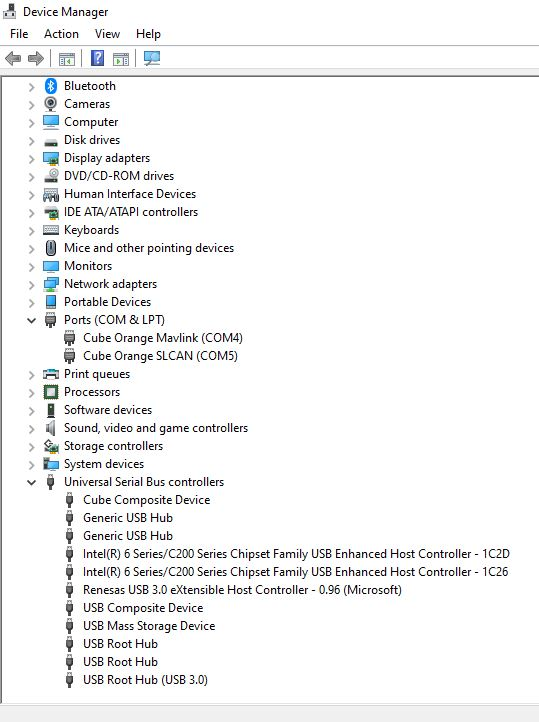

# The Cube FAQ

## Cube Orange Windows 10 installation

I finished up the install and completely updated Windows 10 Pro. I downloaded and installed Mission Planner. Using the Ctrl + F function in Mission Planner I cleared Mission Planner’s drivers and closed the program. I then installed the driver.msi file listed in this forum. I rebooted the laptop, after letting the laptop boot up, I opened the device manager, I plugged the cube into a USB port and all of the drivers automatically loaded. The cube is now connected and both com ports are shown correctly in my Device Manager. I hope this helps some of you. Make sure to back up any files you want to keep, I didn’t have any files so I did a complete restore.

  
Review this post can reach below:  
[https://discuss.cubepilot.org/t/cube-orange-on-win10/3655/14](https://discuss.cubepilot.org/t/cube-orange-on-win10/3655/14)  

  
  
  

