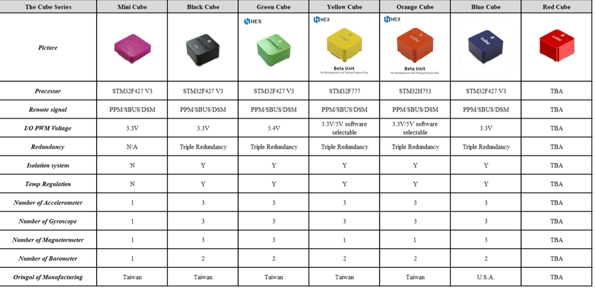

# The Cube Module Overview

### The Cube Fixed Board

* Black, Green, Blue, Purple STM32F427; flash 2MB, RAM 256KB.
* Yellow STM32F777; flash 2MB, Ram 512KB.
* Orange STM32H743; flash 2MB, RAM 1MB.
* On-board 16KB SPI FRAM
* MPU9250 or ICM 20649 integrated accelerometer / gyro.
* MS5611 Barometer
* All sensors connected via SPI.
* Micro SD interfaces via SDIO.

### Vibration Damped IMU board version 1 \(Fitted to Cube Black, Cube Blue, Cube Green\)

* LSM303D integrated accelerometer / magnetometer.
* L3GD20 gyro.
* MPU9250 Gyro / Accel
* MS5611 Barometer
* All sensors connected via SPI.

### Vibration Damped IMU board version 2 \(Fitted to Cube Orange and yellow\)

* ICM20602
* ICM 20948
* MS5611 Barometer
* All sensors connected via SPI.

### I/O ports

* 14 PWM servo outputs \(8 from IO, 6 from FMU\).
* R/C inputs for CPPM, Spektrum / DSM and S.Bus.
* Analogue / PWM RSSI input.
* S.Bus servo output.
* 5 general purpose serial ports, 2 with full flow control
* Two I2C ports
* One SPI port \(un-buffered, for short cables only not recommended for use\).
* Two CAN Bus interface. \(CAN FD for Orange post Beta version\)
* 3 Analogue inputs
* High-powered piezo buzzer driver. \(On expansion board\)
* High-power RGB LED. \(I2C driver compatible Connected externally only\)
* Safety switch / LED.

## System architecture

The Cube continues with the FMU + IO architecture from the previous generation, incorporating the two functional blocks in a single physical module.

### PWM Outputs

The Cube has eight PWM outputs that are connected to IO and can be controlled by IO directly via R/C input and on-board mixing even if FMU is not active \(failsafe / manual mode\). Multiple update rates can be supported on these outputs in three groups; one group of four and two groups of two. PWM signal rates up to 400Hz can be supported. These 8 PWM's are output ONLY and are capable of driving up to 50mA each, but only a total of 100mA for the 8.

Six PWM outputs are connected to FMU and feature reduced update latency. These outputs cannot be controlled by IO in failsafe conditions. Multiple update rates can be supported on these outputs in two groups; one group of four and one group of two.

PWM signal rates up to 400Hz can be supported.

All PWM outputs are EDS-protected, and they are designed to survive accidental mis-connection of servos without being damaged. The servo drivers are specified to drive a 50pF servo input load over 2m of 26AWG servo cable.

the I/O PWM outputs can also be configured as individual GPIOs. Note that these are not high-power outputs – the PWM drivers are designed for driving servos and similar logic inputs only, not relays or LEDs.

### Peripheral Ports

All peripherals are connected through a single 80 pin connector, and the peripherals are connected via a baseboard that can be customized for each application

### Base Board

The initial base board features separate connectors for each of the peripheral ports \(with a few exceptions.

Five serial ports are provided. Serial 1 and 2 feature full flow control. Serial 3 is recommended as the GPS port and has the safety button and \(possibly the safety led\) as well as I2C for the compass and RGB LED. Serial 4 also has I2C, but on the second bus, thus allowing two compass modules to be connected at the same time. Serial 5 is available as a header underneath the board. Serial ports are 3.3V CMOS logic level, 5V tolerant, buffered and ESD-protected.

The SPI port is not buffered; it should only be used with short cable runs. Signals are 3.3V CMOS logic level, but 5V tolerant. SPI is only available to test points on the first base board, along with a CS and INT pin.

Analogue 1-3 are protected against inputs up to 12V, but scaled for 0-3.3V inputs. The RSSI input supports either PWM or analogue RSSI. This input shares a pin with S.Bus output - only one may be connected at a time.

CPPM, S.Bus and DSM/Spektrum input are unchanged from previous versions.

The CAN ports are standard CAN-Bus; termination for one end of the bus is fixed on- board. Drivers are on-board the FMU

The piezo port will drive most piezo elements in the 5 - 300nF range at up to 35V. it is intended to be _extremely loud_, with the achievable sound pressure level limited by the sensitivity of the piezo element being driven.

I2C is direct driven, un-buffered, and pulled up to **\*3.3v on-board\*** the FMU

Serial 5 is used for the on-board ADSB-IN receiver that is featured on newer carrier boards

### Sensors

All flight sensors in The Cube are connected via SPI.

| CUBE TYPE | IMU1 | IMU2 | IMU3 | Baro1 | Baro2 |
| :--- | :--- | :--- | :--- | :--- | :--- |
| Cube Black Blue, Green | MPU9250 | LSM303D/L3GD20 | MPU9250 | MS5611 | MS6511 |
| Cube Purple | MPU9250 | NA | NA | MS5611 | NA |
| Cube Orange/Yellow | ICM20948 | ICM20602 | ICM20649 | MS5611 | MS5611 |

IMU1, Non-Isolated  
IMU2 & 3, Isolated  
Data-ready signals from all sensors are **NOT ROUTED on the Isolated IMU**

## Power Architecture

The Cube removes the power management from the FMU, the Servo rail is no longer the primary source of backup power for the FMU, and it leaves it there for the IO last chance failsafe.

The supply of 3.3v

* Split digital and analogue power domains for FMU and sensors.
* Backup power for IO in the case of FMU power supply failure.

### Power management module \(separate from the FMU\)

Key features of The Cube power architecture:

* Single, independent 5V supply for the flight controller and peripherals.
* Integration with **\*2 power bricks\*** or compatible alternative, including current and voltage sensing.
* Low power consumption and heat dissipation.
* Power distribution and monitoring for peripheral devices.
* Protection against common wiring faults; under/over-voltage protection, overcurrent protection, thermal protection.
* Brown-out resilience and detection.

### FMU and IO Power Supplies

Both FMU and IO operate at 3.3V, and each has its own private dual-channel regulator. As in Pixhawk v1, each regulator features a power-on reset output tied to the regulator’s internal power-up and drop-out sequencing.

### Power Sources

Power may be supplied to The Cube via USB, via the power brick port, or the second brick port. Each power source is protected against reverse-polarity connections and back-powering from other sources.

The FMU + IO power budget is 250mA, including all LEDs and the Piezo buzzer. Peripheral power is limited to 2.5A total.

USB IS NOT RECOMMENDED IN FLIGHT ON Nuttx code

### Power Brick Port

The brick port is the preferred power source for Cube, and brick power will always be selected if it is available.

### Servo Power

The Cube supports both standard \(5V\) and high-voltage \(up to 10V\) servo power with some restrictions.

IO will accept power from the servo connector up to 10V. This allows IO to failover to servo power in all cases if the main power supply is lost or interrupted.

**FMU and peripherals will NOT accept power from the servo connector.**

### Aux Power

The Cube introduces a backup power port; this is set up the same as the primary power input.

At input voltages over 5.7V power is locked out.

The Cube and peripherals combined may draw up to 2.75A total when operating on Aux power, provided that the Brick or other power source can supply the required current.

Power is never supplied by The Cube to servos.

### Servo rail

The I/O chip takes power up to 10.5v from the servo rail; this is used to revert to manual mode in the unfortunate event that the other two main sources of power fail. This is only useful for plane, and only useful if the I/O chip has been mapped correctly.

### USB Power

Power from USB is supported for software update, testing and development purposes. USB power is supplied to the peripheral ports for testing purposes, however total current consumption must typically be limited to 500mA, including peripherals, to avoid overloading the host USB port.

### Multiple Power Sources

When more than one power source is connected, power will be drawn from the highest-priority source with a valid input voltage.

In most cases, FMU should be powered via the power brick or a compatible off board regulator via the brick port or auxiliary power rail.

In desktop testing scenarios, taking power from USB avoids the need for a BEC or similar servo power source \(though servos themselves will still need external power\).

### Summary

For each of the components listed, the input voltage ranges over which the device can be powered from each input is shown.

|  | **Brick port** | **Aux port** | **USB port** | **Servo rail** |
| :--- | :--- | :--- | :--- | :--- |

| **FMU** | 4 - 5.7V | 4 - 5.7V | 4 - 5.7V | NIL |
| :--- | :--- | :--- | :--- | :--- |

| **IO** | 4 - 5.7V | 4 - 5.7V | 4 - 5.7V | 4 - 10.5V |
| :--- | :--- | :--- | :--- | :--- |

<table>
  <thead>
    <tr>
      <th style="text-align:left"><b>Peripherals</b>
      </th>
      <th style="text-align:left">
        
4 - 5.7V

        
2.5A max

      </th>
      <th style="text-align:left">
        
4 - 5.7V

        
2.5A max

      </th>
      <th style="text-align:left">
        
4 - 5.7V

        
2.5A max

      </th>
      <th style="text-align:left">NIL</th>
    </tr>
  </thead>
  <tbody></tbody>
</table>| **Pin \#** | **Name** | **Dir** | **Wire Color** | **Description** |
| :--- | :--- | :--- | :--- | :--- |

| 1 | VDD 5V PEIPH | OUT |  | 5V |
| :--- | :--- | :--- | :--- | :--- |

<table>
  <thead>
    <tr>
      <th style="text-align:left">2</th>
      <th style="text-align:left">IO_TX</th>
      <th style="text-align:left">out</th>
      <th style="text-align:left"></th>
      <th style="text-align:left">
        
3.3V-5.0V TTL level, TX of AP

        
IO_uart1 TX

      </th>
    </tr>
  </thead>
  <tbody></tbody>
</table>| 3 | IO\_RX | in |  | 3.3V - 5.0V TTL level, RX of AP IO\_uart1 RX |
| :--- | :--- | :--- | :--- | :--- |

| 4 | IO-SWDIO | I/O |  | Serial wire debug I/O |
| :--- | :--- | :--- | :--- | :--- |

| 5 | IO-SWCLK | I/O |  | Serial wire Clock |
| :--- | :--- | :--- | :--- | :--- |

| 6 | GND | out |  | GND |
| :--- | :--- | :--- | :--- | :--- |

| **Pin \#** | **Name** | **Dir** | **Wire Color** | **Description** |
| :--- | :--- | :--- | :--- | :--- |

| 1 | VDD 5V PEIPH | OUT |  | 5V |
| :--- | :--- | :--- | :--- | :--- |

| 2 | FMU\_TX \(SERIAL 5\) | out |  | 3.3V-5.0V TTL level, TX of AP FMU\_uart5 TX |
| :--- | :--- | :--- | :--- | :--- |

<table>
  <thead>
    <tr>
      <th style="text-align:left">3</th>
      <th style="text-align:left">FMU_RX (SERIAL 5)</th>
      <th style="text-align:left">in</th>
      <th style="text-align:left"></th>
      <th style="text-align:left">
        
3.3V-5.0V TTL level, RX of AP

        
FMU_uart5 RX

      </th>
    </tr>
  </thead>
  <tbody></tbody>
</table>| 4 | FMU-SWDIO | I/O |  | Serial wire debug I/O |
| :--- | :--- | :--- | :--- | :--- |

| 5 | FMU-SWCLK | I/O |  | Serial wire Clock |
| :--- | :--- | :--- | :--- | :--- |

| 6 | GND | out |  | GND |
| :--- | :--- | :--- | :--- | :--- |

| **Pin \#** | **Name** | **Dir** | **Wire Color** | **Description** |
| :--- | :--- | :--- | :--- | :--- |
| 1 | VDD\_5V\_Periph | out |  |  |
| 2 | Pressure sense in | in |  |  |
| 3 | GND | out |  | GND |

**Spektrum**

| **Pin \#** | **Name** | **Dir** | **Wire Color** | **Description** |
| :--- | :--- | :--- | :--- | :--- |
| 1 | VDD\_3v3\_spektru m | out |  | Independent supply 3v3. |
| 2 | IO\_USART1\_RX | in |  |  |
| 3 | GND | out |  | GND |

**HMI \(Buzzer, USB, LEDs\)**

| **Pin \#** | **Name** | **Dir** | **Wire Color** | **Description** |
| :--- | :--- | :--- | :--- | :--- |
| 1 | VCC\_5V | out | red / gray | Supply to GPS from AP |
| 2 | D\_PLUS | in/out | green / black | 3.3V |
| 3 | D\_MINUS | in/out | red / black | 3.3V |
| 4 | GND | - | black | GND connection |
| 5 | BE\_LED | out | black | Boot / Error Led \(FW updates\) |
| 6 | BUZZER | out | gray / black | VBAT \(8.4 - 42V\) |

**Back Edge \( may rearrange to suit PCB layout\)**

_**SERVO HEADER \(0.1”, 1/1/15 power layout\)**_

| **Position** | **Name** | **Dir** | **Wire Color** | **Description** |
| :--- | :--- | :--- | :--- | :--- |
| 15 | RC / SBUS IN | in/out | black | 3.3V \(4..5V powered\) |
| 14 | MAIN\_OUT\_8 | out | black | 3.3V servo signal, servo rail power |
| 13 | MAIN\_OUT\_7 | out | black | 3.3V servo signal, servo rail power |
| 12 | MAIN\_OUT\_6 | out | black | 3.3V servo signal, servo rail power |
| 11 | MAIN\_OUT\_5 | out | black | 3.3V servo signal, servo rail power |
| 10 | MAIN\_OUT\_4 | out | black | 3.3V servo signal, servo rail power |
| 9 | MAIN\_OUT\_3 | out | black | 3.3V servo signal, servo rail power |
| 8 | MAIN\_OUT\_2 | out | black | 3.3V servo signal, servo rail power |
| 7 | MAIN\_OUT\_1 | out | black | 3.3V servo signal, servo rail power |
| 6 | AUX\_OUT\_6 | out | black | 3.3V servo signal, servo rail power |
| 5 | AUX\_OUT\_5 | out | black | 3.3V servo signal, servo rail power |
| 4 | AUX\_OUT\_4 | out | black | 3.3V servo signal, servo rail power |
| 3 | AUX\_OUT\_3 | out | black | 3.3V servo signal, servo rail power |
| 2 | AUX\_OUT\_2 | out | black | 3.3V servo signal, servo rail power |
| 1 | AUX\_OUT\_1 | out | black | 3.3V servo signal, servo rail power |

**80 pin header \(LONG TERM STANDARD!\)**

| **Pin \#** | **Name** | **Dir** | **Description** |
| :--- | :--- | :--- | :--- |

| 1 | FMU-SWDIO | i/o | Single wire debug io |
| :--- | :--- | :--- | :--- |

| 2 | !FMU- LED\_AMBER | o | Boot error LED \( drive only, use Fet to control led\) |
| :--- | :--- | :--- | :--- |

| 3 | FMU-SWCLK | o | single wire debug clock |
| :--- | :--- | :--- | :--- |

| 4 | I2C\_2\_SDA | i/o | I2C data io |
| :--- | :--- | :--- | :--- |

| 5 | !EXTERN\_CS | o | chip select for external SPI \(NC, just for debugging\) |
| :--- | :--- | :--- | :--- |

| 6 | I2C\_2\_SCL | o | i2c clock |
| :--- | :--- | :--- | :--- |

| 7 | FMU-!RESET | i | reset pin for the FMU |
| :--- | :--- | :--- | :--- |

| 8 |  |  | Future compatibility |
| :--- | :--- | :--- | :--- |

| 9 | VDD\_SERVO\_IN | i | power for last resort i/o failsafe |
| :--- | :--- | :--- | :--- |

| 10 |  |  | Future compatibility |
| :--- | :--- | :--- | :--- |

| 11 | EXTERN\_DRDY | i | interrupt pin for external SPI \(NC, just for debugging\) |
| :--- | :--- | :--- | :--- |

| 12 | SERIAL\_5\_RX | i |  |
| :--- | :--- | :--- | :--- |

| 13 | GND |  | System GND |
| :--- | :--- | :--- | :--- |

| 14 | SERIAL\_5\_TX | o |  |
| :--- | :--- | :--- | :--- |

| 15 | GND |  | System GND |
| :--- | :--- | :--- | :--- |

| 16 | SERIAL\_4\_RX | i |  |
| :--- | :--- | :--- | :--- |

| 17 | SAFETY |  | Safety button input |
| :--- | :--- | :--- | :--- |

| 18 | SERIAL\_4\_TX | o |  |
| :--- | :--- | :--- | :--- |

| 19 | vdd\_3V3\_SPECT RUM\_EN | o | enable for the spectrum voltage regulator |
| :--- | :--- | :--- | :--- |

| 20 | SERIAL\_3\_RX | i |  |
| :--- | :--- | :--- | :--- |

| 21 | PREASSURE\_SE NS\_IN | a i | Analogue port, for pressure sensor, or Laser range finder, or Sonar |
| :--- | :--- | :--- | :--- |

| 22 | SERIAL\_3\_TX | o |  |
| :--- | :--- | :--- | :--- |

| 23 | AUX\_BATT\_VOL TAGE\_SENS | a i | Voltage sense for Aux battery input |
| :--- | :--- | :--- | :--- |

| 24 | ALARM | o | Buzzer PWM signal |
| :--- | :--- | :--- | :--- |

| 25 | AUX\_BATT\_CUR | a i | Current sense for Aux battery input |
| :--- | :--- | :--- | :--- |

|  | RENT\_SENS |  |  |
| :--- | :--- | :--- | :--- |

| 26 | IO-VDD\_3V3 | i | IO chip power, pinned through for debug |
| :--- | :--- | :--- | :--- |

| 27 | !VDD\_5V\_PERIP H\_EN | o | enable signal for Peripherals |
| :--- | :--- | :--- | :--- |

| 28 | !IO- LED\_SAFETY\_P ROT | o | IO-LED\_SAFETY pinned out for IRIS |
| :--- | :--- | :--- | :--- |

| 29 | VBUS | i | vbus, voltage from USB plug |
| :--- | :--- | :--- | :--- |

| 30 | SERIAL2\_RTS |  |  |
| :--- | :--- | :--- | :--- |

| 31 | OTG\_DP1 | i/o | DATA P from USB |
| :--- | :--- | :--- | :--- |

| 32 | SERIAL2\_CTS |  |  |
| :--- | :--- | :--- | :--- |

| 33 | OTG\_DM1 | i/o | DATA M from USB |
| :--- | :--- | :--- | :--- |

| 34 | SERIAL2\_RX | i |  |
| :--- | :--- | :--- | :--- |

| 35 | I2C\_1\_SDA | i/o | I2C data i/o |
| :--- | :--- | :--- | :--- |

| 36 | SERIAL2\_TX | o |  |
| :--- | :--- | :--- | :--- |

| 37 | I2C\_1\_SCL | o | I2C clock |
| :--- | :--- | :--- | :--- |

| 38 | SERIAL1\_RX | i |  |
| :--- | :--- | :--- | :--- |

| 39 | CAN\_L\_2 | i/o | Canbus Low signal driver on FMU |
| :--- | :--- | :--- | :--- |

| 40 | SERIAL1\_TX | o |  |
| :--- | :--- | :--- | :--- |

| 41 | CAN\_H\_2 | i/o | Canbus High signal driver on FMU |
| :--- | :--- | :--- | :--- |

| 42 | SERIAL1\_RTS |  |  |
| :--- | :--- | :--- | :--- |

| 43 | !VDD\_5V\_PERIP H\_OC | i | error state message from Periph power supply |
| :--- | :--- | :--- | :--- |

| 44 | SERIAL1\_CTS |  |  |
| :--- | :--- | :--- | :--- |

| 45 | !VDD\_5V\_HIPOW ER\_OC | i | error state message from High power Periph power supply |
| :--- | :--- | :--- | :--- |

| 46 | IO-USART1\_TX | o |  |
| :--- | :--- | :--- | :--- |

<table>
  <thead>
    <tr>
      <th style="text-align:left">47</th>
      <th style="text-align:left">
        
BATT_VOLTAGE

        
_SENS_PROT

      </th>
      <th style="text-align:left">a i</th>
      <th style="text-align:left">Voltage sense from main battery</th>
    </tr>
  </thead>
  <tbody></tbody>
</table>| 51 | SPI\_EXT\_MOSI | o | External SPI, for debug only |
| :--- | :--- | :--- | :--- |

| 52 | FMU-CH2-PROT | o |  |
| :--- | :--- | :--- | :--- |

| 53 | VDD\_SERVO | i | VDD\_Servo, for monitoring servo bus |
| :--- | :--- | :--- | :--- |

| 54 | FMU-CH3-PROT | o |  |
| :--- | :--- | :--- | :--- |

| 55 | !VDD\_BRICK\_VALID | i | main power valid signal |
| :--- | :--- | :--- | :--- |

| 56 | FMU-CH4-PROT | o |  |
| :--- | :--- | :--- | :--- |

| 57 | !VDD\_BACKUP\_VALID | i | backup power valid signal |
| :--- | :--- | :--- | :--- |

| 58 | FMU-CH5-PROT | o |  |
| :--- | :--- | :--- | :--- |

| 59 | !VBUS\_VALID | i | USB bus valid signal |
| :--- | :--- | :--- | :--- |

| 60 | FMU-CH6-PROT | o |  |
| :--- | :--- | :--- | :--- |

| 61 | VDD\_5V\_IN | i | main power into FMU from power selection |
| :--- | :--- | :--- | :--- |

| 62 | PPM-SBUS-PROT | i |  |
| :--- | :--- | :--- | :--- |

| 63 | VDD\_5V\_IN | i | main power into FMU from power selection |
| :--- | :--- | :--- | :--- |

| 64 | S.BUS\_OUT | o |  |
| :--- | :--- | :--- | :--- |

| 65 | IO-VDD\_5V5 | o | power to RX |
| :--- | :--- | :--- | :--- |

| 66 | IO-CH8-PROT | o |  |
| :--- | :--- | :--- | :--- |

| 67 | SPI\_EXT\_MISO | i | External SPI, for debug only |
| :--- | :--- | :--- | :--- |

| 68 | IO-CH7-PROT | o |  |
| :--- | :--- | :--- | :--- |

| 69 | IO-SWDIO | i/o | IO single wire debug i/o |
| :--- | :--- | :--- | :--- |

| 70 | IO-CH6-PROT | o |  |
| :--- | :--- | :--- | :--- |

| 71 | IO-SWCLK | o | IO single wire debug clock |
| :--- | :--- | :--- | :--- |

| 72 | IO-CH5-PROT | o |  |
| :--- | :--- | :--- | :--- |

| 73 | SPI\_EXT\_SCK | o | External SPI, for debug only |
| :--- | :--- | :--- | :--- |

| 74 | IO-CH4-PROT | i |  |
| :--- | :--- | :--- | :--- |

| 75 | IO-!RESET | i | IO reset pin |
| :--- | :--- | :--- | :--- |

| 76 | IO-CH3-PROT | o |  |
| :--- | :--- | :--- | :--- |

| 77 | CAN\_L\_1 | i/o | Canbus Low signal driver on FMU |
| :--- | :--- | :--- | :--- |

| 78 | IO-CH2-PROT | o |  |
| :--- | :--- | :--- | :--- |

| 79 | CAN\_H\_1 | i/o | Canbus High signal driver on FMU |
| :--- | :--- | :--- | :--- |

| 80 | IO-CH1-PROT | o |  |
| :--- | :--- | :--- | :--- |

|  |
| :--- |

## Differences between Cube colours

### List of features The Cube

* Three IMU's
  * these consist of 2 on the IMU board
  * 1 fixed to the FMU
* Two onboard compasses Cube Black, reen, Blue
  * these consist of 1 on the IMU board
  * 1 Fixed on the FMU
* One onboard compass Cube Orange, Cube Yellow
* Two Baros
  * 1 on the IMU \(this Baro will most likely be removed in favour of a dedicated external Barometer.
  * 1 Fixed on the FMU
* Dual Power input
  * This removes the option of redundancy from the Servo rail and replaces it with a dedicated second power plug
  * A dedicated power protection Zener diode and Fet have been added to protect from voltages over 5.6v being applied to Aux input 2
  * This is only on the "PRO" carrier board mini carrier board still draws the backup from the servo rail.
* Dual external I2C
  * This allows for connection of items to either I2C port, potentially allowing two GPS / Mag units to be plugged in without the Mags conflicting.
* Power monitoring pins are now routed to the I/O chip, these will allow for the logging of power events during an inflight reboot.
  * Brick OK, Backup OK, and FMU 3.3V are all connected to a digital pin on the I/O via a 220Ohm resister.

