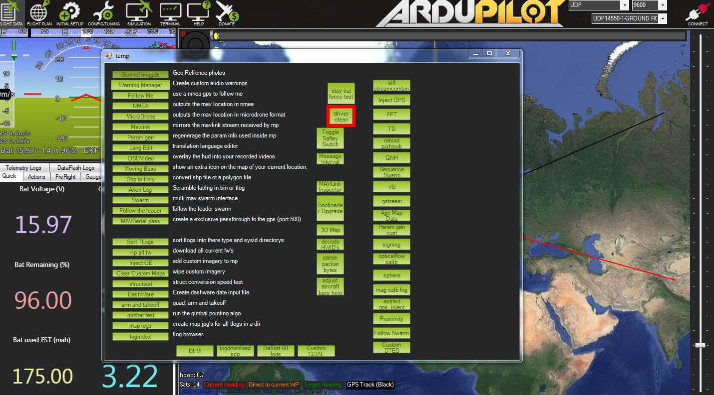

# The Cube Series -  Firmware & Connection  Troubleshooting

## The Cube Autopilot All Models

All Cube Autopilots now come with no firmware installed from the factory and as such you will need to install your chosen firmware such as Ardupilor or PX4 before you can use it.

Cube Orange and Yellow modes are using the STM32F7 and the STM32H7 microcontrollers and as a result its important you are using the latest drivers and software to connect to these models specifically.  

### Supported Ardupilot Versions

The Cube Orange and Yellow are supported in Arducopter,Rover and Plane version 4.0 and later. 

Cube Black, Blue and Purple are supported in older versions however its strogly advised to be using Arducopter 3.6.11 and Arduplane 3.9.11 onward for Black and Blue at minimum due to critical bug fixes. 

In Ardupilot its strongly advised to be using ChibiOS versions with all Cube models.

## USB Connection Problems

Most issues related to conneting to the Cube are caused by the following 

* Old version of Mission Planner/Ground Station
* Old drivers
* Older Windows OS such as Windoes 7 \(Windows 10 Recommended\) 

First steps to resolve connections issues is to update Mission Planner and Drivers.

### New Installation Setup 

If you have never installed Mission Planner or Ardupilot before the simplest way of installing firmware and configuring your Cube is by downloading the latest Mission Planner and Drivers below 

Latest Mission Planner [http://firmware.ardupilot.org/Tools/MissionPlanner/MissionPlanner-latest.msi](http://firmware.ardupilot.org/Tools/MissionPlanner/MissionPlanner-latest.msi)

Latest Drivers  [http://firmware.ardupilot.org/Tools/MissionPlanner/driver.msi](http://firmware.ardupilot.org/Tools/MissionPlanner/driver.msi)

### Updating Mission Planner & Drivers

If you already have an older version of Mission Planner installed and you want to connect to the Orange or Yellow Cube you must update to the latest version and install the latest drivers. 

To update mission planner click the Help Icon along the top bar and then at the bottom of the screen click 'Check for Updates'. 

Once Mission Planner is updated you must also update to the latest drivers. To do this you must first uninstall the old drivers as follows

1. Open Mission Planner
2. Press Control and F
3. In the 'Temp' window select 'driver clean'

4. Download the latest drivers from [http://firmware.ardupilot.org/Tools/MissionPlanner/driver.msi](http://firmware.ardupilot.org/Tools/MissionPlanner/driver.msi), Install then reboot and connect Cube again. 

### Com Ports 

If you are still having connection issues you can check if the com ports are correctly installed by going to device maanger. 

Cube Black, Purple and Blue should show a single com port as follows

Cube Orange and Yellow should show two com ports connected such as 'Cube Orange Mavlink \(COMx\) and Cube Orange SLCAN \(COMx\)'

If you see ProfiCNC CUBE H7 \(COMx\) or ProfiCNC CUBE F7 \(COMx\) then the drivers are not installed correctly and follow the above process again. 

### Cube Orange & Yellow Windows 7 

There are some known issues installing the Cube Orange and Cube Yellow with Windows 7. Its advised you use Windowns 10 however Windows 7 can be made to work by manually deleting the driver files and installing the latest driver file and forcing Windows to install the correct driver manually.

1. Delete ProfiCNC CUBE H7/F7 from device manager while the Cube is still connected, then disconnect the Cube from USB.
2. Uninstall and reinstall the latest Cube drivers as linked above.
3. Reconnect the Cube Orange/Yellow and two devices will show up in “Other Devices” called CubeOrange-BL. 
4. The top entry will change to CubeOrange and you should see the message from windows notifying you that it is installing device drivers.
5. CubeOrange-BL will move to the Ports section and be named Cube Orange Mavlink \(COMx\)
6. If the “CubeOrange-BL” in Other Devices" does not move to Ports after a few moments, right click, go into properties, click on the driver button and wait, it should then move to Ports and is named Cube Orange SLCAN \(COMx\)

.

