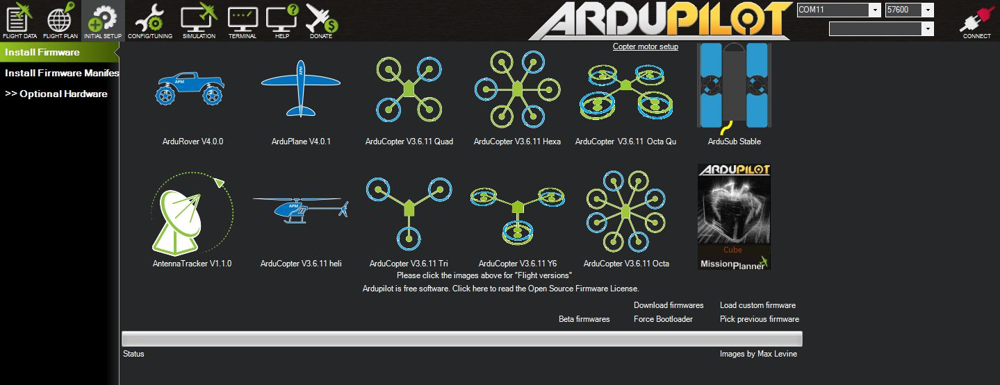
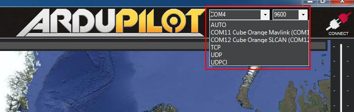
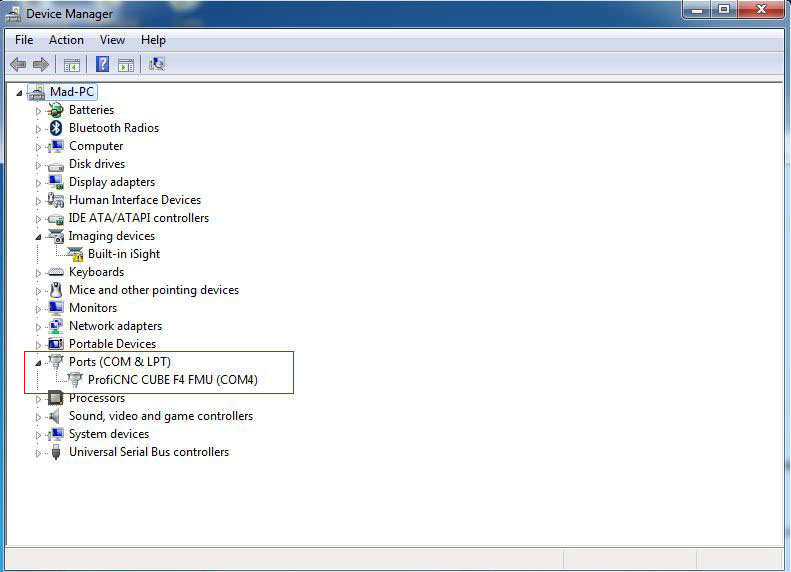
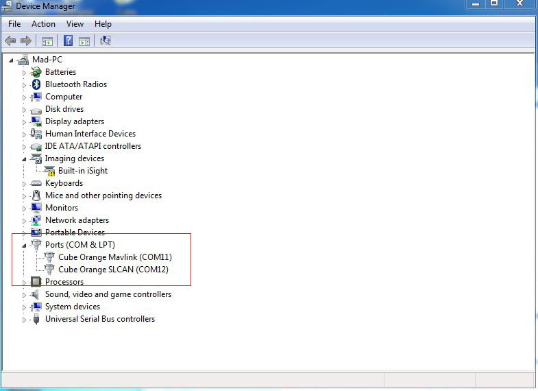

# The Cube  -  Firmware Installation & Connection  Troubleshooting

## The Cube Autopilot All Models Out The Box

All Cube Autopilot models now come with no autopilot software installed from the factory and as such you will need to install your chosen firmware such as Ardupilor or PX4 before you can use it.

### Supported Ardupilot Versions

The Cube Black, Purple and Blue models are compatible with older versions of Ardupilot and PX4 software however the Cube Orange and Cube Yellow modes are using the STM32F7 and the STM32H7 microcontrollers that require you are using the latest drivers and software to use these models.

**Note** It is strongly advised to use the latest stable release of Ardupilot at all times to ensure you are uptosdate with any bug and feature updates.

### Cube Black, Blue and Purple

These Cube models are supported in older versions of Ardupilot however its strogly advised to use Arducopter 3.6.12 or Arduplane 3.9.11 or later due to a critical I2C Storm bug fixes.

More Information on this specific issue can be found in the Cubepilot bulitins or Ardupilot forum.

Cubepilot Bulletin's [https://discuss.cubepilot.org/t/sb-0000005-i2c-storm-can-cause-inflight-reboots-chibios-only-not-nuttx-all-cube-and-pixhawk-hardware-including-clones-and-derivatives/2419](https://discuss.cubepilot.org/t/sb-0000005-i2c-storm-can-cause-inflight-reboots-chibios-only-not-nuttx-all-cube-and-pixhawk-hardware-including-clones-and-derivatives/2419)

Ardupilot forums [https://discuss.ardupilot.org/t/copter-3-6-12-has-been-released-critical-safety-update-if-you-are-flying-3-6-10-or-older/50130](https://discuss.ardupilot.org/t/copter-3-6-12-has-been-released-critical-safety-update-if-you-are-flying-3-6-10-or-older/50130)

### The Cube Orange and Cube Yellow

These models are supported in Arducopter, Rover and Plane version 4.0 and later only.

**Note** Its strongly advised to be using ChibiOS versions of Ardupilot with all Cube models unless you have a specific reasons otherwise.

## **Installing Mission Planner**

### New Installation

If you have never installed Mission Planner or Ardupilot before the simplest way of installing firmware and configuring your Cube is by downloading the latest Mission Planner and drivers below

Latest Mission Planner [http://firmware.ardupilot.org/Tools/MissionPlanner/MissionPlanner-latest.msi](http://firmware.ardupilot.org/Tools/MissionPlanner/MissionPlanner-latest.msi)

Latest Drivers [http://firmware.ardupilot.org/Tools/MissionPlanner/driver.msi](http://firmware.ardupilot.org/Tools/MissionPlanner/driver.msi)

Once completed you can now proceed to 'Installing Ardupilot'.

### Existing Installation - Updating Mission Planner & Drivers

If you already have an older version of Mission Planner installed you should check you are on the latest version, for Cube Orange and Cube Yellow you must update to the latest version and install the latest drivers.

To update mission planner click the 'Help' Icon along the top bar and then at the bottom of the screen click 'Check for Updates'.

Once Mission Planner is updated you must also update the drivers, to do this you should first uninstall the old drivers as follows

1. Disconnect Cube from USB 
2. Open Mission Planner
3. Press Control + F keys
4. In the 'Temp' window click 'driver clean'

1. Next download the latest drivers from [http://firmware.ardupilot.org/Tools/MissionPlanner/driver.msi](http://firmware.ardupilot.org/Tools/MissionPlanner/driver.msi), Install then reboot the system then connect Cube to a USB port and allow the drivers to install. 

## Installing Ardupilot

You can now install your chosen version of Ardupilot, to do this open Mission Planner and go to the 'Initial Setup' screen and choose 'Install Firmware', next choose the version of Ardupilot for your application by clicking and then follow the onscreen instructions.

**Note:** The correct firmware versions for your hardware should be selected automatically by Mission Planner however if prompted to select board type do not select Linux. Select 'Pixhawk' and then select 'Cube Black'.

#### Cube Orange and Yellow Firmware

Cube Orange and Cube Yellow require Ardupilot 4.0 or later, At the time of writting Arducopter 4.0 was still in beta and you may need to click the 'Beta Firmware' option at and select the version you require.

**Note:** You may need to download the firmware manually, to do this select 'Download Firmwares ' at the bottom of the firmware downloads screen in Mission Planner and download the relivent versions from the daily build or beta secition of the Ardupilot downloads area for your application. Then use the 'Load custom firmware' option to install the file you have dowloaded.

## USB Connection Issues

Most issues related to conneting to the Cube are caused by the following

* Old version of Mission Planner/Ground Station
* Old drivers
* Older Windows OS such as Windows 7 \(Windows 10 Recommended\) 

First steps to resolve connections issues is to update Mission Planner and drivers as shown above.

When correctly installed with Ardupilot loaded Mission Planner should show the Cube listed with its port unter the top connection box, the actual com port number my vary but it should show as follows

**Cube Black**

1. To connect Cube Black select the port and set the baud rate 57600 and click connect. 

**Cube Orange & Cube Yellow**

1. To connect Cube Orange or Yellow select the Mavlink com port and set the baud rate 57600 and click connect. 

### Com Ports In Device Manager

If you are still having connection issues you can check if the com ports are correctly installed by going to device manager in Windows.

Cube Black, Purple and Blue should show a single com port as follows

Cube Orange and Yellow should show two com ports connected 'Cube Orange Mavlink \(COMx\) and Cube Orange SLCAN \(COMx\)'

For Cube Orange and Yellow if you see 'ProfiCNC CUBE H7 \(COMx\)' or ' ProfiCNC CUBE F7 \(COMx\)' then the drivers are not installed correctly and follow the above process again.

### Cube Orange & Yellow - Windows 7

There are known issues installing the Cube Orange and Cube Yellow with Windows 7. Its advised you use Windowns 10 or later however Windows 7 can be made to work in some circumstances by manually deleting the driver files and installing the latest driver file and forcing Windows to install the correct driver manually.

1. Delete ProfiCNC CUBE H7/F7 from device manager while the Cube is still connected, then disconnect the Cube from USB.
2. Uninstall and reinstall the latest Cube drivers as linked above.
3. Reconnect the Cube Orange/Yellow and two devices will show up in “Other Devices” called CubeOrange-BL. 
4. The top entry will change to CubeOrange and you should see the message from windows notifying you that it is installing device drivers.
5. CubeOrange-BL will move to the Ports section and be named Cube Orange Mavlink \(COMx\)
6. If the “CubeOrange-BL” in Other Devices" does not move to Ports after a few moments, right click, go into properties, click on the driver button and wait, it should then move to Ports and is named Cube Orange SLCAN \(COMx\). 

