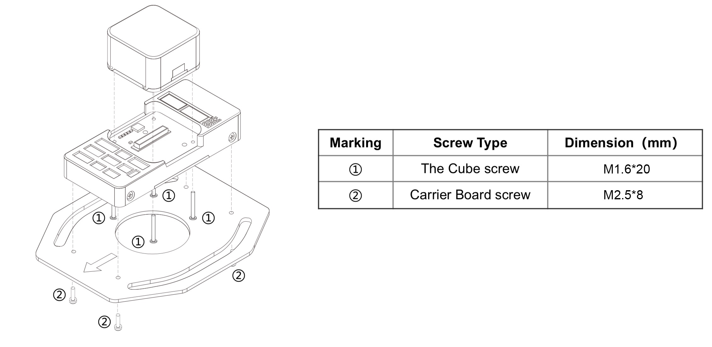

# The Cube User Manual V1.0

## Preparation for The Cube

## Introduction

After the assembly of your unmanned vehicle, you may follow this instruction to install The Cube.

## Mounting

Using the 3M double layer tape or screw from the package, mount The Cube as close as possible to the centre of gravity of your vehicle. Please ensure that the arrow on the flight controller is pointing to the front of your vehicle.

**According to the actual requirement, The Cube can also be mounted reversely or upside-down. Parameters will need to be edited.**

<figure><figcaption></figcaption></figure>

**If screw is needed for mounting, there are screws attached in the package. They are designed for 1.8mm boards. Length of customized M2.5 screws should be around 6 mm to 7.55 mm to fit The Cube.**

**The Cube is not waterproof. Please apply external protection if the working environment is rainy or humid.**

## Peripheral Connection

According to the type, size, dynamic structure, and load, installation of hardware and parameter setting can be diverse. However, the connection of electronic devices are similar. The following contents will guide you to connect your peripheral to The Cube (formerly known as Pixhawk). Please follow these steps before your first flight.

**Remark:Please connect the GPS, sensors, telemetry, etc to The Cube according to the pinout. Please check the wiring order carefully because most of the peripheral malfunctioning are due to incorrect wiring. Since there are limitation on every interface on The Cube, please connect your high-power peripheral to external BEC.**

### Install SD Card

Dataflash logs are stored on microSD Card, which is plugged in the left of The Cube. MicroSD Card with Class 4 or higher is recommended。

**Remark: The Cube cannot arm the vehicle without SD card. A tone alarm with 1 high tune and 2 low tune will be played when trying to arm.**


### Power Supply

The Cube supports triple power source, which are power module, servo rail, and USB cable.

When more than 1 power source is connected, power will be drawn from the highest-priority source with a valid input voltage. (Priority as shown in the table below)

| Power Sources      | Priority | Regular range | Limit         | Protection Range |
| ------------------ | -------- | ------------- | ------------- | ---------------- |
| Power Module Input | High     | 4.8 V - 5.4 V | 4.1 V - 5.7 V | 0 V - 20 V       |
| Servo Rail Input   | Medium   | 4.8 V - 5.4 V | 4.1 V - 10 V  | 0 V - 20 V       |
| USB Cable Input    | Low      | 4.8 V - 5.4 V | 4.1 V - 5.7 V | 0 V - 6 V        |

I/O will accept power from the servo connector up to 10 V FOR MANUAL OVERRIDE. System will be UNPOWERED WHEN SERVO INPUT IS ABOVE 5.7 V AND POWER MODULE INPUT IS ABSENT. FMU and peripherals will NOT accept power from the servo rail.

### Power Module Connection

Connect the power module to the POWER1 port via POWER cable. If there are second battery monitor, please connect it to POWER2 port. The Cube will be turned on immediately after battery is connected. Connect the XT60 on the other side of power module to the motor system and loads.


### Connect ESCs and Motors

Connect the power (+), ground (-), and signal (s) wires for each ESC to the flight controller’s main output pins by motor number. Find your frame type below to determine the assigned order of the motors.

ESC malfunctioning are due to incorrect wiring in most of the case. Signal and ground should always be connected. Please check your ESC model to ensure that the +5 V cable is connected correctly. On APM2.x, ground pin of power supply can be used as APM feedback signal. For The Cube, signal pin and ground pin must be connected to operate the ESC.

### Motor order diagrams

The diagrams below show motor order for each frame type. The numbers indicate which output pin from the flight controller should be connected to each motor/propeller. The propeller direction is shown in green (clockwise, CW) or blue (counter-clockwise, CCW) Connect the cable from ESC to the MAIN OUT port on The Cube.


### Servo Connection

The servo rail is not powered by the flight controller. Therefore an external BEC or ESC that can provide 5V should be used.

Control channels for servos can be set in "Initial Setup > Mandatory Hardware > Servo Output" in Mission Planner.

### Sensors Connection

### Mounting the GPS Module

GPS module should be operated under good condition:

_-Place the module on the outside of your vehicle (in an elevated position if appropriate) with a clear view of the sky, as far as possible from the motors and ESCs, with the arrow facing forward._

_-Distance the module from DC power wiring and the batteries by at least 10cm. Use of a GPS mast is highly recommended._

_-Place the module clear of nearby iron containing metallic objects._

_-Twist power and ground wires where possible._

GPS working in outdoor environment with sufficient sky coverage can obtain better satellite signal, which significantly improve the safety for autonomous missions.

**Some high power wireless devices may interfere with compass and GPS signal. Please relocate those high power wireless devices as far as possible to GPS.**

### GPS modes

Single GPS

Connect GPS to GPS1 port with its 8-pin DF13 connector. Most of the GPS modules are plug-and-play. Some of the GPS module is equipped with compass and it may need calibration.

### RC System Connection

The Cube supports the following signal receivers. Different type of signals has their corresponding port on carrier board.

### PWM/PPM/Futaba S.bus Receiver

* PWM Receiver: The Cube cannot directly process PWM signal. A PPM encoder is needed to encode multi-channel PWM to single-channel PPM signal. Then, connect it to RCIN port on The Cube.
* PPM RC Receiver / Futaba S.Bus Receiver can be directly plugged into the RCIN port.

**Some signal receivers can switch to different modes (eg: multi-channel PWM, single-channel S.Bus). Please refer to the user manual of the signal receiver to set it to S.Bus mode.**

### Spektrum DSM/DSM2/DSM-X Satellite Receiver

For a **Spektrum DSM, DSM2**, or **DSM-X Satellite** receiver, connect to the SPKT port on The Cube.

### Telemetry Connection

The main purpose of wireless telemetry is for two-way communication between autopilot and ground control station, so that the real-time data can be displayed and UAV can be controlled by ground control station.

**Requirement of telemetry: mavlink protocol, passthrough protocol, or TTL serial interface.**

Please ensure that the pin assignment of the cable matches the pinout of TELEM1 on The Cube. Otherwise, please modify it.

After confirming, the telemetry can be connected to TELEM1 or TELEM2 port. Connect it by selecting the corresponding COM port and baud rate (typically 57600) in ground control station.

**Please be noticed the default baud rate of TELEM1 port is 57600. This must match to the baud rate of telemetry.**

## Setup Ground Control Station

The following session will tell how to select the appropriate ground control station for your setup and use it to setup and monitor your unmanned vehicle.

### Select the Appropriate Ground Control Station

A ground station is typically a software application, running on a ground-based computer, that communicates with your UAV via wireless telemetry. It displays real-time data on the UAVs performance and position and can serve as a “virtual cockpit”, showing many of the same instruments that you would have if you were flying a real plane. A GCS can also be used to control a UAV in flight, uploading new mission commands and setting parameters. It is often also used to monitor the live video streams from a UAV’s cameras.

The mostly used and popular ground control station are Mission Planner and QGroundControl. For ArduPilot firmware, you may select Mission Planner. For PX4 firmware, QGroundControl is your first choice.

Different GCS can be selected according to your devices and working environment. They are usually compatible with different functions,such as obtaining real-time data, mission planning, device calibration, parameter setting, etc. Features and user interface are diverse among different GCSs.

### Install Firmware on The Cube

The Cube supports ArduPilot and PX4 firmware. Firmware can be uploaded from ground control stations.

If you are a developer, you may directly compile and upload the firmware to The Cube:

```
./waf configure --board px4-v3
./waf --targets bin/arducopter --upload
```

**The example above compiled arducopter firmware into The Cube. Please refer** [**https://github.com/ArduPilot/ardupilot/blob/master/BUILD.md**](https://github.com/ArduPilot/ardupilot/blob/master/BUILD.md) **for more details.**

**Remark: Hardware of The Cube is fmu-v3, so custom firmware should be compiled as px4fmu-v3.**

## Mission Planner User Manual

### Download Mission Planner

Before installing firmware to The Cube, please download latest version of Mission Planner from ArduPilot website. Beta version is recommended for developers. Please download the corresponding version according to your need.

Using Windows 10 as example, download the .msi installation file and run it as administrator. During the installation process, some drivers will be installed together. Click "yes" if any dialog box pop up.


### Connect Mission Planner to The Cube

To establish a connection you must first choose the communication method/channel you want to use, and then set up the physical hardware and Windows device drivers. You can connect the PC and autopilot using USB cables, Telemetry Radios, Bluetooth, IP connections etc.

* Using USB Cable: Connect the USB cable to the USB port at the left or The Cube. Use a direct USB port on your computer (not a USB hub). Select the corresponding COM port from the dropdown list at the top-right corner in Mission Planner. Then select the baud rate as 115200 。
* Using Telemetry: For USB telemetry, select the corresponding COM port and set baud rate as 57600 . For WIFI or Bluetooth telemetry, select the corresponding device from the device list and input the IP address of telemetry. Please refer to the user manual of your telemetry for more details on parameter setting.

### Loading Firmware to The Cube

elect the COM port drop-down on the upper-right corner of the screen (near the **Connect** button). Select **AUTO** or the specific port for your board. Set the Baud rate to 115200 as shown. Don’t hit **Connect** just yet.

On the Mission Planner’s "Initial Setup > Install Firmware"" screen select the appropriate icon that matches your frame (i.e. Quad, Hexa). Follow the instruction and messages to install firmware.

You may also install old firmware if the latest firmware is not stable enough. In some cases, installing previous version of firmware may solve the problem.

Custom firmware can be installed without internet connection by selecting from local folders.


## Basic Hardware Calibration and Parameter Setting

### Frame Class and Type Configuration

Connect to Mission Planner. On the "Initial Setup > Mandatory Hardware > Frame Type" screen select the frame type of your vehicle such as Plus frame or X frame.


### Accelerometer and Compass Calibration

For more details on minimize magnetic interference and improve compass performance, please refer to [http://ardupilot.org/copter/docs/common-magnetic-interference.html#common-magnetic-interference](https://ardupilot.org/copter/docs/common-magnetic-interference.html#common-magnetic-interference)

Calibration steps

Go to "Initial Setup > Mandatory Hardware > Accel Calibration". Click Calibrate Accel to start the calibration. Pointing the nose of your vehicle to LEVEL, LEFT, RIGHT, NOSEDOWN, NOSEUP, and BACK according to the message below. "Calibration successful" will be shown after calibration completed successfully.

1. Place the vehicle LEVEL then press "Click when Done".


2.Place the vehicle nose to front and left-hand-side to the ground then press "Click when Done".


.jpg>)

3.Place the vehicle nose to the ground then press "Click when Done".


5.Place the vehicle nose to upward then press "Click when Done".


6.Place the vehicle upside-down then press "Click when Done".


"Calibration successful" will be shown after calibration completed successfully.


### Level Calibration

Place the vehicle horizontally and click "Calibrate Level". The text in button will become "Completed" after calibration successful.


### Compass Calibration

Ensure the compass has been enabled.

1. Select "Enable Compasses" and "Compass1"
2.  Select all 3 compass (only 2 if no external GPS module is connect). Select "External mounted" for

    Compass #1 if there is an external GPS module connected. Otherwise, all 2 compasses are internal

    compass inside The Cube.
3.  Click "Start" to calibrate compasses. hold the vehicle in the air and rotate it so that each side (front,

    back, left, right, top and bottom) points down towards the earth for a few seconds in turn. As the vehicle is rotated the green bars should extend further and further to the right until the calibration completes.


The window below will show success. For 3 compasses, "success" will be shown 3 times.


upon successful completion three rising tones will be emitted and a “Please reboot the autopilot” window will appear and you will need to reboot the autopilot before it is possible to arm the vehicle.


If, after multiple attempts, you are unable to calibrate the compass, Press the “Cancel” button and change the “Fitness” drop-down to a more relaxed setting and try again.


### Radio Control Calibration

Connect the RC receiver to The Cube via RCIN and turn on your RC transmitter. Verify that the transmitter is bound to the receiver (the receiver displays a solid green light) and that it is set to use the correct model for your vehicle.

Open the "INITIAL SETUP > Mandatory Hardware > Radio Calibration" screen. If your RC receiver (Rx) and transmitter (Tx) are bound, you should see the green bars move when you move the transmitter sticks.


### Electronic Speed Controller (ESC) Calibration

Safety Check!

Before calibrating ESCs, please ensure that your copter has NO PROPS on it and that The Cube is NOT CONNECTED to your computer via USB and the Lipo battery is disconnected.


All at once calibration:

1.Turn on your transmitter and put the throttle stick at maximum


2.Connect the Lipo battery. The autopilot’s red, blue and yellow LEDs will light up in a cyclical pattern. This means the it’s ready to go into ESC calibration mode the next time you plug it in.


3.With the transmitter throttle stick still high, disconnect and reconnect the battery.


4.Press and hold the safety button until it displays solid red.

5.The autopilot is now in ESC calibration mode. You may notice the red and blue LEDs blinking alternatively on and off like a police car.

6.Wait for your ESCs to emit the musical tone, the regular number of beeps indicating your battery’s cell count (i.e. 3 for 3S, 4 for 4S) and then an additional two beeps to indicate that the maximum throttle has been captured.

7.Pull the transmitter’s throttle stick down to its minimum position.


8.The ESCs should then emit a long tone indicating that the minimum throttle has been captured and the calibration is complete.

9.If the long tone indicating successful calibration was heard, the ESCs are “live” now and if you raise the throttle a bit they should spin. Test that the motors spin by raising the throttle a bit and then lowering it again.

10.Set the throttle to minimum and disconnect the battery to exit ESC-calibration mode.

### Flight Mode Configuration

The flight mode channel is the input radio channel that ArduPilot monitors for mode changes. On Copter this is always channel 5 (can be changed in parameter FLTMODE-CH ).

Toggle the corresponding button to the desired position. As you move your transmitter’s flight mode switch the green highlight bar will move to a different position. When finished press the Save Modes button.

_You can enable up to 6 autopilot control/flight modes to be set from your RC transmitter._


#### 1. Stabilize Mode

Stabilize mode allows you to fly your vehicle manually, but self-levels the roll and pitch axis. Takeoff and landing should be operated under this mode. If you’re learning to fly, try Alt Hold or Loiter instead of Stabilize. You’ll have fewer crashes if you don’t need to concentrate on too many controls at once. Stabilize mode is also the optimal mode for FPV flight.

Make sure you have assigned a button which can easily switch to Stabilize mode. This is critical for taking back the control during emergency scenario!

#### 2. Altitude Hold Mode

You may try this mode after your first flight. GPS is not required in this mode. The flight controller uses a barometer which measures air pressure as the primary means for determining altitude.

When altitude hold mode (aka AltHold) is selected, the throttle is automatically controlled to maintain the current altitude.

Position is not controlled under this mode, therefore it may drift. You may use the controller to move or hold the position.

AC3.1 and later allow arming and disarming in altitude hold mode. When disarming, the copter may need to rest in the landing position for a few seconds to allow the “landing checker” to verify that the copter has landed before you are able to disarm.

When switching into AltHold from a manual flight mode (like Stabilize) on a copter, make sure the throttle stick in the mid position. Otherwise, the copter may suddenly descend or climb.

#### 3. Loiter Mode

Loiter Mode automatically attempts to maintain the current location, heading and altitude. The vehicle can be armed in Loiter mode but only once the GPS has 3D lock and the HDOP has dropped below 2.0. Confirm your GPS is operating in good condition to minimize the chance of GPS Glitch during the flight. This mode is basically similar to AltHold mode.

#### 4. Simple Mode

Simple mode allow the pilot to control the movement of the copter from the pilot’s point of view regardless of which way the copter is facing. This is useful for new pilots who have not mastered adjusting their roll and pitch inputs depending upon which way the vehicle is facing and for cases when the copter is far enough away that it’s heading is not apparent.

#### 5. RTL Mode

RTL mode requires a reliable position estimate to work properly, most commonly provided by GPS and compass.

If you get GPS lock and then ARM your copter, the home position is the location the copter was in when it was armed. This means if you execute an RTL in Copter, it will return to the location where it was armed.

If you get GPS no fix before ARMing, the first GPS lock position in the air will be the home position.

When RTL mode is selected, the copter will return to the home location. The copter will first rise to RTL\_ALT (default 15m) before returning home or maintain the current altitude if the current altitude is higher than RTL\_ALT.

You may also adjust parameters to set automatically landing, and loitering timeout before landing.

#### 6. Circle Mode

Circle will orbit a point located CIRCLE\_RADIUS centimeters in front of the vehicle with the nose of the vehicle pointed at the center. The pilot can control the yaw of the copter, the autopilot will not retake control of the yaw until circle mode is re-engaged.

The pilot does not have any control over the roll and pitch but can change the altitude with the throttle stick as in AltHold or Loiter mode. The copter cannot land in this mode. Radius of the circle can be set by modifying the parameter CIRCLE\_RADIUS.

* The speed of the vehicle (in deg/second) can be modified by changing the CIRCLE\_RATE parameter
* Circling will not stop until another mode is selected
* Centre of circle is defined by GPS coordination and cannot be changed

#### 7. Guided Mode

This mode requires communication between Ground Control Station (such as Mission Planner) and flight controller. In the Mission Planner Flight Data screen map, try right-clicking on a nearby spot and select “Fly to Here”. You will be asked for a guided mode altitude. Enter an above home altitude in meters.

#### 8. Follow Me Mode

You will need a laptop (or a phone/tablet) with an integrated GPS available to the GCS. Once the flight controller is connected to the GCS, the GCS will read the GPS data from your device and send it to your Copter as “fly to here” commands every two seconds. Such that the vehicle will follow the pilot when he is walking around.

This mode may requires additional device.

#### 9. Auto Mode

In Auto mode the copter will follow a pre-programmed mission script stored in the Mission Planner, which is made up of navigation commands (i.e. waypoints) and “do” commands (i.e. commands that do not affect the location of the copter including triggering a camera shutter).

An independent chapter will further explain this mode.

#### 10. Poshold Mode

Poshold Mode is the combination of GPS loitering mode and AltHold mode. GPS lock should be done before takeoff, to avoid GPS glitch during the flight. The control and reaction is similar to AltHold mode: When the pilot releases the sticks the copter will lean back to bring the vehicle to a stop. When no control input, it performs same with Loiter mode.

The maximum brake-angle can be set with the PHLD\_BRAKE\_ANGLE parameter (i.e. 3000 = the vehicle will lean back up to 30degrees)

The speed the vehicle rotates back to the maximum angle can be set with the PHLD\_BRAKE\_RATE parameter (i.e. 8 = rotates back at 8 degrees per second)

#### 11. LAND Mode

LAND Mode attempts to bring the copter straight down. The flight controller uses barometer for determining altitude. If the vehicle has GPS lock the landing controller will attempt to control it’s horizontal position but the pilot can adjust the target horizontal position just as in Loiter mode.

#### 12. Acro Mode

Acro mode (Rate mode) uses the RC sticks to control the angular velocity of the copter. The throttle is completely manual with no compensation for tilt angle of the vehicle. Not recommended for new pilots.

### The Cube Power Module Voltage Calibration

The power module inside The Cube package supports up to 8S voltage, 30 A continuous current and 100 A burst current. If higher load is needed, please replace for another power module with higher current limit.

### Connecting Power Module

Connect the XT60 male connector to the battery (female on the other side for motors or ESC) and JST connector to the POWER1 port on The Cube.

Dual input redundant power is also supported. You may connect the second battery to POWER2 to monitor 2 batteries at the same time.

### Battery Monitor Calibration

Connect The Cube to power module and turn it on. Connect The Cube to Mission Planner via telemetry or USB cable. Battery measurement is primarily set up in the "Initial Setup > Optional Hardware > Battery Monitor" screen.

Enter the properties your module can measure, the type of module, the type of flight controller, and the battery capacity:


Monitor Analog Voltage and Current ;

Sensor;

APM Ver 4.The Cube or Pixhawk .

Default parameter may return inaccurate voltage. Edit Voltage divider according to the following formula to fix it.

**Voltage Divider Value \* Actual Battery Voltage / Voltage Measured by Power Module = Correct Voltage Divider Value**

Enter the new Voltage Divider according to your calculation and reboot the flight controller. Measured voltage should be accurate now.

#### Battery Monitor 2 Calibration

Battery Monitor 2 corresponds to POWER2 port.\
In the "Configuration > Full Parameter Tree" screen, change the following parameters to enable battery \_\*\_monitor 2:


Enter the properties your module can measure, the type of module, the type of flight controller, and the battery capacity. Calculation for voltage divider is same as Battery monitor 1.


Monitor Analog Voltage Only ;

Volt Pin Pixhawk/Pixracer/Navio2 ;

Current Pin Pixhawk/Pixracer/Navio2 。

#### Display Battery Monitor 2 Voltage on HUD

On the HUD right click and select "User Items" will open the "Display this" window. Select battery-voltage2 and modify the display header. Battery Monitor 2 Voltage will be displayed on the HUD after clicking "OK".


## First Flight

### Pre-Arm Safety Check

Copter includes a suite of Pre-arm Safety Checks which will prevent the vehicle from arming if any of a fairly large number of issues are discovered before take-off including missed calibration, configuration or bad sensor data. These checks help prevent crashes and fly-aways but they can also be disabled if necessary.

_In normal situation LED will blink blue or green. The LED will be flashing yellow if the flight controller notice a pre-arm check failure._

*   If it is blinking yellow, please try to disarm. The failure messages will be shown in the HUD window. Solve the error according to the failure message shown.

    Detailed failure messages and solutions can be found on the Ardupilot official website: [http://ardupilot. org/copter/docs/prearm\_safety\_check.html](http://ardupilot.org/copter/docs/prearm\_safety\_check.html)
* If it is blinking blue or green, you may disarm. A low pitch tone will be emited from the buzzer. You will see the motors start to rotate and ready to take off.

### LED Meanings:

Flashing red and blue:Initializing sensors. Place the vehicle still and level while it initializes the sensors.

Flashing blue:Disarmed, no GPS lock. Auto-mission, loiter and return-to-launch flight modes require GPS lock

Solid blue:Armed with no GPS lock

Flashing green:Disarmed (ready to arm), GPS lock acquired. Quick double tone when disarming from the armed state.

Fast Flashing green: Same as above but GPS is using SBAS (so should have better position estimate)

Solid green: with single long tone at time of arming: Armed, GPS lock acquired. Ready to fly!

Double flashing yellow: Failing pre-arm checks (system refuses to arm)

Single Flashing yellow: Radio failsafe activated

Flashing yellow - with quick beeping tone: Battery failsafe activated

Flashing yellow and blue- with high-high-high-low tone sequence (dah-dah-dah-doh): GPS glitch or GPS failsafe activated

Flashing red and yellow:EKF or Inertial Nav failure

Flashing purple and yellow: Barometer glitch

Solid Red: Error，usually due to the SD card(re-plug or place the SD card to solve),MTD or IMU， you may check the SD card and have a look at BOOT.txt for boot message analysis

Solid red with SOS tone sequence:SD card missing or SD card bad format

No light when power on: No firmware，firmware lost，SD card missing or bad format(ac3.4 or higher version)

### Arming

The flight controller can be armed by GCS or remote controller.

* By controller: holding the throttle down, and rudder right for 5 seconds. Do not hold the rudder right for too long (>15 seconds) or you will begin the AutoTrim feature
* By GCS: Connect the flight controller to GCS. There should be a "Action" tab under the HUD. Click the button Arm / Disarm to arm the vehicle.

## Tips For New Pilots

_Note: UAV is not a toy and it may cause injuries. Make sure there is no people or obstacles 50m around._

It is recommended to use Stabilize mode in your first flight. The throttle in Stabilize mode is linear so that the sensitivity is relatively low.

After flying in Stabilize mode for a while, keep altitude above 1m. Assuming that all is fine so far, you’re ready for more advanced modes. Switch to AltHold, Loiter, and other modes to practise them. The control logic of AltHold, Loiter are different from Stabilize. Releasing the throttle stick will keep the vehicle at the current altitude. Climb when pushing up and descend when pushing down.

Note: Please read and understand the characteristic of flight modes before actually using it.

## Optional Hardware

### IMU Temperature Control

IMUs in The Cube are temperature-controlled by onboard heating resistors. Target temperature can be set by changing BRD\_IMU\_TARGTEMP in Full Parameter List. Optimal temperature of IMU is 60 degrees Celsius but it may takes a while (around 10 minutes, variate to actual environment) to reach target temperature. Therefore default temperature in ArduPilot is set as 60 degrees Celsius to shorten the heating time.

It is recommended to set BRD\_IMU\_TARGTEMP to 60 and wait for a while for pre-heating, if you need to maximize the accuracy. After pre-heating, reboot The Cube. Flight controller will re-log the IMU data and the IMU measurement will be at best performance.

### GPS Blending (aka Dual GPS)

Only GPSs that report position and speed accuracy can be used for blending. All UBlox GPSs provide this extra information while GPSs using the NMEA protocol generally do not.

Normally blending should be done with two GPSs from the same manufacturer because the scaling of the accuracy numbers varies and will lead to favouring one GPS over the other.

Note: Two GPSs should not be used on Copter-3.4.5 (and older) firmwares because of the risk of sudden vehicle movements when the primary GPS changes. Copter 3.5 (and higher), Plane 3.8.0 (and higher) and recent versions of Rover all support GPS Blending.

### Hardware Connection

Connect the 8-pin DF13 connector on GPS module to GPS1 port. Then, connect the second GPS module to GPS2 .

GPS can also be connected to other ports with supported protocols. GPS blending supports up to 2 GPS modules. For Here GPS, all LEDs use the same I2C address so LED on GPS2 will not light up.

### Setup through the Ground Station

Change the following parameters in ArduPilot firmware to enable GPS blending mode.

* SERIAL4\_PROTOCOL = 5 /“GPS”。Alternatively TELEM1 or TELEM2 can be used by setting SERIAL1\_PROTOCOL or SERIAL2\_PROTOCOL to 5.
* GPS\_TYPE2 = 1 /“AUTO” or the specific number corresponding to the type of GPS
* GPS\_AUTO\_SWITCH = 2 / “Blend”. Alternatively set to 1 / “UseBest” to only use the better GPS. The better GPS is decided based on the GPS’s self reported accuracy.

## ADS-B Receiver

ADS-B (aka Automatic Dependent Surveillance Broadcast) is an air traffic surveillance technology that enables aircraft to be accurately tracked by air traffic controllers and other pilots without the need for conventional radar.

The ADSB receiver comes with a DF13 serial cable that can be plugged directly into serial port on The Cube. The Ping sensor should be mounted so that the antenna is oriented vertically.

### Setup through the ground station

Set the ADSB\_ENABLE parameter to “1” to enable receiving data from the ADSB sensor

If you are using one of the UARTs on your board which defaults to MAVLink (i.e. TELEM1 , TELEM2 on The Cube) then the default settings will work fine for the PingRx. Alternatively you can connect the Ping to one of the other UARTs, such as the GPS UART (if it is unused) or the serial4/5 UART. In that case you will need to configure the UART as MAVLink at a baudrate of 57600.

For example, if you plugged the Ping into “serial4/5” on The Cube you would set:

SERIAL4\_PROTOCOL =1 (meaning MAVLink) SERIAL4\_BAUD =57 (meaning 57600)

For the Ping2020 you will need to set the SERIAL4\_PROTOCOL value to 2. For example, when connected to TELEM2 you would set:

SERIAL2\_PROTOCOL = 2 (meaning MAVLink2.1.0)

You will need to reboot your board after making those changes.

To enable streaming the ADSB data to the GCS you’ll want to check your StreamRate param. In some cases it is already set but it’s good to check. These rates are adjustable per telemetry like in the case of having both a high-bandwidth and a low-bandwitdh link attached. The param to adjust the rate would depend on which one your GCS is connected to. In most cases, it is TELEM1 .

SR1\_ADSB = 5 (meaning 5 Hz)

Once operational aircraft within about 50km should appear on the Mission Planner map.

## OSD (On-Screen Display)

### Optional OSD Module

An optional OSD (On Screen Display) module receives real-time data from vehicle and overlay those information on the camera. The video is then streaming through video transmitter and can be viewed in the GCS. To enable video display, Connect the 6 pin DF13 cable from the module to TELEM2 on The Cube.

Last Update: 11th June 2019
