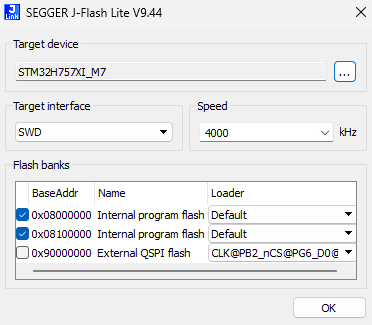

# Firmware Recovery

Recovery may be necessary if a firmware update fails or incompatible firmware is loaded.

Attempt flashing the bootloader via SWD port if the Cube is:

* Not showing up as a USB device at all
* Showing up as a single USB Serial Device
* Displaying an error related to firmware

## Prerequisites

* J-Link device (i.e. EDU Mini V2) or similar
* J-Link Adapter Board and 6-pin JST SUR plug for SWD port
  * Refer here for Carrier Board pinout: [FMU Debug pinout](https://docs.cubepilot.org/user-guides/autopilot/the-cube/introduction/interface-specifications#fmu-debug)
  * Pinout of example J-Link Adapter Board w/ JST SUR plug: [J-Link Adapter Board](https://docs.cubepilot.org/user-guides/~gitbook/image?url=https%3A%2F%2F3175993181-files.gitbook.io%2F%7E%2Ffiles%2Fv0%2Fb%2Fgitbook-x-prod.appspot.com%2Fo%2Fspaces%252F-LUhw7cdLeWVORgnTA3i%252Fuploads%252F06RF3owVp843GLe2ZqdE%252FJ-Link%2520Adapter%2520Board.jpg%3Falt%3Dmedia%26token%3Dfb2b0fb7-36ec-43fa-b9d8-c6da37077af7\&width=768\&dpr=3\&quality=100\&sign=ab4adf7d\&sv=2)
* “J-Link Software and Documentation Pack” ([segger.com/downloads/jlink/](https://www.segger.com/downloads/jlink/))
* Download latest “arducopter\_with\_bl.hex” for your flight controller from [firmware.ardupilot.org](https://firmware.ardupilot.org/) (or other vehicle type of your choice).
* De-cased Carrier Board
  * Remove 4x Phillips head mounting Cube onto Carrier Board.
  * Remove 4x Phillips head from side of housing.
  * Remove 4x 1.5mm hex head from base of housing.
  * Press in plastic clips and gently separate the two parts of the housing.

## Procedures

### J-Link with J-Flash Lite

1. Plug J-Link into the left port on the Carrier Board.

2. Connect J-Link to PC over USB.
3. Open J-Flash Lite (JFlashLite.exe).
4. Use the following parameters, changing the target device according to the table:

| Board       | Target device   |
| ----------- | --------------- |
| CubeOrange+ | STM32H757XI\_M7 |
| CubeOrange  | STM32H753XI     |

5. Click **OK**.
6. Plug the Cube into USB (for power) and immediately click **Erase Chip.**

.png>)

7. Click the button under **Data File** and open the arducopter\_with\_bl.hex file
8. Click **Program Device**.
9. Check the log for the following output:

.png>)

10. Unplug the Cube's USB port and Carrier Board's SWD port.
11. Plug USB into the Cube and verify connectivity with Mission Planner.

Check the version matches the .hex file flashed.\
You should now be able install firmware using Mission Planner.

