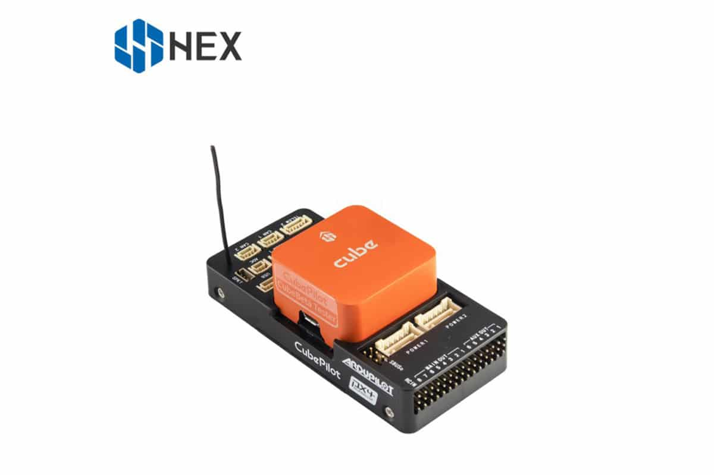

# ADS-B IN Carrier Board

The Cube Orange standard kit consists of the new Cube Orange as well as the new ADS-B equipped carrier board. 

This is an updated version of the original carrier board, its overall footprint is identical to the previous versions, main changes compated to original carrier are as follows 

* Intergration of uAvonix ADS-B IN Receiver
* Built-In ADS-B Antenna 
* Revmoval of Intel Edison Bay and Debug USB Ports
* New Product Livery 
* Correct lableing Of CAN Ports 

All external connections and ports remmain identical to the orignal carrer apart from the following 

### uAvionix ADS-B Receiver   

The new carrier board has an intigrated 1090Mhz ADS-B IN receiver from uAvionix, this allows users to detect ADS-B OUT equip aircraft in the area and displays information sush as the Position, Altitude, Speed and ID of the detected aircraft on a connected ground station. This also allow sense and avoid features included in Ardupilot to be used if configured. 

This ADS-B receiver is conneted to the internal serial 5 Port,  this is compaible with Ardupilot, Mission Planner and QGC.This system will 

To enable ADSB in Ardupilot to detect aircraft on ground satation you need to be using Copter or Plane 4.0 onward for the Cube Orange and set the following parameters 

* ADSB\_ENABLE = 1 Enable ADS-B \(Disabled as default\)
* SERIAL5\_BAUD = 57 Set baud rate
* SERIAL5\_PROTOCOL = 1 Set protocol
* SR0\_ADSB = 2 Set ADSB stream rate to ground station

Note:  You may need to set  SR1\_ADSB = 2 to enable receiving on ground statiion on telem 1 or SR2 for Telem 2.  

 For Advanced users you can set the ADS-B Alarm and Sens and Avoid with the following parameters 

 

