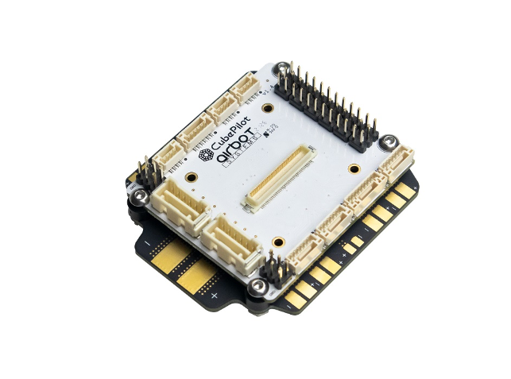

# Airbot Mini Carrier Board


  

The Airbot Mini carrier board is one of the way to install a Cube on a drone. The Mini carrier board encapsulate all the wiring in a 50.5x57.5mm board, in order to save space and weight for applications which have size limits.

A Mini PDB that can pass up to 180A now accompanies the mini carrier board. This ultra compact setup allows easy and clean mounting on all types of chassis.

