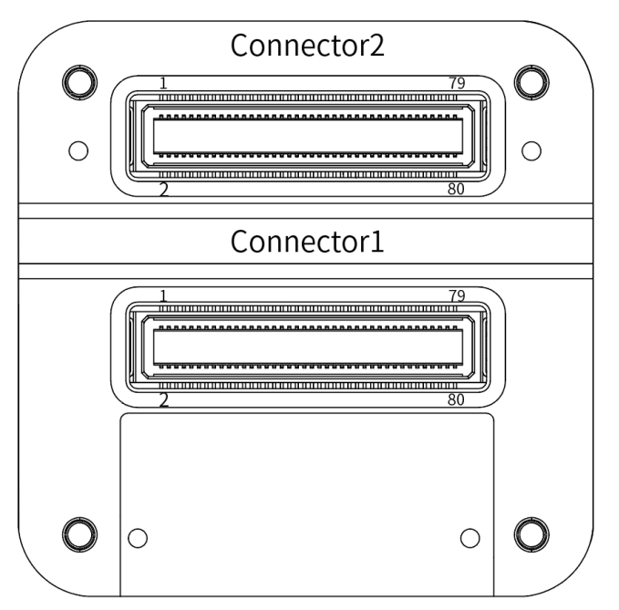
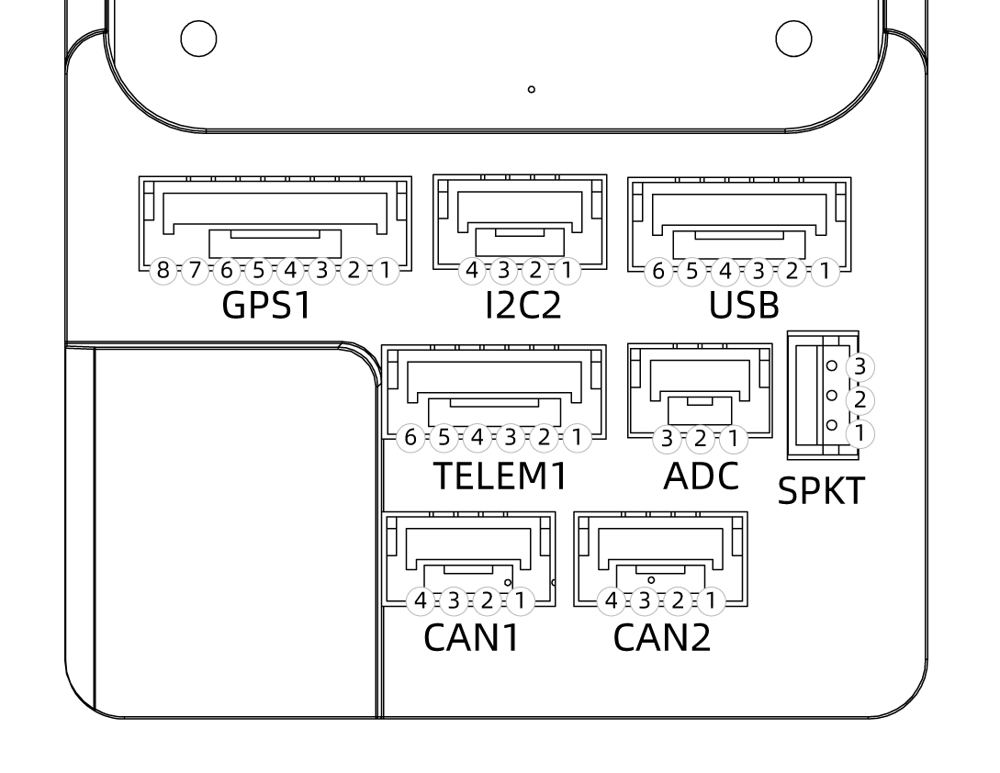
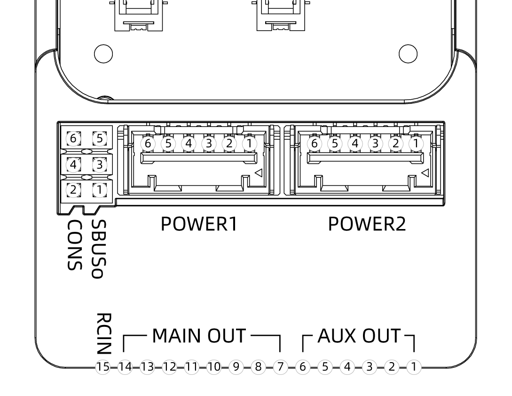
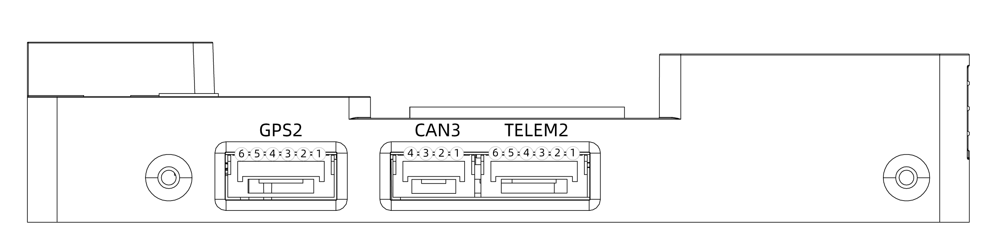
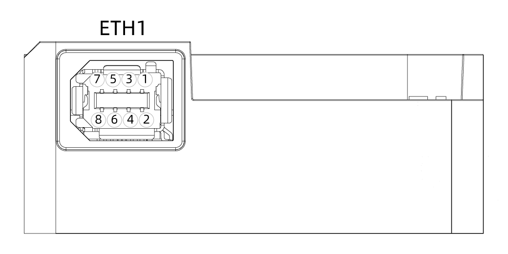
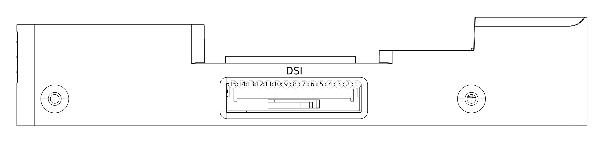

# Cube Red Standard Carrier Board Pinout

## Operating Conditions and Performance

<table><thead><tr><th width="310">About</th><th>Description</th></tr></thead><tbody><tr><td>POWER input voltage / rated input current</td><td>4.1 - 5.7 V / 2.5 A; 0 - 20 V is safe for the system but it will not work</td></tr><tr><td>POWER rated output / input power</td><td>14 W</td></tr><tr><td>USB port input voltage / rated input current</td><td>4 - 5.7 V / 250 mA</td></tr><tr><td>Servo rail input voltage</td><td>4 - 10.5 V</td></tr><tr><td>Waterproof performance</td><td>Not waterproof. External waterproof protection is needed</td></tr><tr><td>Operation Temperature</td><td>-10° / 55°</td></tr></tbody></table>

## Ports Standard and Definition

### Standard Carrier Board Ports Standard

| Connector | Connector Type              |
| --------- | --------------------------- |
| `GPS1`    | JST-GH 1.25 mm (8-pin)      |
| `GPS2`    | JST-GH 1.25 mm (6-pin)      |
| `TELEM1`  | JST-GH 1.25 mm (6-pin)      |
| `TELEM2`  | JST-GH 1.25 mm (6-pin)      |
| `I2C2`    | JST-GH 1.25 mm (4-pin)      |
| `USB`     | JST-GH 1.25 mm (6-pin)      |
| `CAN1`    | JST-GH 1.25 mm (4-pin)      |
| `CAN2`    | JST-GH 1.25 mm (4-pin)      |
| `CAN3`    | JST-GH 1.25 mm (4-pin)      |
| `POWER1`  | Molex CLIK-Mate 2mm (6-pin) |
| `POWER2`  | Molex CLIK-Mate 2mm (6-pin) |
| `ADC`     | JST-GH 1.25 mm (3-pin)      |
| `DSI`     | JST-GH 1.25 mm (15-pin)     |
| `ETH`     | TE Multi-purp pluh(8P)      |

## Cube Red 80-Pin DF17 Connector

<figure><figcaption></figcaption></figure>

### **Connector 1 Assignments**

<table data-header-hidden><thead><tr><th width="84"></th><th width="176"></th><th width="67"></th><th></th></tr></thead><tbody><tr><td>Pin#</td><td>Name</td><td>I/O</td><td>Description</td></tr><tr><td>1</td><td>FMU_SWDIO</td><td>I/O</td><td>FMU serial wire debug I/O</td></tr><tr><td>2</td><td>FMU_LED_AMBER</td><td>O</td><td>Boot error LED (drive only, controlled by FET)</td></tr><tr><td>3</td><td>FMU_SWCLK</td><td>O</td><td>FMU serial wire debug clock</td></tr><tr><td>4</td><td>I2C_2_SDA</td><td>I/O</td><td>I2C Serial Data Tx/Rx</td></tr><tr><td>5</td><td>EXTERN_CS</td><td>O</td><td>Chip select for external SPI (NC, just for debugging)</td></tr><tr><td>6</td><td>I2C_2_SCL</td><td>O</td><td>I2C Serial Clock Signal</td></tr><tr><td>7</td><td>FMU_!RESET</td><td>I</td><td>Reset pin for the FMU</td></tr><tr><td>8</td><td>CAN_L_3</td><td>I/O</td><td>CAN bus Low Signal Driver</td></tr><tr><td>9</td><td>VDD_SERVO_IN</td><td>I</td><td>Power for last resort I/O failsafe</td></tr><tr><td>10</td><td>CAN_H_3</td><td>I/O</td><td>CAN bus High Signal Driver</td></tr><tr><td>11</td><td>EXTERN_DRDY</td><td>I</td><td>Interrupt pin for external SPI (NC, just for debugging)</td></tr><tr><td>12</td><td>SERIAL_5_RX</td><td>I</td><td>UART 5 RX (Receive Data)</td></tr><tr><td>13</td><td>GND</td><td></td><td>System GND</td></tr><tr><td>14</td><td>SERIAL_5_TX</td><td>O</td><td>UART 5 TX (Transmit Data)</td></tr><tr><td>15</td><td>GND</td><td></td><td>System GND</td></tr><tr><td>16</td><td>SERIAL_4_RX</td><td>I</td><td>UART 4 RX (Receive Data)</td></tr><tr><td>17</td><td>SAFETY</td><td></td><td>Safety button input</td></tr><tr><td>18</td><td>SERIAL_4_TX</td><td>O</td><td>UART 4 TX (Transmit Data)</td></tr><tr><td>19</td><td>VDD_3V3_SPEKTRUM_EN</td><td>O</td><td>Enable for the Spektrum voltage regulator</td></tr><tr><td>20</td><td>SERIAL_3_RX</td><td>I</td><td>UART 3 RX (Receive Data)</td></tr><tr><td>21</td><td>PRESSURE_SENS_IN</td><td>AI</td><td>Analogue Signal port, for pressure sensor, Laser range finder, or Sonar</td></tr><tr><td>22</td><td>SERIAL_3_TX</td><td>O</td><td>UART 3 TX (Transmit Data)</td></tr><tr><td>23</td><td>AUX_BATT_VOLTAGE_SENS</td><td>AI</td><td>Voltage sense for Aux battery input</td></tr><tr><td>24</td><td>ALARM</td><td>O</td><td>Buzzer PWM Signal</td></tr><tr><td>25</td><td>AUX_BATT_CURRENT_SENS</td><td>AI</td><td>Current sense for Aux battery input</td></tr><tr><td>26</td><td>IO_VDD_3V3</td><td>I</td><td>IO chip power, pinned through for debug</td></tr><tr><td>27</td><td>VDD_5V_PERIPH_EN</td><td>O</td><td>Enable voltage supply for Peripherals</td></tr><tr><td>28</td><td>IO_LED_SAFET_PROT</td><td>O</td><td>IO-LED_SAFETY (safety LED) pinned out for IRIS</td></tr><tr><td>29</td><td>VBUS</td><td>I</td><td>USB VBus (VDD)</td></tr><tr><td>30</td><td>SERIAL_2_RTS</td><td></td><td>UART 2 RTS (Request To Send)</td></tr><tr><td>31</td><td>OTG_DP1</td><td>I/O</td><td>USB Data+ (D)</td></tr><tr><td>32</td><td>SERIAL_2_CTS</td><td></td><td>UART 2 CTS (Clear To Send)</td></tr><tr><td>33</td><td>OTG_DM1</td><td>I/O</td><td>USB Data- (M)</td></tr><tr><td>34</td><td>SERIAL_2_RX</td><td>I</td><td>UART 2 RX (Receive Data)</td></tr><tr><td>35</td><td>I2C_1_SDA</td><td>I/O</td><td>I2C Serial Data Tx/Rx</td></tr><tr><td>36</td><td>SERIAL_2_TX</td><td>O</td><td>UART 2 TX (Transmit Data)</td></tr><tr><td>37</td><td>I2C_1_SCL</td><td>O</td><td>I2C Serial Clock Signal</td></tr><tr><td>38</td><td>SERIAL_1_RX</td><td>I</td><td>UART 1 RX (Receive Data)</td></tr><tr><td>39</td><td>CAN_L_2</td><td>I/O</td><td>FMU CAN bus Low Signal Driver</td></tr><tr><td>40</td><td>SERIAL_1_TX</td><td>O</td><td>UART 1 TX (Transmit Data)</td></tr><tr><td>41</td><td>CAN_H_2</td><td>I/O</td><td>FMU CAN bus High Signal Driver</td></tr><tr><td>42</td><td>SERIAL_1_RTS</td><td></td><td>UART 1 RTS (Request To Send)</td></tr><tr><td>43</td><td>VDD_5V_PERIPH_OC</td><td>I</td><td>Error state message from Peripheral power supply</td></tr><tr><td>44</td><td>SERIAL_1_CTS</td><td></td><td>UART 1 CTS (Clear To Send)</td></tr><tr><td>45</td><td>VDD_5V_HIPOWER_OC</td><td>I</td><td>Error state message from High power Peripheral power supply</td></tr><tr><td>46</td><td>IO_USART_1_TX</td><td>O</td><td>I/O USART 1 TX</td></tr><tr><td>47</td><td>BATT_VOLTAGE_SENS_PROT</td><td>AI</td><td>Voltage sense from main battery</td></tr><tr><td>48</td><td>IO_USART1_RX_SPECTRUM_DSM</td><td>O</td><td>Signal from Spectrum receiver</td></tr><tr><td>49</td><td>BATT_CURRENT_SENS_PROT</td><td>AI</td><td>Current sense from main battery</td></tr><tr><td>50</td><td>FMU_CH1_PROT</td><td>O</td><td>FMU PWM output channel 1</td></tr><tr><td>51</td><td>SPI_EXT_MOSI</td><td>O</td><td>External SPI, for debug only</td></tr><tr><td>52</td><td>FMU_CH2_PROT</td><td>O</td><td>FMU PWM output channel 2</td></tr><tr><td>53</td><td>VDD_SERVO</td><td>I</td><td>VDD_Servo, for monitoring servo bus</td></tr><tr><td>54</td><td>FMU_CH3_PROT</td><td>O</td><td>FMU PWM Output Channel 3</td></tr><tr><td>55</td><td>VDD_BRICK_VALID</td><td>I</td><td>Main Power valid signal</td></tr><tr><td>56</td><td>FMU_CH4_PROT</td><td>O</td><td>FMU PWM Output Channel 4</td></tr><tr><td>57</td><td>VDD_BACKUP_VALID</td><td>I</td><td>Backup Power valid Signal</td></tr><tr><td>58</td><td>FMU_CH5_PROT</td><td>O</td><td>FMU PWM Output Channel 5</td></tr><tr><td>59</td><td>VBUS_VALID</td><td>I</td><td>USB bus valid signal</td></tr><tr><td>60</td><td>FMU_CH6_PROT</td><td>O</td><td>FMU PWM Output Channel 6</td></tr><tr><td>61</td><td>VDD_5V_IN_PROT</td><td>I</td><td>Main power (5V) into FMU from power selection</td></tr><tr><td>62</td><td>PPM_SBUS_PROT</td><td>I</td><td>PPM / S.Bus Signal Input</td></tr><tr><td>63</td><td>VDD_5V_IN_PROT</td><td>I</td><td>Main power (5V) into FMU from power selection</td></tr><tr><td>64</td><td>S.BUS_OUT</td><td>O</td><td>S.Bus Signal Output</td></tr><tr><td>65</td><td>IO_VDD_5V5</td><td>O</td><td>IO VDD 5.5 V</td></tr><tr><td>66</td><td>IO_CH8_PROT</td><td>O</td><td>I/O PWM Output Channel 8</td></tr><tr><td>67</td><td>SPI_EXT_MISO</td><td>I</td><td>External SPI, for Debug only</td></tr><tr><td>68</td><td>IO_CH7_PROT</td><td>O</td><td>I/O PWM Channel 7</td></tr><tr><td>69</td><td>IO_SWDIO</td><td>I/O</td><td>I/O serial wire debug</td></tr><tr><td>70</td><td>IO_CH6_PROT</td><td>O</td><td>I/O PWM Output Channel 6</td></tr><tr><td>71</td><td>IO_SWCLK</td><td>O</td><td>I/O Serial Wire Debug Clock</td></tr><tr><td>72</td><td>IO_CH5_PROT</td><td>O</td><td>I/O PWM Output Channel 5</td></tr><tr><td>73</td><td>SPI_EXT_SCK</td><td>O</td><td>External SPI, for Debug only</td></tr><tr><td>74</td><td>IO_CH4_PROT</td><td>O</td><td>I/O PWM Output Channel 4</td></tr><tr><td>75</td><td>IO_!RESET</td><td>I</td><td>I/O Reset Pin</td></tr><tr><td>76</td><td>IO_CH3_PROT</td><td>O</td><td>I/O PWM Output Channel 3</td></tr><tr><td>77</td><td>CAN_L_1</td><td>I/O</td><td>FMU CAN bus Low Signal Driver</td></tr><tr><td>78</td><td>IO_CH2_PROT</td><td>O</td><td>I/O PWM Output Channel 2</td></tr><tr><td>79</td><td>CAN_H_1</td><td>I/O</td><td>FMU CAN bus High Signal Driver</td></tr><tr><td>80</td><td>IO_CH1_PROT</td><td>O</td><td>I/O PWM Output Channel 1</td></tr></tbody></table>

### **Connector 2 Assignments**

<table data-header-hidden><thead><tr><th width="83"></th><th width="182"></th><th width="61"></th><th></th></tr></thead><tbody><tr><td>Pin#</td><td>Name</td><td>I/O</td><td>Description</td></tr><tr><td>1</td><td>GND</td><td></td><td>System GND</td></tr><tr><td>2</td><td>FMU_BOOT</td><td>I</td><td>FMU Boot</td></tr><tr><td>3</td><td>FC_NET_TX+</td><td>I/O</td><td>Ethernet TX+,Auto-MDIX support</td></tr><tr><td>4</td><td>NC</td><td></td><td>Use for future</td></tr><tr><td>5</td><td>GND</td><td></td><td></td></tr><tr><td>6</td><td>IO_BOOT</td><td></td><td>IO MCU BOOT</td></tr><tr><td>7</td><td>FC_NET_TX-</td><td>I/O</td><td>Ethernet TX-,Auto-MDIX support</td></tr><tr><td>8</td><td>NC</td><td></td><td>Use for future</td></tr><tr><td>9</td><td>GND</td><td></td><td>System GND</td></tr><tr><td>10</td><td>NC</td><td></td><td>Use for future</td></tr><tr><td>11</td><td>FC_NET_RX+</td><td>I/O</td><td>Ethernet RX+,Auto-MDIX support</td></tr><tr><td>12</td><td>NC</td><td></td><td>Use for future</td></tr><tr><td>13</td><td>GND</td><td></td><td>System GND</td></tr><tr><td>14</td><td>NC</td><td></td><td>Use for future</td></tr><tr><td>15</td><td>FC_NET_RX-</td><td>I/O</td><td>Ethernet RX-,Auto-MDIX support</td></tr><tr><td>16</td><td>NC</td><td></td><td>Use for future</td></tr><tr><td>17</td><td>GND</td><td></td><td>System GND</td></tr><tr><td>18</td><td>NC</td><td></td><td>Use for future</td></tr><tr><td>19</td><td>FC_NET_LEDY</td><td>O</td><td>Link Speed LED Indication</td></tr><tr><td>20</td><td>NC</td><td></td><td>Use for future</td></tr><tr><td>21</td><td>FC_NET_LEDG</td><td>O</td><td>Ethernet Link activity LED Indication</td></tr><tr><td>22</td><td>NC</td><td></td><td>Use for future</td></tr><tr><td>23</td><td>FC_NET_VCC</td><td>I</td><td>Ethernet 3.3V Power in</td></tr><tr><td>24</td><td>NC</td><td></td><td>Use for future</td></tr><tr><td>25</td><td>Timestamp rtc</td><td>I</td><td>Timestamp RTC</td></tr><tr><td>26</td><td>NC</td><td></td><td>Use for future</td></tr><tr><td>27</td><td>GND</td><td></td><td>System GND</td></tr><tr><td>28</td><td>NC</td><td></td><td>Use for future</td></tr><tr><td>29</td><td>CAN_L_1</td><td>I/O</td><td>CAN bus Low Signal Driver</td></tr><tr><td>30</td><td>NC</td><td></td><td>Use for future</td></tr><tr><td>31</td><td>CAN_H_1</td><td>I/O</td><td>CAN bus High Signal Driver</td></tr><tr><td>32</td><td>NC</td><td></td><td>Use for future</td></tr><tr><td>33</td><td>CAN_L_2</td><td>I/O</td><td>CAN bus Low Signal Driver</td></tr><tr><td>34</td><td>NC</td><td></td><td>Use for future</td></tr><tr><td>35</td><td>CAN_H_2</td><td>I/O</td><td>CAN bus High Signal Driver</td></tr><tr><td>36</td><td>NC</td><td></td><td>Use for future</td></tr><tr><td>37</td><td>CAN_L_3</td><td>I/O</td><td>CAN bus Low Signal Driver</td></tr><tr><td>38</td><td>NC</td><td></td><td>Use for future</td></tr><tr><td>39</td><td>CAN_H_3</td><td>I/O</td><td>CAN bus High Signal Driver</td></tr><tr><td>40</td><td>NC</td><td></td><td>Use for future</td></tr><tr><td>41</td><td>GND</td><td></td><td>System GND</td></tr><tr><td>42</td><td>NC</td><td></td><td>Use for future</td></tr><tr><td>43</td><td>UART8_RX</td><td>I</td><td>IO UART 8 RX (Receive Data)</td></tr><tr><td>44</td><td>NC</td><td></td><td>Use for future</td></tr><tr><td>45</td><td>UART8_TX</td><td>O</td><td>IO UART 8 TX (Transmit Data)</td></tr><tr><td>46</td><td>NC</td><td></td><td>Use for future</td></tr><tr><td>47</td><td>GND</td><td></td><td>System GND</td></tr><tr><td>48</td><td>NC</td><td></td><td>Use for future</td></tr><tr><td>49</td><td>DSI_CKP</td><td>O</td><td>MIPI DSI Host Clock Postive</td></tr><tr><td>50</td><td>NC</td><td></td><td>Use for future</td></tr><tr><td>51</td><td>DSI_CKN</td><td>O</td><td>MIPI DSI Host Clock Negative</td></tr><tr><td>52</td><td>NC</td><td></td><td>Use for future</td></tr><tr><td>53</td><td>GND</td><td></td><td>System GND</td></tr><tr><td>54</td><td>NC</td><td></td><td>Use for future</td></tr><tr><td>55</td><td>DSI_D0P</td><td>O</td><td>MIPI DSI Host DATA0 Postive</td></tr><tr><td>56</td><td>NC</td><td></td><td>Use for future</td></tr><tr><td>57</td><td>DSI_D0N</td><td>O</td><td>MIPI DSI Host DATA0 Negative</td></tr><tr><td>58</td><td>NC</td><td></td><td>Use for future</td></tr><tr><td>59</td><td>GND</td><td></td><td>System GND</td></tr><tr><td>60</td><td>NC</td><td></td><td>Use for future</td></tr><tr><td>61</td><td>DSI_D1P</td><td>O</td><td>MIPI DSI Host DATA1 Postive</td></tr><tr><td>62</td><td>NC</td><td></td><td>Use for future</td></tr><tr><td>63</td><td>DSI_D1N</td><td>O</td><td>MIPI DSI Host DATA1 Negative</td></tr><tr><td>64</td><td>NC</td><td></td><td>Use for future</td></tr><tr><td>65</td><td>GND</td><td></td><td>System GND</td></tr><tr><td>66</td><td>NC</td><td></td><td>Use for future</td></tr><tr><td>67</td><td>FMU_DAC</td><td>O</td><td>FMU Analogue output</td></tr><tr><td>68</td><td>NC</td><td></td><td>Use for future</td></tr><tr><td>69</td><td>IO_DAC</td><td>O</td><td>IO Analogue output</td></tr><tr><td>70</td><td>NC</td><td></td><td>Use for future</td></tr><tr><td>71</td><td>GND</td><td></td><td>System GND</td></tr><tr><td>72</td><td>NC</td><td></td><td>Use for future</td></tr><tr><td>73</td><td>VDD_5V_IN_backup</td><td>I</td><td>Main power (5V) into FMU from power selection</td></tr><tr><td>74</td><td>NC</td><td></td><td>Use for future</td></tr><tr><td>75</td><td>VDD_5V_IN_backup</td><td>I</td><td>Main power (5V) into FMU from power selection</td></tr><tr><td>76</td><td>NC</td><td></td><td>Use for future</td></tr><tr><td>77</td><td>VDD_5V_IN_backup</td><td>I</td><td>Main power (5V) into FMU from power selection</td></tr><tr><td>78</td><td>NC</td><td></td><td>Use for future</td></tr><tr><td>79</td><td>VDD_5V_IN_backup</td><td>I</td><td>Main power (5V) into FMU from power selection</td></tr><tr><td>80</td><td>NC</td><td></td><td>Use for future</td></tr></tbody></table>

### Ports and Protocols

<table data-header-hidden><thead><tr><th width="199.33333333333331"></th><th width="457"></th><th></th></tr></thead><tbody><tr><td>Name</td><td>Function</td><td>Marking</td></tr><tr><td>SERIAL 1 / UART 1</td><td>UART 1 with hardware flow control. 3.3V-5V CMOS TTL level, with ESD protection</td><td><code>TELEM1</code></td></tr><tr><td>SERIAL 2 / UART 2</td><td>UART 2 with hardware flow control. 3.3V-5V CMOS TTL level, with ESD protection</td><td><code>TELEM2</code></td></tr><tr><td>SERIAL 3 / UART 3 / I2C 1</td><td>3.3V-5V CMOS TTL level, with ESD protection</td><td><code>GPS1</code></td></tr><tr><td>SERIAL 4 / UART 4 / I2C 2</td><td>UART 4 / I2C 2, 3.3V-5V CMOS TTL level, with ESD protection</td><td><code>GPS2</code></td></tr><tr><td>SERIAL 5 / UART 5 (Debug Console)</td><td>UART 5，Debug Console</td><td><code>CONS</code></td></tr><tr><td>I2C 2</td><td>Independent I2C 2 port. Drivers are on-board on FMU. UN-buffered, and pulled up to 3.3V COMS TTL level</td><td><code>I2C2</code></td></tr><tr><td>CAN Bus</td><td>Standard CAN Bus. Drivers are on-board on FMU.</td><td><code>CAN1</code> <code>CAN2</code> <code>CAN3</code></td></tr><tr><td>R/C IN</td><td>Support CPPM / Futaba S.Bus signal input</td><td><code>RCIN</code></td></tr><tr><td>DSM / USART</td><td>Support Spektrum DSM® Technology, Spektrum DSM2™ / DSMX™ compatible input; I/O USART 1 RX</td><td><code>SKPT</code></td></tr><tr><td>S.Bus OUT / RSSI IN</td><td>S.Bus Servo I/O. PPM Output. Can be used as RSSI input</td><td><code>SBUSo</code></td></tr><tr><td>POWER</td><td>Main Power source and Backup Power source Input</td><td><code>POWER1</code> <code>POWER2</code></td></tr><tr><td>MAIN OUT</td><td>Standard PWM Servo Signal I/O Port x 8</td><td><code>MAIN OUT</code></td></tr><tr><td>AUX OUT</td><td>Programmable FMU GPIO x 6. Support PWM Signal Output</td><td><code>AUX OUT</code></td></tr><tr><td>USB</td><td>Human Machine Interface (HMI): LED, Speaker and USB extension</td><td><code>USB</code></td></tr><tr><td>ADC</td><td>3.3 V ADC Input</td><td><code>ADC</code></td></tr><tr><td>SPI</td><td>Built-in SPI port, with NO buffer, can only use short cable for connection. Not recommended.</td><td><code>Built-in contact point</code></td></tr><tr><td>Debug</td><td>I/O and FMU Testing Port</td><td><code>Built-in port</code></td></tr><tr><td>ETH</td><td>Ethernet Port</td><td></td></tr><tr><td>DSI</td><td>MIPI DSI output and Timestamp,FMU/IO BOOT</td><td></td></tr></tbody></table>

### **Carrier Board Port Interface and Pin Label**

<figure><figcaption></figcaption></figure>

### **SERIAL 1 / UART 1 | Port: `TELEM1`**

<table data-header-hidden><thead><tr><th width="89"></th><th></th><th width="70"></th><th></th><th></th><th></th></tr></thead><tbody><tr><td>Pin #</td><td>Name</td><td>I/O</td><td>Voltage</td><td>Wire Colour</td><td>Definition</td></tr><tr><td>1</td><td>VCC_5V</td><td>OUT</td><td>5 V</td><td>RED/GRAY</td><td>VCC</td></tr><tr><td>2</td><td>SERIAL_1_TX</td><td>OUT</td><td>3.3 V - 5.0 V TTL</td><td>Orange+/BLACK</td><td>UART 1 TX (Transmit Data)</td></tr><tr><td>3</td><td>SERIAL_1_RX</td><td>IN</td><td>3.3 V - 5.0 V TTL</td><td>GREEN/BLACK</td><td>UART 1 RX (Receive Data)</td></tr><tr><td>4</td><td>SERIAL_1_CTS (TX)</td><td>OUT</td><td>3.3 V - 5.0 V TTL</td><td>GRAY/BLACK</td><td>UART 1 CTS (Clear To Send)</td></tr><tr><td>5</td><td>SERIAL_1_RTS (RX)</td><td>IN</td><td>3.3 V - 5.0 V TTL</td><td>GRAY/BLACK</td><td>UART 1 RTS (Request To Send)</td></tr><tr><td>6</td><td>GND</td><td></td><td>GND</td><td>BLACK</td><td>GND</td></tr></tbody></table>

### **SERIAL 3 / UART 3 (GPS) / I2C 1 | Port: `GPS1`**

<table data-header-hidden><thead><tr><th width="87"></th><th width="129"></th><th width="90"></th><th width="122"></th><th width="134"></th><th></th></tr></thead><tbody><tr><td>Pin #</td><td>Name</td><td>I/O</td><td>Voltage</td><td>Cable Colour</td><td>Definition</td></tr><tr><td>1</td><td>VCC_5V</td><td>IN</td><td>5 V</td><td>RED</td><td>VCC Power Supply To GPS From AP</td></tr><tr><td>3</td><td>SERIAL_3_TX</td><td>OUT</td><td>3.3 V - 5.0 V TTL</td><td>BLACK</td><td>UART 3 TX (Transmit Data)</td></tr><tr><td>2</td><td>SERIAL_3_RX</td><td>IN</td><td>3.3 V - 5.0 V TTL</td><td>BLACK</td><td>UART 3 RX (Receive Data)</td></tr><tr><td>4</td><td>I2C_1_SCL</td><td>IN</td><td>3.3 V</td><td>BLACK</td><td>I2C 1 Clock Signal</td></tr><tr><td>5</td><td>I2C_1_SDA</td><td>IN/OUT</td><td>3.3 V</td><td>BLACK</td><td>I2C 1 Serial Data</td></tr><tr><td>6</td><td>BUTTON</td><td></td><td>GND</td><td>BLACK</td><td>Signal shorted to GND on press</td></tr><tr><td>7</td><td>IO_LED_SAFET_PROT</td><td></td><td>GND</td><td>BLACK</td><td>LED Driver For Safety Button</td></tr><tr><td>8</td><td>GND</td><td></td><td>GND</td><td>BLACK</td><td>GND</td></tr></tbody></table>

### **HMI (Buzzer / USB / LED) | Port: `USB`**

<table data-header-hidden><thead><tr><th width="87"></th><th></th><th width="97"></th><th width="99"></th><th></th><th></th></tr></thead><tbody><tr><td>Pin #</td><td>Name</td><td>I/O</td><td>Voltage</td><td>Cable Colour</td><td>Definition</td></tr><tr><td>1</td><td>V BUS</td><td>OUT</td><td>5 V</td><td>RED/GRAY</td><td>USB V BUS</td></tr><tr><td>2</td><td>OTG_DP1</td><td>IN/OUT</td><td>3.3 V</td><td>GREEN/BLACK</td><td>USB Data Positive (D+)</td></tr><tr><td>3</td><td>OTG_DM1</td><td>IN/OUT</td><td>3.3 V</td><td>RED/BLACK</td><td>USB Data Minus (D-)</td></tr><tr><td>4</td><td>GND</td><td></td><td>GND</td><td>BLACK</td><td>GND</td></tr><tr><td>5</td><td>BUZZER_OUT</td><td>OUT</td><td>Battery Voltage</td><td>GRAY/BLACK</td><td>VBAT (8.4 - 42 V)</td></tr><tr><td>6</td><td>FMU_LED_AMBER</td><td>OUT</td><td></td><td>BLACK</td><td>Boot / Error LED (FW updates)</td></tr></tbody></table>

### **I2C 2 | Port: `I2C 2`**

<table data-header-hidden><thead><tr><th width="87"></th><th width="115"></th><th width="96"></th><th width="123"></th><th></th><th></th></tr></thead><tbody><tr><td>Pin #</td><td>Name</td><td>I/O</td><td>Voltage</td><td>Cable Colour</td><td>Definition</td></tr><tr><td>1</td><td>VCC_5V</td><td>OUT</td><td>5 V</td><td>RED/GRAY</td><td>VCC Power Supply</td></tr><tr><td>2</td><td>I2C_2_SCL</td><td>IN/OUT</td><td>3.3 V (PULLUPS)</td><td>BLUE/BLACK</td><td>I2C 2 Clock Signal, Pull-up on AP</td></tr><tr><td>3</td><td>I2C_2_SDA</td><td>IN/OUT</td><td>3.3 V (PULLUPS)</td><td>GREEN/BLACK</td><td>I2C 2 Serial Data, Pull-up on AP</td></tr><tr><td>4</td><td>GND</td><td></td><td>GND</td><td>BLACK</td><td>GND</td></tr></tbody></table>

### **CAN 1 | Port: `CAN1`**

<table data-header-hidden><thead><tr><th width="88"></th><th width="103"></th><th width="90"></th><th width="91"></th><th width="162"></th><th></th></tr></thead><tbody><tr><td>Pin #</td><td>Name</td><td>I/O</td><td>Voltage</td><td>Cable Colour</td><td>Definition</td></tr><tr><td>1</td><td>VCC_5V</td><td>OUT</td><td>5 V</td><td>RED/GRAY</td><td>VCC Power Supply</td></tr><tr><td>2</td><td>CAN_H_1</td><td>IN/OUT</td><td>12 V</td><td>Orange+/BLACK</td><td>CAN High</td></tr><tr><td>3</td><td>CAN_L_1</td><td>IN/OUT</td><td>12 V</td><td>GREEN/BLACK</td><td>CAN Low</td></tr><tr><td>4</td><td>GND</td><td></td><td>GND</td><td>BLACK</td><td>GND</td></tr></tbody></table>

### **CAN 2 | Port: `CAN2`**

<table data-header-hidden><thead><tr><th width="93"></th><th width="105"></th><th width="90"></th><th width="93"></th><th width="162"></th><th></th></tr></thead><tbody><tr><td>Pin #</td><td>Name</td><td>I/O</td><td>Voltage</td><td>Cable Colour</td><td>Definition</td></tr><tr><td>1</td><td>VCC_5V</td><td>OUT</td><td>5 V</td><td>RED/GRAY</td><td>VCC Power Supply</td></tr><tr><td>2</td><td>CAN_H_2</td><td>IN/OUT</td><td>12 V</td><td>Orange+/BLACK</td><td>CAN High</td></tr><tr><td>3</td><td>CAN_L_2</td><td>IN/OUT</td><td>12 V</td><td>GREEN/BLACK</td><td>CAN Low</td></tr><tr><td>4</td><td>GND</td><td></td><td>GND</td><td>BLACK</td><td>GND</td></tr></tbody></table>

### **ADC | Port: `ADC`**

<table data-header-hidden><thead><tr><th width="89"></th><th></th><th width="71"></th><th width="93"></th><th></th><th></th></tr></thead><tbody><tr><td>Pin #</td><td>Name</td><td>I/O</td><td>Voltage</td><td>Cable Colour</td><td>Definition</td></tr><tr><td>1</td><td>VDD_5V_PRES</td><td>OUT</td><td>5 V</td><td>RED</td><td>Power Supply</td></tr><tr><td>2</td><td>PRESSURE_SENS_IN</td><td>IN</td><td></td><td>BLACK</td><td></td></tr><tr><td>3</td><td>GND</td><td></td><td>GND</td><td>BLACK</td><td>GND</td></tr></tbody></table>

### **IO USART 1 / DSM | Port: `SPKT`**

<table data-header-hidden><thead><tr><th width="90"></th><th></th><th width="68"></th><th width="90"></th><th width="130"></th><th></th></tr></thead><tbody><tr><td>Pin #</td><td>Name</td><td>I/O</td><td>Voltage</td><td>Cable Colour</td><td>Definition</td></tr><tr><td>1</td><td>IO_USART1_RX_SPECTRUM_DSM</td><td>IN</td><td></td><td></td><td>IO USART 1 RX, DSM INPUT</td></tr><tr><td>2</td><td>GND</td><td></td><td>GND</td><td></td><td>GND</td></tr><tr><td>3</td><td>VDD_3V3_Spektrum</td><td>OUT</td><td>3.3 V</td><td></td><td>Independent Power Supply</td></tr></tbody></table>

<figure><figcaption></figcaption></figure>

### **SERIAL 5 / UART 5 (Debug Console) / S.Bus OUT | Port: `CONS`** **`SBUSo`**

<table data-header-hidden><thead><tr><th width="127"></th><th width="149"></th><th width="86"></th><th></th><th></th><th></th></tr></thead><tbody><tr><td>Pin #</td><td>Name</td><td>I/O</td><td>Voltage</td><td>Cable Colour</td><td>Definition</td></tr><tr><td>1 <code>SBUSo</code></td><td>S.Bus_Out</td><td>OUT</td><td></td><td></td><td>S.Bus Signal Output</td></tr><tr><td>2 <code>CONS</code></td><td>SERIAL_5_TX</td><td>OUT</td><td>3.3 V - 5.0 V TTL</td><td></td><td>UART 5 TX (Transmit Data)</td></tr><tr><td>3 <code>SBUSo</code></td><td>VDD_SERVO</td><td>OUT</td><td>Servo Voltage</td><td></td><td></td></tr><tr><td>4 <code>CONS</code></td><td>SERIAL_5_RX</td><td>IN</td><td>3.3 V - 5.0 V TTL</td><td></td><td>UART 5 RX (Receive Data)</td></tr><tr><td>5 <code>SBUSo</code></td><td>GND</td><td></td><td>GND</td><td></td><td>GND</td></tr><tr><td>6 <code>CONS</code></td><td>GND</td><td></td><td>GND</td><td></td><td>GND</td></tr></tbody></table>

### **Main Power POWER 1 | Port: `POWER1`**

<table data-header-hidden><thead><tr><th width="91"></th><th></th><th width="63"></th><th width="103"></th><th></th><th></th></tr></thead><tbody><tr><td>Pin #</td><td>Name</td><td>I/O</td><td>Voltage</td><td>Cable Colour</td><td>Definition</td></tr><tr><td>1</td><td>VDD_5V_BRICK</td><td>IN</td><td>5 V</td><td>RED/GRAY</td><td>Supply To AP from Power Brick</td></tr><tr><td>2</td><td>VDD_5V_BRICK</td><td>IN</td><td>5 V</td><td>RED/GRAY</td><td>Supply To AP from Power Brick</td></tr><tr><td>3</td><td>BATT_CURRENT_SENS_PROT</td><td></td><td>3.3 V</td><td>BLACK</td><td>Battery Current Connecter</td></tr><tr><td>4</td><td>BATT_CURRENT_VOLTAGE_PROT</td><td>IN</td><td>3.3 V</td><td>BLACK</td><td>Battery Voltage Connecter</td></tr><tr><td>5</td><td>GND</td><td></td><td>GND</td><td>BLACK</td><td>GND</td></tr><tr><td>6</td><td>GND</td><td></td><td>GND</td><td>BLACK</td><td>GND</td></tr></tbody></table>

### **Backup Power POWER 2 | Port: `POWER2`**

<table data-header-hidden><thead><tr><th width="92"></th><th></th><th width="59"></th><th width="93"></th><th width="128"></th><th></th></tr></thead><tbody><tr><td>Pin #</td><td>Name</td><td>I/O</td><td>Voltage</td><td>Cable Colour</td><td>Definition</td></tr><tr><td>1</td><td>VDD_5V_BRICK</td><td>IN</td><td>5 V</td><td>RED/GRAY</td><td>Supply To AP from Power Brick</td></tr><tr><td>2</td><td>VDD_5V_BRICK</td><td>IN</td><td>5 V</td><td>RED/GRAY</td><td>Supply To AP from Power Brick</td></tr><tr><td>3</td><td>AUX_BATT_CURRENT_SENS</td><td></td><td>3.3 V</td><td>BLACK</td><td>Aux Battery Current Connecter</td></tr><tr><td>4</td><td>AUX_BATT_VOLTAGE_SENS</td><td>IN</td><td>3.3 V</td><td>BLACK</td><td>Aux Battery Voltage Connecter</td></tr><tr><td>5</td><td>GND</td><td></td><td>GND</td><td>BLACK</td><td>GND Connection</td></tr><tr><td>6</td><td>GND</td><td></td><td>GND</td><td>BLACK</td><td>GND</td></tr></tbody></table>

### **CPPM / S.BUS / SERVO SYSTEM | Port: `RCIN`** **`MAIN OUT`** **`AUX OUT`**

<table data-header-hidden><thead><tr><th width="97"></th><th></th><th width="60"></th><th width="172"></th><th></th></tr></thead><tbody><tr><td>Pin #</td><td>Name</td><td>I/O</td><td>Voltage</td><td>Definition</td></tr><tr><td>S - 1</td><td>FMU_CH1_PROT</td><td>OUT</td><td>3.3 V Servo Signal, Servo Rail Power</td><td>PWM Signal</td></tr><tr><td>S - 2</td><td>FMU_CH2_PROT</td><td>OUT</td><td>3.3 V Servo Signal, Servo Rail Power</td><td>PWM Signal</td></tr><tr><td>S - 3</td><td>FMU_CH3_PROT</td><td>OUT</td><td>3.3 V Servo Signal, Servo Rail Power</td><td>PWM Signal</td></tr><tr><td>S - 4</td><td>FMU_CH4_PROT</td><td>OUT</td><td>3.3 V Servo Signal, Servo Rail Power</td><td>PWM Signal</td></tr><tr><td>S - 5</td><td>FMU_CH5_PROT</td><td>OUT</td><td>3.3 V Servo Signal, Servo Rail Power</td><td>PWM Signal</td></tr><tr><td>S - 6</td><td>FMU_CH6_PROT</td><td>OUT</td><td>3.3 V Servo Signal, Servo Rail Power</td><td>PWM Signal</td></tr><tr><td>S - 7</td><td>IO_CH1_PROT</td><td>OUT</td><td>3.3 V Servo Signal, Servo Rail Power</td><td>PWM Signal</td></tr><tr><td>S - 8</td><td>IO_CH2_PROT</td><td>OUT</td><td>3.3 V Servo Signal, Servo Rail Power</td><td>PWM Signal</td></tr><tr><td>S - 9</td><td>IO_CH3_PROT</td><td>OUT</td><td>3.3 V Servo Signal, Servo Rail Power</td><td>PWM Signal</td></tr><tr><td>S - 10</td><td>IO_CH4_PROT</td><td>OUT</td><td>3.3 V Servo Signal, Servo Rail Power</td><td>PWM Signal</td></tr><tr><td>S - 11</td><td>IO_CH5_PROT</td><td>OUT</td><td>3.3 V Servo Signal, Servo Rail Power</td><td>PWM Signal</td></tr><tr><td>S - 12</td><td>IO_CH6_PROT</td><td>OUT</td><td>3.3 V Servo Signal, Servo Rail Power</td><td>PWM Signal</td></tr><tr><td>S - 13</td><td>IO_CH7_PROT</td><td>OUT</td><td>3.3 V Servo Signal, Servo Rail Power</td><td>PWM Signal</td></tr><tr><td>S - 14</td><td>IO_CH8_PROT</td><td>OUT</td><td>3.3 V Servo Signal, Servo Rail Power</td><td>PWM Signal</td></tr><tr><td>S - 15</td><td>PPM_SBUS_PROT</td><td>IN/OUT</td><td>3.3 V / 4.5 V Powered</td><td>PPM / S.Bus Signal</td></tr></tbody></table>

<figure><figcaption></figcaption></figure>

### **SERIAL 2 / UART 2 | Port: `TELEM2`**

<table data-header-hidden><thead><tr><th width="97"></th><th></th><th width="68"></th><th width="130"></th><th width="155"></th><th></th></tr></thead><tbody><tr><td>Pin #</td><td>Name</td><td>I/O</td><td>Voltage</td><td>Cable Colour</td><td>Definition</td></tr><tr><td>1</td><td>VCC_5V</td><td>OUT</td><td>5 V</td><td>RED/GRAY</td><td>VCC</td></tr><tr><td>2</td><td>SERIAL_2_TX</td><td>OUT</td><td>3.3 V - 5.0 V TTL</td><td>Orange+/BLACK</td><td>UART 2 TX (Transmit Data)</td></tr><tr><td>3</td><td>SERIAL_2_RX</td><td>IN</td><td>3.3 V - 5.0 V TTL</td><td>GREEN/BLACK</td><td>UART 2 RX (Receive Data)</td></tr><tr><td>4</td><td>SERIAL_2_CTS (TX)</td><td>OUT</td><td>3.3 V - 5.0 V TTL</td><td>GRAY/BLACK</td><td>UART 2 CTS (Clear To Send)</td></tr><tr><td>5</td><td>SERIAL_2_RTS (RX)</td><td>IN</td><td>3.3 V - 5.0 V TTL</td><td>GRAY/BLACK</td><td>UART 2 RTS (Request To Send)</td></tr><tr><td>6</td><td>GND</td><td></td><td>GND</td><td>BLACK</td><td>GND</td></tr></tbody></table>

### **SERIAL 4 / UART 4 / I2C 2 | Port: `GPS2`**

<table data-header-hidden><thead><tr><th width="91"></th><th></th><th width="75"></th><th></th><th></th><th></th></tr></thead><tbody><tr><td>Pin #</td><td>Name</td><td>I/O</td><td>Voltage</td><td>Cable Colour</td><td>Definition</td></tr><tr><td>1</td><td>VCC_5V</td><td>OUT</td><td>5 V</td><td>RED/GRAY</td><td>VCC Power Supply To GPS From AP</td></tr><tr><td>2</td><td>SERIAL_4_TX</td><td>OUT</td><td>3.3 V - 5.0 V TTL</td><td>Orange+/BLACK</td><td>UART 4 TX (Transmit Data)</td></tr><tr><td>3</td><td>SERIAL_4_RX</td><td>IN</td><td>3.3 V - 5.0 V TTL</td><td>GREEN/BLACK</td><td>UART 4 RX (Receive Data)</td></tr><tr><td>4</td><td>I2C_2_SCL</td><td>OUT</td><td>3.3 V - 5.0 V</td><td>GRAY/BLACK</td><td>I2C 2 Clock Signal</td></tr><tr><td>5</td><td>I2C_2_SDA</td><td>IN</td><td>3.3 V - 5.0 V</td><td>GRAY/BLACK</td><td>I2C 2 Serial Data</td></tr><tr><td>6</td><td>GND</td><td></td><td>GND</td><td>BLACK</td><td>GND</td></tr></tbody></table>

### **CAN 3 | Port: `CAN3`**

<table data-header-hidden><thead><tr><th width="98"></th><th width="105"></th><th width="100"></th><th width="90"></th><th></th><th></th></tr></thead><tbody><tr><td>Pin #</td><td>Name</td><td>I/O</td><td>Voltage</td><td>Cable Colour</td><td>Definition</td></tr><tr><td>1</td><td>VCC_5V</td><td>OUT</td><td>5 V</td><td>RED/GRAY</td><td>VCC Power Supply</td></tr><tr><td>2</td><td>CAN_H_2</td><td>IN/OUT</td><td>12 V</td><td>Orange+/BLACK</td><td>CAN High</td></tr><tr><td>3</td><td>CAN_L_2</td><td>IN/OUT</td><td>12 V</td><td>GREEN/BLACK</td><td>CAN Low</td></tr><tr><td>4</td><td>GND</td><td></td><td>GND</td><td>BLACK</td><td>GND</td></tr></tbody></table>

<figure><figcaption></figcaption></figure>

### **Ethernet: `ETH1`**

<table data-header-hidden><thead><tr><th width="96"></th><th width="107"></th><th width="103"></th><th></th></tr></thead><tbody><tr><td>Pin #</td><td>Name</td><td>I/O</td><td>Descrption</td></tr><tr><td>1</td><td>TXP/RXP</td><td>IN/OUT</td><td>Ethernet TXP/RXP Auto-MDIX support</td></tr><tr><td>2</td><td>TXN/RXN</td><td>IN/OUT</td><td>Ethernet TXN/RXN Auto-MDIX support</td></tr><tr><td>3</td><td>RXP/TXP</td><td>IN/OUT</td><td>Ethernet RXP/TXP Auto-MDIX support</td></tr><tr><td>4</td><td>NC</td><td></td><td>No connect</td></tr><tr><td>5</td><td>NC</td><td></td><td>No connect</td></tr><tr><td>6</td><td>RXN/TXN</td><td>IN/OUT</td><td>Ethernet RXN/TXN Auto-MDIX support</td></tr><tr><td>7</td><td>NC</td><td></td><td>No connect</td></tr><tr><td>8</td><td>NC</td><td></td><td>No connect</td></tr></tbody></table>

<figure><figcaption></figcaption></figure>

### **DSI / Timestamp / Boot| Port: `DSI`**

<table data-header-hidden><thead><tr><th width="89"></th><th width="169"></th><th width="91"></th><th></th></tr></thead><tbody><tr><td>Pin #</td><td>Name</td><td>I/O</td><td>Definition</td></tr><tr><td>1</td><td>IO_BOOT_0</td><td>OUT</td><td>IO BOOT</td></tr><tr><td>2</td><td>FMU_BOOT_0</td><td>OUT</td><td>FMU BOOT</td></tr><tr><td>3</td><td>TIMESTAMP_RTC</td><td>OUT</td><td>TIMESTAMP</td></tr><tr><td>4</td><td>GND</td><td></td><td>GND</td></tr><tr><td>5</td><td>DSI_CKP</td><td>OUT</td><td>MIPI DSI Host Clock Postive</td></tr><tr><td>6</td><td>DSI_CKN</td><td>OUT</td><td>MIPI DSI Host Clock Negative</td></tr><tr><td>7</td><td>GND</td><td></td><td>GND</td></tr><tr><td>8</td><td>DSI_D0P</td><td>OUT</td><td>MIPI DSI Host DATA 0 Postive</td></tr><tr><td>9</td><td>DSI_D0N</td><td>OUT</td><td>MIPI DSI Host DATA 0 Negative</td></tr><tr><td>10</td><td>GND</td><td></td><td>GND</td></tr><tr><td>11</td><td>DSI_D1P</td><td>OUT</td><td>MIPI DSI Host DATA 1 Postive</td></tr><tr><td>12</td><td>DSI_D1N</td><td>OUT</td><td>MIPI DSI Host DATA 1 Negative</td></tr><tr><td>13</td><td>GND</td><td></td><td>GND</td></tr><tr><td>14</td><td>IO_DAC</td><td>OUT</td><td>IO Analog output</td></tr><tr><td>15</td><td>FMU_DAC</td><td>OUT</td><td>FMU Analong output</td></tr></tbody></table>
