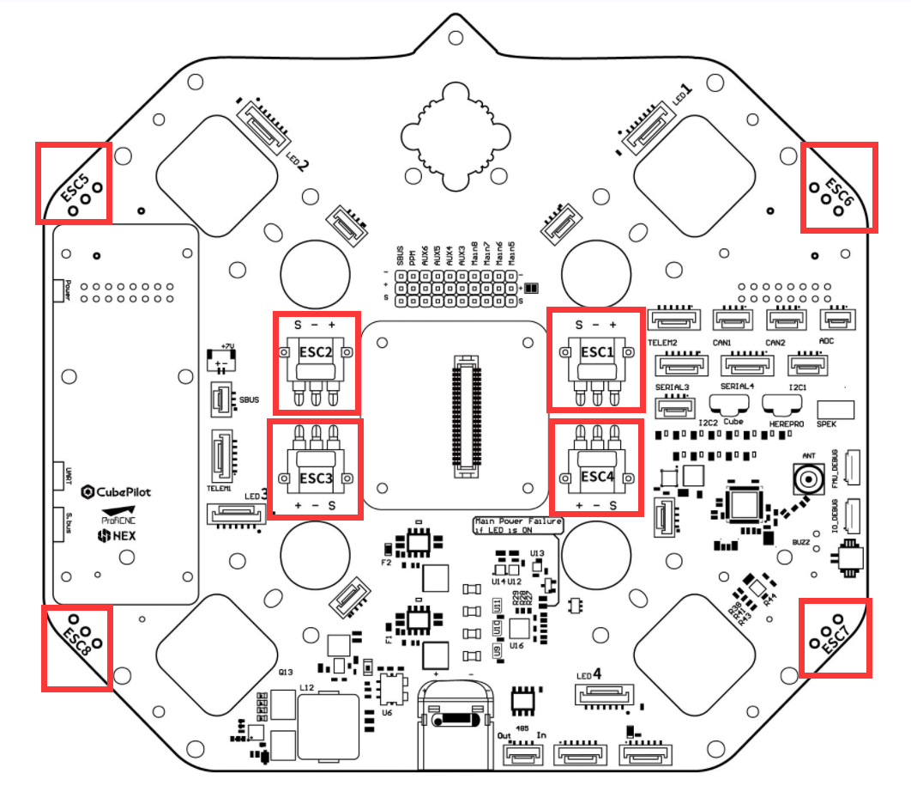
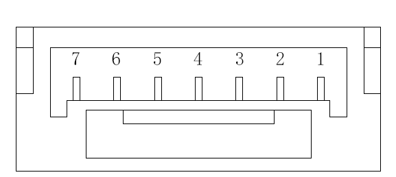
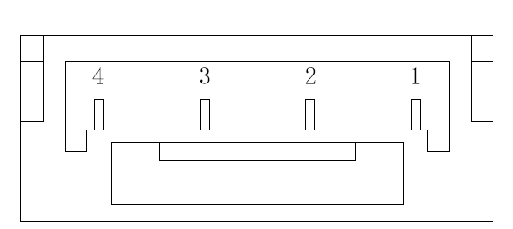
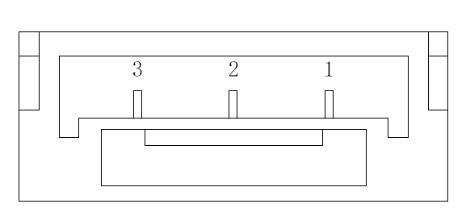
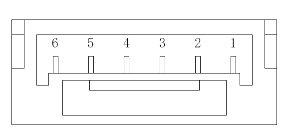
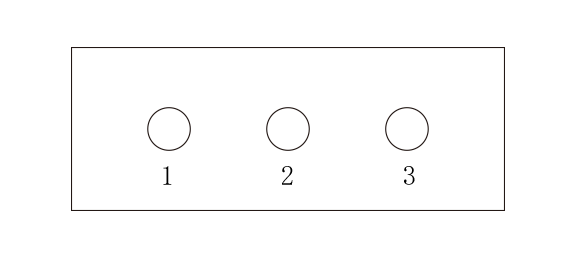

# EDU450 Carrier Board

<figure><figcaption></figcaption></figure>

## **Introduction**

The EDU-450 carrier board is a highly integrated component specifically designed to seamlessly integrate into the EDU450 drone frame. Its primary aim is to effectively minimize the common issues related to wire and module entanglement often experienced during multi-rotor assembly. This carrier board offers a range of features, including built-in power distribution, redundant power supplies for the autopilot, fail-over power selection built-in as a backup, a dedicated payload power regulator, and various other functionalities.

This carrier board is primarily designed with geometric optimization for quadcopters, X8 configurations, and octocopters in mind, it offers connections for all functions of The Cube autopilot. Consequently, this board can be seamlessly integrated into any vehicle type that is compatible with The Cube autopilot system.

## Features

* Up to 8-cell Lithium battery (36V)
* 100A continuous current
* Power and signal for ESCs
* 5V navigation light port
* Built-in power distribution unit
* Built-in Hall effect voltage and current sensor
* Redundant power supplies for flight critical components
* Built-in 5V/10A, 7V/1.5A BEC
* Main power Failure indicator lights
* Connectors for all functions of Cube
* 485 and SPI port

## Power

The carrier board incorporates a built-in voltage and Hall current sensor. The main battery can be connected to the XT60 "MAIN PWR" port on the board, removing the need for an external power brick.

The power distribution system is rated to distribute 100A in total to the ESCs when under stagnant, room-temperature air conditions.

If the EDU450 carrier board is installed within an enclosure or used in challenging conditions, such as high temperatures, the current capacity rating needs to be reduced. For vehicles operating consistently at high currents, conduct a ground test first by using a temperature gun to assess the thermal performance.

To ensure the built-in sensors on the EDU-450 board accurately read the voltage and current numbers, complete the following steps:

1. Go to Mission Planner.
2. Go to **Config/Tuning** -> **Full Parameter List**.
3. Configure the following parameters to the values shown below.

| Parameter          | Value |
| ------------------ | ----- |
| BATT\_AMP\_OFFSET  | 0.25  |
| BATT\_AMP\_PERVOLT | 50    |
| BATT\_CURR\_PIN    | 3     |
| BATT\_MONITOR      | 4     |
| BATT\_VOLT\_MULT   | 12.05 |
| BATT\_VOLT\_PIN    | 2     |

## Specification

Size：170 mm x 145 mm

Weight：185g（with carbon fiber plate）

## **Port Interface**

### RS485 & SPI

The carrier board introduces enhancements such as anti-interference capabilities, high-sensitivity RS485, and a full-duplex, high-speed, synchronous serial communication SPI interface. This interface can be used to connect with Profi-LED or a range of industrial equipment, thereby offering increased communication support for extended equipment and a broader spectrum of applications.

### Customized port for HerePro

The carrier board features a dedicated HerePro special interface designed to streamline data , debugging, and power supply functions into a single connection point, enhancing overall integration and reducing the need for excess wiring.

### ADS\_B External Antenna

The integrated ADS-B system is employed for receiving air traffic information, and it includes a standard SMA interface for user convenience. Users have the option to connect an external antenna to expand the data receiving range.

<figure><figcaption></figcaption></figure>

### HereLink Airunit installation

**Note: Please connect receiver to PPM（as picture showed），other 2 "SBUS" s are Sbus out**

<figure><figcaption></figcaption></figure>

### 5V BEC

The board can supply 5V to the Main and AUX rail by bridging the following pad with solder.

<figure><figcaption></figcaption></figure>

### ProfiLed

The carrier board has 4 built-in ProfiLed interfaces for the connection and control of navigation lights.

<figure><figcaption></figcaption></figure>

### ESC Port

ESCs used Amass-MR30 connector to power the motor and transmit PWM signal.

The 8 ESC port in total is available for multi-rotor UAVs with four and coaxial eight rotors.

<figure><figcaption></figcaption></figure>

## Pin identification

### ProfiLED

<figure><figcaption></figcaption></figure>

| Pin # | Name    |
| ----- | ------- |
| 1     | 5V\_LED |
| 2     | CI      |
| 3     | DI      |
| 4     | CO      |
| 5     | DO      |
| 6     | GND     |
| 7     | GND     |

### SPI

<figure><figcaption></figcaption></figure>

| Pin # | Name |
| ----- | ---- |
| 1     | 5V   |
| 2     | MOSI |
| 3     | MISO |
| 4     | SCK  |
| 5     | CS   |
| 6     | GND  |

### 485

<figure><figcaption></figcaption></figure>

| PIN | NAME |
| --- | ---- |
| 1   | Y    |
| 2   | Z    |
| 3   | B    |
| 4   | A    |

### I2C

<figure><figcaption></figcaption></figure>

| PIN | NAME        |
| --- | ----------- |
| 1   | VCC\_5V     |
| 2   | I2C\_2\_SCL |
| 3   | I2C\_2\_SDA |
| 4   | GND         |

### BUZZER

<figure><figcaption></figcaption></figure>

| PIN | NAME   |
| --- | ------ |
| 1   | BUZZER |
| 2   | GND    |

### SBUS

<figure><figcaption></figcaption></figure>

| PIN | NAME        |
| --- | ----------- |
| 1   | S.bus out 1 |
| 2   | S.bus out 2 |
| 3   | GND         |

### 5V (BEC POWER)

<figure><figcaption></figcaption></figure>

| PIN | NAME |
| --- | ---- |
| 1   | 5V   |
| 2   | 5V   |
| 3   | 5V   |
| 4   | GND  |
| 5   | GND  |
| 6   | GND  |

### CAN

<figure><figcaption></figcaption></figure>

| PIN# | NAME    |
| ---- | ------- |
| 1    | VCC\_5V |
| 2    | CAN\_H  |
| 3    | CAN\_L  |
| 4    | GND     |

### Serial（Uart）

<figure><figcaption></figcaption></figure>

**SERIAL 1 | Telem 1**

| Pin # | Name                |
| ----- | ------------------- |
| 1     | VCC\_5V             |
| 2     | SERIAL\_1\_TX       |
| 3     | SERIAL\_1\_RX       |
| 4     | SERIAL\_1\_CTS (TX) |
| 5     | SERIAL\_1\_RTS (RX) |
| 6     | GND                 |

**SERIAL 2 |Telem 2**

| Pin # | Name                |
| ----- | ------------------- |
| 1     | VCC\_5V             |
| 2     | SERIAL\_2\_TX       |
| 3     | SERIAL\_2\_RX       |
| 4     | SERIAL\_2\_CTS (TX) |
| 5     | SERIAL\_2\_RTS (RX) |
| 6     | GND                 |

**SERIAL 3**

| PIN# | NAME                |
| ---- | ------------------- |
| 1    | VCC\_5V             |
| 2    | SERIAL\_3\_TX       |
| 3    | SERIAL\_3\_RX       |
| 4    | SERIAL\_3\_CTS (TX) |
| 5    | SERIAL\_3\_RTS (RX) |
| 6    | GND                 |

**SERIAL4**

| PIN# | NAME                |
| ---- | ------------------- |
| 1    | VCC\_5V             |
| 2    | SERIAL\_4\_TX       |
| 3    | SERIAL\_4\_RX       |
| 4    | SERIAL\_4\_CTS (TX) |
| 5    | SERIAL\_4\_RTS (RX) |
| 6    | GND                 |

### ADC

<figure><figcaption></figcaption></figure>

| Pin # | Name              |
| ----- | ----------------- |
| 1     | VDD\_5V\_Periph   |
| 2     | Pressure sense in |
| 3     | GND               |

### Debug

<figure><figcaption></figcaption></figure>

**IO\_DEBUG**

| PIN | NAME  |
| --- | ----- |
| 1   | GND   |
| 2   | SWCLK |
| 3   | SWDIO |
| 4   | NC    |
| 5   | NC    |
| 6   | 5V    |

**FMU\_DEBUG**

| PIN | NAME  |
| --- | ----- |
| 1   | GND   |
| 2   | SWCLK |
| 3   | SWDIO |
| 4   | NC    |
| 5   | NC    |
| 6   | 5V    |

## Indication LED

### **Main power Failure if LED is ON**

<figure><figcaption></figcaption></figure>

**Page available for revision and updating through the Github link below:**\
[**https://github.com/CubePilot/cubepilot-docs/blob/master/carrier-boards/edu450-carrier-board.md**](edu450-carrier-board.md)

2023/09/21
