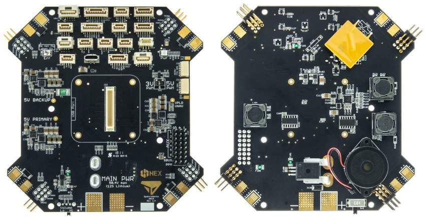

# Kore Carrier Board

## Introduction

The primary purpose of the Kore Multi-Rotor Carrier Board for The CUBE is to reduce the rat’s nest of wires and modules typically associated with a multi-rotor assembly. It provides built-in power distribution, redundant power supplies for the autopilot, built-in fail-over power selection, a separate payload power regulator, and many other features.

While this carrier board is geometrically optimized for quadcopters, X8 configurations, and octocopters, it provides connections for every function of The CUBE autopilot. Therefore, this board can be integrated into any vehicle type that is supported by The CUBE, including all other multi-rotor frame types, plane, rover, sub, and antenna tracker.

## Features At-A-Glance

* Up to 12-cell Lithium battery (50.4V)
* 140A continuous current with 280A surges
* Power and signal for ESCs conveniently located in corners
* 12V navigation light power available at each corner
* Built-in power distribution
* Built-in voltage and current sense
* Redundant power supplies for flight critical components
* Payload connectors with resettable fuses for 5V, 12V, and direct battery power
* Good power and error indicator lights
* Built-in buzzer with volume control
* Connectors for every function of The CUBE
* Easily accessible PWM voltage level selector (3.3V or 5V)
* Resistant to ground bounce on PWM signal
* Connector-compatible with standard ProfiCNC carrier board
* Connector ports for debugging IO and FMU processors

## Power

The system battery should be connected directly to the large pads labeled “MAIN PWR”. Pads are available on both top and bottom of the board. No external power brick is necessary, as voltage and current sense is done directly on the board. Pay special attention to the polarity symbols, as there is no reverse protection. Batteries up to 12S, or 50.4V, may be used.

The power distribution system is rated to supply 140A to the ESCs when exposed to stagnant air at room temperature, with surges up to 280A. If the board will have continuous airflow across it (exposed to prop wash during flight), significantly higher currents may be sourced. Alternatively, if the board will be mounted within an enclosure or if flown on a very hot day, it may be necessary to de-rate the current capacity. For users that expect to operate their vehicle continuously at high currents (over 100A), it is recommended that ground testing is done with a temperature gun prior to flight. The surface of the carrier board should never exceed 100°C.

In order to accurately read the voltage and current using the built-in sensors on the board, the following parameters should be set in The CUBE:

| Parameter          | Value |
| ------------------ | ----- |
| BATT\_AMP\_OFFSET  | 0.45  |
| BATT\_AMP\_PERVOLT | 50    |
| BATT\_CURR\_PIN    | 3     |
| BATT\_MONITOR      | 4     |
| BATT\_VOLT\_MULT   | 15.3  |
| BATT\_VOLT\_PIN    | 2     |

To set these parameters in mission planner, navigate to the **Config/Tuning -> Full Parameter List** Page.

* **Note:** If you are using a fresh installation of mission planner you will have to enable this page by setting **Config/Tuning->Planner->Layout** to **“Advanced”**

You may either type in these parameters manually, or download this [parameter file ](http://docs.spektreworks.com/assets/params/Multirotor\_PCB\_Power.param)and upload via mission planner. After inputting via either method, be sure to click “Write Params” to save the parameters in the Cube.

### General Use Payload Power Connectors

There are three general use payload power connectors to source power for external devices and payloads. They are labeled as J1, J14, and J19 in white ink on the board. Molex brand Clik-Mate connectors are used for the power connectors.

| Reference | Voltage         | Max Current | Pinout                 | Mating Part Number |
| --------- | --------------- | ----------- | ---------------------- | ------------------ |
| J1        | Battery Voltage | 3A          | 1-3: Battery, 4-6: GND | Molex 5023800600   |
| J14       | 5.3V            | 1.5A        | 1-2: 5.3V, 3-4: GND    | Molex 5023800400   |
| J19       | 12.2V           | 2A          | 1-2: 12.2V, 3-5: GND   | Molex 5023800500   |

The battery voltage and 5.3V power connectors are independently fused with resettable fuses. If a short occurs, the fuse will cut power to the offending connector. If this occurs, identify the short and remove it. Wait a couple of minutes and the fuse should reset. **The fuses may not react instantly and damage may occur to your carrier board if an external device has a short.** SpektreWorks is not responsible for damage caused by an external device.

The 12.2V power connector is **not** internally fused. It is highly recommended that the user fuse any external loads to prevent excessive current from damaging the carrier board.

### ESC Connections

At each corner of the board are solder pads for ESC power. The power wires from your ESCs may be soldered to the pads on the top or bottom surface.

Next to the ESC power pads are 3x3 0.1” header pins. The bottom row of pins provides power for navigation lights. The center pin is 12V and the right pin is ground. The left pin is unused and should be removed. **Make sure you do not plug in an ESC cable into the bottom row of this connector.**

The top two rows of pins are for the ESC PWM signal. These two rows correspond to two of the “Main Out” connections of The CUBE. The rows are labeled in white ink on the board. The “S”, “+”, and “-“ correspond to the PWM signal, power, and ground, respectively. All eight Main Out connections are available in the four corners of the board. It helps to look at the header pins from the side to see which row corresponds to which label.

By default, the board does not supply power to the ESC PWM connections. However, if no BEC is available to power the ESCs, the user may bridge JP1 with solder to provide 5.3V from the board to the ESCs. **If JP1 is bridged with solder, do not plug a BEC into the ESC connections.**

Most commercially available ESCs expect 3.3V PWM signals from the autopilot to control the motor. This is the default setting of a The CUBE. If, however, you require 5V PWM signals, there is a convenient switch for this on the carrier board. The switch is located on the right side of the board and is labeled “3V PWM” and “5V PWM”. Use a pen or a sharp tool to slide the switch to the desired voltage.

### Aux Pins

Additionally, the six “Aux Out” connections are available as part of a 3x8 group of headers on the right side of the board. Refer to the labels in white ink to identify each pin. By default, the board does not supply power to the center pins of the Aux channels. An external power supply connected to these pins will supply all of the Aux pins, but will be isolated from the rest of the board. If desired, the board can supply 5.3V to the Aux rail by bridging the pads of JP2 with solder. It is recommended to only use on-board power for low-noise and low-power devices. It is not recommended to use servo motors with on-board power. **If JP2 is bridged with solder, do not connect an external power supply to the Aux pins.**

## Motor Pin Assignments

The default Motor PWM pin arrangement of the carrier board was chosen for easy integration with a standard quadcopter. For other vehicle or frame types (including X8, Hex, Octo, etc), it is necessary to re-map the motor outputs to the correct corners of the board. This is possible for ArduCopter Firmware v3.5.0+.

When re-mapping PWM outputs with Ardupilot, it is important to distinguish the **motor number** from the **output number**. The **motor number** refers to the physical location of the motor, and does not change. The following graphics show the motor numbers used by the ArduCopter firmware.

The **output number** refers to the physical pin on each board that each motor is assigned to. These pins are on the corners of the board and are numbered “MAIN1” through “MAIN8”.

Any motor number can be re-mapped to any output. This is done by setting the SERVOX\_FUNCTION (where x is the output number) to the appropriate value given in the table below.

| Motor Number Desired | SERVORX\_FUNCTION Value |
| -------------------- | ----------------------- |
| 1                    | 33                      |
| 2                    | 34                      |
| 3                    | 35                      |
| 4                    | 36                      |
| 5                    | 37                      |
| 6                    | 38                      |
| 7                    | 39                      |
| 8                    | 40                      |

For example, if I wanted to plug Motor 3 into the MAIN5 connector on the board, I would set the SERVO5\_FUNCTION parameter to 35.

### Hex Setup

The following procedure may be used to configure the board for a hexacopter:

1. Flash the cube with ArduCopter 3.5.0 or later.
2. Connect to the cube in mission planner and navigate to the **Initial Setup -> Mandatory Hardware -> Frame Type** page.
3. Set the FRAME\_CLASS to Hexa
4. Reboot The CUBE
5. Navigate to the **Config/Tuning -> Full Parameter List** Page.
   * **Note:** If you are using a fresh installation of mission planner you will have to enable this page by setting **Config/Tuning->Planner->Layout** to **“Advanced”**
6. Set the following parameter values:
   * SERVO1\_FUNCTION=37
   * SERVO2\_FUNCTION=38
   * SERVO3\_FUNCTION=35
   * SERVO4\_FUNCTION=36
   * SERVO5\_FUNCTION=34
   * SERVO6\_FUNCTION=33
   * You may either type in these parameters manually, or download this [parameter file ](http://docs.spektreworks.com/assets/params/Multirotor\_PCB\_HEX.param)and upload via mission planner. After inputting via either method, be sure to click “Write Params” to save the parameters in the Cube.
7.  Connect your ESCs according to the following table using the motor numbers from the “Hexa X” picture above

    | Motor Number | Output |
    | ------------ | ------ |
    | 1            | MAIN6  |
    | 2            | MAIN5  |
    | 3            | MAIN3  |
    | 4            | MAIN4  |
    | 5            | MAIN1  |
    | 6            | MAIN2  |

### Octa Setup

The following procedure may be used to configure the board for a flat octacopter:

1. Flash the cube with ArduCopter 3.5.0 or later.
2. Connect to the cube in mission planner and navigate to the **Initial Setup -> Mandatory Hardware -> Frame Type** page.
3. Set the FRAME\_CLASS to Octa
4. Reboot The CUBE
5. Navigate to the **Config/Tuning -> Full Parameter List** Page.
   * **Note:** If you are using a fresh installation of mission planner you will have to enable this page by setting **Config/Tuning->Planner->Layout** to **“Advanced”**
6. Set the following parameter values:
   * SERVO1\_FUNCTION=33
   * SERVO2\_FUNCTION=34
   * SERVO3\_FUNCTION=39
   * SERV04\_FUNCTION=36
   * SERVO5\_FUNCTION=37
   * SERVO6\_FUNCTION=35
   * SERVO7\_FUNCTION=40
   * SERVO8\_FUNCTION=38
   * You may either type in these parameters manually, or download this [parameter file ](http://docs.spektreworks.com/assets/params/Multirotor\_PCB\_OCTA.param)and upload via mission planner. After inputting via either method, be sure to click “Write Params” to save the parameters in the Cube.
7.  Connect your ESCs according to the following table using the motor numbers from the “Octo X” picture above

    | Motor Number | Output |
    | ------------ | ------ |
    | 1            | MAIN1  |
    | 2            | MAIN2  |
    | 3            | MAIN6  |
    | 4            | MAIN4  |
    | 5            | MAIN5  |
    | 6            | MAIN8  |
    | 7            | MAIN3  |
    | 8            | MAIN7  |

### X-8 Setup

The following procedure may be used to configure the board for an X-8 (OctaQuad):

1. Flash the cube with ArduCopter 3.5.0 or later.
2. Connect to the cube in mission planner and navigate to the **Initial Setup -> Mandatory Hardware -> Frame Type** page.
3. Set the FRAME\_CLASS to OctaQuad
4. Reboot The CUBE
5. Navigate to the **Config/Tuning -> Full Parameter List** Page.
   * **Note:** If you are using a fresh installation of mission planner you will have to enable this page by setting **Config/Tuning->Planner->Layout** to **“Advanced”**
6. Set the following parameter values:
   * SERVO2\_FUNCTION=35
   * SERVO3\_FUNCTION=34
   * You may either type in these parameters manually, or download this [parameter file ](http://docs.spektreworks.com/assets/params/Multirotor\_PCB\_X8.param)and upload via mission planner. After inputting via either method, be sure to click “Write Params” to save the parameters in the Cube.
7.  Connect your ESCs according to the following table using the motor numbers from the “Octo X” picture above

    | Motor Number | Output |
    | ------------ | ------ |
    | 1            | MAIN1  |
    | 2            | MAIN3  |
    | 3            | MAIN2  |
    | 4            | MAIN4  |
    | 5            | MAIN5  |
    | 6            | MAIN6  |
    | 7            | MAIN7  |
    | 8            | MAIN8  |

## Digital and Analog Connectors 

The SpektreWorks carrier board comes with all of the same JST-brand receptacles as the standard ProfiCNC carrier board with a few exceptions. The tables below describe the pin-out of each JST connector.

### Telemetry 1

| Name | Label | Pins            |
| ---- | ----- | --------------- |
| TLM1 | J4    | 1. 5V           |
|      |       | 2. Serial 1 TX  |
|      |       | 3. Serial 1 RX  |
|      |       | 4. Serial 1 CTS |
|      |       | 5. Serial 1 RTS |
|      |       | 6. GND          |

### Telemetry 2

| Name | Label | Pins            |
| ---- | ----- | --------------- |
| TLM2 | J8    | 1. 5V           |
|      |       | 2. Serial 2 TX  |
|      |       | 3. Serial 2 RX  |
|      |       | 4. Serial 2 CTS |
|      |       | 5. Serial 2 RTS |
|      |       | 6. GND          |

### GPS1 (SER3/I2C1)

| Name      | Label | Pins             |
| --------- | ----- | ---------------- |
| SER3/I2C1 | J2    | 1. 5V            |
|           |       | 2. Serial 3 TX   |
|           |       | 3. Serial 3 RX   |
|           |       | 4. SCL1          |
|           |       | 5. SDA1          |
|           |       | 6. Safety Button |
|           |       | 7. Safety LED    |
|           |       | 8. GND           |

### GPS2 (SER4/I2C2)

| Name       | Label | Pins           |
| ---------- | ----- | -------------- |
| SER4/ I2C2 | J18   | 1. 5V          |
|            |       | 2. Serial 4 TX |
|            |       | 3. Serial 4 RX |
|            |       | 4. SCL2        |
|            |       | 5. SDA2        |
|            |       | 6. GND         |

### I2C1

| Name | Label | Pins    |
| ---- | ----- | ------- |
| I2C1 | J3    | 1. 5V   |
|      |       | 2. SCL1 |
|      |       | 3. SDA1 |
|      |       | 4. GND  |

### I2C2

| Name | Label | Pins    |
| ---- | ----- | ------- |
| I2C2 | J7    | 1. 5V   |
|      | J15   | 2. SCL1 |
|      |       | 3. SDA1 |
|      |       | 4. GND  |

### CAN1

| Name | Label | Pins       |
| ---- | ----- | ---------- |
| CAN1 | J16   | 1. 5V      |
|      |       | 2. CAN1\_H |
|      |       | 3. CAN1\_L |
|      |       | 4. GND     |

### CAN2

| Name | Label | Pins       |
| ---- | ----- | ---------- |
| CAN2 | J6    | 1. 5V      |
|      |       | 2. CAN2\_H |
|      |       | 3. CAN2\_L |
|      |       | 4. GND     |

### SPI

| Name | Label | Pins     |
| ---- | ----- | -------- |
| SPI  | J5    | 1. 5V    |
|      |       | 2. SCK   |
|      |       | 3. MISO  |
|      |       | 4. MOSI  |
|      |       | 5. \~NSS |
|      |       | 6. DRDY  |
|      |       | 7. GND   |

Note: The SPI port will likely be removed in future versions of this carrier board.

### ADC

| Name | Label | Pins       |
| ---- | ----- | ---------- |
| ADC  | J13   | 1. 5V      |
|      |       | 2. ADC\_IN |
|      |       | 3. NC      |
|      |       | 4. GND     |

The ADC\_IN input voltage is divided by two using a symmetric 10kΩ voltage divider on the board. Do not exceed analog voltages above 6.6V on this pin.

### BATT2 Sense

| Name        | Label | Pins                     |
| ----------- | ----- | ------------------------ |
| BATT2 SENSE | J17   | 1. 5V                    |
|             |       | 2. BATT2\_Volt\_Sense    |
|             |       | 3. BATT2\_Current\_Sense |
|             |       | 4. GND                   |

In order to use the BATT2\_Volt\_Sense pin, a user-selected resistor must be soldered to the board. Use the following equation to select the resistor value:

Where Vmax is the maximum voltage expected on this pin. R will be the resistance in Ohms. Once this value is calculated, a common through hole style resistor should soldered to the space labeled R46 on the bottom surface of the board.

.png>)

In order for The CUBE to accurately read the secondary voltage, the BATT2\_VOLT\_MULT parameter must be set. It can be calculated using the following equation:

### Debug

Two Debug connectors are provided for developer use. One debug header is provided for each process on The CUBE.

Connector is JST brand and mates with SHR-06V-S-B or SHR-06V-S

| Name         | Label | Pins           |
| ------------ | ----- | -------------- |
| SER5/FMU DBG | J20   | 1. 3.3V        |
|              |       | 2. Serial 5 TX |
|              |       | 3. Serial 5 RX |
|              |       | 4. FMU-SWDIO   |
|              |       | 5. FMU-SWCLK   |
|              |       | 6. GND         |

| Name   | Label | Pins                  |
| ------ | ----- | --------------------- |
| IO DBG | J21   | 1. 3.3V               |
|        |       | 2. IO-SERIAL1\_TX     |
|        |       | 3. DSM/IO-SERIAL1\_RX |
|        |       | 4. IO-SWDIO           |
|        |       | 5. IO-SWCLK           |
|        |       | 6. GND                |

## Indicator Lights 

The carrier board has two indicator lights on the top surface labeled “Pwr” and “Err”.

**Pwr Light:** There are two independent 5V regulators that provide power to the autopilot and other peripherals. This light will shine blue if and only if both regulators are working. **Do not fly if this light is not blue.**

**Err Light:** If one of the two regulators has failed, this light will shine red. **Do not fly if this light is red.**

## Buzzer and Volume Control 

The carrier board comes with a piezoelectric buzzer mounted on the underside of the board. No external buzzer is required. For safety reasons, do not mount the board on your vehicle in a manner that causes the buzzer to be muffled.

The carrier board features a volume control switch located at the front edge of the board. When the switch is pushed to the right, the buzzer will be at full, ear-splitting volume. When pushed to the left, the volume is reduced. For safety reasons, never fly with the switch at the lower volume.

## Mechanical Information

### Mass

79g without Cube 108g with Cube

### Outer Dimensions

### Mounting Hole Locations

## Errata

The pins on connector J3 should be labeled “SCL1” and “SDA1”, not “SCL2” and “SDA2”. The label “I2C1” next to the connector is correct.

## Disclaimer 

Due to the complex nature of any drone vehicle, there are many causes of failure that may result in damaged components. SpektreWorks cannot warranty the carrier board against damage caused by external devices (ESCs, motors, peripherals, etc.) or due to a crash. SpektreWorks will replace a carrier board that has a manufacturer defect within 30 days of purchase.
