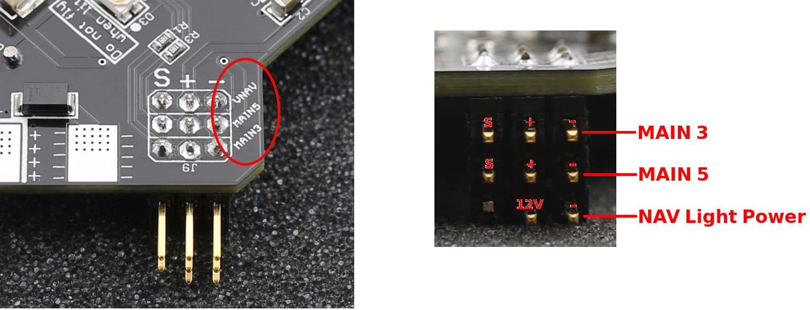
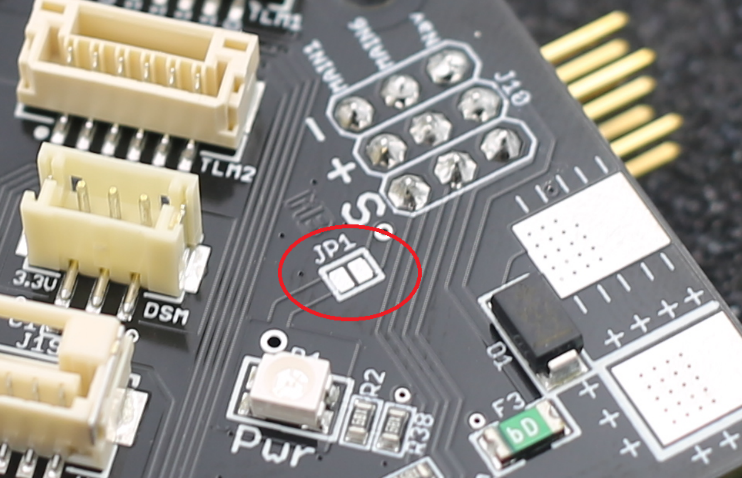
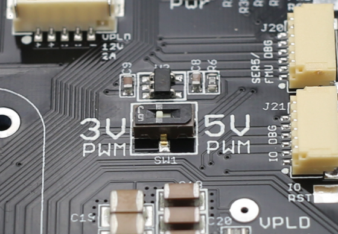
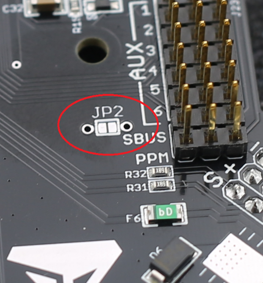
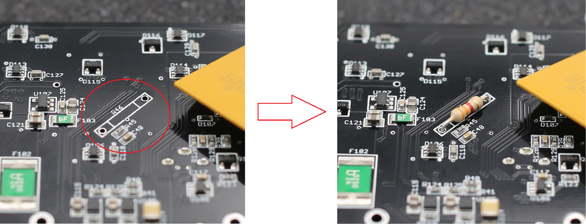

# Kore Carrier Board

## Introduction

The primary purpose of the Kore Multi-Rotor Carrier Board is to minimize the entangled wiring and modules typically associated with a multi-rotor assembly. It provides many features, such as built-in power distribution, redundant power supplies for the autopilot, built-in fail-over power selection, and a separate payload power regulator.

Although this carrier board is geometrically optimized for quadcopters, X8 configurations, and octocopters, it provides connections that can support the various functions supported by The CUBE. Thus, it can be integrated into any vehicle type supported by The Cube, which includes various multi-rotor frame types, planes, rovers, submarines, and antenna trackers.

## Features

* Up to 12-cell Lithium battery (50.4V)
* 140A continuous current with 280A surges
* Power and signal for ESCs located at the corners
* 12V navigation light power available at each corner
* Built-in power distribution
* Built-in voltage and current sense
* Redundant power supplies for flight critical components
* Payload connectors with resettable fuses for 5V, 12V, and direct battery power
* Power Good and Power Error indicator lights
* Built-in buzzer with volume control
* Connectors for every function of The Cube
* Easily accessible PWM voltage level selector (3.3V or 5V)
* Resistant to ground bounce on PWM signal
* Connector-compatible with Standard carrier board
* Connector ports for debugging I/O and FMU processors

## Power

The system battery should be connected directly to the large pads labeled “MAIN PWR”. These Pads are located at the top and bottom of the board. No external power brick is necessary, as voltage and current sense is done directly on the board. Pay special attention to the polarity symbols, as there is no reverse protection. Batteries up to 12S or 50.4V can be used.

The power distribution system is rated to supply 140A to the ESCs when exposed to stagnant room-temperature air, with current surges reaching up to 280A. If the board encounters continuous airflow (exposed to prop wash during flight), significantly higher currents can be supported. Alternatively, if the board is mounted within an enclosure or if flown on a very hot day, it may be necessary to de-rate the current capacity. For users that expect to operate the vehicle continuously at high currents (over 100A), conduct ground testing with a temperature gun prior to flight. The surface of the carrier board should never exceed 100°C.

## Ensuring the Built-In Sensors Accurately Read the Voltage and Current

Some parameters need to be configured to ensure the built-in sensors on the board accurately read the voltage and current. See below for the steps:&#x20;

### **Method 1**

1. Open Mission Planner.&#x20;
2. Connect The Cube to Mission Planner.&#x20;
3. If Mission Planner was just installed, click **Config** -> **Planner** and select **"**_**Advanced**_**"** for the **Layout.**&#x20;
4. Click **Config** -> **Full Parameter List.**
5. Download this [parameter file](http://docs.spektreworks.com/assets/params/Multirotor_PCB_Power.param).
6. Click **Load from file** to upload the file to Mission Planner.

<figure><figcaption></figcaption></figure>

7. Click **Write Params**.

<figure><figcaption></figcaption></figure>

8. Reboot The Cube.

### **Method 2**

1. Open Mission Planner.&#x20;
2. Connect The Cube to Mission Planner.
3. If Mission Planner was just installed, click **Config** -> **Planner** and select **"**_**Advanced**_**"** for the **Layout.**&#x20;
4. Click **Config** -> **Full Parameter List.**
5. Configure the BATT\_Monitor value to "4".&#x20;

<figure><figcaption></figcaption></figure>

6. Click **Write Params**.

<figure><figcaption></figcaption></figure>

7. Reboot The Cube.&#x20;
8. Click **Config** -> **Full Parameter List.**
9. Set the following parameters to the values shown in the table.

| Parameter          | Value |
| ------------------ | ----- |
| BATT\_AMP\_OFFSET  | 0.45  |
| BATT\_AMP\_PERVOLT | 50    |
| BATT\_CURR\_PIN    | 3     |
| BATT\_VOLT\_MULT   | 15.3  |
| BATT\_VOLT\_PIN    | 2     |

10. Click **Write Params**.

### General Use Payload Power Connectors

Three general-purpose power connectors, labeled J1, J14, and J19, are provided to supply power to external devices and payloads. Molex Clik-Mate power connectors are used.

| Reference | Voltage         | Max Current | Pinout                 | Mating Part Number |
| --------- | --------------- | ----------- | ---------------------- | ------------------ |
| J1        | Battery Voltage | 3A          | 1-3: Battery, 4-6: GND | Molex 5023800600   |
| J14       | 5.3V            | 1.5A        | 1-2: 5.3V, 3-4: GND    | Molex 5023800400   |
| J19       | 12.2V           | 2A          | 1-2: 12.2V, 3-5: GND   | Molex 5023800500   |

The battery voltage and 5.3V power connectors are independently fused with resettable fuses. If a short circuit occurs, the fuse will cut power to the affected connector. When this happens, complete the following steps:

1. Remove the power source that is providing the excessive current.
2. Wait for a couple of minutes for the fuse to reset.


If the external device uses too much current and the fuse does not immediately cut power, it may damage the carrier board. Cubepilot is not responsible for any damage caused by external devices.


### ESC Connections

Solder pads for ESC power are located at each corner of the board. The power wires from the ESCs can be soldered to the pads on either the top or bottom of the board.

Next to the ESC power pads are 3x3 0.1” header pins. The bottom row of these pins provides power for navigation lights.&#x20;

* **Right pin**: Ground
* **Center pin**: Supplies 12V
* **Left pin**: Unused and should be removed.


Do not plug an ESC cable into the bottom row of this connector.


The top two rows of pins are for the ESC PWM signal. These pins correspond to two of the **Main Out** connections of The Cube.&#x20;

* S: PWM signal
* +: Power
* \-: Ground

All eight Main Out connections are available at the four corners of the board. Check the header pins from the side to determine which row corresponds to which label.

By default, the board does not supply power to the ESC PWM connections. However, if no BEC is available to power the ESCs, bridge JP1 with solder to provide 5.3V from the board to the ESCs.&#x20;


Do not plug a BEC into the ESC connections when JP1 is bridged with solder.


Most commercially available ESCs expect 3.3V PWM signals from the autopilot to control the motor. This is the default setting of The CUBE. To change to 5V PWM signals, use a pen or a pointed tool to move the switch, which is located on the right side of the board and labeled as **3V PWM** / **5V PWM**.&#x20;

### Aux Pins

There are six “Aux Out” connections located within a 3x8 group of headers on the right side of the board. The pins are labeled for easy identification. By default, the board does not supply power to the center pins of the Aux channels. An external power supply connected to these pins will supply power to all the Aux pins, but it will be isolated from the rest of the board. Alternatively, by bridging the pads of JP2 with solder, the board can provide 5.3V to the Aux rail.


* Use on-board power only for low-noise and low-power devices.
* Do not use servo motors with on-board power.
* Do not connect an external power supply to the Aux pins if JP2 is bridged with solder.


| Pin Label | Description |
| --------- | ----------- |
| SBUS      | SBUS Out    |
| PPM       | Rcin        |

## Motor Pin Assignments

By default, the Motor PWM pins on the carrier board are arranged for easy integration with a standard quadcopter. For other vehicle or frame types (including X8, Hex, Octo, etc.), it is necessary to re-map the motor outputs to the correct corners on the board. This can be done using ArduCopter Firmware v3.5.0 or above.

When re-mapping PWM outputs with Ardupilot, it is important to distinguish the motor number from the output number.

**Motor number**: Refers to the physical location of the motor and does not change. The following graphic shows the motor numbers used by the ArduCopter firmware.

**Output number**: Refers to the physical pin on the board to which each motor is assigned. These pins are labeled "MAIN1" to "MAIN8" and are located on the board's corners.

Any motor number can be re-mapped to any output. This is done by setting the SERVOX\_FUNCTION (where x is the output number) to the appropriate value shown in the table below.

| Required Motor Number | SERVORX\_FUNCTION Value |
| --------------------- | ----------------------- |
| 1                     | 33                      |
| 2                     | 34                      |
| 3                     | 35                      |
| 4                     | 36                      |
| 5                     | 37                      |
| 6                     | 38                      |
| 7                     | 39                      |
| 8                     | 40                      |

For example, to plug Motor 3 into the MAIN5 connector on the board, set the SERVO5\_FUNCTION parameter to 35.

### Hexa Setup

To configure the carrier board for a hexacopter, complete the following steps:

1. Mount The Cube to the carrier board.
2. Open Mission Planner.&#x20;
3. Connect The Cube to Mission Planner.
4. If Mission Planner was just installed, click **Config** -> **Planner** and select **"**_**Advanced**_**"** for the **Layout.**&#x20;
5. Flash The Cube with ArduCopter 3.5.0 or above.
6. Click **Setup** -> **Mandatory Hardware -> Frame Type**.
7. Select the frame picture with six motors arranged in a radial pattern for the **Frame Class** and choose a **Frame Type**.&#x20;

<figure><figcaption></figcaption></figure>

8. Reboot The CUBE
9. Click **Config** -> **Full Parameter List**.
10. Set the following parameters to the values shown in the table below. This can be done in two ways:

    * Enter the values manually.
    * Download this [parameter file ](http://docs.spektreworks.com/assets/params/Multirotor_PCB_HEX.param)and then click **Load from file** to upload it to Mission Planner.&#x20;

    <figure><figcaption></figcaption></figure>

| Parameter        | Value |
| ---------------- | ----- |
| SERVO1\_FUNCTION | 37    |
| SERVO2\_FUNCTION | 38    |
| SERVO3\_FUNCTION | 35    |
| SERVO4\_FUNCTION | 36    |
| SERVO5\_FUNCTION | 34    |
| SERVO6\_FUNCTION | 33    |

11. Click **Write Params**.

<figure><figcaption></figcaption></figure>

12. Reboot The Cube.
13. Connect the ESCs, as shown in the table below.

| Motor Number | Output |
| ------------ | ------ |
| 1            | MAIN6  |
| 2            | MAIN5  |
| 3            | MAIN3  |
| 4            | MAIN4  |
| 5            | MAIN1  |
| 6            | MAIN2  |

### Octa Setup

To configure the carrier board for a flat octacopter, complete the following steps:

1. Mount The Cube to the carrier board.
2. Open Mission Planner.&#x20;
3. Connect The Cube to Mission Planner.
4. If Mission Planner was just installed, click **Config** -> **Planner** and select **"**_**Advanced**_**"** for the **Layout.**&#x20;
5. Flash The Cube with ArduCopter 3.5.0 or above.
6. Click **Setup** -> **Mandatory Hardware -> Frame Type**.
7. Select the frame picture with eight motors arranged in a radial pattern for the **Frame Class** and choose a **Frame Type**.&#x20;

<figure><figcaption></figcaption></figure>

8. Reboot The CUBE.
9. Click **Config** -> **Full Parameter List**.
10. Set the following parameters to the values shown in the table below. This can be done in two ways:

    * Enter the values manually.
    * Download this [parameter file ](http://docs.spektreworks.com/assets/params/Multirotor_PCB_OCTA.param)and then click **Load from file** to upload it to Mission Planner.&#x20;

    <figure><figcaption></figcaption></figure>

| Parameter        | Value |
| ---------------- | ----- |
| SERVO1\_FUNCTION | 33    |
| SERVO2\_FUNCTION | 34    |
| SERVO3\_FUNCTION | 39    |
| SERV04\_FUNCTION | 36    |
| SERVO5\_FUNCTION | 37    |
| SERVO6\_FUNCTION | 35    |
| SERVO7\_FUNCTION | 40    |
| SERVO8\_FUNCTION | 38    |

11. Click **Write Params**.

<figure><figcaption></figcaption></figure>

12. Reboot The Cube.
13. Connect the ESCs, as shown in the table below.

| Motor Number | Output |
| ------------ | ------ |
| 1            | MAIN1  |
| 2            | MAIN2  |
| 3            | MAIN6  |
| 4            | MAIN4  |
| 5            | MAIN5  |
| 6            | MAIN8  |
| 7            | MAIN3  |
| 8            | MAIN7  |

### X-8 Setup

To configure the carrier board for an X-8 (OctaQuad), complete the following steps:

1. Mount The Cube to the carrier board.
2. Open Mission Planner.&#x20;
3. Connect The Cube to Mission Planner.
4. If Mission Planner was just installed, click **Config** -> **Planner** and select **"**_**Advanced**_**"** for the **Layout.**&#x20;
5. Flash The Cube with ArduCopter 3.5.0 or above.
6. Click **Setup** -> **Mandatory Hardware** -> **Frame Type**.
7. Select the frame picture with eight motors arranged in a square pattern, with one motor stacked on top of another at each corner. Then, choose a **Frame Type**.&#x20;

<figure><figcaption></figcaption></figure>

8. Reboot The CUBE.
9. Click **Config** -> **Full Parameter List**.
10. Set the following parameters to the values shown in the table below. This can be done in two ways:

    * Enter the values manually.
    * Download this [parameter file](http://docs.spektreworks.com/assets/params/Multirotor_PCB_X8.param)and then click **Load from file** to upload it to Mission Planner.&#x20;

    <figure><figcaption></figcaption></figure>

| Parameter        | Value |
| ---------------- | ----- |
| SERVO2\_FUNCTION | 35    |
| SERVO3\_FUNCTION | 34    |

11. Click **Write Params**.

<figure><figcaption></figcaption></figure>

12. Reboot The Cube.
13. Connect the ESCs, as shown in the table below.

| Motor Number | Output |
| ------------ | ------ |
| 1            | MAIN1  |
| 2            | MAIN3  |
| 3            | MAIN2  |
| 4            | MAIN4  |
| 5            | MAIN5  |
| 6            | MAIN6  |
| 7            | MAIN7  |
| 8            | MAIN8  |

## Digital and Analog Connectors 

The Kore carrier board has the same JST-brand receptacles as the standard carrier board, with a few exceptions. The tables below show the pin-out of each JST connector.

### Telemetry 1

| Name | Label | Pins            |
| ---- | ----- | --------------- |
| TLM1 | J4    | 1. 5V           |
|      |       | 2. Serial 1 TX  |
|      |       | 3. Serial 1 RX  |
|      |       | 4. Serial 1 CTS |
|      |       | 5. Serial 1 RTS |
|      |       | 6. GND          |

### Telemetry 2

| Name | Label | Pins            |
| ---- | ----- | --------------- |
| TLM2 | J8    | 1. 5V           |
|      |       | 2. Serial 2 TX  |
|      |       | 3. Serial 2 RX  |
|      |       | 4. Serial 2 CTS |
|      |       | 5. Serial 2 RTS |
|      |       | 6. GND          |

### GPS1 (SER3/I2C1)

| Name      | Label | Pins             |
| --------- | ----- | ---------------- |
| SER3/I2C1 | J2    | 1. 5V            |
|           |       | 2. Serial 3 TX   |
|           |       | 3. Serial 3 RX   |
|           |       | 4. SCL1          |
|           |       | 5. SDA1          |
|           |       | 6. Safety Button |
|           |       | 7. Safety LED    |
|           |       | 8. GND           |

### GPS2 (SER4/I2C2)

| Name       | Label | Pins           |
| ---------- | ----- | -------------- |
| SER4/ I2C2 | J18   | 1. 5V          |
|            |       | 2. Serial 4 TX |
|            |       | 3. Serial 4 RX |
|            |       | 4. SCL2        |
|            |       | 5. SDA2        |
|            |       | 6. GND         |

### I2C1

| Name | Label | Pins    |
| ---- | ----- | ------- |
| I2C1 | J3    | 1. 5V   |
|      |       | 2. SCL1 |
|      |       | 3. SDA1 |
|      |       | 4. GND  |

### I2C2

| Name | Label | Pins    |
| ---- | ----- | ------- |
| I2C2 | J7    | 1. 5V   |
|      | J15   | 2. SCL1 |
|      |       | 3. SDA1 |
|      |       | 4. GND  |

### CAN1

| Name | Label | Pins       |
| ---- | ----- | ---------- |
| CAN1 | J16   | 1. 5V      |
|      |       | 2. CAN1\_H |
|      |       | 3. CAN1\_L |
|      |       | 4. GND     |

### CAN2

| Name | Label | Pins       |
| ---- | ----- | ---------- |
| CAN2 | J6    | 1. 5V      |
|      |       | 2. CAN2\_H |
|      |       | 3. CAN2\_L |
|      |       | 4. GND     |

### SPI

| Name | Label | Pins     |
| ---- | ----- | -------- |
| SPI  | J5    | 1. 5V    |
|      |       | 2. SCK   |
|      |       | 3. MISO  |
|      |       | 4. MOSI  |
|      |       | 5. \~NSS |
|      |       | 6. DRDY  |
|      |       | 7. GND   |


The SPI port is expected to be removed in future versions of this carrier board.


### ADC

| Name | Label | Pins       |
| ---- | ----- | ---------- |
| ADC  | J13   | 1. 5V      |
|      |       | 2. ADC\_IN |
|      |       | 3. NC      |
|      |       | 4. GND     |


The ADC\_IN input voltage is divided by two using a symmetric 10kΩ voltage divider on the board. Do not exceed analog voltages above 6.6V on this pin.


### BATT2 Sense

| Name        | Label | Pins                     |
| ----------- | ----- | ------------------------ |
| BATT2 SENSE | J17   | 1. 5V                    |
|             |       | 2. BATT2\_Volt\_Sense    |
|             |       | 3. BATT2\_Current\_Sense |
|             |       | 4. GND                   |

In order to use the BATT2\_Volt\_Sense pin, a user-selected resistor must be soldered to the board. Use the following equation to determine the resistor value:

* **Vmax**: Maximum voltage expected on this pin.
* **R**: Resistance (Ohms)

When the value is calculated, a common through-hole style resistor should be soldered to the space labeled R46 underneath the board.

For The CUBE to accurately read the secondary voltage, the BATT2\_VOLT\_MULT parameter must be set. Use the following equation to calculate the value.&#x20;

### Debug

Two debug connectors are provided for developer use. One debug header is provided for each processer on The CUBE.

The connector is from the JST brand and mates with SHR-06V-S-B or SHR-06V-S.

| Name         | Label | Pins           |
| ------------ | ----- | -------------- |
| SER5/FMU DBG | J20   | 1. 3.3V        |
|              |       | 2. Serial 5 TX |
|              |       | 3. Serial 5 RX |
|              |       | 4. FMU-SWDIO   |
|              |       | 5. FMU-SWCLK   |
|              |       | 6. GND         |

| Name   | Label | Pins                  |
| ------ | ----- | --------------------- |
| IO DBG | J21   | 1. 3.3V               |
|        |       | 2. IO-SERIAL1\_TX     |
|        |       | 3. DSM/IO-SERIAL1\_RX |
|        |       | 4. IO-SWDIO           |
|        |       | 5. IO-SWCLK           |
|        |       | 6. GND                |

## Indicator Lights 

The carrier board has two indicator lights on the top surface labeled “Pwr” and “Err”.

**Pwr Light:** Two independent 5V regulators provide power to The Cube and other peripherals. A constant blue light indicates both regulators are working.&#x20;

**Err Light:** A constant red light indicates one of the two regulators has failed.&#x20;


* Do not fly the vehicle if the blue Pwr Light is not lit.
* Do not fly the vehicle if the Err Light is lit.&#x20;


## Buzzer and Volume Control 

The carrier board includes a piezoelectric buzzer mounted on its underside. Thus, no external buzzer is needed.&#x20;


Do not mount the board onto the vehicle in a way that muffles the buzzer sound.


The carrier board has a volume control switch located at the front edge.&#x20;

* **Switch moved to the right**: Buzzer volume is at maximum volume.&#x20;
* **Switch moved to the left**: Buzzer volume is at a reduced level. &#x20;


Never fly the vehicle with the buzzer volume set to a reduced level. &#x20;


## Mechanical Information

### Mass

* **Without The Cube**: 79g
* **With The Cube**: 108g

### Outer Dimensions

### Mounting Hole Locations

## Errata

The pins on connector J3 should be labeled “SCL1” and “SDA1”, not “SCL2” and “SDA2”. The label “I2C1” next to the connector is correct. The l"SBUS" label refers to SBUS out, and the "PPM" label denotes Rcin.

## Disclaimer 

Due to the complex nature of any drone vehicle, there are many causes of failure that may result in damaged components. SpektreWorks does not warranty the carrier board against damage caused by external devices (ESCs, motors, peripherals, etc.) or due to a crash. SpektreWorks will replace a carrier board that has a manufacturer defect within 30 days of purchase.

The following Github link can be used to revise and update the Kore carrier board informatio&#x6E;**:** \
[**https://github.com/CubePilot/cubepilot-docs/blob/master/carrier-boards/kore-carrier-board.md**](kore-carrier-board.md)
