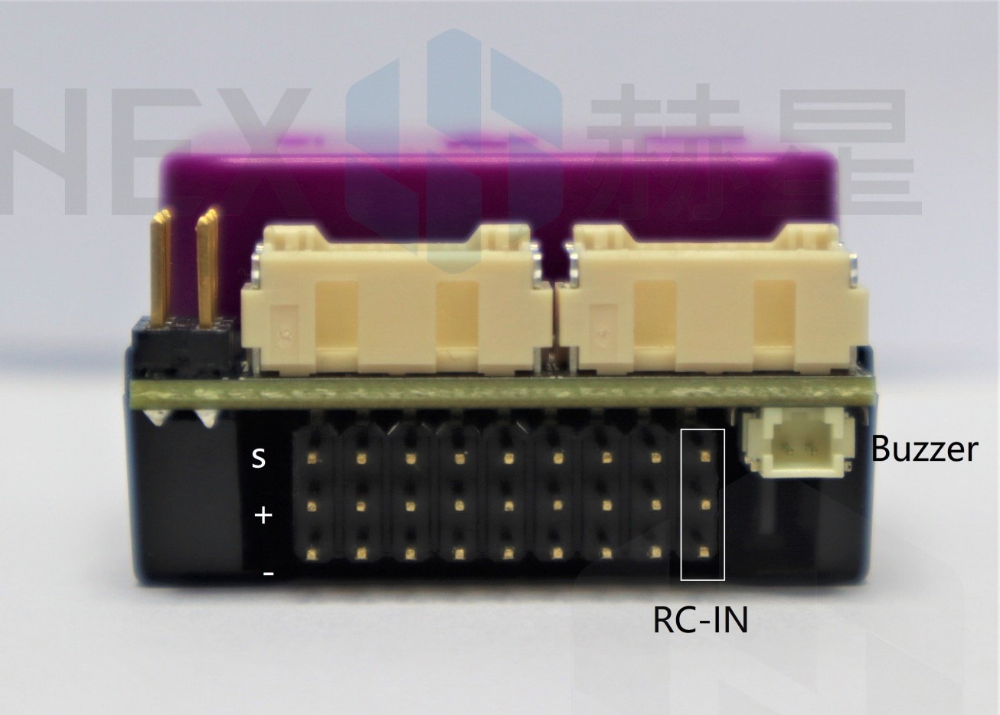
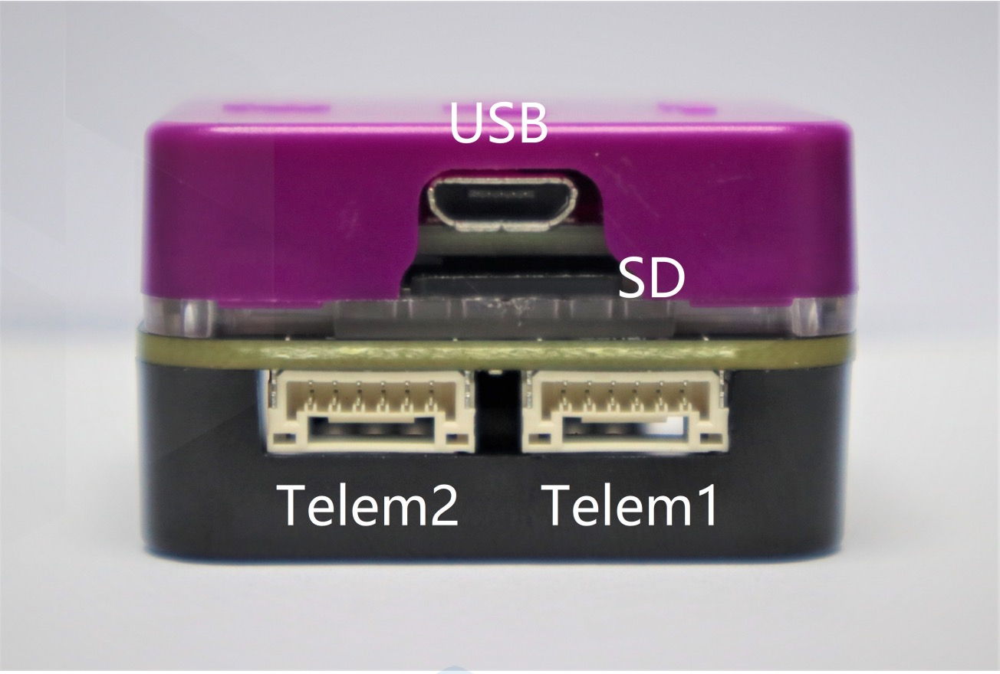
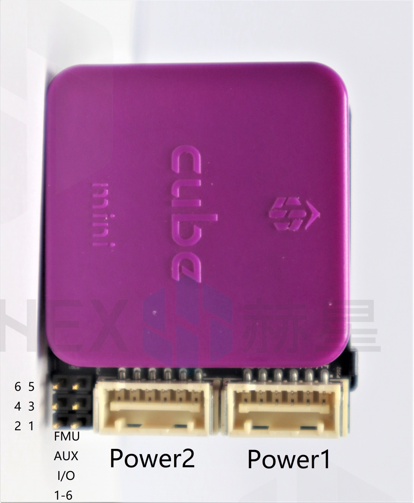
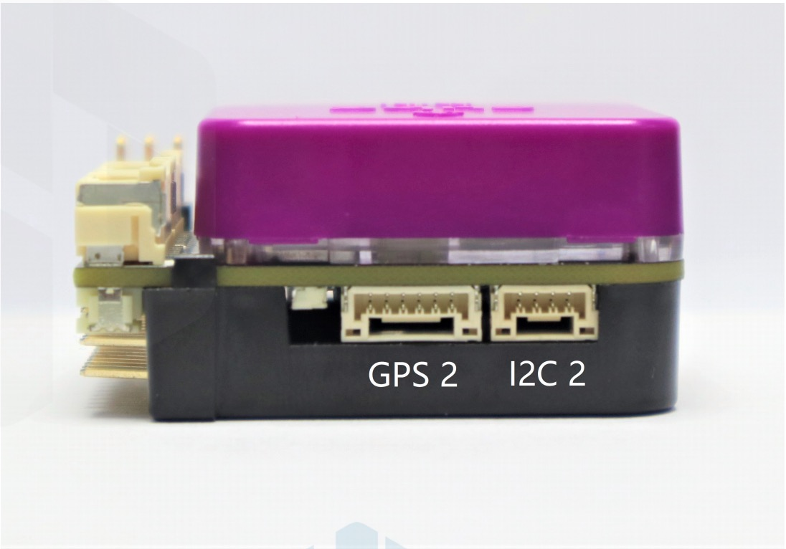

# Mini Carrier Board

### Working Conditions and Performance

| About | Description |
| :--- | :--- |
| POWER input voltage / rated input current | 4-5.7V / 2.5A; 0-20V is safe for the system but it will not work |
| POWER rated output / input power | 14 W |
| USB port input voltage / rated input current | 4-5.7V / 250mA |
| Servo rail input voltage | 4-10.5V |
| Waterproof | Not waterproof. External waterproof protection is needed |
| Working temperature | -10°C / 55°C |

### Size and Specifications

| Type | Description |
| :--- | :--- |
| Mini Carrier Board Size / Chassis Material | 47.5x38.5x17.8 \(mm\) / ABS Molding |
|  |  |

### Interfaces and Definitions

Pinout

Red dot on plug side denotes pin 1

### Mini Carrier Board Interface Model

| Ports | Corresponding Connecter Model |
| :--- | :--- |
| GPS1 | JST-GH 1.25 mm \(8-pin\) |
| GPS2 | JST-GH 1.25 mm \(6-pin\) |
| TELEM1 | JST-GH 1.25 mm \(6-pin\) |
| TELEM2 | JST-GH 1.25 mm \(6-pin\) |
| I2C | JST-GH 1.25 mm \(4-pin\) |
| CAN2 | JST-GH 1.25 mm \(4-pin\) |
| POWER1 | Molex CLIK-Mate 2 mm \(6-pin\) |
| POWER2 | Molex CLIK-Mate 2 mm \(6-pin\) |
| BUZZER | DF13 1.25 mm \(2-pin\) |

### Mini Cube 80-pin DF17 Connector Assignments \(same as the Cube Black\)

| Pin\# | Name | Direction | Description |
| :--- | :--- | :--- | :--- |
| 1 | FMU\_SWDIO | I/O | FMU serial wire debug I/O |
| 2 | FMU\_LED\_AMBER | O | Boot error LED \(drive only, controlled by FET\) |
| 3 | FMU\_SWCLK | O | FMU serial wire debug clock |
| 4 | I2C\_2\_SDA | I/O | I2C data I/O |
| 5 | EXTERN\_CS | O | Chip select for external SPI \(NC, just for debugging\) |
| 6 | I2C\_2\_SCL | O | I2C clock |
| 7 | FMU\_!RESET | I | Reset pin for the FMU |
| 8 | PROT\_SPARE\_1 |  | Spare |
| 9 | VDD\_SERVO\_IN | I | Power for last resort I/O failsafe |
| 10 | PROT\_SPARE\_2 |  | Spare |
| 11 | EXTERN\_DRDY | I | Interrupt pin for external SPI \(NC, just for debugging\) |
| 12 | SERIAL\_5\_RX | I | UART 5 RX \(Receive Data\) |
| 13 | GND |  | System GND |
| 14 | SERIAL\_5\_TX | O | UART 5 TX \(Transmit Data\) |
| 15 | GND |  | System GND |
| 16 | SERIAL\_4\_RX | I | UART 4 RX \(Receive Data\) |
| 17 | SAFETY |  | Safety button input |
| 18 | SERIAL\_4\_TX | O | UART 4 TX \(Transmit Data\) |
| 19 | VDD\_3V3\_SPEKTRUM\_EN | O | Enable for the spectrum voltage supply |
| 20 | SERIAL\_3\_RX | I | UART 3 RX \(Receive Data\) |
| 21 | PRESSURE\_SENS\_IN | AI | Analogue port, for pressure sensor, or Laser range finder, or Sonar |
| 22 | SERIAL\_3\_TX | O | UART 3 TX \(Transmit Data\) |
| 23 | AUX\_BATT\_VOLTAGE\_SENS | AI | Voltage sense for Aux battery input |
| 24 | ALARM | O | Buzzer PWM signal |
| 25 | AUX\_BATT\_CURRENT\_SENS | AI | Current sense for Aux battery input |

### !! KEEP UPDATING !!

