# Cube ID

<figure>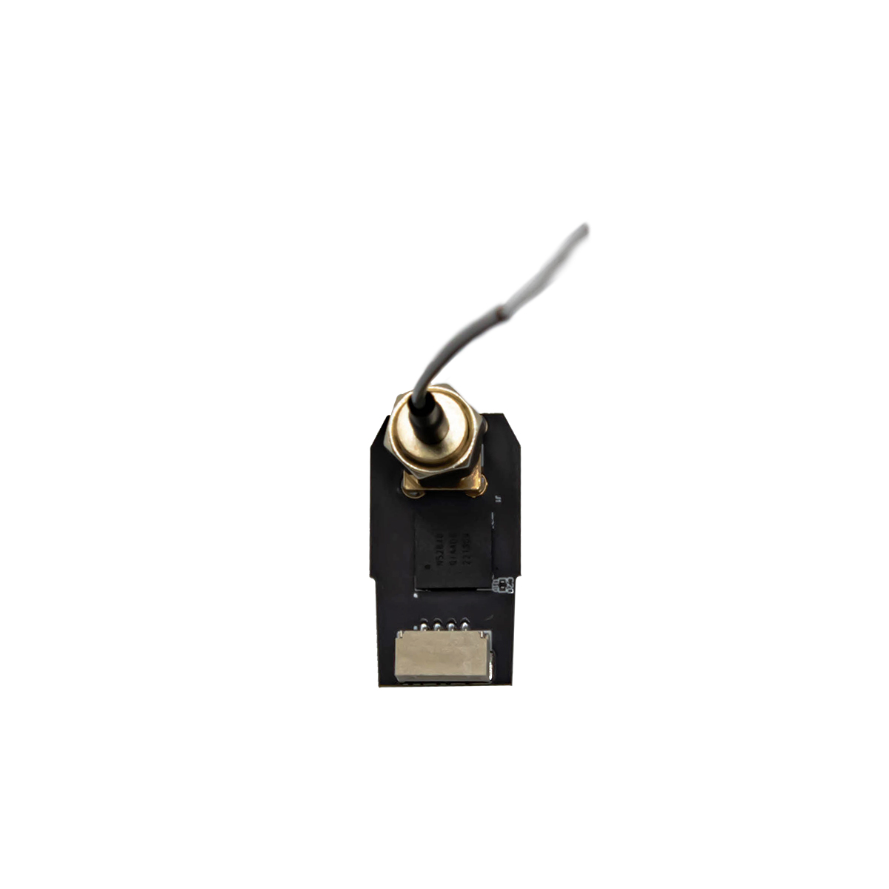<figcaption></figcaption></figure>

<figure>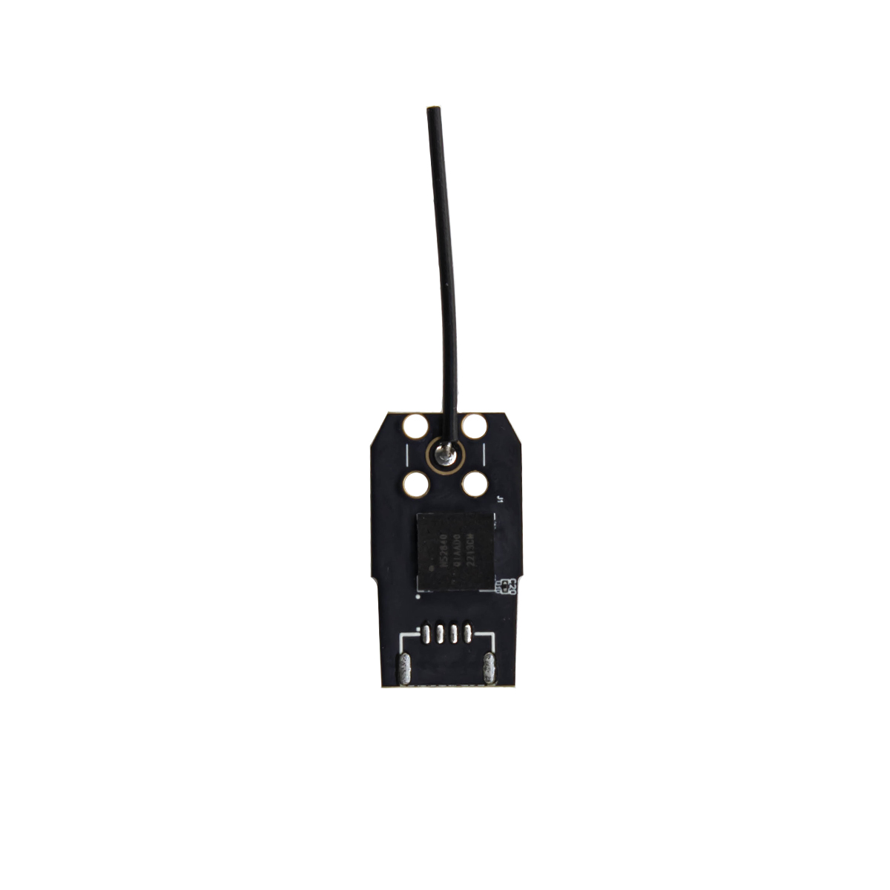<figcaption></figcaption></figure>

## Overview

Cube ID is small size (25mm \* 13.75mm \* 3.5mm ) Remote ID which broadcasting information about UAVs in fligh through a Bluetooth 5.2 dual-mode unit, supports both CAN and serial protocols.

Users can write different codes with one Cube ID only, to adapt to multiple UAVs based on their needs.

CubeID is FCC and CE certified.

## Hardware Specification

### **Cube ID Specification**

<table><thead><tr><th>Type</th><th>Parameter</th><th data-hidden></th></tr></thead><tbody><tr><td><strong>Bluetooth chip</strong></td><td>Nordic NRF52840 (Bluetooth 5.2 )</td><td></td></tr><tr><td><strong>Frequency</strong></td><td>2402MHz ~ 2480MHz</td><td></td></tr><tr><td><strong>Operation Temperature</strong></td><td>-40°C ~ 85°C</td><td></td></tr><tr><td><strong>Dimension</strong></td><td>25mm * 13.75mm * 3.5mm</td><td></td></tr><tr><td><strong>Weight</strong></td><td>10g (with cable and antenna)</td><td></td></tr><tr><td><strong>Protocol</strong></td><td>Serial</td><td></td></tr></tbody></table>

### **Cube ID\_CAN Specification**

<table><thead><tr><th>Type</th><th>Parameter</th><th data-hidden></th></tr></thead><tbody><tr><td><strong>Bluetooth chip</strong></td><td>Nordic NRF52840 (Bluetooth 5.2 )</td><td></td></tr><tr><td><strong>Frequency</strong></td><td>2402MHz ~ 2480MHz</td><td></td></tr><tr><td><strong>Operation Temperature</strong></td><td>-40°C ~ 85°C</td><td></td></tr><tr><td><strong>Dimension</strong></td><td>25mm * 13.75mm * 3.5mm</td><td></td></tr><tr><td><strong>Weight</strong></td><td>10g (with cable and antenna)</td><td></td></tr><tr><td><strong>Protocol</strong></td><td>CAN &#x26; Serial</td><td></td></tr></tbody></table>

## Pinout

### CAN

<figure>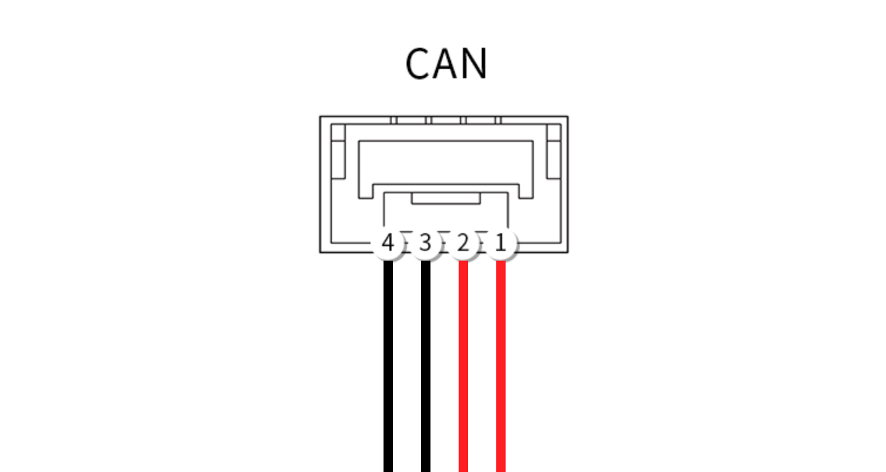<figcaption></figcaption></figure>

| Pin | Definition | Cable color |
| --- | ---------- | ----------- |
| 1   | VCC\_5V    | red         |
| 2   | CAN\_H     | red         |
| 3   | CAN\_L     | black       |
| 4   | GND        | black       |

### Serial

<figure>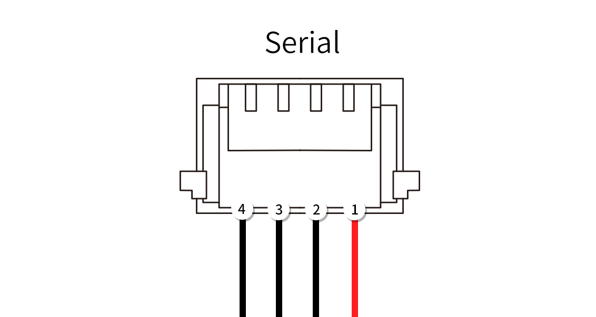<figcaption></figcaption></figure>

| Pin | Definition | Cable color |
| --- | ---------- | ----------- |
| 1   | VCC\_5V    | red         |
| 2   | TX         | black       |
| 3   | RX         | black       |
| 4   | GND        | black       |

## Installation

Connect the CAN or Serial port on module and flight controller with the suitable cable(we provide 4 Pin CAN cable,6 Pin and 8 pin Serial cable) . Stick the module to UAV by regular sticker or soft sticker (with slightly vibration isolation).

_\*Keep the antenna away from the propeller._

## Settings

> For OEM use, you must create your OEM OpenDroneID Ardupilot firmware ，please check
>
> [https://ardupilot.org/dev/docs/opendroneid.html#opendroneid](https://ardupilot.org/dev/docs/opendroneid.html#opendroneid))
>
> [https://www.youtube.com/watch?v=Az8v4Kx4hS0](https://www.youtube.com/watch?v=Az8v4Kx4hS0)
>
>
>
> For normal user please load latest Ardupilot firmware.

1. Connect the flight controller to computer via USB cable. Open Mission Planner（latest version）. Install the OpenDroneID firmware firmware by "Load custom firmware".

<figure>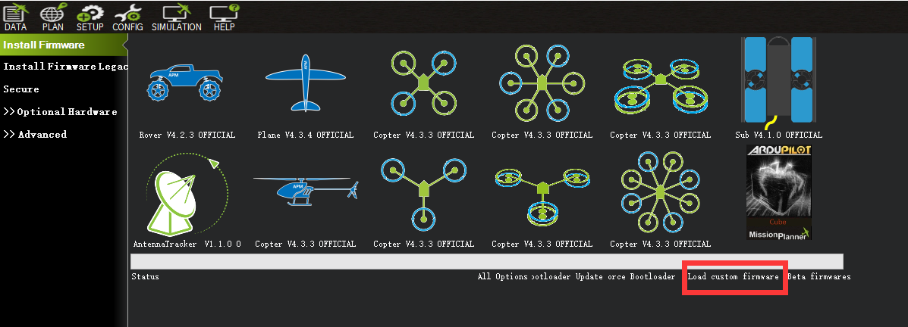<figcaption></figcaption></figure>

2. Go to "Full Parameter List" and find "DID\_ENABLE". Change it to "1" to enable ODID.

<figure>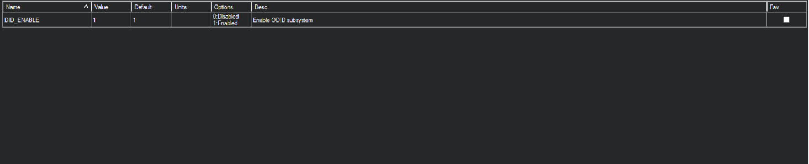<figcaption></figcaption></figure>

3. Go to "Full Parameter List" and find "CAN\_P1\_DRIVER". Change it to "1" to enable CAN.

<figure>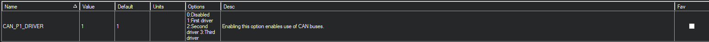<figcaption></figcaption></figure>

（or if you use serial port ,find Serialx\_PROTOCAL and change it to mavlink）

<figure>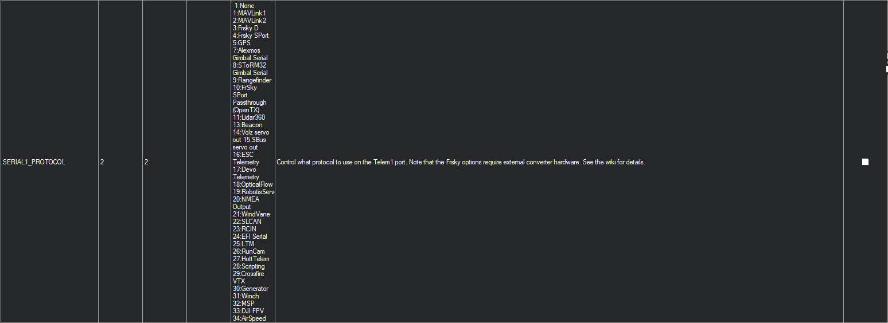<figcaption></figcaption></figure>

4. Go to MissionPlanner homepage select **Drone ID** to set **(1)UAS ID\*** **(2)UAD ID Type** and **(3)UA Type**

<figure>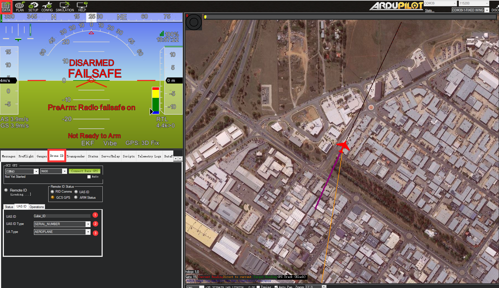<figcaption></figcaption></figure>

to set **(1)UAS ID** **(2)UAD ID Type** and **(3)UA Type**

<figure>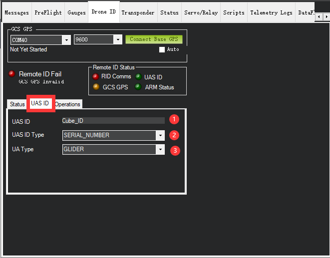<figcaption></figcaption></figure>

Go to **Operation** to set **(1)Operator ID , (2)Oper ID Type , (3)Self ID DESC** and **(4)Self ID Type**

<figure>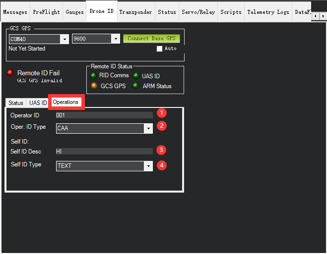<figcaption></figcaption></figure>

## Testing

***

Download **DroneScanner** for IOS， **OpenDroneID** or **DroneScanner** for Android to detect and monitor nearby UAVs.

Operator are able to check UAV's location, ID , operator ID, distance from operator , ect by using these APP.

#### Note

> For more information about Remote ID, you may check in Wiki:
>
> [https://ardupilot.org/copter/docs/common-remoteid.html](https://ardupilot.org/copter/docs/common-remoteid.html)

#### **Warning**

Caution: The user is cautioned that changes or modifications not expressly approved by the party responsible for compliance could void the user's authority to operate the equipment.

This device complies with Part 15 of the FCC Rules. Operation is subject to the following two conditions: (1) this device may not cause harmful interference, and (2) this device must accept any interference received, including interference that may cause undesired operation.

NOTE: This equipment has been tested and found to comply with the limits for a Class B digital device, pursuant to Part 15 of the FCC Rules. These limits are designed to provide reasonable protection against harmful interference in a residential installation. This equipment generates, uses and can radiate radio frequency energy and, if not installed and used in accordance with the instructions, may cause harmful interference to radio communications. However, there is no guarantee that interference will not occur in a particular installation.

If this equipment does cause harmful interference to radio or television reception, which can be determined by turning the equipment off and on, the user is encouraged to try to correct the

interference by one or more of the following measures:

\-- Reorient or relocate the receiving antenna.

\-- Increase the separation between the equipment and receiver.

\-- Connect the equipment into an outlet on a circuit different from that to which the receiver is connected.

\-- Consult the dealer or an experienced radio/TV technician for help.

_**\*FCC Radiation Exposure Statement\***_

This equipment complies with FCC radiation exposure limits set forth for an uncontrolled environment.

This equipment should be installed and operated with a minimum distance of 20cm between the radiator and your body.

This transmitter must not be co-located or operating in conjunction with any other antenna or transmitter.

Last modify: 14th March 2023
