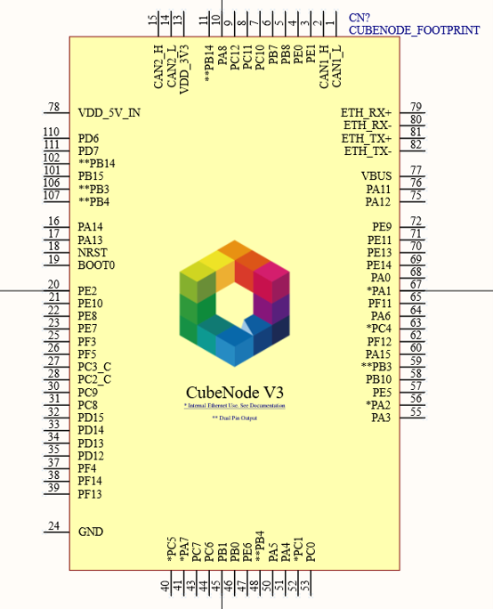

# Footprint

## CubeNode Footprint PCBLIB

<figure><figcaption></figcaption></figure>

<figure><figcaption></figcaption></figure>



## CubeNode Footprint Dimension

<figure><figcaption></figcaption></figure>

<figure><figcaption></figcaption></figure>

## CubeNode Footprint SCHLIB

<figure><figcaption></figcaption></figure>

<figure><figcaption></figcaption></figure>


