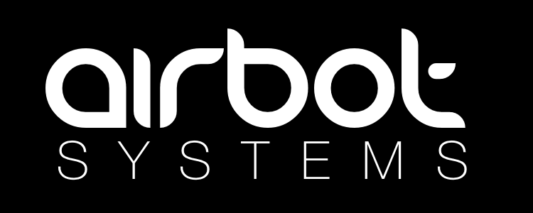
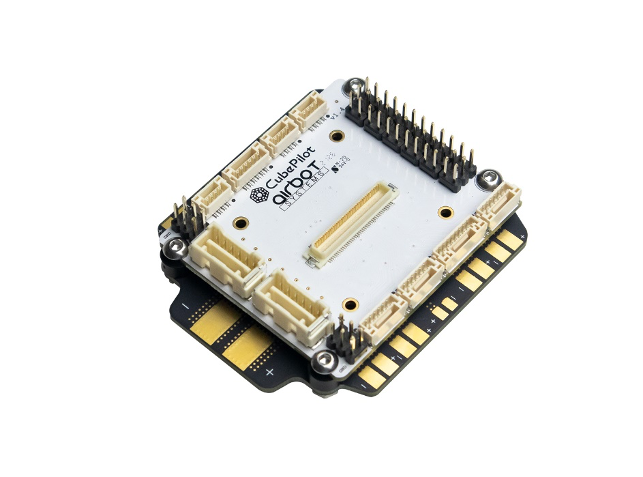
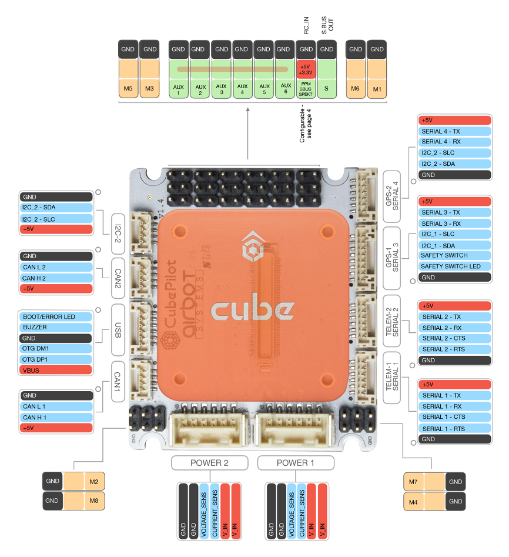
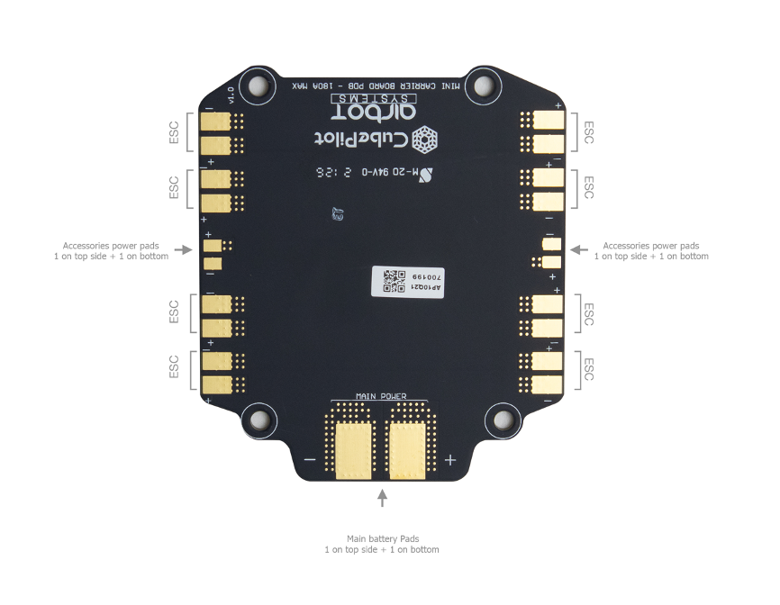
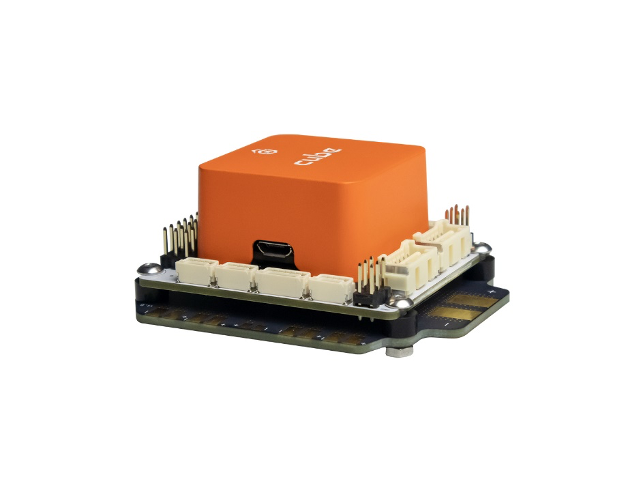

# Airbot Systems

## About Airbot Systems

Airbot Systems is a french company that develops and produces high standard aerial drones and drone parts. Founded in 2015, the company firstly specialised in developing custom aerial drones for professional companies. Today, based on the large technical experience gained, Airbot Systems develops and manufactures its own products and is increasing it’s range year after year.

## Product Description

### Airbot Mini Carrier Board


\

The Airbot Mini carrier board is one of the way to install a Cube on a drone. The Mini carrier board encapsulate all the wiring in a 50.5x57.5mm board, in order to save space and weight for applications which have size limits.

A Mini PDB that can pass up to 180A now accompanies the mini carrier board. This ultra compact setup allows easy and clean mounting on all types of chassis.

#### &#xD; &#xD;&#xD;**FEATURES :**

●  Dual power inputs \
    (redundant power with automatic switch to the second power source when first one fails)\
●  Easy to install on drone \
    (see the mounting pattern above)\
●  Power distribution & voltage protection \
    (providing current to each connector)\
●  Motor PWM signal distribution\
    (up to 8 motors - distributed on corners)\
●  Standard 2.54mm servo PPM/S.BUS/Spectrum RC input \
    (+5v/+3.3v selectable power from carrier board)\
●  AUX VCC pins are connected together. This allows powering the AUX rail externally.

### &#xD;&#xD;**POWER DISTRIBUTION BOARD : (optional)**

The Airbot Power Distribution Board Set can be installed directly under Airbot Mini carrier board set. The PDB allows up to 180A through ESC interface and four pairs of low power pads (2 on top/ 2 on bottom). The mounting hole are aligned with Airbot carrier board, so the board can be stacked together while separated by small nylon spacers.

## &#xD;&#xD;**Contact**

support@airbot-systems.com
