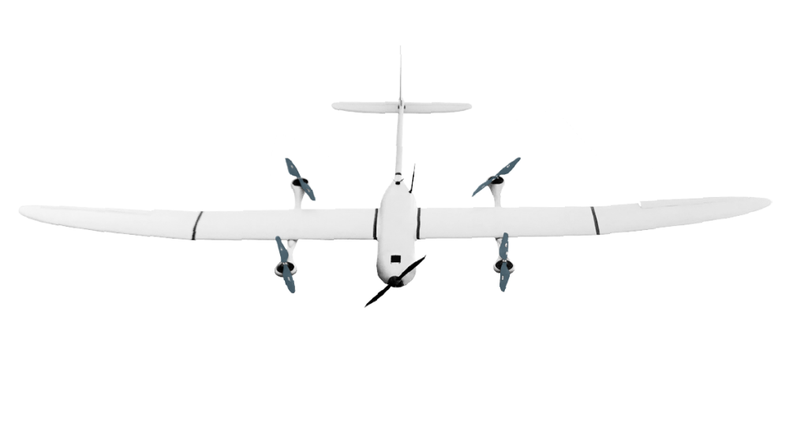
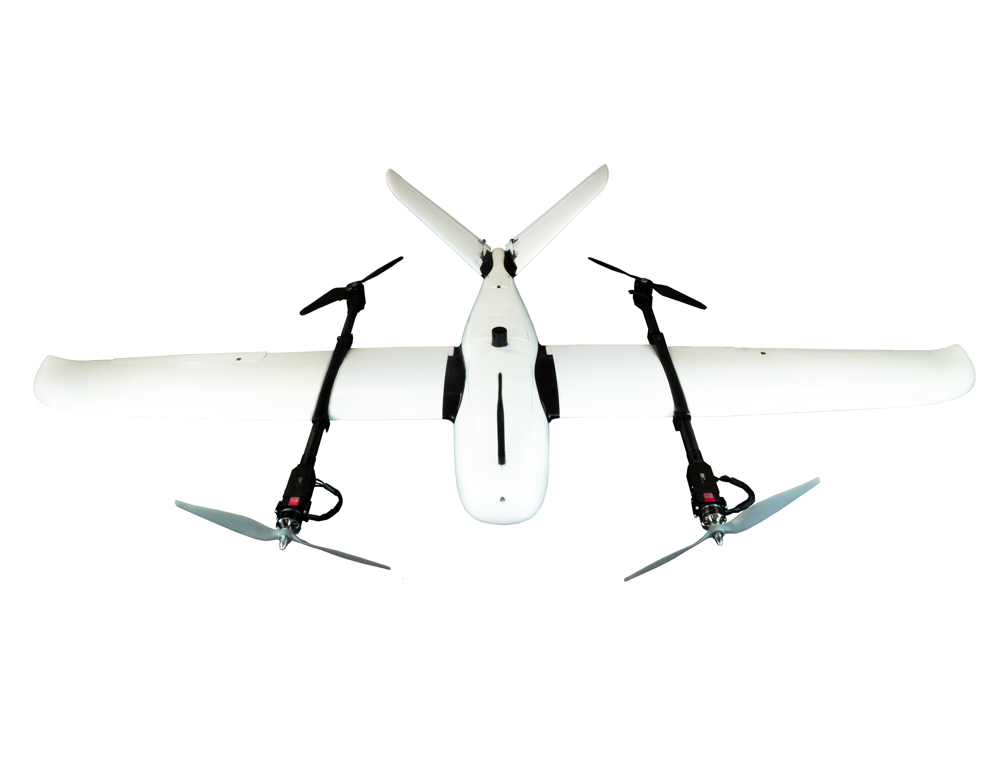
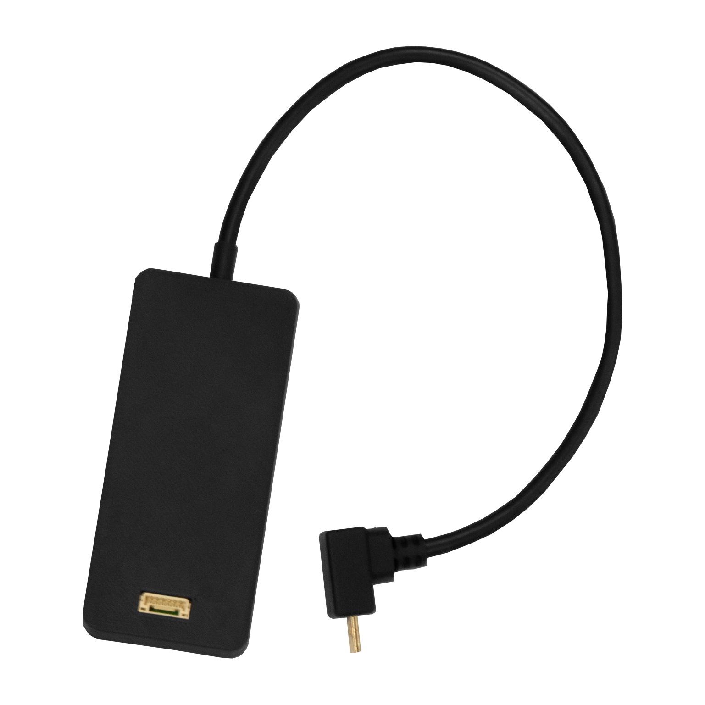
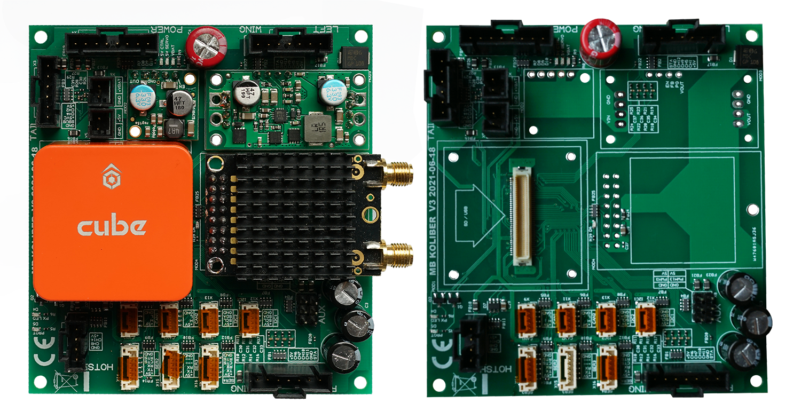

# BZB UAS

#### **BZB UAS**

**Professional long range Unmanned Systems**

BZB UAS specializes in production and integration of airplanes with vertical take off and landing systems \(VTOL\).

**Are you monitoring large areas?** 

**Is the flight time of conventional multirotor drones too short?**

Check our solutions addressed to professionals.

  

### **ekoSKY**

This plane is equipped with a vertical takeoff and landing system \(VTOL\). It is made of composite materials and is powered only by electric motors. Takeoff and landing procedure is performed using four reliable vertical takeoff engines. After reaching the transition height, the front motor is started. This motor allows the plane to stay in the air for up to 240 minutes. Plug&Play system, vertical takeoff and landing make flight preparation and operation surprisingly simple and convenient.

Impresses with its design



| Technical Detail | \*\*\*\* |
| :--- | :--- |
| FLIGHT TIME | Up to 240 minutes |
| MASS \(MTOM\) | 18 kg |
| MAXIMUM PAYLOAD MASS | 5 kg |
| ASSEMBLY TIME | 10 minutes |
| CRUISING SPEED | 20 m/s \(72 km/h\) |
| TAKEOFF/LANDING | Vertical takeoff and landing |
| Range | 868 MHZ; 30 km |

### \*\*\*\*

### **modified Freeman 2100 by BZB UAS - KOLIBER VTOL**

Professional system for people that value safety and work comfort. The system delivers photogrammetric data from large-scale areas. The VTOL system makes taking off and landing easy as never before. All this means that we can recommend this system to anyone regardless of their flying skills



| **Technical Detail** |  |
| :--- | :--- |
| **FLIGHT TIME** | **Up to 80 minutes** |
| **MASS \(MTOM\)** | **6.5 kg** |
| **MAXIMUM PAYLOAD MASS** | **0.7 kg** |
| **ASSEMBLY TIME** | **8 minutes** |
| **CRUISING SPEED** | **20 m/s \(72 km/h\)** |
| **TAKEOFF/LANDING** | **Vertical takeoff and landing** |
| **Range** | **868 MHZ; 30 km** |

### \*\*\*\*

### **DROTAG X**

DROTAG.x updated version of an earlier DROTAG. It is a small circuit board that triggers your camera and saves geotags in EXIF files \(latitude, longitude, height and direction\) in flight!

### \*\*\*\*

### **MOTHERBOARD** 

Integrated electronics adapted to connect the cube autopilot and the telemetry radio from RFDesign. The system is dedicated to QuadPlane, Tilt Motor, or Fixed wing Plane UAVs. Minimize the number of wired connections.

Integrated with the converter to supply 5V servos. Separate, redundant autopilot power supply, significantly increases the reliability of the system.  
  

  
  

