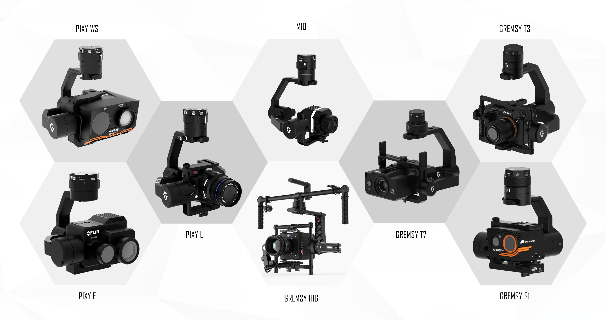
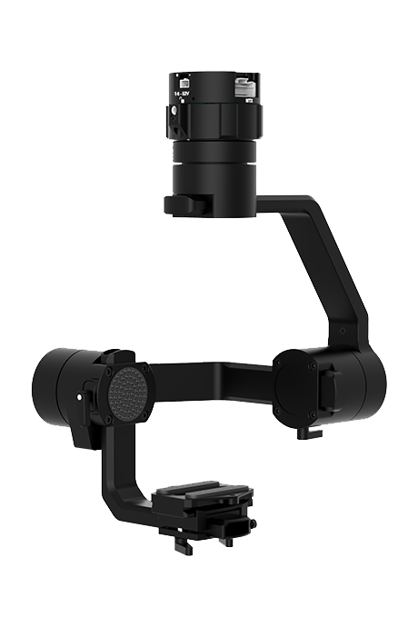
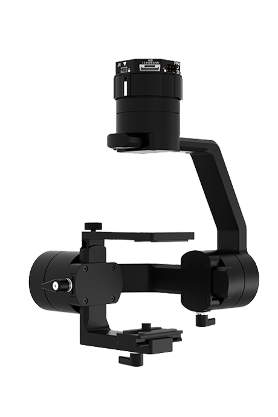
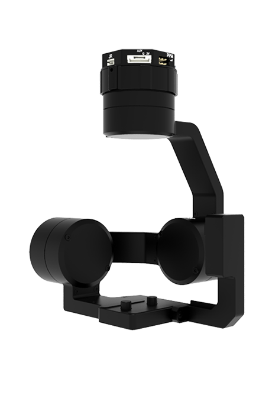
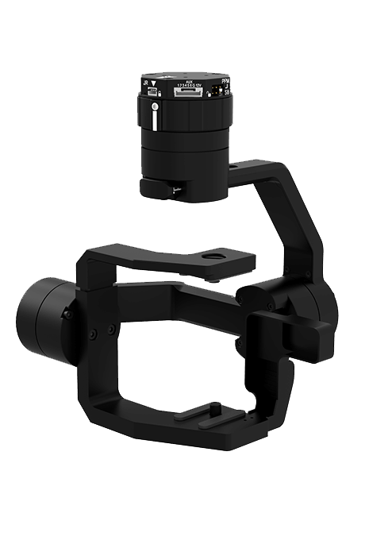
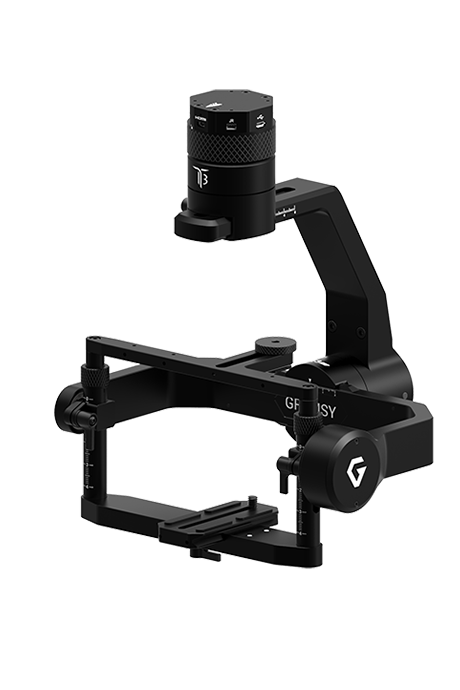
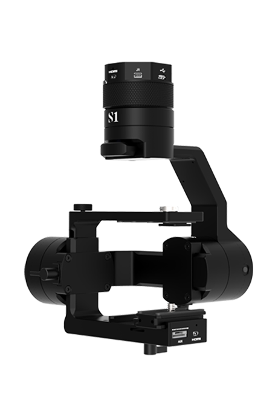
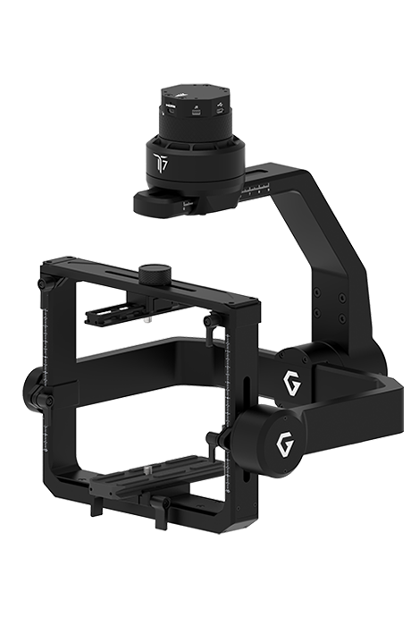

# Gremsy

## About Gremsy


Gremsy is a leading manufacturer of camera gimbal stabilisers for drones and unmanned aerial vehicles \(UAVs\). Our gimbals are designed to be highly adaptable for integration with various drones and cameras, providing steady footage and efficient solutions for a multitude of industrial applications. We also develop customised projects to offer customers flexible solutions tailored to their needs.


  

To empower users in deploying multiple aerial platforms, all Gremsy gimbals \(excluding H16\) are built to support drones using the PX4 and Ardupilot firmware as well as popular autopilots like Pixhawk, Cubepilot. We also provide the Gremsy SDK using MAVlink protocol to allow users connectivity and communication with drone systems using Pixhawk.

## Product Description

### MIO


  
[Mio](https://gremsy.com/mio) is the smallest and lightest Gremsy gimbal offering motorised 3 axis stabilisation for industrial and commercial uses. Mio is compatible with a wide range of cameras weighing up to 400g, including Sony mapping sensors, FLIR infrared sensors and Micasense Rededge multispectral cameras. The versatile system can be mounted on the top, bottom or front of the drone.

**KEY FEATURES**  
● Small form factor design  
● Versatile payload  
● Flexible mounting option  
● Support Herelink for drone & camera gimbal control  
● Support autonomous flight using Pixhawk



<table>
  <thead>
    <tr>
      <th style="text-align:left"><b>Specifications for MIO</b>
      </th>
      <th style="text-align:left"></th>
    </tr>
  </thead>
  <tbody>
    <tr>
      <td style="text-align:left"><b>Dimensions (D x W x H)</b>
      </td>
      <td style="text-align:left">120 x 99 x 175 mm (gimbal) 43 x 85 x 70 mm (camera cage)</td>
    </tr>
    <tr>
      <td style="text-align:left"><b>Weight</b>
      </td>
      <td style="text-align:left">0.55 lbs (250 g)</td>
    </tr>
    <tr>
      <td style="text-align:left"><b>Maximum Payload</b>
      </td>
      <td style="text-align:left">0.88 lbs (400g)</td>
    </tr>
    <tr>
      <td style="text-align:left"><b>Connection</b>
      </td>
      <td style="text-align:left">USB 2.0, DJI A3 CAN, UART, S-bus, PPM, Bluetooth, Micro HDMI</td>
    </tr>
    <tr>
      <td style="text-align:left"><b>Gimbal Mode</b>
      </td>
      <td style="text-align:left">Lock Mode, Follow Mode, Mapping Mode, Inverted Mode, Front Mode</td>
    </tr>
    <tr>
      <td style="text-align:left"><b>Control Mode</b>
      </td>
      <td style="text-align:left">SBUS/PPM/LB2//MAVLink</td>
    </tr>
    <tr>
      <td style="text-align:left"><b>Controlled Rotation Range</b>
      </td>
      <td style="text-align:left">
        
Pan axis control: &#xB1;325&#xB0;

        
Tilt axis control: &#xB1; 120&#xB0;

        
Roll axis control: &#xB1; 40&#xB0;

      </td>
    </tr>
  </tbody>
</table>

### 

### PIXY U

PIXY U is a 3- axis gimbal that can handle a wide variety of cameras, featuring Pixy quick release with integrated HDMI, a variety of I/O interfaces and ability to start up within seconds. Greatly compatible with Flir, Redege cameras and many other sensors, Pixy U is built to carry out survey, inspection, mapping and flexible aerial missions.



**KEY FEATURES**  
●  Multi-camera support  
●  Compact & lightweight design  
●  Upside down perspective  
●  Support Herelink for drone & camera gimbal control Support autonomous flight using Pixhawk





<table>
  <thead>
    <tr>
      <th style="text-align:left"><b>Specifications for PIXY U</b>
      </th>
      <th style="text-align:left"></th>
    </tr>
  </thead>
  <tbody>
    <tr>
      <td style="text-align:left"><b>Dimensions (D x W x H)</b>
      </td>
      <td style="text-align:left">145 x 112 x 200 mm (gimbal) 65.5 x 100 x 70 mm (camera cage)</td>
    </tr>
    <tr>
      <td style="text-align:left"><b>Weight</b>
      </td>
      <td style="text-align:left">1.0 lbs (465 g)</td>
    </tr>
    <tr>
      <td style="text-align:left"><b>Maximum Payload</b>
      </td>
      <td style="text-align:left">1.0 lbs (465g)</td>
    </tr>
    <tr>
      <td style="text-align:left"><b>Connection</b>
      </td>
      <td style="text-align:left">USB 2.0, DJI A3 CAN, UART, S-bus, Spektrum, PPM, Bluetooth, Micro HDMI</td>
    </tr>
    <tr>
      <td style="text-align:left"><b>Gimbal Mode</b>
      </td>
      <td style="text-align:left">Lock Mode, Follow Mode, Mapping Mode, Inverted Mode,</td>
    </tr>
    <tr>
      <td style="text-align:left"><b>Control Mode</b>
      </td>
      <td style="text-align:left">SBUS / Spektrum / PPM / LB2 / MAVlink</td>
    </tr>
    <tr>
      <td style="text-align:left"><b>Controlled Rotation Range</b>
      </td>
      <td style="text-align:left">
        
Pan axis control: +330&#xB0; to -330&#xB0;

        
Tilt axis control: +135&#xB0; to -45&#xB0;

        
Roll axis control: &#xB1; 45&#xB0;

      </td>
    </tr>
  </tbody>
</table>

### PIXY F

Pixy F is a lightweight, palm-sized gimbal specifically designed for FLIR DUO PRO R. This compact gimbal offers the optimised size and weight for longer flight time.

**KEY FEATURES**  
●  Super lightweight gimbal  
●  Fully support Flir duo pro R  
●  Support Herelink for drone & camera gimbal control  
●  Support autonomous flight using Pixhawk

| Specifications for PIXY F |  |
| :--- | :--- |
| **Dimensions \(D x W x H\)** | 139 x 132 x 153 mm \(gimbal\) |
| **Weight** | 0.8 lbs \(360 g\) |
| **Payload** | Flir Duo Pro R |
| **Connection** | USB 2.0, DJI A3 CAN, UART, S-bus, Spektrum, PPM, Bluetooth, Micro HDMI |
| **Gimbal Mode** | Lock Mode, Follow Mode, Mapping Mode, Inverted Mode |
| **Control Mode** | SBUS / Spektrum / PPM / LB2 / MAVlink |
| **Controlled Rotation Range** | Pan axis control: +330° to -330°  Tilt axis control: +135° to -45°  Roll axis control: ± 45° |

### PIXY WS

PIXY WS is the customised gimbal built upon Pixy U but tailored for Wiris Security camera. Pixy WS weighs 470g and inherits all Pixy U’s features.

**KEY FEATURES**  
●  Tailored for Wiris Security  
●  No balancing nor tuning  
●  Upside down perspective  
●  Support Herelink for drone & camera gimbal control Support autonomous flight using Pixhawk

<table>
  <thead>
    <tr>
      <th style="text-align:left">Specifications for PIXY WS</th>
      <th style="text-align:left"></th>
    </tr>
  </thead>
  <tbody>
    <tr>
      <td style="text-align:left"><b>Dimensions (D x W x H)</b>
      </td>
      <td style="text-align:left">170 x 157 x 180 mm (gimbal)</td>
    </tr>
    <tr>
      <td style="text-align:left"><b>Weight</b>
      </td>
      <td style="text-align:left">1.0 lbs (470 g)</td>
    </tr>
    <tr>
      <td style="text-align:left"><b>Payload</b>
      </td>
      <td style="text-align:left">Wiris Security</td>
    </tr>
    <tr>
      <td style="text-align:left"><b>Connection</b>
      </td>
      <td style="text-align:left">USB 2.0, DJI A3 CAN, UART, S-bus, Spektrum, PPM, Bluetooth, Micro HDMI</td>
    </tr>
    <tr>
      <td style="text-align:left"><b>Gimbal Mode</b>
      </td>
      <td style="text-align:left">Lock Mode, Follow Mode, Mapping Mode, Inverted Mode</td>
    </tr>
    <tr>
      <td style="text-align:left"><b>Control Mode</b>
      </td>
      <td style="text-align:left">SBUS / Spektrum / PPM / LB2 / MAVlink</td>
    </tr>
    <tr>
      <td style="text-align:left"><b>Controlled Rotation Range</b>
      </td>
      <td style="text-align:left">
        
Pan axis control: +330&#xB0; to -330&#xB0;

        
Tilt axis control: +135&#xB0; to -45&#xB0;

        
Roll axis control: &#xB1; 45&#xB0;

      </td>
    </tr>
  </tbody>
</table>

### 

### GREMSY T3


Gremsy T3 \(version 3\) is the most advanced 3-axis camera stabiliser ready to fly with many industrial cameras for inspection, mapping and other demanding applications. Featuring onboard HDMI and AUX ports, the T3 ensures simple and clean setup as well as increased portability for your system. The T3 features a quick release that allows users to swap among T&S series gimbals.

**KEY FEATURES**  
●  Hot-swap capability  
●  Multi-Camera Support  
●  Fully-featured advanced I/O interfaces  
●  Support Herelink for drone & camera gimbal control  
●  Support autonomous flight using Pixhawk



<table>
  <thead>
    <tr>
      <th style="text-align:left">Specifications for GREMSY T3</th>
      <th style="text-align:left"></th>
    </tr>
  </thead>
  <tbody>
    <tr>
      <td style="text-align:left"><b>Dimensions (D x W x H)</b>
      </td>
      <td style="text-align:left">184 x 237 x 288 mm (gimbal) 100 x 152 x 120 mm (camera cage)</td>
    </tr>
    <tr>
      <td style="text-align:left"><b>Weight</b>
      </td>
      <td style="text-align:left">2.65 lbs (1200 g)</td>
    </tr>
    <tr>
      <td style="text-align:left"><b>Maximum Payload</b>
      </td>
      <td style="text-align:left">3.7 lbs (1700g)</td>
    </tr>
    <tr>
      <td style="text-align:left"><b>Connection</b>
      </td>
      <td style="text-align:left">USB 2.0, DJI A3 CAN, UART, S-bus, Spektrum, PPM, Bluetooth, Micro HDMI</td>
    </tr>
    <tr>
      <td style="text-align:left"><b>Gimbal Mode</b>
      </td>
      <td style="text-align:left">Lock Mode, Follow Mode, Mapping Mode, Inverted Mode</td>
    </tr>
    <tr>
      <td style="text-align:left"><b>Control Mode</b>
      </td>
      <td style="text-align:left">SBUS / Spektrum / PPM / LB2 / MAVlink</td>
    </tr>
    <tr>
      <td style="text-align:left"><b>Controlled Rotation Range</b>
      </td>
      <td style="text-align:left">
        
Pan axis control: &#xB1; 330&#xB0;

        
Tilt axis control: &#xB1; 120&#xB0;

        
Roll axis control: &#xB1; 45&#xB0;

      </td>
    </tr>
  </tbody>
</table>

### GREMSY S1

Gremsy S1 is a compact 3-axis gimbal for mappers, surveyors and industry experts demanding lightweight and high precision gimbal. The S1V3 also comes with the quick release to help users save time during set-up and dismantling.

**KEY FEATURES**  
●  Hot-swap capability  
●  Compact design. Multi-Camera Support  
●  Flexible in camera mounting  
●  Support Herelink for drone & camera gimbal control Support autonomous flight using Pixhawk



<table>
  <thead>
    <tr>
      <th style="text-align:left">Specifications for GREMSY S1</th>
      <th style="text-align:left"></th>
    </tr>
  </thead>
  <tbody>
    <tr>
      <td style="text-align:left"><b>Dimensions (D x W x H)</b>
      </td>
      <td style="text-align:left">168 x 150 x 220 mm (gimbal) 65 x 120 x 75 mm (camera cage)</td>
    </tr>
    <tr>
      <td style="text-align:left"><b>Weight</b>
      </td>
      <td style="text-align:left">1.8 lbs (830 g)</td>
    </tr>
    <tr>
      <td style="text-align:left"><b>Maximum Payload</b>
      </td>
      <td style="text-align:left">1.6 lbs (750g)</td>
    </tr>
    <tr>
      <td style="text-align:left"><b>Connection</b>
      </td>
      <td style="text-align:left">USB 2.0, DJI A3 CAN, UART, S-bus, Spektrum, PPM, Bluetooth, Micro HDMI</td>
    </tr>
    <tr>
      <td style="text-align:left"><b>Gimbal Mode</b>
      </td>
      <td style="text-align:left">Lock Mode, Follow Mode, Mapping Mode, Inverted Mode</td>
    </tr>
    <tr>
      <td style="text-align:left"><b>Control Mode</b>
      </td>
      <td style="text-align:left">SBUS / Spektrum / PPM / LB2 / MAVlink</td>
    </tr>
    <tr>
      <td style="text-align:left"><b>Controlled Rotation Range</b>
      </td>
      <td style="text-align:left">
        
Pan axis control: &#xB1; 330&#xB0;

        
Tilt axis control: &#xB1; 120&#xB0;

        
Roll axis control: &#xB1; 45&#xB0;

      </td>
    </tr>
  </tbody>
</table>

### GREMSY T7

Gremsy T7 is the next level of heavy lifting gimbal for industrial applications. With a large camera cage and ability to carry up to 7 lbs, the T7 expands the range of compatible cameras and is capable of loading multiple specialised sensors at once.

**KEY FEATURES**  
●  Hot-swap capability  
●  Handle heavy-lift cameras  
●  Multiple-camera mounting with ease  
●  Support Herelink for drone & camera gimbal control Support autonomous flight using Pixhawk



<table>
  <thead>
    <tr>
      <th style="text-align:left">Specifications<b> for GREMSY T7</b>
      </th>
      <th style="text-align:left"></th>
    </tr>
  </thead>
  <tbody>
    <tr>
      <td style="text-align:left"><b>Dimensions (D x W x H)</b>
      </td>
      <td style="text-align:left">253 x 260 x 345 mm (gimbal)
         150 x 180 x 130 mm (camera cage)</td>
    </tr>
    <tr>
      <td style="text-align:left"><b>Weight</b>
      </td>
      <td style="text-align:left">4 lbs (1860 g)</td>
    </tr>
    <tr>
      <td style="text-align:left"><b>Maximum Payload</b>
      </td>
      <td style="text-align:left">7 lbs (3175g)</td>
    </tr>
    <tr>
      <td style="text-align:left"><b>Connection</b>
      </td>
      <td style="text-align:left">USB 2.0, DJI A3 CAN, UART, S-bus, Spektrum, PPM, Bluetooth, Micro HDMI</td>
    </tr>
    <tr>
      <td style="text-align:left"><b>Gimbal Mode</b>
      </td>
      <td style="text-align:left">Lock Mode, Follow Mode, Mapping Mode, Inverted Mode</td>
    </tr>
    <tr>
      <td style="text-align:left"><b>Control Mode</b>
      </td>
      <td style="text-align:left">SBUS / Spektrum / PPM / LB2 / MAVlink</td>
    </tr>
    <tr>
      <td style="text-align:left"><b>Controlled Rotation Range</b>
      </td>
      <td style="text-align:left">
        
Pan axis control: &#xB1; 330&#xB0;

        
Tilt axis control: &#xB1; 120&#xB0;

        
Roll axis control: &#xB1; 45&#xB0;

      </td>
    </tr>
  </tbody>
</table>

## Contact


●  152-154 Street No.02, Van Phuc Residential City,   
Hiep Binh Phuoc Ward, Thu Duc City, Ho Chi Minh City, Vietnam  
●  \(+84-28\) 37 205 221  
●  contact@gremsy.com  
●  [www.gremsy.com](http://www.gremsy.com)

## 

