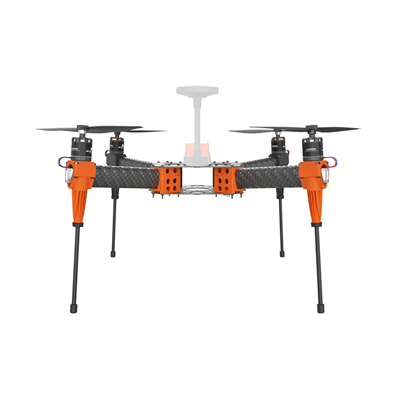

# EDU-450

## Specification&#x20;

**Wheelbase:** 450mm \
**Size:** 360\*360\*260mm \
**Motor:** HS2216 KV:920\
**ESC:** Hexsoon 20A\
**Propeller:** T-MOTOR T1045Ⅱ\
**Weight:** 870g (without battery) \
**Max Payload:** 960g (without battery) \
**Recommend Battery :** 4S 5300mah


EDU-450 PID parameter reference (Zipped)



