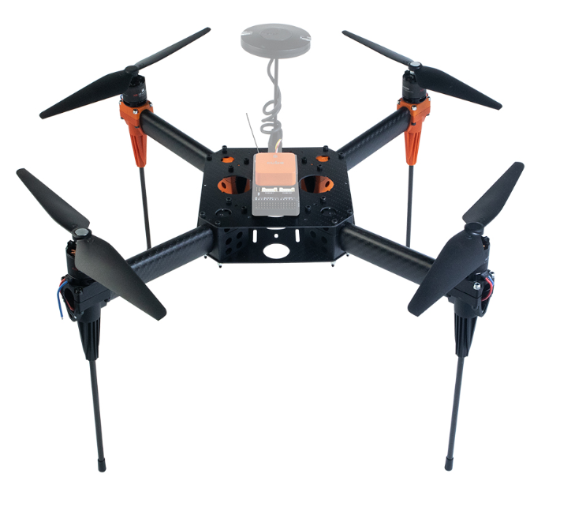

# EDU-450

## Specification&#x20;

**Width:** 450mm \
**Height:** 260mm \
**Motor:** T-Motor 2216 880KV \
**RPM:** 6000-7000 RPM/min \
**ESC:** Hobbywing XRotor 20A \
**Wheelbase:** 17.7in/450mm \
**Weight:** 847g Frame without battery \
**Max Payload:** 960g without battery \
**Battery Requirement:** 4S 5Ah


EDU-450 PID parameter reference (Zipped)


