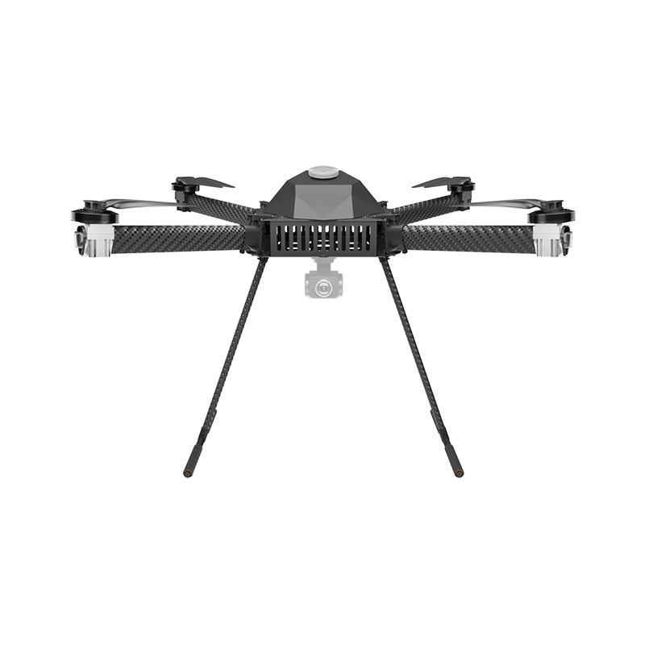
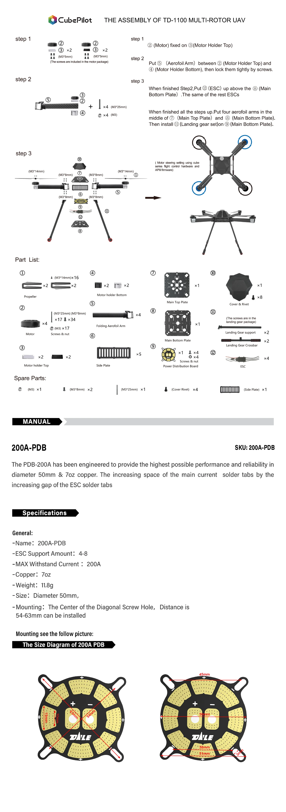

# TD-1100

## Specification&#x20;

**Wheelbase:** 1100mm\
**Size:** 950\*950\*600mm\
**Motor:** T-MOTOR U8II KV:100\
**ESC:** T-MOTOR FLAME 60A HV\
**Propeller:** T-MOTOR MF2815\
**Weight:** 5000g (without battery) \
**Max Payload:** 4000g without battery \
**Recommend Battery:** 12s 22000mah

<figure><figcaption></figcaption></figure>
