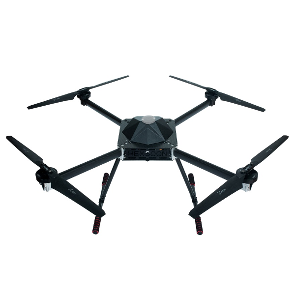

# TD-1100

## TD-1100 Teardrop Aerodynamic Rotorcraft

### Specification 

**Width:** 930mm   
**Height:** 590mm   
**Motor:** T-Motor U8 II KV100   
**ESC:** T-Motor Flame 60A HV  
**Wheelbase:** 43.3in/1100mm   
**Weight:** 5kg Frame without battery   
**Max Payload:** 4kg without battery   
**Battery Requirement:** 12S 16Ah

