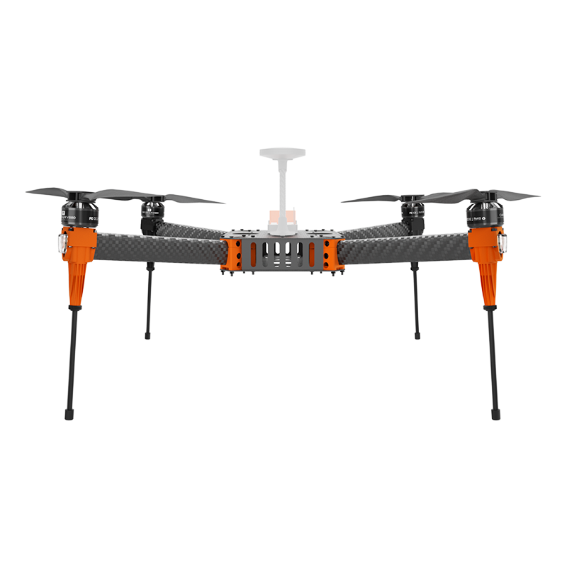
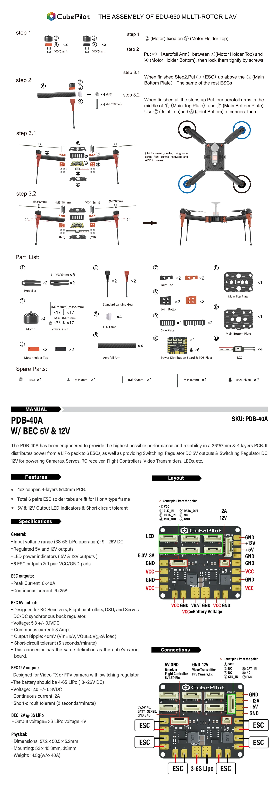

# EDU-650

## Specification&#x20;

**Wheelbase:** 650mm\
**Size:** 500\*500\*400mm\
**Motor:** HS4012 KV:370\
**ESC:** Hexsoon 40A\
**Propeller:** T-MOTOR MF1503\
**Weight:** 1595g (without battery) \
**Max Payload:** 1000g without battery \
**Recommend Battery:** 6S 12000mah

<figure><figcaption></figcaption></figure>
