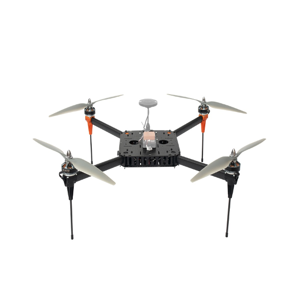

# TD-650

## TD-650 Teardrop Aerodynamic Rotorcraft

### Specification 

**Width:** 500mm \
**Height: **260mm \
**Motor: **T-Motor 4010 370KV \
**ESC: **Hobbywing 40A \
**Wheelbase: **25.5in/650mm \
**Weight: **1.6kg Frame without battery \
**Max Payload: **1kg without battery \
**Battery Requirement: **6S 12Ah
