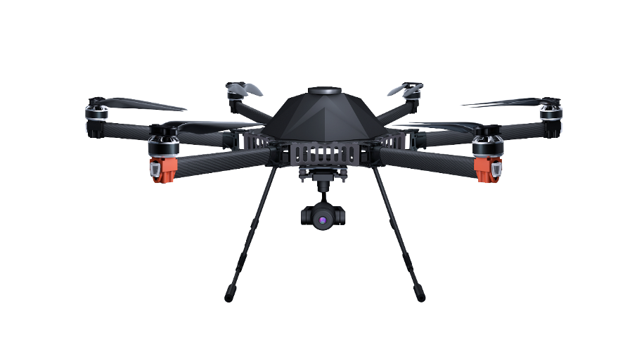

# TD-860

## TD-860 Teardrop Aerodynamic Rotorcraft

### Specification 

**Width:** 840mm   
**Height:** 390mm   
**Motor:** T-Motor 4010 370KV   
**ESC:** Hobbywing 40A   
**Wheelbase:** 33.8in/860mm   
**Weight:** 2.65kg Frame without battery   
**Max Payload:** 2kg without battery   
**Battery Requirement:** 6S 12Ah / 6S 16Ah

