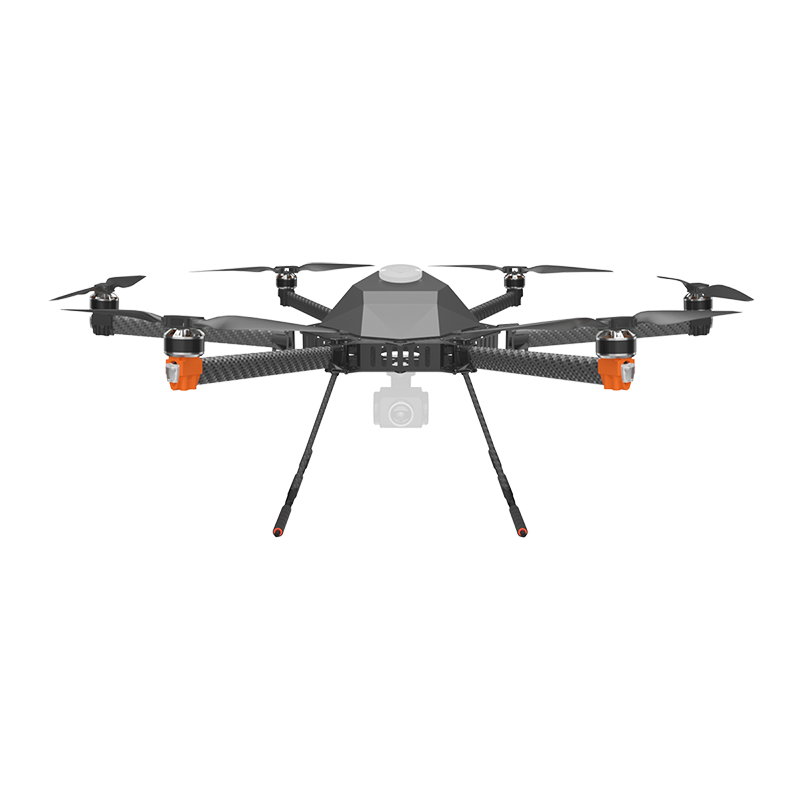

# TD-900

## Specification&#x20;

**Wheelbase:** 900mm\
**Size:** 900\*900\*400mm\
**Motor:** HS4012 KV:370\
**ESC:** Hexsoon 40A\
**Propeller:** T-MOTOR MF1503\
**Weight:** 2900g (without battery) \
**Max Payload:** 2000g without battery \
**Recommend Battery:** 6s 16000mah


