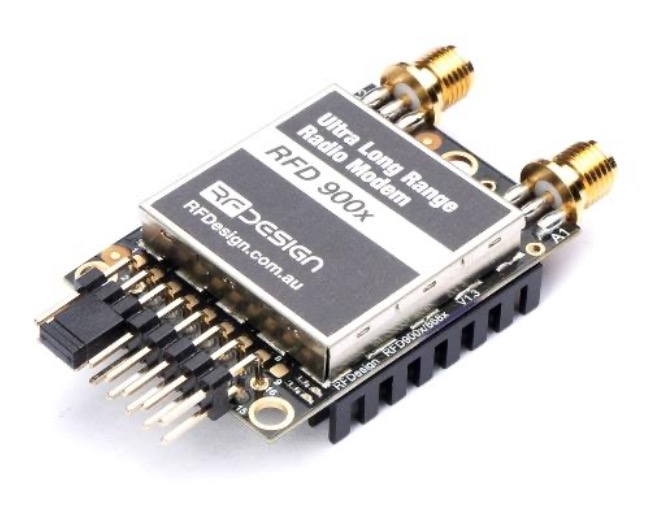

# RFDesign Pty Ltd

## About RFDesign

RFDesign is an electronics design and manufacturing company specialising in Embedded systems, Radios, Antennas and high frequency electronics.

We are located in Brisbane, Australia with our office located in Archerfield, QLD. Please visit RFDesign main website, [http://rfdesign.com.au](http://rfdesign.com.au) for more information.

## RFD900**x**

### **New Features**

* New Processor, ARM 32 bit core.
* Air data rate: 500kbit/s
* AES Hardware accelerated encryption. \*Fully working\*
* RC PPM Passthrough with telemetry at the same time.
* Fully ESD protected + filtered - Every IO port is protected and filtered.
* Original SiK point to point firmware implemented.
* Asynchronous multipoint firmware, \*Beta release\*

### Features

*   Long range >40km depending on antennas and GCS setup&#x20;

    _\*80km demonstrated by Edge Research labs on a balloon, 57km in India, on Dipoles._
* 2 x RP-SMA RF connectors, diversity switched.
* 1 Watt (+30dBm) transmit power.
* Transmit low pass filter.
* \> 20dB Low noise amplifier, high IP3.
* RX SAW filter.
* All I/O ESD protected and filtered.
*   Re implemented SiK and Multipoint SiK firmware, field upgradeable, easy to

    configure.
* Small, lightweight.
* License free use in Australia, Canada, USA, NZ
* Note: Not compatible with older modems

### Interfaces

<table><thead><tr><th></th><th width="297"></th></tr></thead><tbody><tr><td><strong>RF</strong></td><td>2 x RP-SMA connectors</td></tr><tr><td><strong>Serial</strong></td><td>Logic level TTL (+3.3v)</td></tr><tr><td><strong>Power</strong></td><td>+5v, ~800mA max peak (at maximum transmit power)</td></tr><tr><td><strong>GPIO</strong></td><td>6 General purpose IO (Digita capable)</td></tr></tbody></table>

### Specifications

<table><thead><tr><th width="170.92018567173824"></th><th></th></tr></thead><tbody><tr><td><strong>Frequency Range</strong></td><td>
902 - 928 MHz (USA)

915 - 928 MHz (Australia)
</td></tr><tr><td><strong>Output Power</strong></td><td>
1W (+30dBm), controllable in 1dB steps 

( +/- 1dB @=20dBm typical )
</td></tr><tr><td><strong>Air Data transfer rates</strong></td><td>12, 56, 64, 100, 125, 200, 224, 500 and 750 kbit/sec (User settable, 64kbit default)*</td></tr><tr><td><strong>UART data transfer rates</strong></td><td>
1200, 2400, 4800, 9600, 19200, 38400, 57600, 115200, 230400, 460800, 1M baud (User settable, 57600 default)*

<strong>*note these values are correct as of version 3.16 SiK firmware</strong>
</td></tr><tr><td><strong>Output Power</strong></td><td>1W (+30dBm)</td></tr><tr><td><strong>Receive Sensitivity</strong></td><td>>111 dBm at 12kbps, 105 at 64 kbps and 98 at 200 kbps</td></tr><tr><td><strong>Size</strong></td><td>
30 mm (wide) x 57 mm (long) x 12.8 mm (thick) - Including RF Shield,

Heatsink and connector extremeties
</td></tr><tr><td><strong>Weight</strong></td><td>14.5g</td></tr><tr><td><strong>Mounting</strong></td><td>3 x M2.5 screws, 3 x header pin solder points</td></tr><tr><td><strong>Power Supply</strong></td><td>
+5 V nominal (+3.5 V min, +5.5 V max) 

~800 mA peak at maximum power
</td></tr><tr><td><strong>Temp. Range</strong></td><td>
-40 to +85 °C

tested operational from -73 to +123 °C
</td></tr></tbody></table>

### Software / GCS Support

The software solution is an open source development called "SiK". It has been re implemented to suit the new processor architecture available on the 32bit ARM processor core. A boot loader and interface is available for further development and field upgrade of the modem firmware via the serial port.

Most parameters are configurable via AT commands, Eg. baud rate (air/uart), frequency band, power levels.

Integrated support for configuring the RFD900 radios is supported by APM Planner. The default settings are at 57600 baud, N, 8, 1, and 64k air data rate.

The RFD900x manual is here: [RFD900x Manual](http://files.rfdesign.com.au/Files/documents/RFD900x%20DataSheet%20V1.1.pdf)

The RFD900x SiK software manual is here : [RFD900x Peer-to-peer Manual](http://files.rfdesign.com.au/Files/documents/RFD900x%20Peer-to-peer%20V3.X%20User%20Manual%20V1.2.pdf)

### Software features include

* Frequency hopping spread spectrum (FHSS)
* Transparent serial link
* Point to Point, or Multipoint networking
*   Configuration by simple AT commands for local radio, RT commands for remote

    radio
* User configurable serial data rates and air data rates
* MAVLink protocol framing (user selectable)
*   MAVLink radio status reporting (Local RSSI, Remote RSSI, Local Noise, Remote

    Noise)
* Automatic antenna diversity switching on a packet basis in realtime
* Automatic duty cycle throttling based on radio temperature to avoid overheating

### Compliance

The RFD900 is designed to be compliant with the following standards:

* FCC Part 15.247 (Frequency hopping and digitally modulated intentional radiators)
* AS/NZS 4268:2012 (Radio equipment and systems - short range devices)

The modem is designed for system integrators who will integrate the modem into their own projects and product prototypes. The user is responsible for compliance with local regulations for radio transmitters.

## Contact Information

RFDesign Pty Ltd&#x20;

Unit 7/1 Stockwell Place&#x20;

Archerfield QLD 4108&#x20;

Tel: +61 (0)7 3255 6042&#x20;

Email: info@rfdesign.com.au
