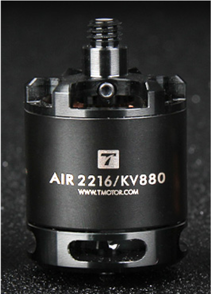
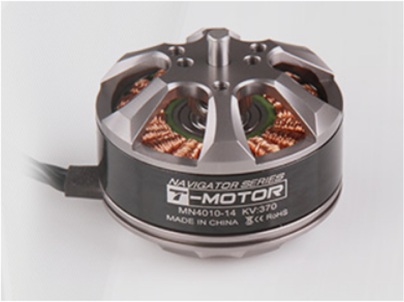
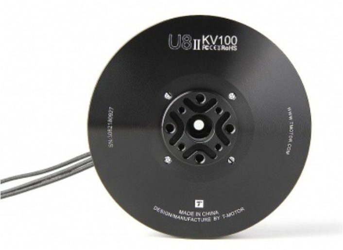

# T-MOTOR

### 

## About T-Motor

T-MOTOR, a world renowned company, providing propulsion system solution for UAV with advanced technology is specialising in Motors, ESCs \(Electronic Speed Controller\) and Propellers. Widely used for aerial photography, industrial, agricultural, and commercial applications, our products obtain high reputation for the high quality.

**Our value:** The Safer Propulsion System

**Our vision:** Be the guiding star in UAV industry

**Our purport:** Technological Innovation; Win-Win Cooperation; Integrity &Service

## T-MOTOR Team

T-MOTOR is a team of profession, innovation and passion.

**R&D Department:** We do R&D with pursuit of innovation and quality, but also attach significance to details and user experience.

**Production Department:** We make perfect products with best raw materials and advanced production technology and equipment.

**QC Department:** We carry out inspection in each process from raw materials to finished products to make sure impeccable products reach our customers.

**Sales Department:** We do sale with profession and passion, supplying thoughtful service for customers.

**Other Departments:** We coordinate with each other from better T-MOTOR.

T-MOTOR also offers OEM/ODM service to meet various demands from customers. We would like to grow up with you--our esteemed customers, and gain mutual benefits. Your valuable comments and ideas would be appreciated.

## T-MOTOR Culture

Tiger, king of the jungle, is celebrated for valor, power, boldness and vigor in Chinese traditional culture. TIGER MOTOR \(T-MOTOR\) is devoted to being the guiding star in UAV field with its profession, quality, innovation, integrity and great service.

**PROFESSION**  
T-MOTOR is offering customers products and service with profession, which fundamentally ensures interests of our customers.

**QUALITY**  
T-MOTOR values quality most. We furnish you with the safest propulsion system for your pilot dream.

**INNOVATION**  
T-MOTOR starting from user experience, innovates satisfactory products for customers.

**INTEGRITY**  
T-MOTOR founded on integrity is looking forward to cooperating with you for mutual benefits.

SERVICE T-MOTOR provides you with full-scale and professional services.

## Product Description

### T-motor Air 2216 880KV

| Specification |  |  |  |
| :--- | :--- | :--- | :--- |
| **KV**  | 880 | **Rated Voltage \(Lipo\)** | 2-4S |
| **Idle Current \(10V\)** | 0.6A - 0.8A | **ESC Recommendation** | AIR 20A |
| **Peak Current \(180s\)** | 16A | **Propeller Recommendation** | T1045 |
| **Max. Power \(180s\)** | 260w | **Motor Weight \(Incl. Cable\)** | 65 ± 2g |
| **Internal Resistance** | 115 ± 15m**Ω** | **Lead Length** | 43 - 45mm |

For more information about T-motor Air 2216 please check below:  
[https://store.tmotor.com/goods.php?id=727 ](https://store.tmotor.com/goods.php?id=727%20)

### T-motor MN4010 370KV

| Specification |  |  |  |
| :--- | :--- | :--- | :--- |
| **Internal Resistance** | 98m**Ω** | **Configuration** | 18N24P |
| **Shaft Diameter** | 4mm | **Motor Dimensions** | ⌀44.5 x 30.5mm |
| **Stator Diameter** | 40mm | **Stator Height** | 10mm |
| **AWG** | 18\# | **Cable Length** | 600mm |
| **Weight Including Cables** | 137g | **Weight Excluding Cables** | 112g |
| **No. of Cells \(Lipo\)** | 4 - 8s | **Idle Current @ 10v** | 0.8A |
| **Max Continuous Power 180S** | 450W | **Max Continuous Current 180S** | 20A |

For more information about T-motor Air MN4010 please check below:  
[https://store.tmotor.com/goods.php?id=341](https://store.tmotor.com/goods.php?id=341)

### T-motor U8 II 100KV

| Specification |  |  |  |
| :--- | :--- | :--- | :--- |
| Diameter | 87.1mm | Height | 29.1mm |
| Shaft Diameter | 15mm | Configuration  | 36N42P |
| Lead Spec | 90mm | Ingress Protection Level | IP55 |
| KV | 100 | Rated Voltage \(Lipo\) | 12S |
| Motor Weight \(Incl. Cable\) | 272g | Propeller Recommendation | 27 - 28° |
| Idle Current \(18V\) | 0.7A | Quadcopter \(28CF\) | 14kg |
| Internal Resistance | 170 ± 5m**Ω** | Hexacopter \(28CF\) | 21kg |
| Peak Current \(180S） | 29.3A | Octocopter \(28CF） | 28kg |
| Max Power \(180S\) | 1406.4w | Packing Size | 130 \* 111 \* 50.6mm |

For more information about T-motor Air MN4010 please check below:  
[https://store.tmotor.com/goods.php?id=561](https://store.tmotor.com/goods.php?id=561)

**Contact Information**   
Contact person:Annie Qiu  
Position: Sales Manager  
Mobile：+8615879175073  
Email: annie@tmotor.com  
Skype: Annie Qiu T-motor  
Facebook: https://www.facebook.com/ajuan.qiu

