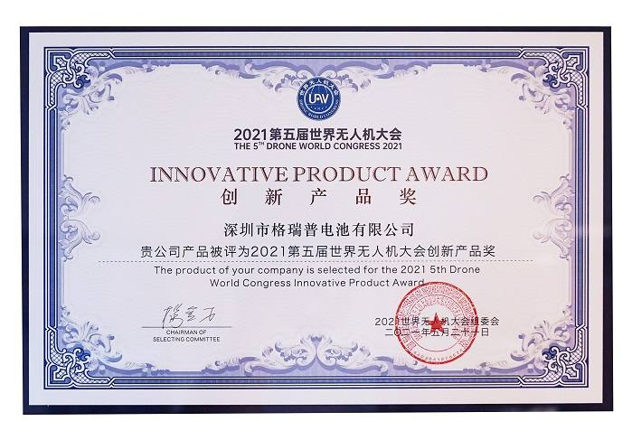
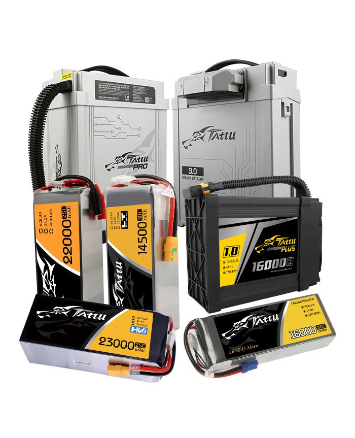
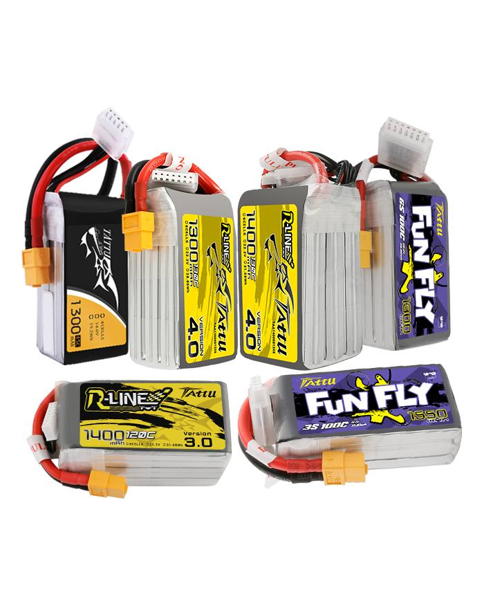

# Tattu


**About Tattu**
---------------

Founded by Grepow in 2015, Tattu has become renown as the tried-and-true battery brand for professional drones, eVTOLs, FPVs, and remote control hobbies.  It has continued to deliver reliable, local customer support for years with its offices located in the United States, Germany, and mainland China and Taiwan.

With Grepow’s more than 20 years of experience in battery development and production, Tattu has unfailingly yielded high-quality battery packs that have pushed the UAV industry to new heights.  Its work as an industry-leading brand has gained public recognition as reflected with its acceptance of the Innovation Product Award at the 2021 Drone World Conference.



**Tattu series**
----------------

Tattu batteries’ capacity, C-rate, weight, and other specs have been designed according to industry standards and demands of its many pilots.  With its dependable yet powerful Smart and High Voltage series, Tattu batteries carry quite the punch.  For smaller packs, the Funfly and R-Line series have and continue to be a trustworthy choice.

### &#xD;&#xD;**Commercial-Drone** **Batteries**


**Tattu Smart Batteries** are equipped with a BMS and anti-spark capabilities, combined with a high-performance, low-power MCU to give users a better understanding of their battery status. The compact and waterproof housing optimises the reliability of the system in harsh environments.

There is a plethora of other options: high-voltage and low-temperature batteries can be used in a wider range of scenarios; the NMC 811 battery makes a breakthrough with an energy density of 275wh/Kg and cycle life of 1000 cycles, which extends operating times.&#x20;

Tattu products are widely used in film aerial photography, agricultural spraying, surveying and mapping, forest fire prevention, flood rescue, cargo transportation and many other fields.

### &#xD;&#xD;  **FPV Batteries**


With its high output current and high C-rate, **Tattu FPV batteries** are often found in major competitions, such as the Multi GP and EMHC.  Their performance pushes pilots to achieve the best flights.  With superb battery technology, light weight, and high reliability, these battery packs are versatile and used in FPV drones, races, and many other applications.

### **Others**


Tattu isn’t the only brand that Grepow offers.  Under Gens Ace, there are chargers and batteries for receivers, transmitters, and other remote control hobbies.

If you can’t find what you need under Tattu and Gens Ace, then look no further: Grepow offers custom battery solutions regardless of whether you’re inquiring into OEMs or ODMs.  Contact Grepow at [info@grepow.com](mailto:info@grepow.com) for your specific needs and applications.

## **About Grepow**


Founded in 1998, Shenzhen Grepow Battery Co., Ltd. has its own 4 factories and more than 3000 global and local employees. Grepow specializes in the research and production of NIMH, LiPo, LiFePO4 batteries and the development of power management systems. From industrial equipment to smart rings, Grepow can provide power to support them all.

## **Media**



For more information on Tattu, peruse the below websites and social media:

USA Website: [https://www.genstattu.com/](https://www.genstattu.com/)

EU Website: [https://www.gensace.de/](https://www.gensace.de/)&#x20;

Facebook: [https://www.facebook.com/Tattulipos](https://www.facebook.com/Tattulipos)\


Instagram: [https://www.instagram.com/tattulipos/​](https://www.instagram.com/tattulipos/)

Youtube: [https://www.youtube.com/channel/UCfWP-RIqbjGPx-V\_5jkNy5Q](https://www.youtube.com/channel/UCfWP-RIqbjGPx-V\_5jkNy5Q)

Email: info@grepow.com
