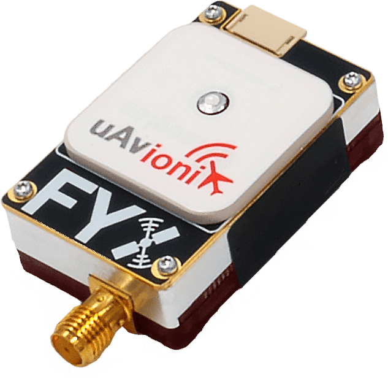
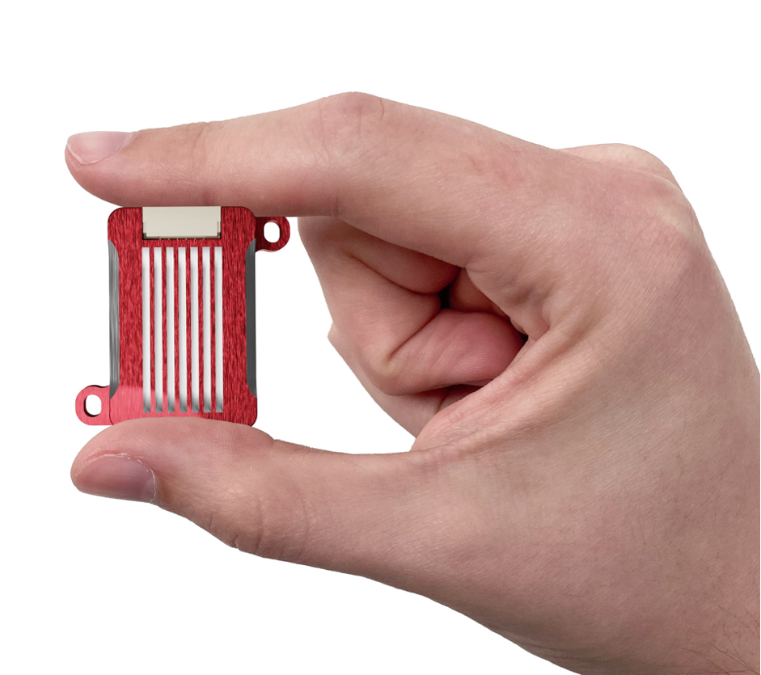
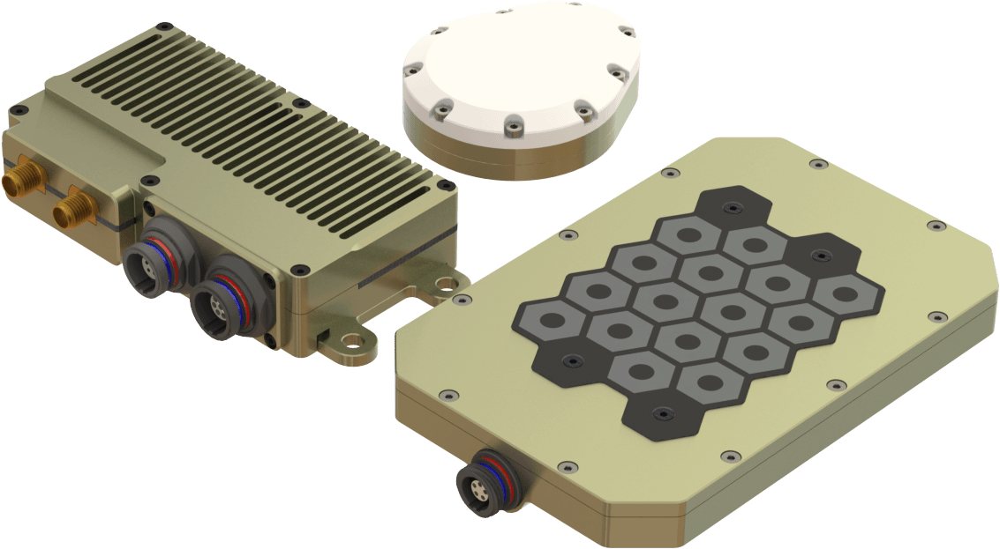
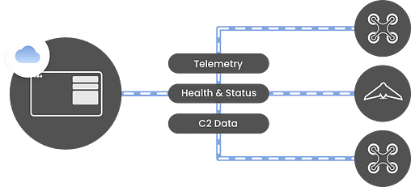

# uAvionix

## About uAvionix

**uAvionix was founded with the mission of bringing safety solutions to the unmanned aviation industry in order to aid in the integration of Unmanned Aircraft Systems (UAS) into National Airspace Systems (NAS).**

uAvionix offers low SWaP TSO certified and uncertified avionics for General Aviation (GA), Airport Surface Vehicles and the UAS markets. The team consists of an unparalleled engineering and management team with a unique combination of experience within avionics, surveillance, airport services, UAS aircraft development, radio frequency (RF), and semiconductor industries. uAvionix is backed by investors at Playground Global and Airbus Ventures.

## **Product Description**

### George UAV Autopilot

**George G2i and G3 Autopilots based on the CubePilot System. Migrate your existing Ardupilot or PX4 software and configuration to George’s robust certifiable platform.**

George combines the flexibility and over a decade’s worth of open-source innovation in UAS autopilots with the robustness of a certifiable DAL-C hardware and a DAL-C safety and sensor processor. George has the aircraft.

While George provides the flexibility of the Pixhawk platform, it’s sweet spot is optimized for Vertical Takeoff and Landing (VTOL) Fixed Wing platforms – the most flexible and energy-efficient combo to emerge in aviation in over a century.

Learn more: [George UAV Autopilot](https://uavionix.com/products/george/)

### **truFYX**

**The 1st TSOd GPS Source for UAS.** truFYX weighing only 20 grams and able to fit in the palm of your hand, truFYX integrates into nearly any configuration. Compatible with popular autopilots and approved for transponder and ADS-B solutions, truFYX is the trusted GPS source for your UAS or UAM operation. truFYX uses industry-standard NMEA or MAVLink protocols.

| Specification     |               |
| ----------------- | ------------- |
| Weight            | 20 grams      |
| Size              | 47.37×8.21 mm |
| HPA / VPA         | 5 m / 7 m     |
| Power Consumption | 350mW         |
| Velocity Accuracy | 3 m/s         |
| Time Accuracy     | 30 ns         |
| Update Rate       | 5 Hz          |

Learn more: [truFYX](https://uavionix.com/products/trufyx/)

### ****

### **ping200X**&#x20;

**Transponder & ADSB Out Device. This is the 1st and only TSOd unit on the market for UAS.**

| **Specification** |                                                                                 |
| ----------------- | ------------------------------------------------------------------------------- |
| Weight            | 50 grams                                                                        |
| Size              | 47 x 54 x 9 mm                                                                  |
| Input Voltage     | 
11-34V (3S-8S LiPo) 1.5W Continuous On/Alt.  4W Peak (8ms maximum)
 |

ping200X is the premier FAA TSO Certified Mode S ADS-B OUT transponder for UAS. Enabling airspace access, regulator and Air Navigation Service Provider (ANSP) acceptance worldwide, ping200X enables your aircraft to be detected by Secondary Surveillance Radar (SSR), Traffic Collision Avoidance Systems (TCAS), and ADS-B IN receivers.

Compact and light, ping200X is a Level 2els, Class 1 transponder small enough to fit on Class 1 and 2 sUAS. At only 50-grams, the ping200X transponder packs a punch managing to outperform bulkier transponders while drawing only 1.5 Watts.

Learn more: [**ping200X**](https://uavionix.com/products/ping200x/)****

****

### ping2020i **** / ping1090i

**ADSB Transceiver for ADSB In & Out.** ping2020i detects aircraft threats on both 1090MHz and 978MHz within a 100 statute mile radius in real-time and allows nearby aircraft to see you on 978MHz.

ping2020i is the world’s smallest, lightest, and most affordable full-range, dual-link Automatic Dependent Surveillance-Broadcast (ADS-B) transceiver with integrated Satellite Based Augmentation System (SBAS) Global Positioning System (GPS) and precision barometric sensor. At just 26 grams, it assists with Detect and Avoid (DAA) for Unmanned Aircraft Systems (UAS) operations in the National Airspace System (NAS).

| **Specification** |            |
| ----------------- | ---------- |
| Weight            | 26 grams   |
| Size              | 25x40x16mm |
| **WAAS GPS**      |            |
| Augmentation      | SBAS       |
| Sensitivity       | -166dBm    |

Learn more: [ping2020i](https://uavionix.com/products/ping2020/)

### pingRX PRO

**Professional detect and avoid ADSB Receiver.**&#x20;

pingRX Pro is a dual-band ADS-B receiver capable of tracking aircraft on both 978MHz and 1090MHz.

The all-new pingRX Pro is the latest purpose-built Detect and Avoid (DAA) system for professional UAS applications. With easy autopilot integration and the added protection of an aircraft-aluminum housing and detachable remote mount antenna, pingRX Pro is the ideal ADS-B receiver for professional UAS operators who need reliability, rugged build quality, and flexibility for limitless UAS applications.

pingRX Pro features a maximum range of nearly 100 times any competitive solution **** and meets all suggested well clear distances.

| Specification         |                                                  |
| --------------------- | ------------------------------------------------ |
| Weight                | 8 grams                                          |
| Size                  | 32x31x9mm                                        |
| Input Voltage / Power | 4-6V / 150mA                                     |
| Interface             | 
MAVLink Serial 57600bps 

UCP 115200
 |

Learn more: [pingRX PRO](https://uavionix.com/products/pingrx-pro/)

### SkyLine

**Enterprise Managed C2 Infrastructure.** SkyLine is the first Enterprise Command and Control (C2) infrastructure management service built from the ground up to meet aviation design standards for critical UAS and UAM applications. Leveraging DO-362A SkyLink radios, SkyLine integrates hardware, software, and services for seamless management of your mission and infrastructure.

Monitor and control aircraft location, network health, signal strength, and load balancing and roaming capabilities from the SkyLine Service Platform

.png>)

The SkyLink hardware and Managed Infrastructure services provide centralized control over your mission, be it linear infrastructure or wide-area coverage.

Learn more: [SkyLine](https://uavionix.com/products/skyline/)

### microLink

**microLink is an FCC (U.S.A.) and IC (Canada) approved, aviation-grade, Beyond Visual Line of Sight (BVLOS) Command and Control (C2) datalink radio specifically designed for long-range mission-critical UAS operations. microLink is the only solution when integrity and performance are critical to your mission.**

microLink and skyStation use GPS UTC timing for its precision frequency hopping algorithm. While skyStation includes an internal GPS, microLink can receive GPS timing from your autopilot, or a dedicated high-quality GPS such as the uAvionix microFYX or the CubePilot [Here+ GPS](https://docs.cubepilot.org/user-guides/here+/here+v2-user-manual).

| Specification |                                                                              |
| ------------- | ---------------------------------------------------------------------------- |
| Weight        | 
16 grams (Airborne Radio)

500 grams (Ground Radio)
              |
| Size          | 
31x26x9mm (Airborne Radio)

122x82x55mm (Ground Radio)
           |
| Input Power   | 
4-6V / 1.7W Peak (Airborne Radio)

POE / 13W Peak (Ground Radio)
 |
| Bandwidth     | 200kHz                                                                       |

Learn more: [microLink](https://uavionix.com/products/microlink/)

## Contact Information

Joe Gibbs\
[joe.gibbs@uavionix.com](mailto:joe.gibbs@uavionix.com)\
PH: 971-207-3332
