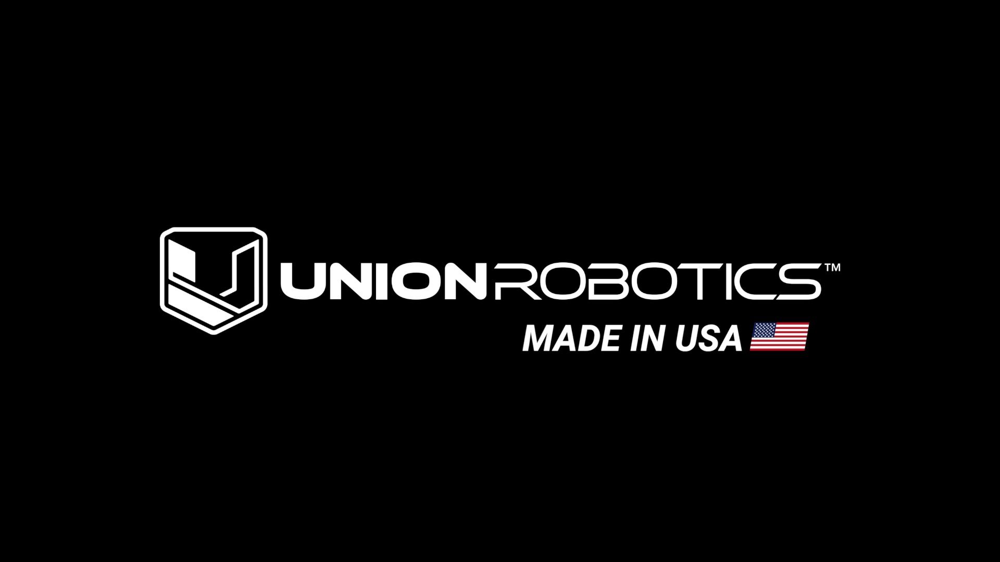

# Union Robotics

## Product Manuals


[meadowhawk-2](meadowhawk-2/)



[herelink-blue](herelink-blue/)


## Customer Support

#### :telephone\_receiver: 1-888-864-6680

:envelope: **support@union-robotics.com**

Support team is located in Portland, Oregon USA, _Pacific Standard Time_ (_PST_)

## Website

### [www.union-robotics.com](https://www.union-robotics.com)

