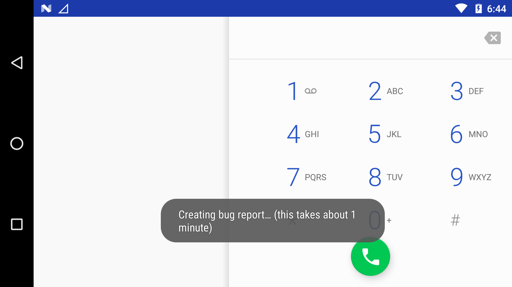

# Bug Report

## Create a Bug Report from the Ground Station

Navigate to the home screen on the Ground Station and click the `App` icon in the lower right hand side of the screen.

Click the `Phone` app.

Dial `*#*#284#*#*` , when complete, the system will automatically start generating a bug report.

Plug the Ground Staion into a PC using a USB micro cable.

When plugged into a PC, swipe down on the top of the middle of the screen on the Ground Station to pull down the menu bar. Select `USB charging this device` to change the USB settings.

Select `Transfer files` to change the USB settings to allow the Ground Station to act as a storage device when connected to a PC.

On the PC navigate to the `Optimus` folder, then navigate to the `debug_log` folder to access the bug report zip file.

Email us the bug report [support@union-robotics.com](mailto:union-robotics.com)
