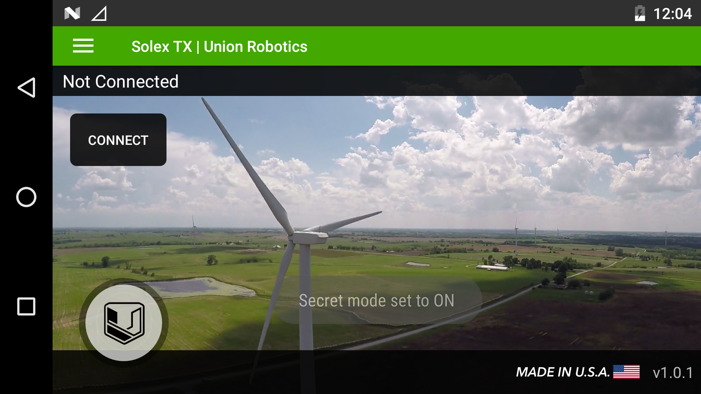
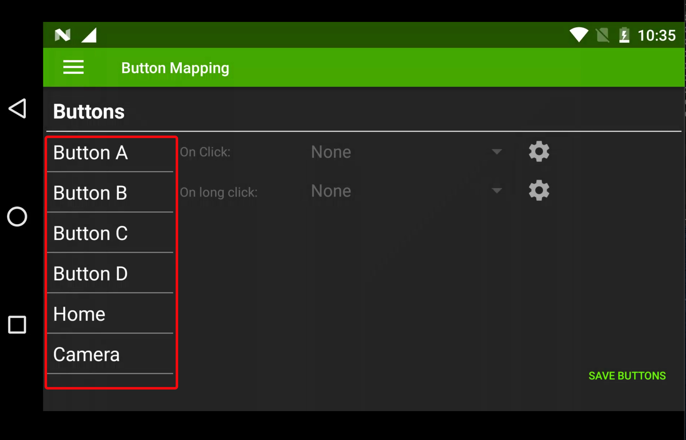
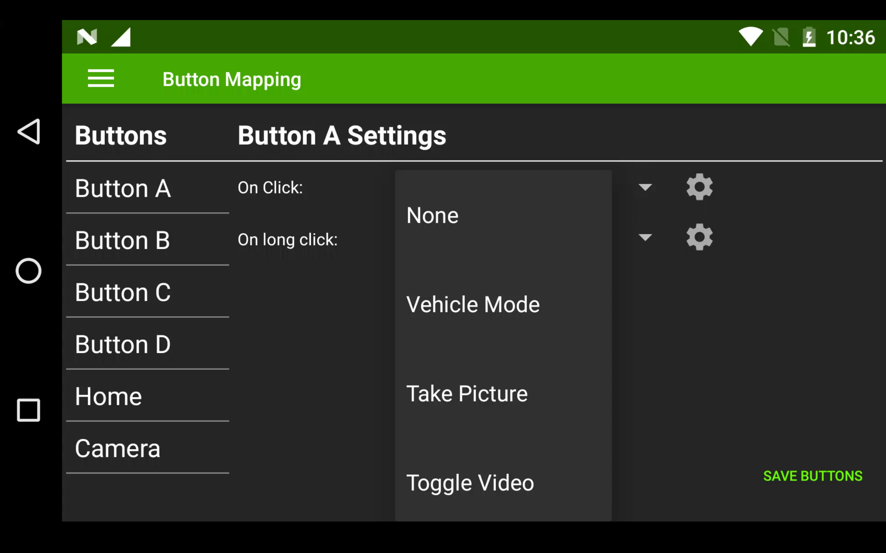
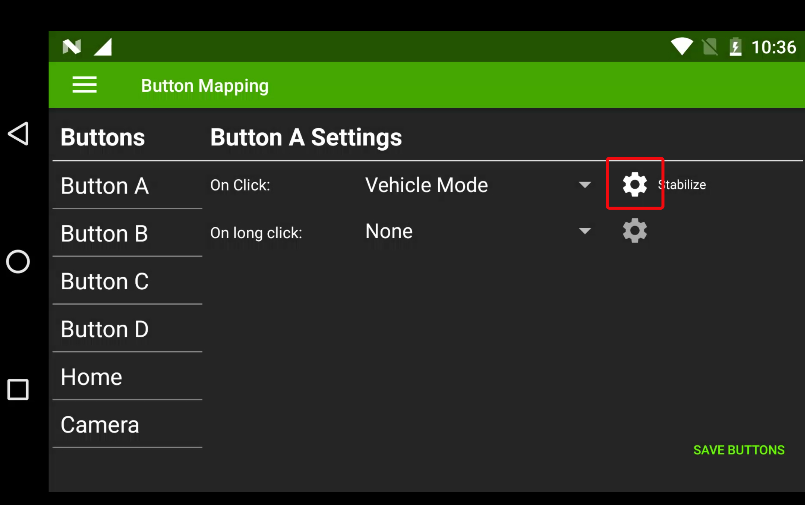
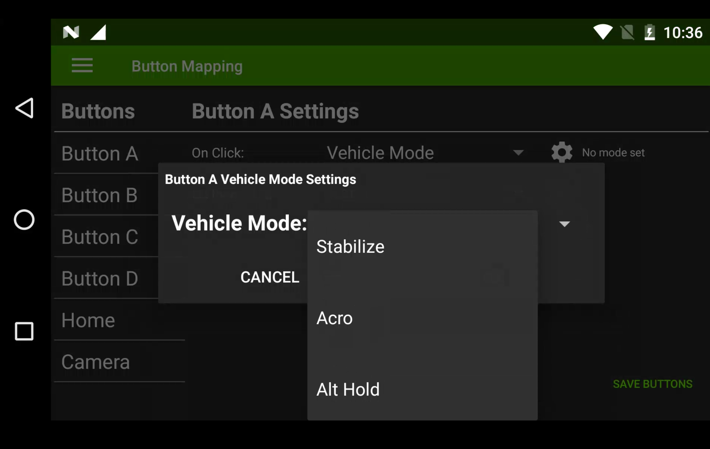
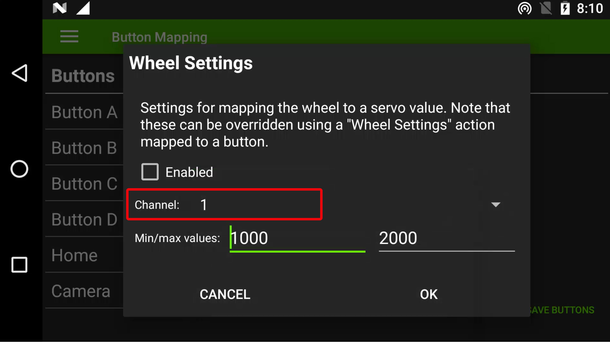
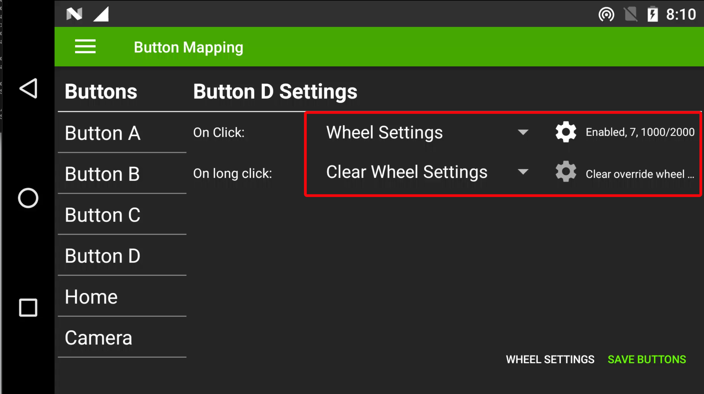
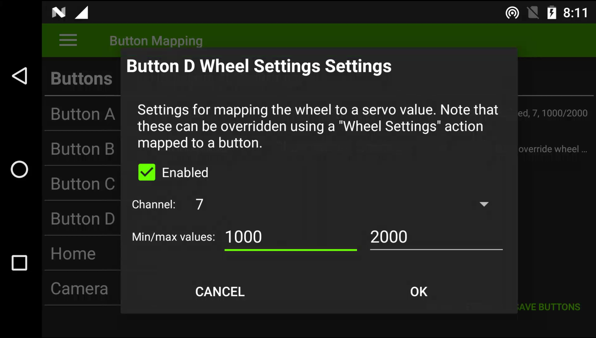
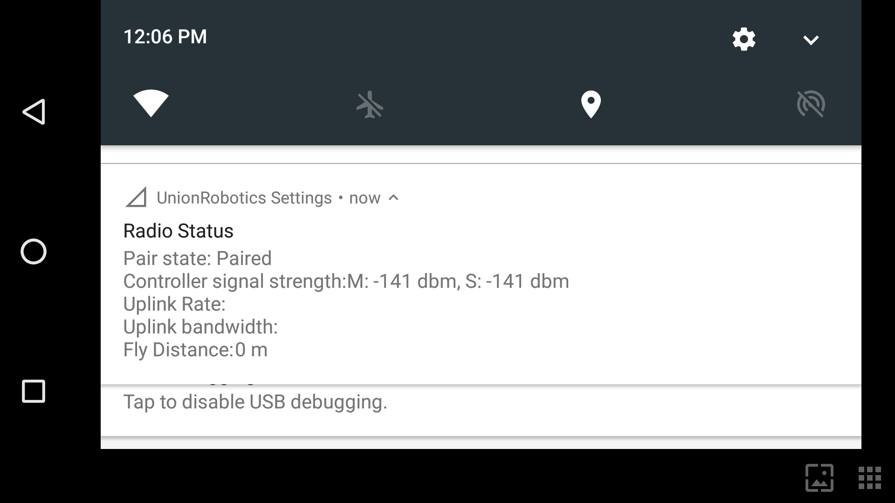

# Configure Buttons

## Button Mapping

To configure buttons, the "Secret Mode" needs to be set to 'ON'.

Open the UR/Solex TX App

Press and hold the Version number at the bottom right of the screen for 5 seconds.

On release, the "Secret mode set to ON" message should appear.

Click the hamburger menu icon in the top left corner

Select `Button Mapping` &#x20;

Choose desired button

Select either `Click` or `Long Click` (**Note** this allows you to set two functions to each button)

.jpg>)

Click on drop down to select the function you want

Click on small cog to select option with-in selected function

Select function option

Repeat for each button assignment and click `SAVE BUTTONS` in bottom corner to finish

## Hardware Wheel

The hardware wheel is mapped to SBUS channel 5 by default but can also be configured in UR/Solex TX to Servo output channels 1-16 on the Autopilot, you also have the ability to switch the servo output via a button in UR/Solex TX.

**To Configure Wheel in Solex TX**

* Open UR/Solex TX App&#x20;
* Click the hamburger menu icon in top left corner
* Select `Button Mapping` as above
* Click `WHEEL SETTINGS` in the bottom right corner

Select the desired servo channel from 1- to 16

Finish by clicking OK and click `SAVE BUTTONS` in bottom corner

To configure a button to change the wheel servo output configure the button to `WHEEL SETTINGS`&#x20;

Click the cog and set new channel and PWM values and click `OK` and then `SAVE BUTTONS` in bottom right corner. &#x20;

Once changed the wheel will output on the new selected channel, to return to its original servo output you will need to program one button function to `Clear Wheel Settings` as shown above.

## Configure Sbus Buttons & Wheel

DataLink is fitted with six programmable buttons and one hardware wheel. These can be configured to control sbus channel outputs from the Rover Unit's dual sbus connector and to send Mavlink commands to the autopilot via UR/Solex TX.

### **Autopilot Mode Selection - Important**

Autopilot mode selection must not be programmed to sbus channels. Mode selection should be configured to Mavlink commands within UR/Solet TX to ensure predictable behavior in the event of signal loss or system reboot.

**Important Note:** Ardupilot sets Sbus channel 5 to mode selection as default, this should be disabled with DataLink by setting the pram FLTMODE\_CH: to 0.

### Sbus Outputs

The HereLink Blue settings app allows you to program buttons A,B,C,D,Cam & HW Wheel to control sbus outputs on the air unit, HereLink Blue has dual independent sbus outputs on bus 1 and bus 2. Buttons can be configured on channels 5 - 16 on bus 1 and channels 1-16 on bus 2.

Channels 1-4 on Bus 1 are reserved for RC control.

Each button can be programmed in one of 3 modes with long press and short press actions in Toggle and Multi modes.

### Button Modes Available

* Toggle  = Output latches between two pwm values with a short or long press option.
* Momenty = Output changes to active value when pressed and held, returns to default when released.&#x20;
* Multi = Sends command for channel to go to preset pwm value. Multi buttons can be stacked on both short and long press as well as multiple buttons configurations to allow channel outputs to range in values. &#x20;

To select the mode either press T for Toggle, M for Momantry, when neither T or M is selected the button is in Multi mode.

### Profiles

HereLink Blue Sbus Buttons allows you to save multiple button profiles. This means you can set up HereLink Blue to have multiple configurations for different applications.

### Sbus Button Configuration

#### To Configure

From App Launcher slide down the notification drawer from the top and select "Union Robotics Setting". Slide left for buttons screen. Here you will find the button configuration options for sbus.

.png>)

Click `NEW` and type name for your new profile and press `OK`.

.png>)

Select the first button you want to configure from the drop down menu then click `ADD` .

"Screenshot to be updated"

Select desired button mode by tapping the letter, ie: Toggle, Momenty or leave blank for Multi

**Tip: To move to the top end of the range you can scroll backwards, also ‘Flicking’ the numbers will scroll faster though the range.**

If setting a Multi mode button set desired active pwm output.&#x20;

Set sbus channel output and bus.&#x20;

Once configured you must click `SAVE` to store settings.

Next continue to add more buttons via the above process.

To remove a button config simply click the bin icon next to the name.&#x20;

#### Multi Buttons

Multi button config allows you to set short and long press options as well as other buttons to set stages outputs on a sbus channel, below is an example of two buttons changing a channel to 4 different pwm values.

When setting up Multi mode buttons at least one on each channel must be selected as default value, this sets the default output pwm the system will default to on power on.

