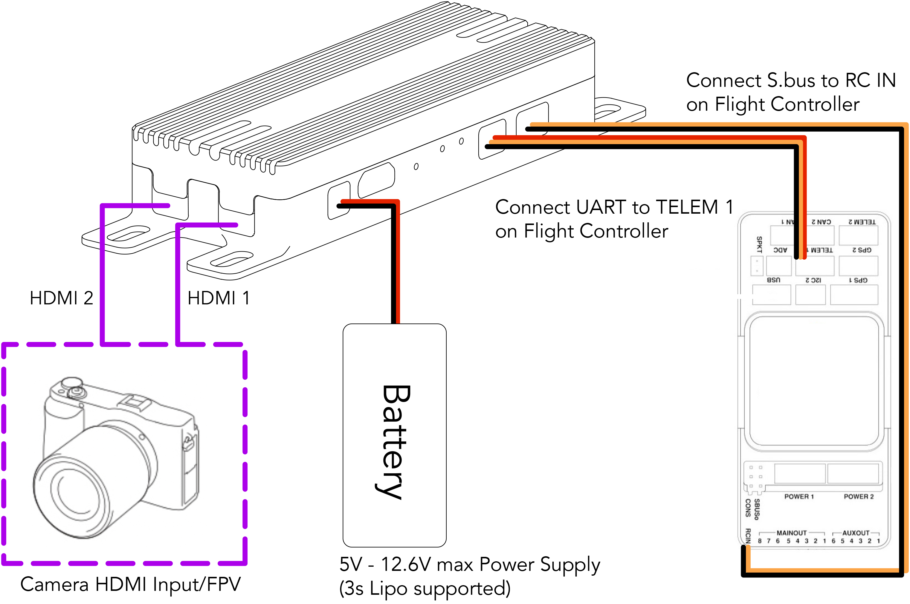

# Air Unit Interface & Installation

## Connector Inputs

1. HDMI 2: Micro HDMI, for video input
2. HDMI 1: Micro HDMI, for video input (preferred)
3. Power: 6V - 12.6V max (3s Lipo supported) power input _\*avoid sharing BEC with servos_
4. Micro USB: For debug or upgrade, support OTG
5. Pair/Reset: For pairing and rest
6. LED 1,2: To indicate pairing status and transmission status
7. UART: 3.3V / 5V UART
8. S.bus: Tow 3.3V RC output
9. Antenna 1,2: MMCX, for signal transmission and communication

## Pin Out

.jpeg>)

## Connector Routing

## Installation

* Mount the Rover Unit securely to the drone
* Choose the best position to attache the rover unit antennas.
* Connect the antennas to ANT 1, ANT 2 (MMCX) on the Rover unit. There shall be no metal parts or any conductor attached to the antennas.&#x20;
* Connect S.bus on the Rover Unit to the RC IN on the Flight Controller.
* Connect UART on the Rover unit to the TELEM 1 or TELEM 2 on the Flight Controller.
* Connect 5V - 12.6V max (3s Lipo supported) battery to the power input on the Rover Unit.
* Connect a camera to HDMI 1 (preferred) on the Rover Unit. If you are sing two camera, connect the second camera to HDMI 2. You may switch from Stream 1 and Stream 2 on the Ground Station to display the corresponding video stream.
