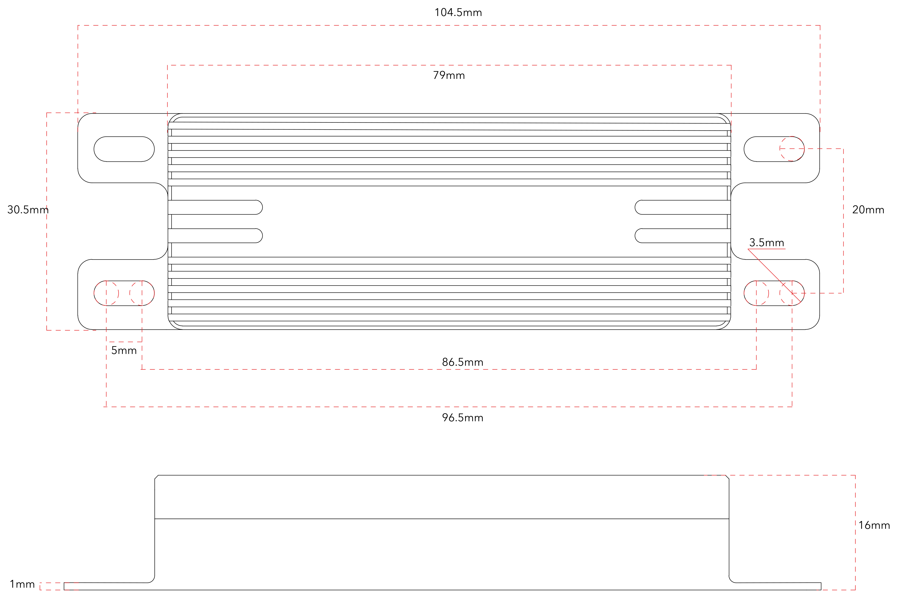

# Air Unit Specifications

|                    |                                         |
| ------------------ | --------------------------------------- |
| Feature            | Specification                           |
| Housing:           | 6061 Aluminum                           |
| Dimensions:        | 104.5mm x 30.5mm x 16mm                 |
| Weight:            | 90g (w/ antennas)                       |
| Antennas:          | 2x circularly polarized antenna 1.9dbic |
| Signal Bandwidth:  | 20MHz/10MHz                             |
| Power Consumption: | <4W                                     |
