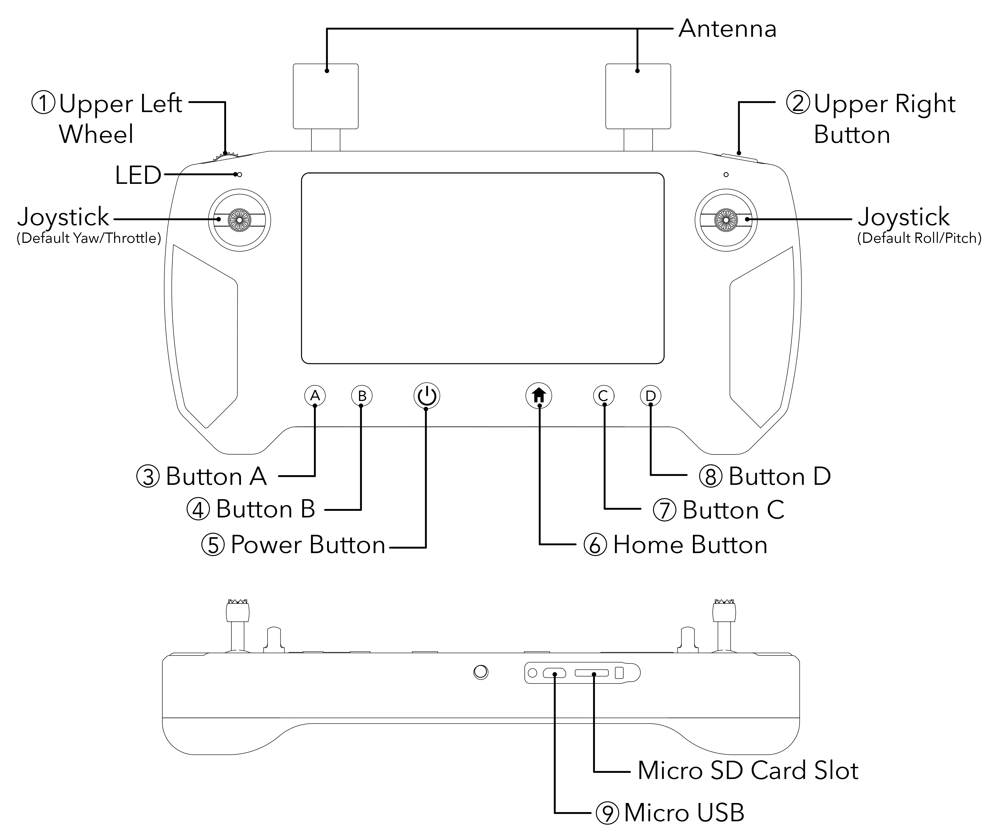

# Ground Station Buttons & LED

|                        |                                       |
| ---------------------- | ------------------------------------- |
| Feature                | Specification                         |
| 1) Upper Left Wheel:   | Control gimbal (configurable)         |
| 2) Upper Right Button: | Take photo (configurable)             |
| 3) Button A:           | Configurable                          |
| 4) Button B:           | Configurable                          |
| 5) Power Button:       | Power on/off and unlock screen        |
| 6) Home Button:        | Return to Land options (configurable) |
| 7) Button C:           | Configurable                          |
| 8) Button D:           | Configurable                          |
| 9) Micro USB           | Charge battery/connect to computer    |

## Ground Station LED (Left)

|                      |                          |
| -------------------- | ------------------------ |
| Feature              | Specification            |
| Flashing Red Light:  | Critical battery power   |
| Steady Red Light:    | Low battery power        |
| Steady Yellow Light: | Medium battery power     |
| Steady Green Light:  | Sufficient battery power |
