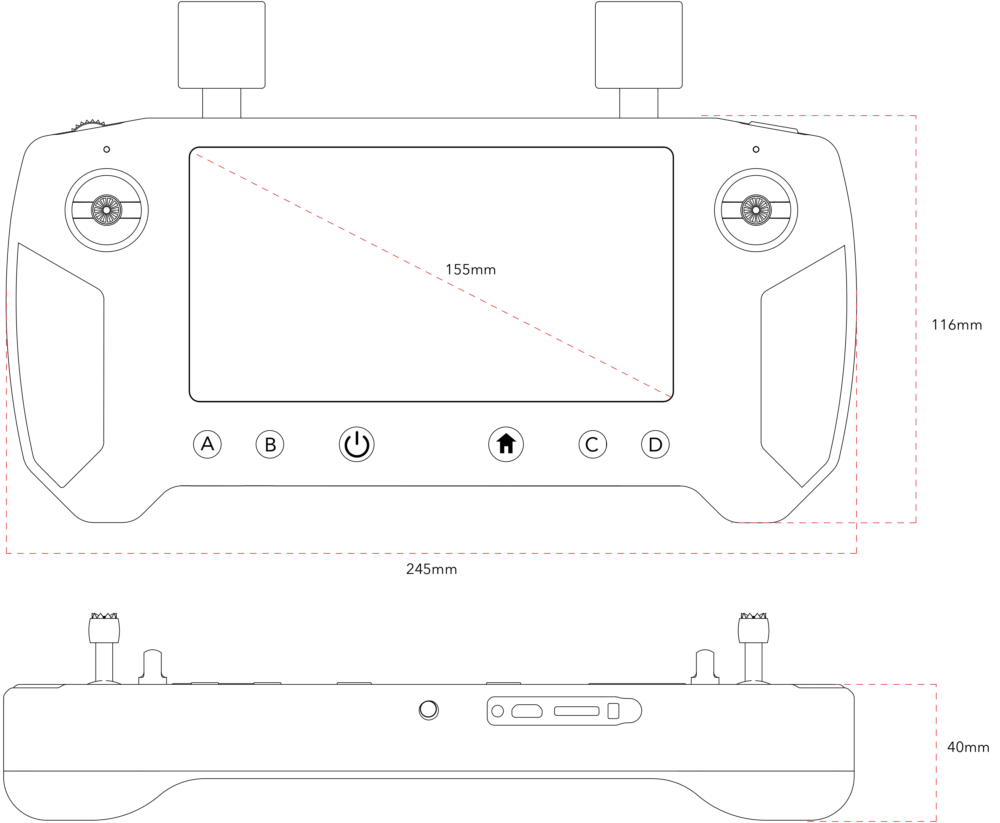

# Ground Station Specifications

|                    |                                                                                                                             |
| ------------------ | --------------------------------------------------------------------------------------------------------------------------- |
| Feature            | Specification                                                                                                               |
| Housing:           | 6061 Aluminum                                                                                                               |
| Dimensions:        | 245mm × 116mm × 40mm not including external antenna and joystick                                                            |
| Weight:            | 920g (w/ antennas)                                                                                                          |
| Screen:            | 5.46 inch, 1080P, 16 Million Colors, Capacitive Touch Screen                                                                |
| Audio:             | 1x Built-in Speaker, 2x Built-in Microphone                                                                                 |
| Remote Control:    | 2x Joystick, 1x Wheel, 6x Button, 1x Upper Right Button                                                                     |
| Communication:     | WIFI/GPS 2.4GHz                                                                                                             |
| LED:               | 2x tricolor LED (left, right)                                                                                               |
| Interface:         | 1x MicroUSB, 1x Micro SD Card Slot (extendable to max 64GB)                                                                 |
| Antenna:           | 2.4GHz (1.9dBic) × 2 detachable ,built-in wifi antenna, built-in GPS antenna, external GPS antenna interface x 1 (optional) |
| Power:             | 4950mAh built-in Li-ion battery                                                                                             |
| Charging:          | Support Micro USB 5V 2A                                                                                                     |
| Power Consumption: | <4W Average (with transmission on, medium screen brightness, WIFI off, GPS off)                                             |
