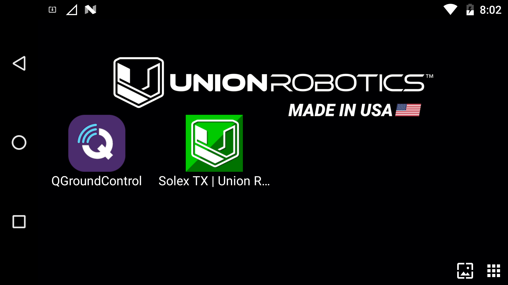
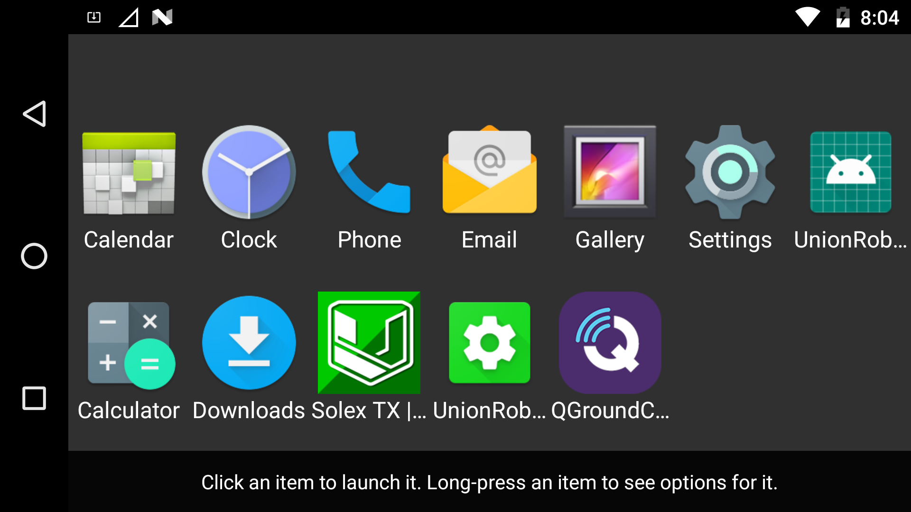

# Installing a Custom App

## Installing SDK Platform-Tools

Ensure you have latest [platform-tools](https://developer.android.com/studio/releases/platform-tools) installed on your computer system.

If you do not have the SDK "platform-tools" installed on your computer, download it from this link and keep track where the the "platform-tools" folder is located:



## Connect the HereLink Blue to a computer

Enable "Developer Mode" on the DataLink by navigating to `Settings`->`About Phone`->`Build Number` and tap at least 7 times on "Build Number."


Enable `Settings`->`Developer options`->`USB debugging`


Using a USB to Micro USB cable, plug the HereLink Blue into a computer and open the computer's terminal command line


## Open the Terminal <a href="#open-the-terminal" id="open-the-terminal"></a>

For Windows, navigate to the "platform-tools" folder. In this folder, hold **down Shift and then right-click**. From the menu select the “**Open Command window here**” option. If the option to open the command window is not available, then click on the "open PowerShell window here".<br>


For Mac, navigate to the "platform-tools" folder. **Right Click** the folder and select  `Services`->`New Terminal at Folder`


## Check if the unit is connected

Using the computer's terminal, check it the device is connected via the adb command protocol:

Mac:

```
adb devices

```


Windows:

```
.\adb devices

```


## Installing .apk using adb

Move the .apk file to the SDK "platform-tools" folder on your computer


##

Install the .apk using `adb install <app_name>.apk` in your computers terminal

Mac:

```
adb install <app_name>.apk

```


Windows:

```
.\adb install <app_name>.apk

```


The new app should now appear in the app launcher's list.





## Uninstall an app using adb

To remove the app use `adb remove org.myorg.appname`

```
$ adb remove org.myorg.appname
Success
```
