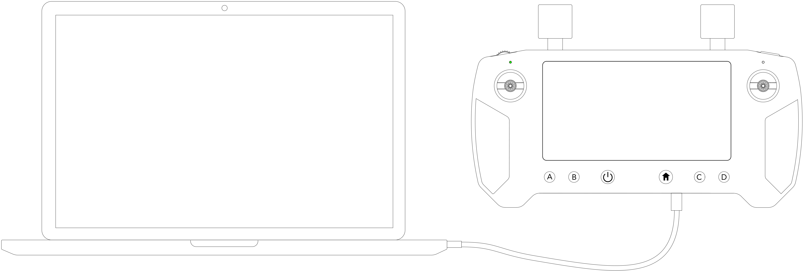
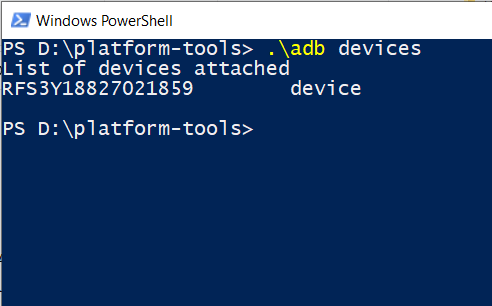
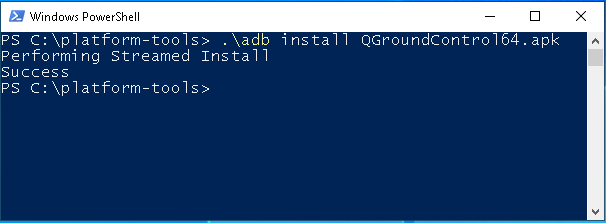
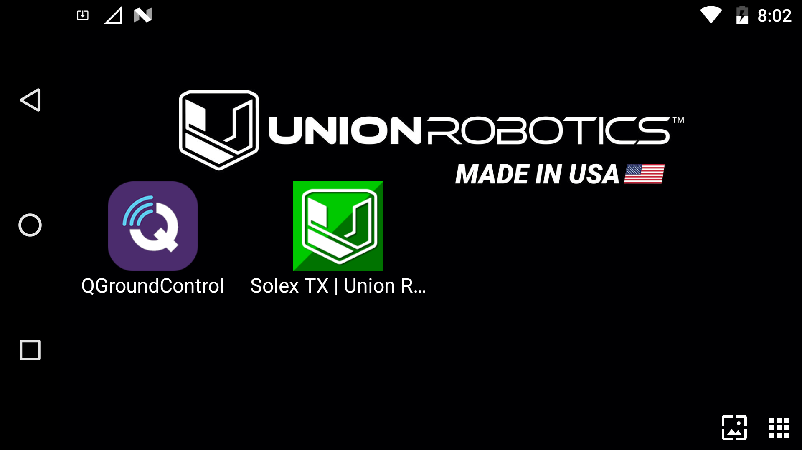
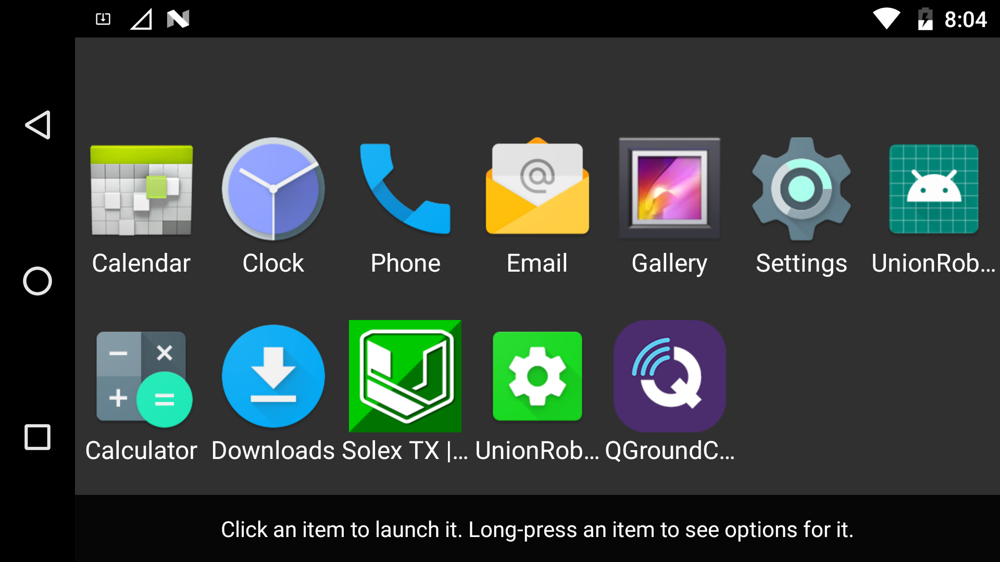

# Installing QGC

## Installing SDK Platform-Tools

Ensure you have latest [platform-tools](https://developer.android.com/studio/releases/platform-tools) installed on your computer system.

If you do not have the SDK "platform-tools" installed on your computer, download it from this link and keep track where the the "platform-tools" folder is located:



## Connect the HereLink Blue to a computer

Enable "Developer Mode" on the HereLink Blue by navigating to `Settings`->`About Phone`->`Build Number` and tap at least 7 times on "Build Number."


 (1).png>)


Enable `Settings`->`Developer options`->`USB debugging`


Using a USB to Micro USB cable, plug the DataLink into a computer and open the computer's terminal command line



## Open the Terminal <a href="#open-the-terminal" id="open-the-terminal"></a>

For Windows, navigate to the "platform-tools" folder. In this folder, hold **down Shift and then right-click**. From the menu select the “**Open Command window here**” option. If the option to open the command window is not available, then click on the "open PowerShell window here".\


.png>)

For Mac, navigate to the "platform-tools" folder. **Right Click** the folder and select  `Services`->`New Terminal at Folder`


## Check if the unit is connected

Using the computer's terminal, check it the device is connected via the adb command protocol:

Mac:

```
adb devices

```


Windows:

```
.\adb devices

```



## Download QGC APK

Click the link below to download the Android 64 bit QGC .apk to your computer:&#x20;



Move the .apk file to the SDK "platform-tools" folder on your computer


## Installing QGC to the DataLink

Install QGroundControl using `adb install QGroundControl64.apk` in your computers terminal

Mac:

```
adb install QGroundControl64.apk

```


Windows:

```
.\adb install QGroundControl64.apk
```



QGC should now appear in the app launcher's list.




