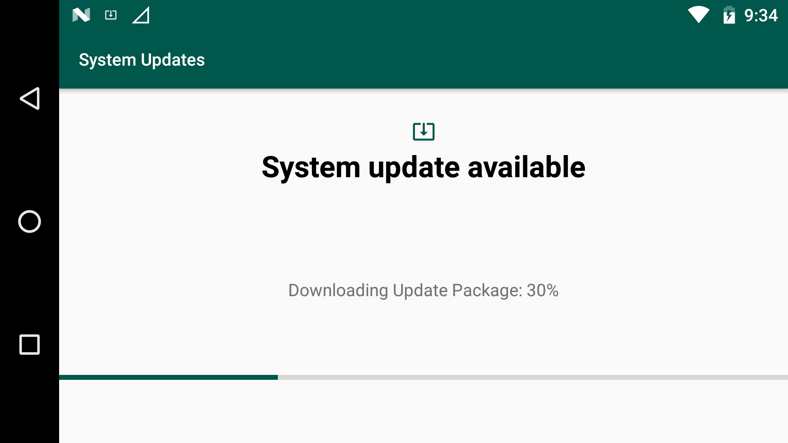
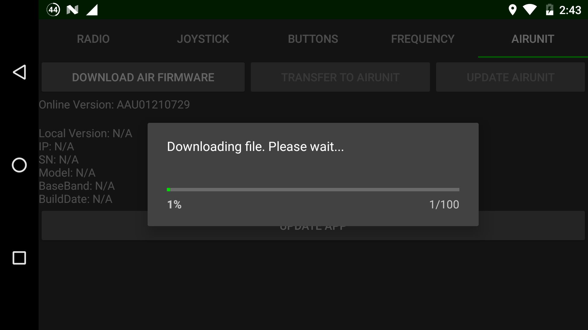
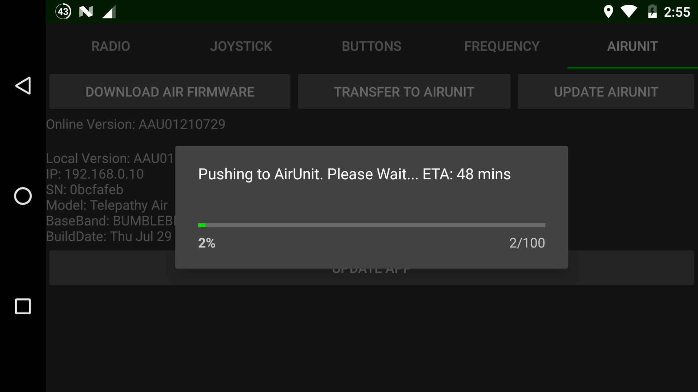
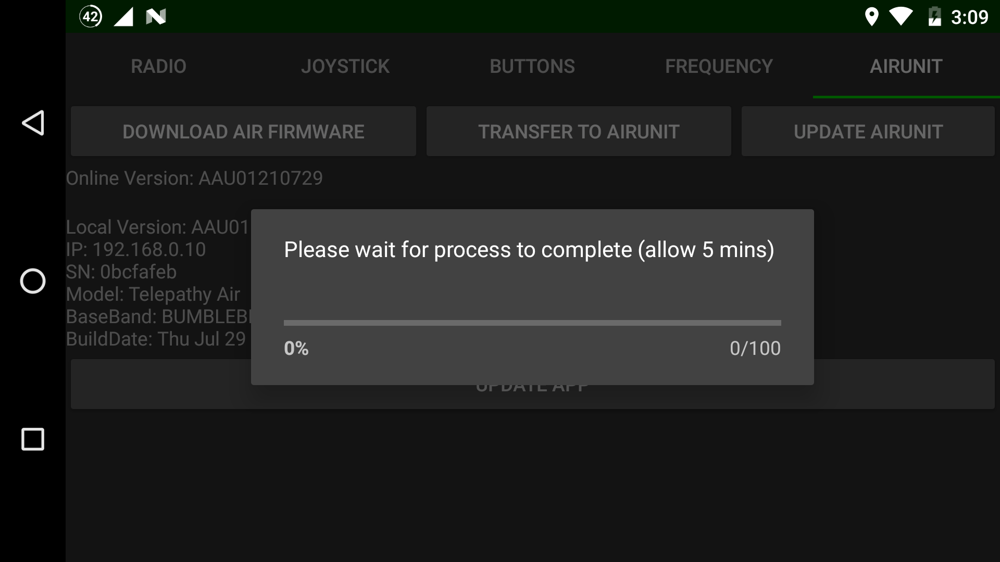
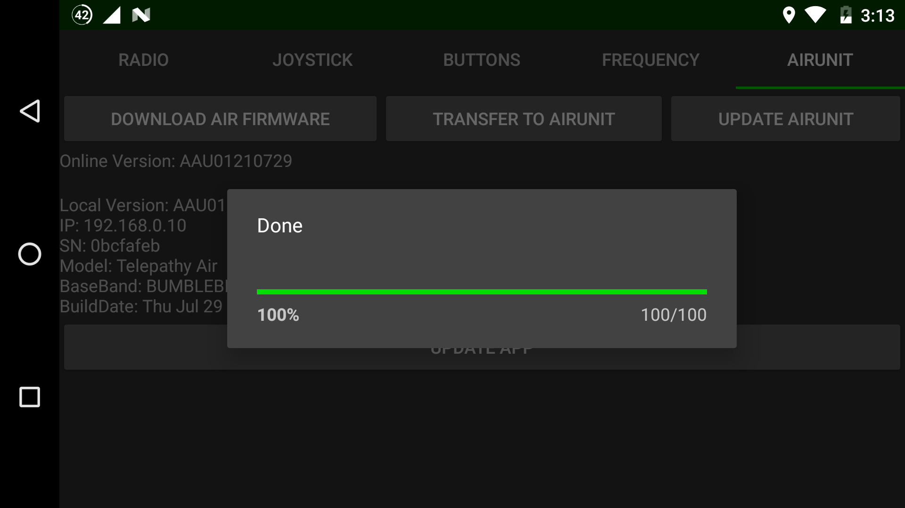

# Update Firmware

## Update Ground Station

Connect your DataLink to a 5.8GHz WIFI and make sure an internet connection is available

Pull down from the top and select the settings cog in the top corner or click the `Update Available` tab

Scroll to the bottom and click the `About Phone` option

.png>)

Select `System Update`&#x20;

Select `CHECK FOR UPDATE` in the bottom corner&#x20;

Select `UPDATE` in the bottom corner

The system will update and install

## Update Error

There are 3 things the need to be checked if you receive an error

1. You are connected to stable WIFI
2. The device time/date is correct
3. You entered the correct Key

## Update Air Unit

In the `Radio Settings` menu, select `AIRUNIT` tab. The app will download the settings from the air unit and search online to see if there is an update available.&#x20;

Select `DOWNLOAD AIR FIRMWARE` tab.

The Air Unit Firmware will start downloading to the Ground Station.

Once downloading is complete, select the `TRANSFER TO AIRUNIT` tab.

The downloaded firmware will start to transfer to the Air Unit.

Once the transfer is complete, select the `UPDATE AIRUNIT` tab.

The new Air Unit firmware will be installed on the Air Unit.

Once complete, click anywhere on the screen outside the grey box to continue.

