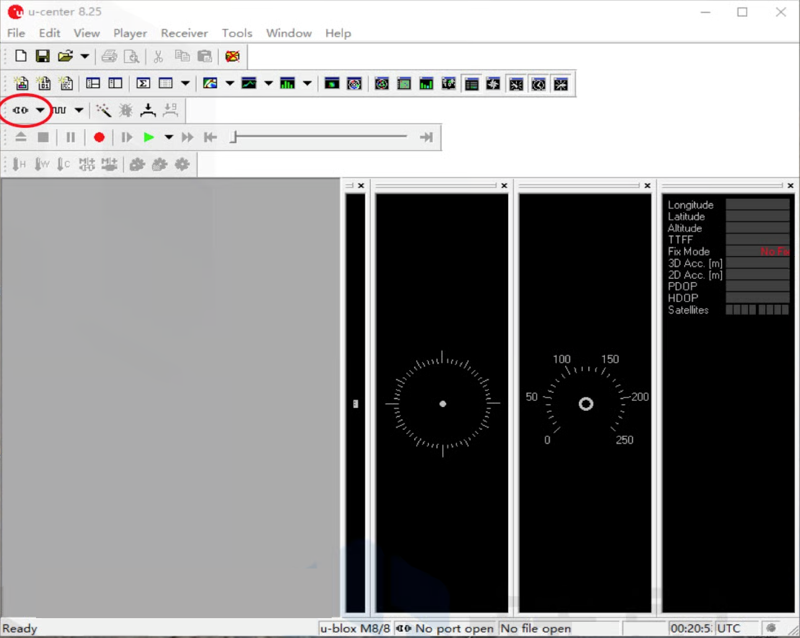
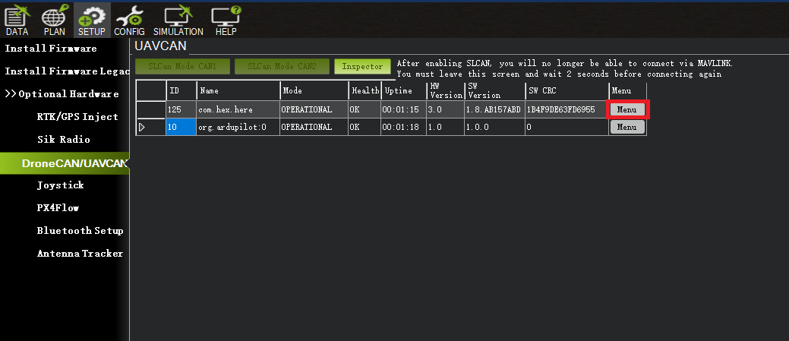

# UR/Solex TX App

## **Connecting the Ground Station to the Air Unit**

If the Ground Station and Air Unit link does not automatically connect, press the `CONNECT` button on the left hand side of the display screen.

.png>)

Once connected, the UR/Solex TX app will download the vehicle's parameters

## **Flight Screen**

To view the flight screen, click on the Union Robotics logo at the bottom left side of the screen.

.png>)

### Pre-Flight Checklist Screen

This will take you to the “Pre-Flight Checklist” screen, where you are required to check each item.

**WARNING: Physically inspect the aircraft for each item on the Pre-Flight Checklist before checking the box on the screen. Failure to do so could result in aircraft failure or injury.**

.png>)

Once all items have been checked on the Pre-Flight Checklist screen, you will be automatically directed to the Verify Controls screen. This screen reminds the pilot to verify all the aircraft controls properly function upon take off before starting the mission. Click `GO!` to be directed to the flight screen

## **UI Overview**

### **Flight Screen**

.png>)

|                        |                                                                         |
| ---------------------- | ----------------------------------------------------------------------- |
| Feature                | Specification                                                           |
| Distance:              | Distance the aircraft is in relation to the ground station              |
| Control Panel:         | Displays control panel                                                  |
| Gimbal Angle:          | The current pitch angle of the camera gimbal                            |
| Radio Signal:          | Received signal strength indicator                                      |
| Batt:                  | Vehicle battery remaining voltage                                       |
| Telemetry Panel:       | Displays vehicle's telemetry                                            |
| Camera Exposure Value: | Displays camera's current exposure value (with compatible cameras)      |
| Camera Zoom:           | Controls camera's zoom (with compatible cameras)                        |
| Shutter/Record:        | Controls camera's shutter and record function (with compatible cameras) |
| Photo/Video:           | Controls camera's photo and video mode (with compatible cameras)        |
| Map View:              | Displays map screen                                                     |
| Alt:                   | Altitude from ground level at ground station                            |

### Land

|                                   |                                                                                                                                                                                                                                                                                                                                                                                                                                                                                                                                                                                                                                            |
| --------------------------------- | ------------------------------------------------------------------------------------------------------------------------------------------------------------------------------------------------------------------------------------------------------------------------------------------------------------------------------------------------------------------------------------------------------------------------------------------------------------------------------------------------------------------------------------------------------------------------------------------------------------------------------------------ |
| Feature                           | Specification                                                                                                                                                                                                                                                                                                                                                                                                                                                                                                                                                                                                                              |
| Land Now                          | Land Now will initiate the auto-land function, which will land the aircraft in the current place. The vertical speed at which the Meadowhawk will descend during an auto-land varies as the Meadowhawk approaches the ground. By default, the aircraft will descend at 1m/s until 10 ft above the ground and then it will slow its descent considerably until touchdown.                                                                                                                                                                                                                                                                   |
| Return-to-Launch (RTL)            | 
Return-to-Launch Mode will command the Meadowhawk to fly back to the defined launch point. When the Meadowhawk first acquires a GPS position, it sets this as the launch point of the flight. Return-to-launch Mode enables the aircraft to follow a straight path when returning to the initial launch point.

During an LOS event, RTL followed by auto-land will be initiated automatically. The Meadowhawk will first check its current altitude against the configured RTL altitude. The Meadowhawk will climb to safe-height. Next, the Meadowhawk will fly back to the launch position set at the initial GPS position.
 |
| Smart Return-to-Launch (SmartRTL) | When switched into Smart RTL, like regular RTL, the vehicle will attempt to return home. The “Smart” part of this mode is that it will retrace a safe path home instead of returning directly home. This can be useful if there are obstacles between the vehicle and the home position.                                                                                                                                                                                                                                                                                                                                                   |

### **Control Panel**

.png>)

|                   |                                                                      |
| ----------------- | -------------------------------------------------------------------- |
| Feature           | Specification                                                        |
| Arm/Disarm:       | Arm and Disarm the vehicle                                           |
| Mavlink Viewer:   | Live view of the Mavlink messages                                    |
| Blackbox Logging: | Turn on and off the redundant blackbox logging to the ground station |
| Reboot:           | Reboot the vehicle's autopilot                                       |

### **Map View**

Displays an overhead map view. This view can be used for mapping autonomous missions.

.png>)

#### **Layers**

When clicking on the layers button on the Map View, the layers option menu will display. The options will overlay on the map.

### **Alert Indications** 

The DataLink has many alarm, warning and failure indicators. All alarm, warning and failure indicators will be displayed in a red bar across the top of the ground station screen.\

|                                            |                                                                                                               |
| ------------------------------------------ | ------------------------------------------------------------------------------------------------------------- |
| Alert                                      | Specification                                                                                                 |
| Low Battery**:**                           | Battery failsafe has triggered, should land immediately                                                       |
| No GPS Fix:                                | Warns pilot that the GPS can not get a satellite fix                                                          |
| Telemetry Lost:                            | Warns pilot that the telemetry signal has been lost                                                           |
| High GPS HDOP:                             | GPS signal quality is insufficient                                                                            |
| Throttle Below Failsafe:                   | Ground controller has lost connection to the vehicle                                                          |
| Gyro Calibration Failed:                   | Failed to calibrate the IMUs on the vehicle                                                                   |
| Mode Not Armable:                          | Operator is attempting to arm the vehicle in a mode which does not allow arming                               |
| Rotor Not Spinning:                        | Autopilot has detected an error attempting to run one or more motors                                          |
| Vehicle is Leaning:                        | Vehicle orientation is not suitable for takeoff                                                               |
| Throttle Too High:                         | Current throttle setting is too high to arm safely (could result in spontaneous takeoff)                      |
| Safety Switch:                             | Operator attempted to arm, but hardware arm-safety switch is engaged                                          |
| Compass Calibration Running:               | Cannot arm, currently calibrating the compass                                                                 |
| RC Not Calibrated:                         | Ground control radio has not been calibrated for use with the vehicle                                         |
| Barometer Not Healthy:                     | Barometer is experiencing an error                                                                            |
| Compass Not Healthy:                       | Compass is experiencing an error                                                                              |
| Compass Not Calibrated:                    | Compass requires calibration                                                                                  |
| Compass Offsets Too High:                  | Compass calibration has resulted in unusable offsets                                                          |
| Check Magnetic Field:                      | Vehicle is near a metallic or magnetic object which is interfering with compass operation                     |
| Inconsistent Compass:                      | Compass readings are determined to be erroneous                                                               |
| Check Geo Fence:                           | Vehicle is outside of a defined fence area, not allowed to fly                                                |
| Inertial Navigation System Not Calibrated: | IMU calibration is needed                                                                                     |
| Accelerometers Not Healthy:                | IMU calibration is needed                                                                                     |
| Inconsistent Accelerometers:               | IMU calibration is needed                                                                                     |
| Gyros Not Healthy:                         | IMU calibration is needed, or vehicle needs to be moved to an orientation matching the powered-up orientation |
| Check Board Voltage:                       | Problem detected with power supplied to the autopilot                                                         |
| Inconsistent Gyros:                        | IMU calibration is needed, or vehicle needs to be moved to an orientation matching the powered-up orientation |
| Check Max Angle:                           | ANGLE\_MAX parameter set to an in appropriate value                                                           |
| RC Failsafe:                               | Ground controller has lost connection with the vehicle                                                        |
| Need GPS Lock:                             | Operator is trying to arm vehicle in a mode where GPS lock is needed, and there is no GPS lock                |
| EKF Home Variance:                         | EKF has detected a difference between expected and actual home points                                         |
| GPS Glitch:                                | GPS readings indicate an error (e.g. multipathing) - GPS signal cannot be trusted                             |
| Waiting for Navigation Alignment:          | AP is initializing and not ready to launch                                                                    |
| Altitude Disparity:                        | GPS and barometer altitudes are reported to be substantially different, indicating a possible error           |
| Vehicle Crash:                             | AP has detected that the vehicle has collided with terrain or some other solid object                         |
| EKF Variance:                              | EKF has detected uncertainty in GPS location, compass heading, IMU readings. Should not launch                |
| Need Position Estimate:                    | GPS needs to calculate an estimated position for the vehicle                                                  |

## **Missions**

The primary way to create and edit missions is in the Mission Editor, accessible from the main menu. The list of Missions you've created is seen from the Mission list (which appears when you click the "Missions" button on the left). The toolbar at the top lets you add or delete waypoints to/from a mission, or undo recent changes you've made.

When the mission editor is opened, it should be positioned at your current location on the map. If you have a specific place you want to create a mission at, then select "Search Address" from the menu. (You'll need an internet connection for this.) Type in the address, ZIP code, etc. you're interested in, and it will show you a list of addresses matching what you typed. Pick one, and the map will pan to that location. You can also search for a lat/lng directly by typing it into the search field.

### **Mission Vehicle Type**

Click the `VEHICLE TYPE` button in the top right of the missions screen. Select the desired vehicle you would like to run a mission with.

## Mission Types

### **Waypoint Missions**

To create a mission using  waypoints, click the **** `+` marker in the toolbar, which will then turn green. To the right on the toolbar, there will be a drop-down list of waypoint types that you can drop, choose Waypoint.

To add waypoints, click on the map where you want the aircraft to fly, starting with the place of launch. At each point, a marker will be placed on the map.

To change settings on each waypoint, click either the waypoint marker on the map, or the item in the horizontal list at the bottom. A panel will appear on the right of the screen with slider attributes. These are attributes of the waypoint that can be edited. The top sliders are common to most waypoints (i.e Altitude, speed). The next set (under "Details") is the set of attributes specific to that type of waypoint.

#### ****

#### **Takeoff Point**

To change the first waypoint to a Takeoff, click the top of the panel, and it will drop down a list of items. Click **** `Takeoff` in the list. The panel's contents will change to show just the relevant attributes for a Takeoff. The waypoint also disappears off of the map, because a Takeoff doesn't really have a defined point; it's just the location your vehicle is sitting when it takes off.

#### **Return Home**

To change the last waypoint to a Return Home, click the top of the panel, and it will drop down a list of items. Click `Return Home` in the list. The panel's contents will change to show just the relevant attributes for a Return Home. The waypoint also disappears off of the map, because a Return Home doesn't really have a defined point; it's just the location your vehicle starts to return to the launch location to land.

.png>)

.png>)

#### **Land**

To change the last waypoint to a Land, click the top of the panel, and it will drop down a list of items. Click `Land` in the list.

.png>)

#### **Deleting a Waypoint**

Click the `trash can icon` on the toolbar and pick something to delete, either by clicking the item on the map, or in the bottom list. It will disappear. If you didn't mean to do it, hit the Undo button, and it will re-appear.

To stop deleting things when you click them, click the trash can icon until it's not highlighted.

.png>)

#### **Terrain Following**

Altitudes in missions are defined as distance from the ground (AGL) at the takeoff location. If a mission encompasses a hill or valley, you'll have to manage your waypoint altitude carefully to avoid either flying too high, or flying into the side of a hill. Or, you can use the Follow Terrain action in the Mission Editor. In order to use this, you have to have access to an internet connection.&#x20;

**NOTICE:** You only need the internet connection while you're applying elevations to waypoints during mission editing. You don't need it to fly the mission. Also, if you move any waypoints after applying elevations, you should apply elevations again to make sure their altitudes work with their new ground elevations.

For example, a mission where the first waypoint is at the bottom of a 30-meter hill and the next waypoint is at the top of the hill, and the altitudes of both waypoints are at 10 meters. After applying elevation, the altitude of the second top-of-the-hill waypoint will be 40 meters**.**

**WARNING:** If a waypoint is set at the bottom of a hill, and another one is down the far side of a hill or at the bottom of the opposite side. Solex will look for the highest elevation between those points and check whether the angle to the high point is higher than the angle between the destination points. If it is, it will warn you of problem areas and mark them on the map so you can put additional waypoints of your choice there. Drop additional waypoints, and drag them to the right position in the bottom waypoint list view. Once they're in place, run Terrain Follow again.

On infrequent occasions, Solex might flag a point right next to a waypoint as a possible error. This can happen on terraced fields if you drop individual waypoints on the tops of the terraces. In this case, click `Use Anyway` in the warning dialog that appears, and elevations will be applied normally.

**NOTICE:** Terrain following does not apply to multi-point waypoint items such as surveys, Wall Scan, Tower Scan, Structure Scan, etc. Only the altitude of the item itself will be adjusted.

Draw all of your waypoints on the map, then select `Follow Terrain` from the menu (it will be grayed out if you don't have an internet connection, or your mission is empty).&#x20;

.png>)

.png>)

On the dialog box that appears, click `Apply Elevations`.

UR/Solex TX will look up the elevation for each location in your mission to find the ground elevation at each location. For each location in the mission, it will add the difference between the first location's elevation and the current location's elevation to the current location's altitude.

### **Grid Missions**

This is a fairly complex mission item that can do a lot of different things, but requires some planning in order to use it.

A Grid acts a bit like a survey, in that it causes the vehicle to travel a path back and forth over a polygon area. But instead of controlling the distance between survey runs (the lines going from end to end) by way of camera parameters, you specify the distance between the runs directly via the width attribute.

The normal mission-item attributes like Speed and Altitude are present if you need to specify them. Angle controls the angle relative to North that the lines on the Grid will be oriented.

#### ****

#### **Turns**

You can specify the speed at which the vehicle flies (or rolls, as this is meant to be used with rovers as well) along runs, vs how fast it performs turns at the ends. You can also specify actions to be performed at the start of a turn, as well as at the start of a run. So imagine you have something attached to the vehicle that you want to turn on at the start of a run and off during turns. Run actions and Turn actions let you do that.

The Turn Margin attribute affects how closely the vehicle will change from Run to Turn speed (and vice versa) from the end of the run.

Turn Delay and Run Delay can be used to control how long the vehicle waits between speed changes. This is useful if you've assigned an action that takes some time to complete before the vehicle should continue the mission.

#### ****

#### **Guide Point**

Depending on how it's configured and tuned, a vehicle may tend to wander after it makes a turn at the end and heads toward the waypoint at the opposite end of the run. Or, like a plane, it might swing wide around the waypoint and head to the opposite end at an angle. If this is undesirable, you can add Guide points to each run to give the vehicle something close to aim for, and get on track more quickly. You can also assign actions to be run at each Guide point if you want to. You can control how many Guide points there are between the ends of a run with the Guide Count attribute.

To create a mission using  Grid, click the `+` marker in the toolbar, which will then turn green. To the right on the toolbar, there will be a drop-down list of waypoint types that you can drop, choose `Grid`.

Tab the map in the area you want to create a grid.

Use your finger or stylus pen to draw the perimeter of the area you want to to add a grid mission.

Upon lifting your finger from drawing, a grid will automatically be placed within the area you outlined.

### **Wall Scan Missions**

Wall Scan is a mission item type useful for doing linear scans of straight areas from the side.

To use it, drop a Wall Scan item on the location you want to scan. Set the Wall Length setting to the length of the scan, and it will expand on either side of the dropped location. Use the At Distance setting to control how close to the location the vehicle will fly. Use Scan Angle to control which direction the scan will go. Scan Angle is expressed in degrees relative to the dropped point, with the scan direction being 90 degrees to that. So for example if you drop the point on a location and leave Scan Angle at 0 (North), the vehicle will fly on the North side of the object from East to West (or vice versa, depending on whether you have Reverse checked in the Wall Scan options). To fly North/South on the East side of the object, set the Scan Angle setting to 90 (East). Options are as follows:

|                          |                                                                                                                                                                                                                                                                                                      |
| ------------------------ | ---------------------------------------------------------------------------------------------------------------------------------------------------------------------------------------------------------------------------------------------------------------------------------------------------- |
| Feature                  | Specification                                                                                                                                                                                                                                                                                        |
| Wall Length:             | Length of the wall you're scanning.                                                                                                                                                                                                                                                                  |
| At Distance:             | Distance you want to fly from the wall.                                                                                                                                                                                                                                                              |
| Scan Angle:              | Angle relative to the wall. 0 is North, 90 is East, and so on. Rows: Specifies how many rows to scan. A value of 1 will go from one end of the wall to the other. Each additional row will cause the vehicle to rise by the Step Height (below) and double back the other way.                       |
| Step Height:             | How much to increase altitude for each additional horizontal run.                                                                                                                                                                                                                                    |
| Horz. Points:            | Specifies how many points are in a horizontal run.                                                                                                                                                                                                                                                   |
| Take Pictures at points: | Turn this on to take a picture at each point specified in "Horz. Points". If you want to record video of the scan instead, don't check this box. If you want to take pictures based on flight distance rather than points, add a "Camera Trigger" action to this waypoint with the desired distance. |
| Aim at Center:           | If this is turned on, the camera will pan to point at the main marker for this item. If turned off, the vehicle will point straight ahead and fly back and forth sideways                                                                                                                            |

### **Tower Scan Missions**

Tower Scan is a type of mission item that allows for scanning things like wind turbines, radio towers, water towers, etc. It's meant to fly around a target at a specified radius, taking pictures (or recording video) as it goes.

.png>)

A Tower Scan can be assigned the following attributes:

|               |                                                                                                                                                                      |
| ------------- | -------------------------------------------------------------------------------------------------------------------------------------------------------------------- |
| Feature       | Specification                                                                                                                                                        |
| Base Altitude | The value of the "Altitude" attribute in the “common” section                                                                                                        |
| Top alt       | Highest Altitude used in scan                                                                                                                                        |
| Step Height   | Altitude increase between scan runs                                                                                                                                  |
| Radius        | Distance from the target                                                                                                                                             |
| Start Angle   | The angle relative to the target where the scan starts.                                                                                                              |
| Scan Angle    | How far the scan encircles the target. 360 is a complete circle, 180 is a half circle, and so on.                                                                    |
| Leg Count     | How many “legs” to appear in the scan                                                                                                                                |
| Take Pictures | For Vertical Scans, set a picture distance interval for taking pictures as the vehicle rises and falls. For Horizontal scans, take a picture at each stopping point. |
| Reverse       | Reverse the scan path so it starts at the opposite end. For example, for a scan starting on the East side of a target, start on the West side and go East.           |
| Type          | Horizontal or Vertical tower scan (see more below)                                                                                                                   |

The minimum number of legs is 3. In this case, the vehicle will fly to one side and point at the target, fly half-way between that point and the other side, and finally to the other side. The number of legs you select influences the number of generated waypoints, the number of pictures taken, and the time required to fly the scan.

#### ****

#### **Horizontal vs Vertical**

There are two types of Tower scan: Horizontal and Vertical.

.png>)

A Vertical scan starts at the base altitude of a scan leg and flies straight up to the top of the leg. Once there, it moves over to the next leg, and flies straight down to the base altitude. It continues this pattern until the end of the scan. If you have "Take Picture" turned on, it stops at intervals on the way up or down and takes a picture.

A Horizontal scan starts at the base altitude and flies horizontally, stopping for 2 seconds at each leg (and optionally taking a picture). Once it completes a row, it rises by the Step Height altitude value and flies back the other direction through each leg, stopping at each point and taking a picture.

**NOTICE:** When setting up a Tower Scan, pay close attention to the path drawn on the map. The path will show entry into and the exit from the scan, which may not appear on the side of the tower scan you expect it too. This is because the path crosses from left to right and back during the scan, and the exit point (the one which heads to the next waypoint) will be on the side where the scan finishes. The path is clearly shown on the map, so you can avoid crossing over to a waypoint that could cause your vehicle to collide with the object you're scanning. If you want to change the exit side of the scan, you can do so by adjusting the step height or top altitude of the scan.

### **Survey Missions**

Surveys are kind of their own thing within missions. A Survey is an item in a mission that contains its own waypoints. Your vehicle won't fly straight to the waypoint, but will follow the path determined by the Survey.

#### ****

#### **Creating a Survey**

To create a Survey, click the Add button and pick `Survey` from the waypoint type list.&#x20;

.png>)

Tap the map where you want the center of the survey to be, and it will display a message saying to draw the survey region. Draw a shape, and a polygon will be created that approximates what you drew. If you want a square, draw something vaguely square-shaped, and a polygon will appear that's sort of square-shaped. It won't be perfect, but it's OK because you can adjust it.

.png>)

.png>)

To adjust a Survey, use the normal editing tools. Move polygon points by dragging them around, and delete them by clicking the Delete button and clicking the points. If you don't like a move or delete you've just done, hit Undo and it will go back to where it was.

You can move an entire Survey around by dragging the center point. The whole collection of points will move along with it.

#### ****

#### **Survey Settings**

Make sure you're not in `Delete Mode` in the editor, and click on the center point of a Survey (or click on it in the horizontal list at the bottom). The Details panel will appear with settings for the Survey. You can adjust angle, overlap/sidelap, and whether to start taking pictures automatically when your vehicle enters the survey area. The Lock Orientation option makes your vehicle always face the same direction as it flies the survey.

To make a Spline Survey (a Survey involving spline points, hence the name), click Spline Survey and it will show the spline path the vehicle will take when flying the survey.

## **Save a Mission**

To Fly a created mission, you will need to save the mission. Click **** `SAVE` on the title area, specify a name for your mission, and click `SAVE` again. The mission should appear in the list you see when you select `Missions`.

## **Fly a Mission**

Flying missions  are done from the Map view in the flight screen. In the Map view, one of the layers is `Missions`. Click `Missions`, and you'll see a list of missions.

.png>)

.png>)

Click one, and a panel containing `Send` and `Arm` buttons will appear. Click `Send` and the mission will be generated and sent to the vehicle. At that point, the Arm button can be used to arm the motors. Once you've done that: If your mission has a Takeoff point, you can click Start and the mission will start on its own. Otherwise, you can click Takeoff, and then Start. Alternatively, you can launch manually, and then click `Start`.

### ****

### **Skipping to Items in Mission**

Once underway, you can click a waypoint on the solexMap and you'll see a prompt asking if you want to fly to that location in the mission. If you click `Yes`, your vehicle will stop what it's doing, fly directly to that location in the mission, and continue from there.

### ****

### **Pausing/Resuming Missions**

You can hit `Pause` to freeze the mission. At this point, you can either hit `Resume`to resume the mission, `Home` to RTL, or hit the `FLY` button on your transmitter to take manual control and fly normally. `Land` lands the vehicle right where it is, which you'll most likely only want to do in special cases. In the case of  `Resume`, your vehicle will start flying at the last speed it was flying at according to the waypoint speeds in your mission. If no waypoint speeds were set in a mission, then it will resume flying at the overall mission speed.

### ****

### **Editing from the Mission Layer**

To edit a mission from the Mission layer, click the `Edit` button on the layer list panel. The currently-loaded mission will load into the Mission Editor, and it will appear. Mess around with it, press Save, and press Back. It should appear in the Mission Layer with the updates in place. You'll still need to send it to the vehicle manually.\
