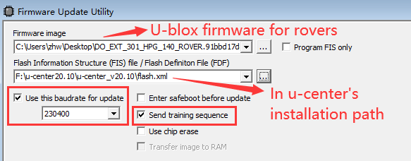

# UR/Solex TX App

## **Connecting the Ground Station to the Air Unit**

If the Ground Station and Air Unit link does not automatically connect, press the `CONNECT` button on the left hand side of the display screen.

.png>)

Once connected, the UR/Solex TX app will download the vehicle's parameters

## **Flight Screen**

To view the flight screen, click on the Union Robotics logo at the bottom left side of the screen.

.png>)

### Pre-Flight Checklist Screen

This will take you to the “Pre-Flight Checklist” screen, where you are required to check each item.

**WARNING: Physically inspect the aircraft for each item on the Pre-Flight Checklist before checking the box on the screen. Failure to do so could result in aircraft failure or injury.**

.png>)

Once all items have been checked on the Pre-Flight Checklist screen, you will be automatically directed to the Verify Controls screen. This screen reminds the pilot to verify all the aircraft controls properly function upon take off before starting the mission. Click `GO!` to be directed to the flight screen

## **UI Overview**

### **Flight Screen**

.png>)

|                        |                                                                         |
| ---------------------- | ----------------------------------------------------------------------- |
| Feature                | Specification                                                           |
| Distance:              | Distance the aircraft is in relation to the ground station              |
| Control Panel:         | Displays control panel                                                  |
| Gimbal Angle:          | The current pitch angle of the camera gimbal                            |
| Radio Signal:          | Received signal strength indicator                                      |
| Batt:                  | Vehicle battery remaining voltage                                       |
| Telemetry Panel:       | Displays vehicle's telemetry                                            |
| Camera Exposure Value: | Displays camera's current exposure value (with compatible cameras)      |
| Camera Zoom:           | Controls camera's zoom (with compatible cameras)                        |
| Shutter/Record:        | Controls camera's shutter and record function (with compatible cameras) |
| Photo/Video:           | Controls camera's photo and video mode (with compatible cameras)        |
| Map View:              | Displays map screen                                                     |
| Alt:                   | Altitude from ground level at ground station                            |

### Land

|                                   |                                                                                                                                                                                                                                                                                                                                                                                                                                                                                                                                                                                                                                            |
| --------------------------------- | ------------------------------------------------------------------------------------------------------------------------------------------------------------------------------------------------------------------------------------------------------------------------------------------------------------------------------------------------------------------------------------------------------------------------------------------------------------------------------------------------------------------------------------------------------------------------------------------------------------------------------------------ |
| Feature                           | Specification                                                                                                                                                                                                                                                                                                                                                                                                                                                                                                                                                                                                                              |
| Land Now                          | Land Now will initiate the auto-land function, which will land the aircraft in the current place. The vertical speed at which the Meadowhawk will descend during an auto-land varies as the Meadowhawk approaches the ground. By default, the aircraft will descend at 1m/s until 10 ft above the ground and then it will slow its descent considerably until touchdown.                                                                                                                                                                                                                                                                   |
| Return-to-Launch (RTL)            | 
Return-to-Launch Mode will command the Meadowhawk to fly back to the defined launch point. When the Meadowhawk first acquires a GPS position, it sets this as the launch point of the flight. Return-to-launch Mode enables the aircraft to follow a straight path when returning to the initial launch point.

During an LOS event, RTL followed by auto-land will be initiated automatically. The Meadowhawk will first check its current altitude against the configured RTL altitude. The Meadowhawk will climb to safe-height. Next, the Meadowhawk will fly back to the launch position set at the initial GPS position.
 |
| Smart Return-to-Launch (SmartRTL) | When switched into Smart RTL, like regular RTL, the vehicle will attempt to return home. The “Smart” part of this mode is that it will retrace a safe path home instead of returning directly home. This can be useful if there are obstacles between the vehicle and the home position.                                                                                                                                                                                                                                                                                                                                                   |

### **Control Panel**

.png>)

|                   |                                                                      |
| ----------------- | -------------------------------------------------------------------- |
| Feature           | Specification                                                        |
| Arm/Disarm:       | Arm and Disarm the vehicle                                           |
| Mavlink Viewer:   | Live view of the Mavlink messages                                    |
| Blackbox Logging: | Turn on and off the redundant blackbox logging to the ground station |
| Reboot:           | Reboot the vehicle's autopilot                                       |

### **Map View**

Displays an overhead map view. This view can be used for mapping autonomous missions.

.png>)

#### **Layers**

When clicking on the layers button on the Map View, the layers option menu will display. The options will overlay on the map.

### **Alert Indications** 

The DataLink has many alarm, warning and failure indicators. All alarm, warning and failure indicators will be displayed in a red bar across the top of the ground station screen.\

|                                            |                                                                                                               |
| ------------------------------------------ | ------------------------------------------------------------------------------------------------------------- |
| Alert                                      | Specification                                                                                                 |
| Low Battery**:**                           | Battery failsafe has triggered, should land immediately                                                       |
| No GPS Fix:                                | Warns pilot that the GPS can not get a satellite fix                                                          |
| Telemetry Lost:                            | Warns pilot that the telemetry signal has been lost                                                           |
| High GPS HDOP:                             | GPS signal quality is insufficient                                                                            |
| Throttle Below Failsafe:                   | Ground controller has lost connection to the vehicle                                                          |
| Gyro Calibration Failed:                   | Failed to calibrate the IMUs on the vehicle                                                                   |
| Mode Not Armable:                          | Operator is attempting to arm the vehicle in a mode which does not allow arming                               |
| Rotor Not Spinning:                        | Autopilot has detected an error attempting to run one or more motors                                          |
| Vehicle is Leaning:                        | Vehicle orientation is not suitable for takeoff                                                               |
| Throttle Too High:                         | Current throttle setting is too high to arm safely (could result in spontaneous takeoff)                      |
| Safety Switch:                             | Operator attempted to arm, but hardware arm-safety switch is engaged                                          |
| Compass Calibration Running:               | Cannot arm, currently calibrating the compass                                                                 |
| RC Not Calibrated:                         | Ground control radio has not been calibrated for use with the vehicle                                         |
| Barometer Not Healthy:                     | Barometer is experiencing an error                                                                            |
| Compass Not Healthy:                       | Compass is experiencing an error                                                                              |
| Compass Not Calibrated:                    | Compass requires calibration                                                                                  |
| Compass Offsets Too High:                  | Compass calibration has resulted in unusable offsets                                                          |
| Check Magnetic Field:                      | Vehicle is near a metallic or magnetic object which is interfering with compass operation                     |
| Inconsistent Compass:                      | Compass readings are determined to be erroneous                                                               |
| Check Geo Fence:                           | Vehicle is outside of a defined fence area, not allowed to fly                                                |
| Inertial Navigation System Not Calibrated: | IMU calibration is needed                                                                                     |
| Accelerometers Not Healthy:                | IMU calibration is needed                                                                                     |
| Inconsistent Accelerometers:               | IMU calibration is needed                                                                                     |
| Gyros Not Healthy:                         | IMU calibration is needed, or vehicle needs to be moved to an orientation matching the powered-up orientation |
| Check Board Voltage:                       | Problem detected with power supplied to the autopilot                                                         |
| Inconsistent Gyros:                        | IMU calibration is needed, or vehicle needs to be moved to an orientation matching the powered-up orientation |
| Check Max Angle:                           | ANGLE\_MAX parameter set to an in appropriate value                                                           |
| RC Failsafe:                               | Ground controller has lost connection with the vehicle                                                        |
| Need GPS Lock:                             | Operator is trying to arm vehicle in a mode where GPS lock is needed, and there is no GPS lock                |
| EKF Home Variance:                         | EKF has detected a difference between expected and actual home points                                         |
| GPS Glitch:                                | GPS readings indicate an error (e.g. multipathing) - GPS signal cannot be trusted                             |
| Waiting for Navigation Alignment:          | AP is initializing and not ready to launch                                                                    |
| Altitude Disparity:                        | GPS and barometer altitudes are reported to be substantially different, indicating a possible error           |
| Vehicle Crash:                             | AP has detected that the vehicle has collided with terrain or some other solid object                         |
| EKF Variance:                              | EKF has detected uncertainty in GPS location, compass heading, IMU readings. Should not launch                |
| Need Position Estimate:                    | GPS needs to calculate an estimated position for the vehicle                                                  |

## **Missions**

The primary way to create and edit missions is in the Mission Editor, accessible from the main menu. The list of Missions you've created is seen from the Mission list (which appears when you click the "Missions" button on the left). The toolbar at the top lets you add or delete waypoints to/from a mission, or undo recent changes you've made.

When the mission editor is opened, it should be positioned at your current location on the map. If you have a specific place you want to create a mission at, then select "Search Address" from the menu. (You'll need an internet connection for this.) Type in the address, ZIP code, etc. you're interested in, and it will show you a list of addresses matching what you typed. Pick one, and the map will pan to that location. You can also search for a lat/lng directly by typing it into the search field.

### **Mission Vehicle Type**

Click the `VEHICLE TYPE` button in the top right of the missions screen. Select the desired vehicle you would like to run a mission with.

## Mission Types

### **Waypoint Missions**

To create a mission using  waypoints, click the** **`+` marker in the toolbar, which will then turn green. To the right on the toolbar, there will be a drop-down list of waypoint types that you can drop, choose Waypoint.

To add waypoints, click on the map where you want the aircraft to fly, starting with the place of launch. At each point, a marker will be placed on the map.

To change settings on each waypoint, click either the waypoint marker on the map, or the item in the horizontal list at the bottom. A panel will appear on the right of the screen with slider attributes. These are attributes of the waypoint that can be edited. The top sliders are common to most waypoints (i.e Altitude, speed). The next set (under "Details") is the set of attributes specific to that type of waypoint.

#### ****

#### **Takeoff Point**

To change the first waypoint to a Takeoff, click the top of the panel, and it will drop down a list of items. Click** **`Takeoff` in the list. The panel's contents will change to show just the relevant attributes for a Takeoff. The waypoint also disappears off of the map, because a Takeoff doesn't really have a defined point; it's just the location your vehicle is sitting when it takes off.

#### **Return Home**

To change the last waypoint to a Return Home, click the top of the panel, and it will drop down a list of items. Click `Return Home` in the list. The panel's contents will change to show just the relevant attributes for a Return Home. The waypoint also disappears off of the map, because a Return Home doesn't really have a defined point; it's just the location your vehicle starts to return to the launch location to land.

#### **Land**

To change the last waypoint to a Land, click the top of the panel, and it will drop down a list of items. Click `Land` in the list.

#### **Deleting a Waypoint**

Click the `trash can icon` on the toolbar and pick something to delete, either by clicking the item on the map, or in the bottom list. It will disappear. If you didn't mean to do it, hit the Undo button, and it will re-appear.

To stop deleting things when you click them, click the trash can icon until it's not highlighted.

**Updating......**
