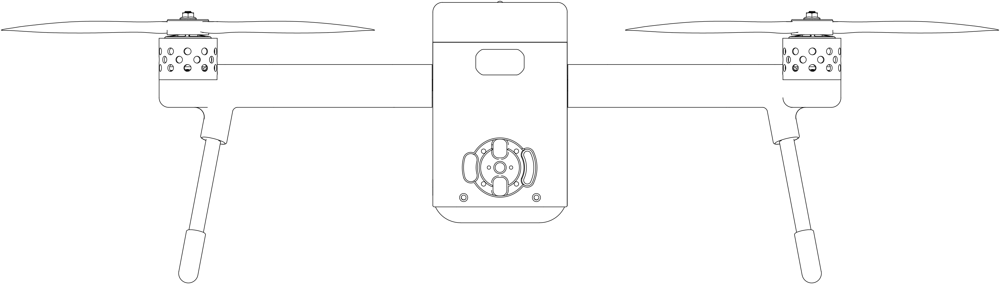
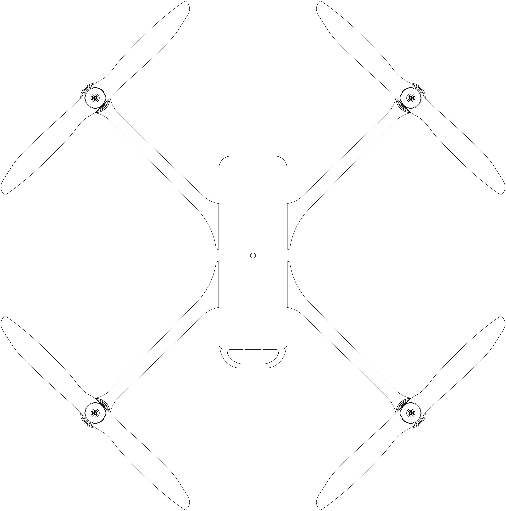
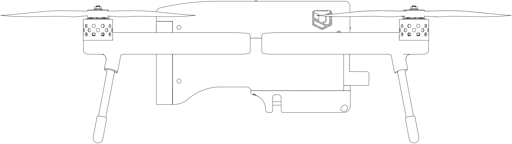
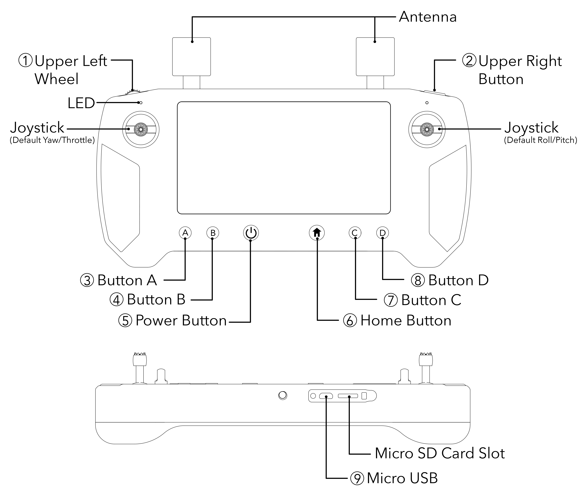

# 1. GENERAL

## ** 1.1 Introduction**

This Remote Vehicle Flight Manual has been prepared to describe the complete operation of the airframe and flight control systems of the Meadowhawk remotely piloted aerial vehicle, and the normal maintenance of those items. Do not operate the Meadowhawk without reading and understanding this manual.\

This manual is not a substitute for adequate flight training. Training requirements can vary when operating in different countries or under different flight conditions. Always consult local regulations before flying the Meadowhawk. In areas where there are no flight training requirements, it is the sole determination of the pilot-in-command as to whether he or she has the appropriate level of training or experience for a given flight. Always set and adhere to personal minimums and fly within your own capabilities.\

## **1.2 Warnings, Cautions and Notes**

The following definitions apply to warnings, cautions, and notes used in this Remote Aircraft Flight manual:

**WARNING**

Disregarding the following instructions leads to an immediate or severe deterioration of flight safety and hazardous situations, including such resulting in personal injury and damage to property.

**CAUTION**

Disregarding the following instructions leads to a serious or long term deterioration of flight safety

**NOTE**

Draws attention to any special item not directly related to safety but which is important or unusual.

## **1.3 Description**

The Union Robotics® Meadowhawk 2 is a professional multi-rotor aircraft designed for critical infrastructure inspections, search and rescue operations, and first responder applications.

Manufactured by:

Union Robotics®

3800 SW Cedar Hills Blvd Suite 260, Beaverton, OR 97005

[www.union-robotics.com](http://www.union-robotics.com)

support@union-robotics.com

1-888-864-6680

## **1.3.1 Three-View-Drawing of the sUAS**

## **1.3.3 Motors | Propellers | Electronic Speed Controls**

|                             |                                     |
| --------------------------- | ----------------------------------- |
| **Motors**                  |                                     |
| Number of Motors            | 4                                   |
| Motor Manufacture           | Union Corp.                         |
| Motor Model Number          | URBH-1001                           |
| Motor Type                  | Direct Drive 3-Phase PMAC Outrunner |
| Motor Power Rating \| Speed | Max Watts 1562.81 \| Max RPM 15033  |

|                        |                                |
| ---------------------- | ------------------------------ |
| **Propellers**         |                                |
| Number of Propellers   | 4                              |
| Propeller Manufacture  | T-Motors                       |
| Propeller Model Number | URAP-1011                      |
| Number of Blades       | 2                              |
| Propeller Type         | (2) 15x5.5CW and (2) 15x5.5CCW |

|                                 |                |
| ------------------------------- | -------------- |
| **Electronic Speed Controller** |                |
| umber of ESCs                   | 1              |
| ESC Manufacture                 | Union Robotics |
| ESC Model Number                | URAE-1002      |
| ESC Type                        | 4-in-1         |
| ESC Power Rating                | 55A            |

## **1.3.4 Flight Control Surfaces**

|                      |     |
| -------------------- | --- |
| **Control Surfaces** | N/A |

## **1.3.5 Avionics | Navigation | Communication Systems**

|                                           |                             |
| ----------------------------------------- | --------------------------- |
| Number of Flight Controllers              | 1                           |
| Flight Controller Manufacture             | Union Robotics              |
| Flight Controller Model                   | URMR-1003                   |
| Flight Controller Processor               | 32-bit STM32F7777 Cortex M4 |
| Flight Controller Accelerometer/Gyroscope | Bosh BM1088                 |
| Flight Modes                              | Loiter, RTL, SmartRTL       |
| Telemetry Manufacture                     | Union Robotics              |
| Telemetry Model                           | URDL-1004                   |
| Telemetry Frequency                       | 2.4GHZ                      |
| Radio Receiver Manufacture                | Union Robotics              |
| Radio Receiver Frequency                  | 2.4GHz                      |
| Video Transmitter Manufacture             | Union Robotics              |
| Video Transmitter Model                   | URDL-1004                   |
| Video Transmitter Format                  | 720P 30fps & 1080P 30/60fps |
| Video Transmitter Frequency               | 2.4GHz                      |

## **1.3.6 Flight Battery**

|                                             |                         |
| ------------------------------------------- | ----------------------- |
| Battery Manufacture                         | Union Robotics          |
| Battery Type                                | Li-ion Sanyo NCR18650GA |
| Bat**t**ery Capacity                        | 14000mAh                |
| Battery min. Charge Rate                    | 8.0A                    |
| Battery max. Charge Rate                    | 14.0A                   |
| Number of Batteries Required for Flight     | 1                       |
| Number of Spare Batteries Available On-Site | 2                       |

## **1.3.7 Weights**

|                                                                          |                |   |
| ------------------------------------------------------------------------ | -------------- | - |
| Empty Weight - Without Flight Battery or Payload                         | 4 lbs / 1.8KG  |   |
| Nominal Take-Off Weight - with Standard Flight Battery, Standard Payload | 7 lbs / 3.1KG  |   |
| Maximum Take-Off Weight                                                  | 10 lbs / 4.5KG |   |

## **1.4 Remote Pilot Station**

|                              |                |
| ---------------------------- | -------------- |
| Radio Controller Manufacture | Union Robotics |
| Radio Controller Model       | URDL-1004      |
| Radio Controller Frequency   | 2.4GHz         |

## **1.4.1 Function Controls Layout**

## **1.4.2 Command and Control Link**

|                       |                |
| --------------------- | -------------- |
| Telemetry Manufacture | Union Robotics |
| Telemetry Model       | URDL-1004      |
| Telemetry Frequency   | 2.4GHz         |
| Telemetry Range       | 10km           |

## **1.5 Firmware | Software**

|                 |                      |
| --------------- | -------------------- |
| ​Firmware       | Union Robotics AP    |
| Firmware  Build | v4.1                 |
| Software        | Union Robotics/Solex |
| Software Build  | v1.0.3               |

## **1.6.1 Abbreviations and Acronyms**

|      |                                                                                                                                                                                                                                                                                                                                                                                                                         |
| ---- | ----------------------------------------------------------------------------------------------------------------------------------------------------------------------------------------------------------------------------------------------------------------------------------------------------------------------------------------------------------------------------------------------------------------------- |
| LOS  | Loss of Signal                                                                                                                                                                                                                                                                                                                                                                                                          |
| sUAS | 
Small Unmanned Aircraft System includes all

components of the system required for the flight of

an unmanned aircraft, including the radio controller,

data link and other related support equipment.
                                                                                                                                                                                           |
| UAV  | Unmanned Aerial Vehicle includes all components of the system required for the flight of an unmanned aircraft, including the radio controller, data link and other related support equipment. ISA                                                                                                                                                                                                                       |
| ISA  | 
International Standard Atmosphere in which: 

The air is a dry, perfect gas;

The temperature at sea level is 15° Celsius (59° Fahrenheit); 

The pressure at sea level is 1013.2 mbar (29.92 inches Hg); 

The temperature gradient from sea level to the altitude at which the temperature is -56.5°C (-69.7°F) is -0.00198°C (-0.003564°F) per foot and zero above that altitude
 |
| MSL  | Mean Sea Level is the average height above the surface of the sea for all stages of tide                                                                                                                                                                                                                                                                                                                                |
| AGL  | Above Ground Level is the height of the aircraft above the ground                                                                                                                                                                                                                                                                                                                                                       |
| OAT  | Outside Air Temperature is the free air static temperature surrounding the aircraft                                                                                                                                                                                                                                                                                                                                     |
| RTL  | Return-to-Launch The flight mode that allows the aircraft to optimally return to the point of take off, without feedback from the operator. Return-to-Launch is also known as Return-to-Land or Return-to-Home.                                                                                                                                                                                                         |
| RPA  | Remotely Piloted Aircraft                                                                                                                                                                                                                                                                                                                                                                                               |
| ASL  | Above Sea Level Altitude                                                                                                                                                                                                                                                                                                                                                                                                |
| sUAS | Small Unmanned Autonomous System or Small Unmanned Aircraft System                                                                                                                                                                                                                                                                                                                                                      |
| HDOP | Horizontal Dilution of Precision                                                                                                                                                                                                                                                                                                                                                                                        |

## **1.6.2 Definitions**

|                                         |                                                                                                                                                                                                                                                                                             |
| --------------------------------------- | ------------------------------------------------------------------------------------------------------------------------------------------------------------------------------------------------------------------------------------------------------------------------------------------- |
| Throttle Stick                          | The radio controller stick responsible for throttle control. For the Pilot controller, this is the vertical movement of the left control stick.                                                                                                                                             |
| Yaw Stick                               | The radio controller stick responsible for yaw (also called pan) control. For the Pilot controller, this is the lateral movement of the left control stick. For the camera operator controller, this is the lateral movement of the right control stick.                                    |
| Pitch Stick                             | The radio controller stick responsible for pitch control. For the Pilot and camera operator controllers, this is the vertical movement of the right stick.                                                                                                                                  |
| Roll Stick                              | The radio controller stick responsible for roll control. For the Pilot controller, this is the lateral movement of the right control stick.                                                                                                                                                 |
| Pitch/Roll Stick                        | The radio control stick responsible for both pitch and roll control. For the Pilot controller, this is the right stick.                                                                                                                                                                     |
| Throttle/Yaw Stick                      | The radio control stick responsible for both throttle and yaw control. For the Pilot controller, this is the left stick.                                                                                                                                                                    |
| Hook Release Switch                     | The radio control switch responsible for releasing the cargo hook control.                                                                                                                                                                                                                  |
| Flight Mode Switch                      | The radio control switch responsible for the flight mode control. For the Pilot controller, the flight mode switch controls both Loiter and Return-to-Launch.                                                                                                                               |
| Loiter                                  | The flight mode that allows the aircraft to optimally hold its altitude and lateral position.                                                                                                                                                                                               |
| Pressure Altitude                       | 
Altitude measured from standard sea level pressure (1013.2 mbar, 29.92 in. Hg) by a pressure or barometric altimeter 

It is the indicated pressure altitude corrected for position and instrument error. In this Manual, altimeter instrument errors are assumed to be zero
 |
| Maximum Continuous Power Output         | The maximum typical power output of a motor averaged over the entire flight                                                                                                                                                                                                                 |
| Maximum Instantaneous Peak Power Output | The maximum power output of a motor during any phase of flight, such as when maneuvering                                                                                                                                                                                                    |
| Maximum Takeoff Weight (MTOW)           | Maximum allowable weight at liftoff                                                                                                                                                                                                                                                         |
| Standard Empty Weight                   | Weight of a standard aircraft                                                                                                                                                                                                                                                               |
| Basic Empty Weight                      | Standard empty weight plus optional equipment                                                                                                                                                                                                                                               |
| Useful Load                             | Difference between take off weight and basic empty weight                                                                                                                                                                                                                                   |
| Payload                                 | Useful load less battery weight                                                                                                                                                                                                                                                             |
